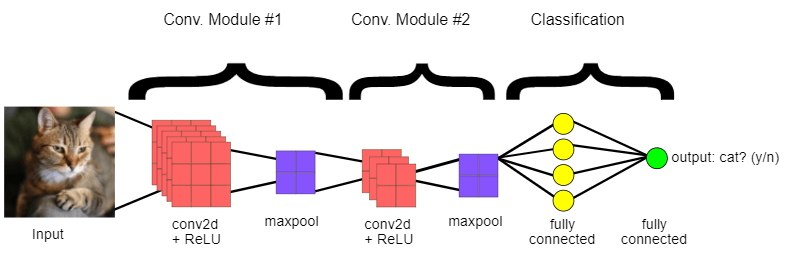
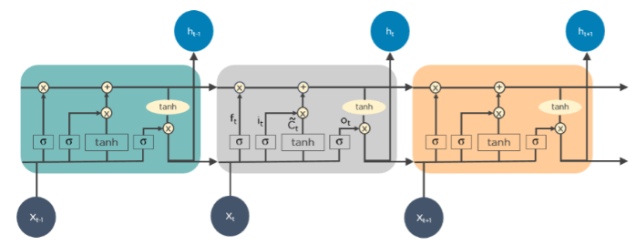
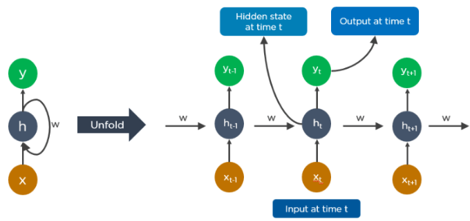
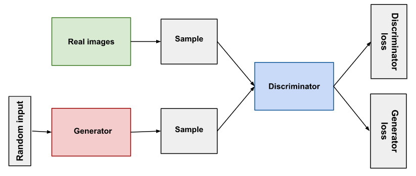
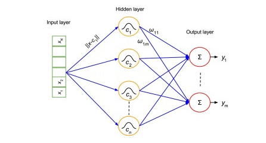
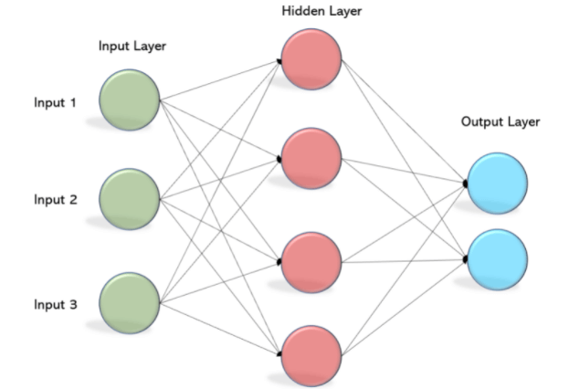
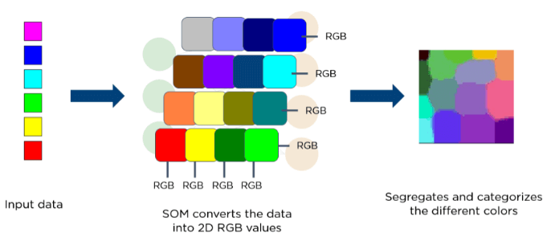
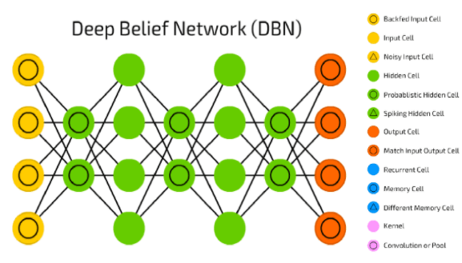
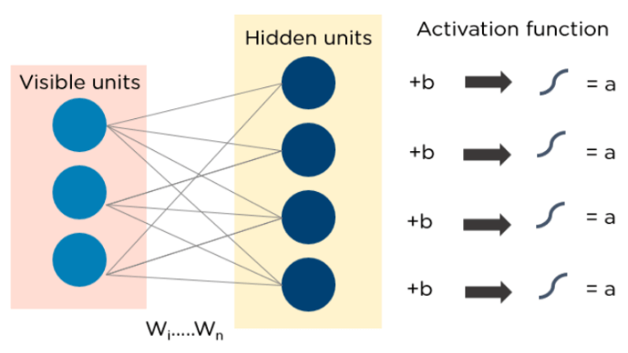
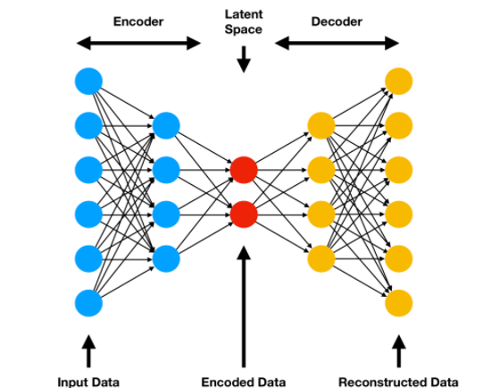

## **Deep Learning Algorithms**

**What is Deep Learning Algorithm?**

Deep learning can be defined as the method of machine learning and artificial intelligence that is intended to intimidate humans and their actions based on certain human brain functions to make effective decisions. It is a very important data science element that channels its modeling based on data-driven techniques under **predictive modeling** and **statistics**. To drive such a human-like ability to adapt and learn and to function accordingly, there have to be some strong forces which we popularly called **algorithms**.

- Deep learning algorithms are dynamically made to run through several layers of neural networks, which are nothing but a set of decision-making networks that are pre-trained to serve a task. 
- Later, each of these is passed through simple layered representations and move on to the next layer.
- However, most machine learning is trained to work fairly well on datasets that have to deal with hundreds of features or columns.
- For a data set to be structured or unstructured, machine learning tends to fail mostly because they fail to recognize a simple image having a dimension of 800x1000 in RGB.
- It becomes quite unfeasible for a traditional machine learning algorithm to handle such depths. **This is where deep learning**.

## **Importance of Deep Learning**

- Deep learning algorithms play a crucial role in determining the features and can handle the large number of processes for the data that might be structured or unstructured.
- Although, deep learning algorithms can overkill some tasks that might involve complex problems because they need access to huge amounts of data so that they can function effectively.
- For example, there's a popular deep learning tool that recognizes images namely Imagenet that has access to 14 million images in its dataset-driven algorithms.
- It is a highly comprehensive tool that has defined a next-level benchmark for deep learning tools that aim images as their dataset.
- Deep learning algorithms are highly progressive algorithms that learn about the image by passing it through each neural network layer. 
- The layers are highly sensitive to detect low-level features of the image like edges and pixels and henceforth the combined layers take this information and form holistic representations by comparing it with previous data.
- For example, the middle layer might be programmed to detect some special parts of the object in the photograph which other deep trained layers are programmed to detect special objects like dogs, trees, utensils, etc.
- However, if we talk out the simple task that involves less complexity and a data-driven resource, deep learning algorithms fail to generalize simple data. This is one of the main reasons deep learning is not considered effective as linear or boosted tree models. Simple models aim to churn out custom data, track fraudulent transactions and deal with less complex datasets with fewer features. Also, there are various cases like multiclass classification where deep learning can be effective because it involves smaller but more structured datasets but is not preferred usually.

## **Deep Learning Algorithms**

## **1. Convolutional Neural Networks (CNNs)**

- CNN's popularly known as ConvNets majorly consists of several layers and are specifically used for image processing and detection of objects.
- CNNs have wide usage in identifying the image of the satellites, medical image processing, series forecasting, and anomaly detection.
- CNNs process the data by passing it through multiple layers and extracting features to exhibit convolutional operations. The **Convolutional Layer** consists of **Rectified Linear Unit (ReLU)** that outlasts to rectify the feature map. **The Pooling layer** is used to rectify these feature maps into the next feed. Pooling is generally a sampling algorithm that is down-sampled and it reduces the dimensions of the feature map. Later, the result generated consists of **2-D arrays** consisting of **single, long, continuous**, and **linear vector** flattened in the map. The next layer i.e., called **Fully Connected Layer** which forms the flattened **matrix** or **2-D array** fetched from the Pooling Layer as input and identifies the image by classifying it.

## **2. Long Short Term Memory Networks (LSTMs)**

LSTMs can be defined as **Recurrent Neural Networks** (RNN) that are programmed to learn and adapt for dependencies for the long term. It can memorize and recall past data for a greater period and by default, it is its sole behavior. LSTMs are designed to retain over time and henceforth they are majorly used in time series predictions because they can restrain memory or previous inputs. This analogy comes from their **chain-like** structure consisting of **four** interacting layers that communicate with each other differently. Besides applications of time series prediction, they can be used to construct **speech recognizers, development in pharmaceuticals,** and composition of **music loops** as well.

## **3. Recurrent Neural Networks (RNNs)**

Recurrent Neural Networks or RNNs consist of some directed connections that form a cycle that allow the input provided from the LSTMs to be used as input in the current phase of RNNs. These inputs are deeply embedded as inputs and enforce the memorization ability of LSTMs lets these inputs get absorbed for a period in the internal memory. RNNs are therefore dependent on the inputs that are preserved by LSTMs and work under the synchronization phenomenon of LSTMs. RNNs are mostly used in captioning the image, time series analysis, recognizing handwritten data, and translating data to machines.

RNNs follow the work approach by putting output feeds (t-1) time if the time is defined as t. Next, the output determined by t is feed at input time t+1. Similarly, these processes are repeated for all the input consisting of any length. There's also a fact about RNNs is that they store historical information and there's no increase in the input size even if the model size is increased. RNNs look something like this when unfolded.

## **4. Generative Adversarial Networks (GANs)**

GANs are defined as deep learning algorithms that are used to generate new instances of data that match the training data. GAN usually consists of two components namely a **generator** that learns to generate false data and a **discriminator** that adapts itself by learning from this false data. Over some time, GANs have gained immense usage since they are frequently being used to clarify **astronomical images** and simulate **lensing** the gravitational dark matter. It is also used in **video games** to increase graphics for **2D** textures by recreating them in higher resolution like **4K**. They are also used in creating **realistic cartoons character** and also rendering human faces and **3D object rendering**.

GANs work in simulation by generating and understanding the fake data and the real data. During the training to understand these data, the generator produces different kinds of fake data where the discriminator quickly learns to adapt and respond to it as false data. GANs then send these recognized results for updating. Consider the below image to visualize the functioning.

## **5. Radial Basis Function Networks (RBFNs)**

RBFNs are specific types of neural networks that follow a feed-forward approach and make use of radial functions as activation functions. They consist of **three** layers namely the **input layer, hidden layer,** and **output layer** which are mostly used for **time-series prediction, regression testing,** and **classification**.

RBFNs do these tasks by measuring the similarities present in the training data set. They usually have an input vector that feeds these data into the input layer thereby confirming the identification and rolling out results by comparing previous data sets. Precisely, the input layer has **neurons** that are sensitive to these data and the nodes in the layer are efficient in classifying the class of data. Neurons are originally present in the hidden layer though they work in close integration with the input layer. The hidden layer contains **Gaussian transfer** functions that are inversely proportional to the distance of the output from the neuron's center. The output layer has linear combinations of the **radial-based** data where the Gaussian functions are passed in the neuron as parameter and output is generated. Consiider the given image below to understand the process thoroughly.

## **6. Multilayer Perceptrons (MLPs)**

MLPs are the base of deep learning technology. It belongs to a class of feed-forward neural networks having various layers of **perceptrons**. These perceptrons have various activation functions in them. MLPs also have connected input and output layers and their number is the same. Also, there's a layer that remains hidden amidst these two layers. MLPs are mostly used to build **image and speech recognition** systems or some other types of the **translation software**.

The working of MLPs starts by feeding the data in the input layer. The neurons present in the layer form a graph to establish a connection that passes in one direction. The weight of this input data is found to exist between the hidden layer and the input layer. MLPs use activation functions to determine which nodes are ready to fire. These activation functions include **tanh** function, **sigmoid** and **ReLUs**. MLPs are mainly used to train the models to understand what kind of co-relation the layers are serving to achieve the desired output from the given data set.

## **7. Self Organizing Maps (SOMs)**

SOMs were invented by **Teuvo Kohenen** for achieving data visualization to understand the dimensions of data through artificial and self-organizing neural networks. The attempts to achieve data visualization to solve problems are mainly done by what humans cannot visualize. These data are generally high-dimensional so there are lesser chances of human involvement and of course less error.

SOMs help in visualizing the data by initializing weights of different nodes and then choose random vectors from the given training data. They examine each node to find the relative weights so that dependencies can be understood. The winning node is decided and that is called **Best Matching Unit** (BMU). Later, SOMs discover these winning nodes but the nodes reduce over time from the sample vector. So, the closer the node to BMU more is the more chance to recognize the weight and carry out further activities. There are also multiple iterations done to ensure that no node closer to BMU is missed. One example of such is the **RGB color combinations** that we use in our daily tasks. Consider the below image to understand how they function.

## **8. Deep Belief Networks (DBNs)**

DBNs are called generative models because they have various layers of latent as well as stochastic variables. The latent variable is called a **hidden unit** because they have binary values. DBNs are also called **Boltzmann Machines** because the **RGM** layers are stacked over each other to establish communication with previous and consecutive layers. DBNs are used in applications like video and image recognition as well as capturing motional objects.

DBNs are powered by **Greedy algorithms**. The layer to layer approach by leaning through a **top-down** approach to generate weights is the most common way DBNs function. DBNs use step by step approach of Gibbs sampling on the hidden **two-layer** at the top. Then, these stages draw a sample from the visible units using a model that follows the ancestral sampling method. DBNs learn from the values present in the latent value from every layer following the **bottom-up** pass approach.

## **9. Restricted Boltzmann Machines (RBMs)**

RBMs were developed by **Geoffrey Hinton** and resemble stochastic neural networks that learn from the probability distribution in the given input set. This algorithm is mainly used in the field of dimension **reduction, regression** and **classification, topic modeling** and are considered the building blocks of DBNs. RBIs consist of two layers namely the **visible layer** and the **hidden layer**. Both of these layers are connected through hidden units and have bias units connected to nodes that generate the output. Usually, RBMs have two phases namely **forward pass** and **backward pass**.

The functioning of RBMs is carried out by accepting inputs and translating them to numbers so that inputs are encoded in the forward pass. RBMs take into account the weight of every input, and the backward pass takes these input weights and translates them further into reconstructed inputs. Later, both of these translated inputs, along with individual weights, are combined. These inputs are then pushed to the visible layer where the activation is carried out, and output is generated that can be easily reconstructed. To understand this process, consider the below image.

## **Autoencoders**

Autoencoders are a special type of neural network where inputs are outputs are found usually identical. It was designed to primarily solve the problems related to unsupervised learning. Autoencoders are highly trained neural networks that **replicate** the data. It is the reason why the input and output are generally the same. They are used to achieve tasks like **pharma discovery, image processing,** and **population prediction**.

Autoencoders constitute three components namely the **encoder,** the **code,** and the **decoder**. Autoencoders are built in such a structure that they can receive inputs and transform them into various representations. The attempts to copy the original input by reconstructing them is more accurate. They do this by encoding the image or input, reduce the size. If the image is not visible properly they are passed to the neural network for clarification. Then, the clarified image is termed a reconstructed image and this resembles as accurate as of the previous image. To understand this complex process, see the below-provided image.

