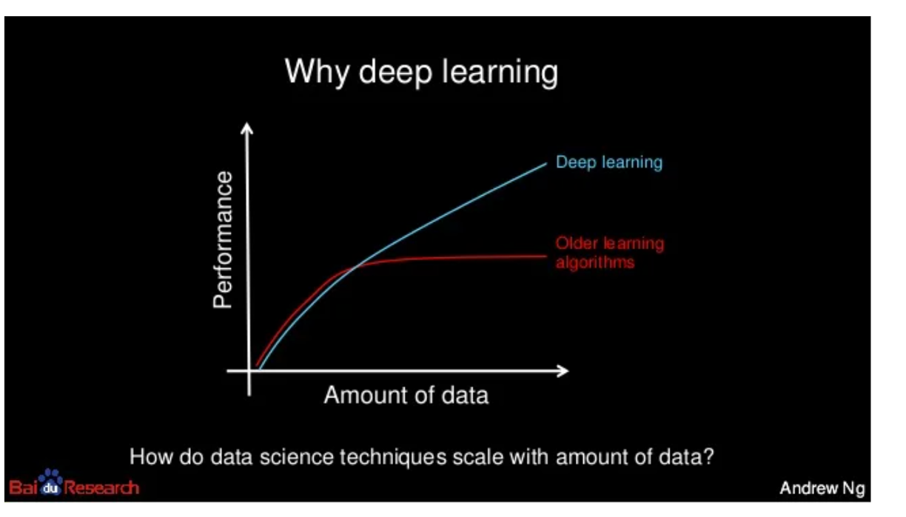
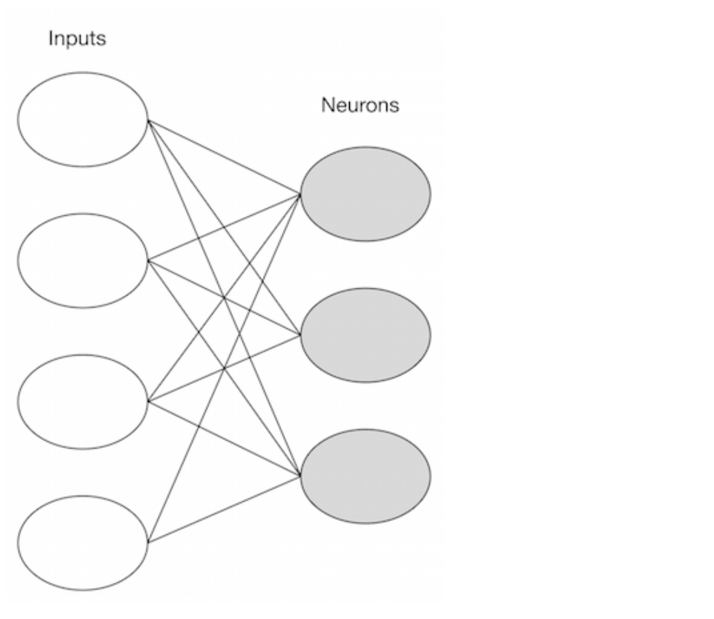
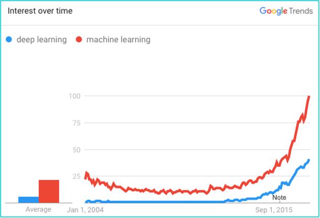
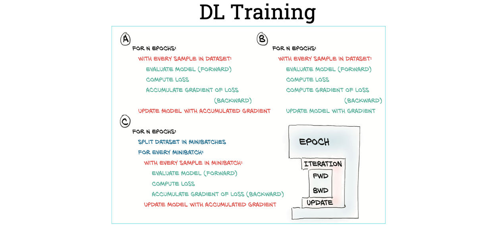

## <span style="color:red">**Deep Learning**</span>

- To understand what deep learning is, we first need to understand the relationship deep learning has with machine learning, neural networks, and artificial intelligence.
- At the outer most ring you have artificial intelligence (using computers to reason). One layer inside of that is machine learning. With artificial neural networks and deep learning at the center.
- Broadly speaking, deep learning is a more approachable name for an artificial neural network. The “deep” in deep learning refers to the depth of the network. An artificial neural network can be very shallow.
- Neural networks are inspired by the structure of the cerebral cortex. At the basic level is the perceptron, the mathematical representation of a biological neuron. Like in the cerebral cortex, there can be several layers of interconnected perceptrons.
- The first layer is the input layer. Each node in this layer takes an input, and then passes its output as the input to each node in the next layer. There are generally no connections between nodes in the same layer and the last layer produces the outputs.
- We call the middle part the hidden layer. These neurons have no connection to the outside (e.g. input or output) and are only activated by nodes in the previous layer.

 

- Think of deep learning as the technique for learning in neural networks that utilizes multiple layers of abstraction to solve pattern recognition problems.
- In the 1980s, most neural networks were a single layer due to the cost of computation and availability of data.
- Machine learning is considered a branch or approach of Artificial intelligence, whereas deep learning is a specialized type of machine learning.
- Machine learning involves computer intelligence that doesn’t know the answers up front. Instead, the program will run against training data, verify the success of its attempts, and modify its approach accordingly. 
- Machine learning typical requires a sophisticated education, spanning software engineering and computer science to statistical methods and linear algebra.

- There are two broad classes of machine learning methods:

    - Supervised learning
    - Unsupervised learning

In supervised learning, a machine learning algorithm uses a labeled dataset to infer the desired outcome. This takes a lot of data and time, since the data needs to be labeled by hand. Supervised learning is great for classification and regression problems.

For example, let’s say that we were running a company and want to determine the effect of bonuses on employee retention. If we had historical data – i.e. employee bonus amount and tenure – we could use supervised machine learning.

With unsupervised learning, there aren’t any predefined or corresponding answers. The goal is to figure out the hidden patterns in the data. It’s usually used for clustering and associative tasks, like grouping customers by behavior. Amazon’s “customers who also bought…” recommendations are a type of associative task.

While supervised learning can be useful, we often have to resort to unsupervised learning. Deep learning has proven to be an effective unsupervised learning technique.

## **Why is Deep Learning Important?**



Computers have long had techniques for recognizing features inside of images. The results weren’t always great. Computer vision has been a main beneficiary of deep learning. Computer vision using deep learning now rivals humans on many image recognition tasks.

Facebook has had great success with identifying faces in photographs by using deep learning. It’s not just a marginal improvement, but a game changer: “Asked whether two unfamiliar photos of faces show the same person, a human being will get it right 97.53 percent of the time. New software developed by researchers at Facebook can score 97.25 percent on the same challenge, regardless of variations in lighting or whether the person in the picture is directly facing the camera.”

Speech recognition is a another area that’s felt deep learning’s impact. Spoken languages are so vast and ambiguous. Baidu – one of the leading search engines of China – has developed a voice recognition system that is faster and more accurate than humans at producing text on a mobile phone. In both English and Mandarin.

What is particularly fascinating, is that generalizing the two languages didn’t require much additional design effort: “Historically, people viewed Chinese and English as two vastly different languages, and so there was a need to design very different features,” Andrew Ng says, chief scientist at Baidu. “The learning algorithms are now so general that you can just learn.”

Google is now using deep learning to manage the energy at the company’s data centers. They’ve cut their energy needs for cooling by 40%. That translates to about a 15% improvement in power usage efficiency for the company and hundreds of millions of dollars in savings.


## **Deep Learning Microservices**

Here’s a quick overview of some deep learning use cases and microservices.

Illustration Tagger. An implementation of Illustration2Vec, this microservice can tag an image with the safe, questionable, or explicit rating, the copyright, and general category tag to understand what’s in the image. DeepFilter is a style transfer service for applying artistic filters to images.

The age classifier uses face detection to determine the age of a person in a photo. The Places 365 Classifier uses a pre-trained CNN and based on Places: An Image Database for Deep Scene Understanding B. Zhou, et al., 2016 to identify particular locations in images, such as a courtyard, drugstore, hotel room, glacier, mountain, etc. Lastly, there is InceptionNet, a direct implementation of Google’s InceptionNet using TensorFlow. It takes an image (such as a car), and returns the top 5 classes the model predicts are relevant to the image.

## **Open Source Deep Learning Frameworks**

Deep learnings is made accessible by a number of open source projects. Some of the most popular technologies include, but are not limited to, Deeplearning4j (DL4j), Theano, Torch, TensorFlow, and Caffe. The deciding factors on which one to use are the tech stack they target, and if they are low-level, academic, or application focused. Here’s an overview of each:

**DL4J:**

  - JVM-based
  - Distrubted
  - Integrates with Hadoop and Spark

**Theano:**

  - Very popular in Academia
  - Fairly low level
  - Interfaced with via Python and Numpy

**Torch:**

  - Lua based
  - In house versions used by Facebook and Twitter
  - Contains pretrained models

**TensorFlow:**

  - Google written successor to Theano
  - Interfaced with via Python and Numpy
  - Highly parallel
  - Can be somewhat slow for certain problem sets

**Caffe:**

  - Not general purpose. Focuses on machine-vision problems
  - Implemented in C++ and is very fast
  - Not easily extensible
  - Has a Python interface

## **McCulloch and Pitts Neuron**

In 1943, McCulloch and Pitts introduced a mathematical model of a neuron. It consisted of three components:

  1. A set of **weights** corresponding to synapses (inputs)
  2. An **adder** for summing input signals; analogous to cell membrane that collects charge
  3. An **activation function** for determining when the neuron fires, based on accumulated input


A single neuron is not interesting, nor useful, from a learning perspective. It cannot learn; it simply receives inputs and either fires or not. Only when neurons are joined as a network can they perform useful work.

Learning takes place by changing the weights of the connections in a neural network, and by changing the parameters of the activation functions of neurons.

## **Perceptron**

A collection of McCullough and Pitts neurons, along with a set of input nodes connected to the inputs via weighted edges, is a perceptron, the simplest neural network.

Each neuron is independent of the others in the perceptron, in the sense that its behavior and performance depends only on its own weights and threshold values, and not of those for the other neurons. Though they share inputs, they operate independently.

The number of inputs and outputs are determined by the data. Weights are stored as a N x K matrix, with N observations and K neurons, with specifying the weight on the ith observation on the jth neuron.




## **Learning with Perceptrons**


## **Example: Logical functions**

Let's see how the perceptron learns by training it on a couple of of logical functions, AND and OR. For two variables x1 and x2, the AND function returns 1 if both are true, or zero otherwise; the OR function returns 1 if either variable is true, or both. These functions can be expressed as simple lookup tables.

```
%matplotlib inline
import numpy as np
import pandas as pd
import matplotlib.pyplot as plt
import seaborn as sns
sns.set()
from scipy import optimize
from ipywidgets import *
from IPython.display import SVG
from sklearn import datasets
```

```
AND = pd.DataFrame({'x1': (0,0,1,1), 'x2': (0,1,0,1), 'y': (0,0,0,1)})
AND

x1	x2	y
0	0	0	0
1	0	1	0
2	1	0	0
3	1	1	1
```

First, we need to initialize weights to small, random values (can be positive and negative).

```
w = np.random.randn(3)*1e-4
```

Then, a simple activation function for calculating g(h):

```
g = lambda inputs, weights: np.where(np.dot(inputs, weights)>0, 1, 0)
```

Finally, a training function that iterates the learning algorithm, returning the adapted weights.

```
def train(inputs, targets, weights, eta, n_iterations):

    # Add the inputs that match the bias node
    inputs = np.c_[inputs, -np.ones((len(inputs), 1))]

    for n in range(n_iterations):

        activations = g(inputs, weights);
        weights -= eta*np.dot(np.transpose(inputs), activations - targets)
        
    return(weights)
```

Let's test it first on the AND function.

```
inputs = AND[['x1','x2']]
target = AND['y']

w = train(inputs, target, w, 0.25, 10)
```

Checking the performance:

```
g(np.c_[inputs, -np.ones((len(inputs), 1))], w)

array([0, 0, 0, 1])

Thus, it has learned the function perfectly. Now for OR:
```

```
OR = pd.DataFrame({'x1': (0,0,1,1), 'x2': (0,1,0,1), 'y': (0,1,1,1)})
OR

	x1	x2	y
0	0	0	0
1	0	1	1
2	1	0	1
3	1	1	1
```

```
w = np.random.randn(3)*1e-4
```

```
inputs = OR[['x1','x2']]
target = OR['y']

w = train(inputs, target, w, 0.25, 20)
```

```
g(np.c_[inputs, -np.ones((len(inputs), 1))], w)
```

array([0, 1, 1, 1])
Also 100% correct.

Exercise: XOR
Now try running the model on the XOR function, where a one is returned for either x1 or x2 being true, but not both. What happens here?

Let's explore the problem graphically:

```
AND.plot(kind='scatter', x='x1', y='x2', c='y', s=50, colormap='winter')
plt.plot(np.linspace(0,1.4), 1.5 - 1*np.linspace(0,1.4), 'k--');
```


```
XOR = pd.DataFrame({'x1': (0,0,1,1), 'x2': (0,1,0,1), 'y': (0,1,1,0)})

XOR.plot(kind='scatter', x='x1', y='x2', c='y', s=50, colormap='winter');
```


## **Multi-layer Perceptron**

The solution to fitting more complex (i.e. non-linear) models with neural networks is to use a more complex network that consists of more than just a single perceptron. The take-home message from the perceptron is that all of the learning happens by adapting the synapse weights until prediction is satisfactory. Hence, a reasonable guess at how to make a perceptron more complex is to simply **add more weights.**

There are two ways to add complexity:

  1. Add backward connections, so that output neurons feed back to input nodes, resulting in a **recurrent network**
  2. Add neurons between the input nodes and the outputs, creating an additional ("hidden") layer to the network, resulting in a **multi-layer perceptron**

  The latter approach is more common in applications of neural networks.

  

  How to train a multilayer network is not intuitive. Propagating the inputs forward over two layers is straightforward, since the outputs from the hidden layer can be used as inputs for the output layer. However, the process for updating the weights based on the prediction error is less clear, since it is difficult to know whether to change the weights on the input layer or on the hidden layer in order to improve the prediction.

  Updating a multi-layer perceptron (MLP) is a matter of:

    1. moving forward through the network, calculating outputs given inputs and current weight estimates
    2. moving backward updating weights according to the resulting error from forward propagation.

In this sense, it is similar to a single-layer perceptron, except it has to be done twice, once for each layer.

## **Backpropagation**

Backpropagation is a method for efficiently computing the gradient of the cost function of a neural network with respect to its parameters. These partial derivatives can then be used to update the network's parameters using, e.g., gradient descent. This may be the most common method for training neural networks. Deriving backpropagation involves numerous clever applications of the chain rule for functions of vectors.


## **Review: The chain rule**


## **Notation**


## **Backpropagation in general**


## **Backpropagation in practice**


## **Toy Python example**
Due to the recursive nature of the backpropagation algorithm, it lends itself well to software implementations. The following code implements a multi-layer perceptron which is trained using backpropagation with user-supplied nonlinearities, layer sizes, and cost function.

```
# Ensure python 3 forward compatibility
from __future__ import print_function
import numpy as np

def sigmoid(x):
    return 1/(1 + np.exp(-x))

class SigmoidLayer:
    def __init__(self, n_input, n_output):
        self.W = np.random.randn(n_output, n_input)
        self.b = np.random.randn(n_output, 1)
    def output(self, X):
        if X.ndim == 1:
            X = X.reshape(-1, 1)
        return sigmoid(self.W.dot(X) + self.b)

class SigmoidNetwork:

    def __init__(self, layer_sizes):
        '''
        :parameters:
            - layer_sizes : list of int
                List of layer sizes of length L+1 (including the input dimensionality)
        '''
        self.layers = []
        for n_input, n_output in zip(layer_sizes[:-1], layer_sizes[1:]):
            self.layers.append(SigmoidLayer(n_input, n_output))
    
    def train(self, X, y, learning_rate=0.2):
        X = np.array(X)
        y = np.array(y)
        if X.ndim == 1:
            X = X.reshape(-1, 1)
        if y.ndim == 1:
            y = y.reshape(1, -1)
        
        # Forward pass - compute a^n for n in {0, ... L}
        layer_outputs = [X]
        for layer in self.layers:
            layer_outputs.append(layer.output(layer_outputs[-1]))
        
        # Backward pass - compute \partial C/\partial z^m for m in {L, ..., 1}
        cost_partials = [layer_outputs[-1] - y]
        for layer, layer_output in zip(reversed(self.layers), reversed(layer_outputs[:-1])):
            cost_partials.append(layer.W.T.dot(cost_partials[-1])*layer_output*(1 - layer_output))
        cost_partials.reverse()
        
        # Compute weight gradient step
        W_updates = []
        for cost_partial, layer_output in zip(cost_partials[1:], layer_outputs[:-1]):
            W_updates.append(cost_partial.dot(layer_output.T)/X.shape[1])
        # and biases
        b_updates = [cost_partial.mean(axis=1).reshape(-1, 1) for cost_partial in cost_partials[1:]]
        
        for W_update, b_update, layer in zip(W_updates, b_updates, self.layers):
            layer.W -= W_update*learning_rate
            layer.b -= b_update*learning_rate

    def output(self, X):
        a = np.array(X)
        if a.ndim == 1:
            a = a.reshape(-1, 1)
        for layer in self.layers:
            a = layer.output(a)
        return a
```
```
nn = SigmoidNetwork([2, 2, 1])
X = np.array([[0, 1, 0, 1], 
              [0, 0, 1, 1]])
y = np.array([0, 1, 1, 0])
for n in range(int(1e3)):
    nn.train(X, y, learning_rate=1.)
print("Input\tOutput\tQuantized")
for i in [[0, 0], [1, 0], [0, 1], [1, 1]]:
    print("{}\t{:.4f}\t{}".format(i, nn.output(i)[0, 0], 1*(nn.output(i)[0] > .5)))
```

```
logistic = lambda h, beta: 1./(1 + np.exp(-beta * h))

@interact(beta=(-1, 25))
def logistic_plot(beta=5):
    hvals = np.linspace(-2, 2)
    plt.plot(hvals, logistic(hvals, beta))
```


```
hyperbolic_tangent = lambda h: (np.exp(h) - np.exp(-h)) / (np.exp(h) + np.exp(-h))

@interact(theta=(-1, 25))
def tanh_plot(theta=5):
    hvals = np.linspace(-2, 2)
    h = hvals*theta
    plt.plot(hvals, hyperbolic_tangent(h))
```

## **Gradient Descent**


```
import numpy as np

# Define the sigmoid activation function and its derivative
def sigmoid(x):
    return 1 / (1 + np.exp(-x))

def sigmoid_derivative(x):
    return x * (1 - x)

# Input dataset (X) and output dataset (y)
X = np.array([[0, 0], 
              [0, 1], 
              [1, 0], 
              [1, 1]])

y = np.array([[0], 
              [1], 
              [1], 
              [0]])
```

```
# Initialize weights and biases randomly
input_layer_neurons = X.shape[1]
hidden_layer_neurons = 2
output_layer_neurons = 1
```

```
# Weight matrices
W1 = np.random.uniform(size=(input_layer_neurons, hidden_layer_neurons))
W2 = np.random.uniform(size=(hidden_layer_neurons, output_layer_neurons))
```

```
# Bias vectors
b1 = np.random.uniform(size=(1, hidden_layer_neurons))
b2 = np.random.uniform(size=(1, output_layer_neurons))
```

```
# Learning rate
learning_rate = 0.5
```

```
# Training the neural network
for epoch in range(10000):
    # Forward propagation
    hidden_layer_input = np.dot(X, W1) + b1
    hidden_layer_output = sigmoid(hidden_layer_input)
    
    output_layer_input = np.dot(hidden_layer_output, W2) + b2
    predicted_output = sigmoid(output_layer_input)
    
    # Compute the error
    error = y - predicted_output
    
    # Backpropagation
    # Calculate the gradient for the output layer
    d_predicted_output = error * sigmoid_derivative(predicted_output)
    
    # Calculate the error for the hidden layer
    hidden_layer_error = d_predicted_output.dot(W2.T)
    d_hidden_layer_output = hidden_layer_error * sigmoid_derivative(hidden_layer_output)
    
    # Update the weights and biases
    W2 += hidden_layer_output.T.dot(d_predicted_output) * learning_rate
    b2 += np.sum(d_predicted_output, axis=0, keepdims=True) * learning_rate
    
    W1 += X.T.dot(d_hidden_layer_output) * learning_rate
    b1 += np.sum(d_hidden_layer_output, axis=0, keepdims=True) * learning_rate
```

```
# Display the final predicted output
print("Final predicted output:\n", predicted_output)
```

```
# Display the final weights and biases
print("\nFinal weights for W1:\n", W1)
print("\nFinal weights for W2:\n", W2)
print("\nFinal biases for b1:\n", b1)
print("\nFinal biases for b2:\n", b2)
```

### Explanation:

**Initialization**:

   - Input dataset `X` and output dataset `y`.

   - Weight matrices `W1` and `W2` and bias vectors `b1` and `b2` are initialized randomly.

   - The learning rate is set to 0.5.

**Forward Propagation**:

   - Compute the input and output for the hidden layer.

   - Compute the input and output for the output layer (predicted output).


**Error Calculation**:

   - Compute the error by subtracting the predicted output from the actual output.

**Backpropagation**:

   - Compute the gradient of the error with respect to the predicted output.

   - Compute the error propagated back to the hidden layer.

   - Compute the gradient of the hidden layer output.


**Weight and Bias Update**:

   - Update the weights and biases for both layers using the computed gradients and learning rate.

**Training Loop**:

   - The above steps are repeated for a specified number of epochs (10,000 in this case).

After training, the final predicted output, weights, and biases are printed. This simple example uses a neural network with one hidden layer to demonstrate the key concepts of backpropagation.


this activation function may take any of several forms, such as a logistic function.

## <span style="color:orange">**Example of Deep Learning**</span>


- In the example given above, we provide the raw data of images to the first layer of the input layer. 
- After then, these input layer will determine the patterns of local contrast that means it will differentiate on the basis of colors, luminosity, etc.
- Then the 1st hidden layer will determine the face feature, i.e., it will fixate on eyes, nose, and lips, etc. And then, it will fixate those face features on the correct face template. 
- So, in the 2nd hidden layer, it will actually determine the correct face here as it can be seen in the above image, after which it will be sent to the output layer. 
- Likewise, more hidden layers can be added to solve more complex problems, for example, if you want to find out a particular kind of face having large or light complexions. So, as and when the hidden layers increase, we are able to solve complex problems.

## <span style="color:red">**Types of Deep Learning Networks**</span>


## <span style="color:blue">**1. Feed Forward Neural Network**</span>

A feed-forward neural network is none other than an Artificial Neural Network, which ensures that the nodes do not form a cycle. In this kind of neural network, all the perceptrons are organized within layers, such that the input layer takes the input, and the output layer generates the output. Since the hidden layers do not link with the outside world, it is named as hidden layers. Each of the perceptrons contained in one single layer is associated with each node in the subsequent layer. It can be concluded that all of the nodes are fully connected. It does not contain any visible or invisible connection between the nodes in the same layer. There are no back-loops in the feed-forward network. To minimize the prediction error, the backpropagation algorithm can be used to update the weight values.

## **Applications:**

- ## <span style="color:green">**Data Compression**</span>
- ## <span style="color:green">**Pattern Recognition**</span>
- ## <span style="color:green">**Computer Vision**</span>
- ## <span style="color:green">**Sonar Target Recognition**</span>
- ## <span style="color:green">**Speech Recognition**</span>
- ## <span style="color:green">**Handwritten Characters Recognition**</span>

## <span style="color:blue">**2. Recurrent Neural Network**</span>

Recurrent neural networks are yet another variation of feed-forward networks. Here each of the neurons present in the hidden layers receives an input with a specific delay in time. The Recurrent neural network mainly accesses the preceding info of existing iterations. For example, to guess the succeeding word in any sentence, one must have knowledge about the words that were previously used. It not only processes the inputs but also shares the length as well as weights crossways time. It does not let the size of the model to increase with the increase in the input size. However, the only problem with this recurrent neural network is that it has slow computational speed as well as it does not contemplate any future input for the current state. It has a problem with reminiscing prior information.

## **Applications:**

- ## <span style="color:green">**Machine Translation**</span>
- ## <span style="color:green">**Robot Control**</span>
- ## <span style="color:green">**Time Series Prediction**</span>
- ## <span style="color:green">**Speech Recognition**</span>
- ## <span style="color:green">**Speech Synthesis**</span>
- ## <span style="color:green">**Time Series Anomaly Detection**</span>
- ## <span style="color:green">**Rhythm Learning**</span>
- ## <span style="color:green">**Music Composition**</span>


## <span style="color:blue">**3. Convolutional Neural Network**</span>

Convolutional Neural Networks are a special kind of neural network mainly used for image classification, clustering of images and object recognition. DNNs enable unsupervised construction of hierarchical image representations. To achieve the best accuracy, deep convolutional neural networks are preferred more than any other neural network.

## **Applications:**

- ## <span style="color:green">**Identify Faces, Street Signs, Tumors.**</span>
- ## <span style="color:green">**Image Recognition.**</span>
- ## <span style="color:green">**Video Analysis.**</span>
- ## <span style="color:green">**NLP.**</span>
- ## <span style="color:green">**Anomaly Detection.**</span>
- ## <span style="color:green">**Drug Discovery.**</span>
- ## <span style="color:green">**Checkers Game.**</span>
- ## <span style="color:green">**Time Series Forecasting.**</span>


## <span style="color:blue">**4. Restricted Boltzmann Machine**</span>

RBMs are yet another variant of Boltzmann Machines. Here the neurons present in the input layer and the hidden layer encompasses symmetric connections amid them. However, there is no internal association within the respective layer. But in contrast to RBM, Boltzmann machines do encompass internal connections inside the hidden layer. These restrictions in BMs helps the model to train efficiently.

## **Applications:**

- ## <span style="color:green">**Filtering.**</span>
- ## <span style="color:green">**Feature Learning.**</span>
- ## <span style="color:green">**Classification.**</span>
- ## <span style="color:green">**Risk Detection.**</span>
- ## <span style="color:green">**Business and Economic analysis.**</span>


## <span style="color:blue">**5. Autoencoders**</span>

An autoencoder neural network is another kind of unsupervised machine learning algorithm. Here the number of hidden cells is merely small than that of the input cells. But the number of input cells is equivalent to the number of output cells. An autoencoder network is trained to display the output similar to the fed input to force AEs to find common patterns and generalize the data. The autoencoders are mainly used for the smaller representation of the input. It helps in the reconstruction of the original data from compressed data. This algorithm is comparatively simple as it only necessitates the output identical to the input.

- **Encoder:** Convert input data in lower dimensions.
- **Decoder:** Reconstruct the compressed data.

## **Applications:**

- ## <span style="color:green">**Classification.**</span>
- ## <span style="color:green">**Clustering.**</span>
- ## <span style="color:green">**Feature Compression.**</span>

## **Deep learning applications**

- **Self-Driving Cars**
In self-driven cars, it is able to capture the images around it by processing a huge amount of data, and then it will decide which actions should be incorporated to take a left or right or should it stop. So, accordingly, it will decide what actions it should take, which will further reduce the accidents that happen every year.

- **Voice Controlled Assistance**
When we talk about voice control assistance, then Siri is the one thing that comes into our mind. So, you can tell Siri whatever you want it to do it for you, and it will search it for you and display it for you.

- **Automatic Image Caption Generation**
Whatever image that you upload, the algorithm will work in such a way that it will generate caption accordingly. If you say blue colored eye, it will display a blue-colored eye with a caption at the bottom of the image.

- **Automatic Machine Translation**
With the help of automatic machine translation, we are able to convert one language into another with the help of deep learning.

<span style="color:purple">Limitations</span>

-  It only learns through the observations.
- It comprises of biases issues.

<span style="color:purple">Advantages</span>

- It lessens the need for feature engineering.
- It eradicates all those costs that are needless.
- It easily identifies difficult defects.
- It results in the best-in-class performance on problems.

<span style="color:purple">Disadvantages</span>

- It requires an ample amount of data.
- It is quite expensive to train.
- It does not have strong theoretical groundwork.

## **Introduction**

- Brains **biological network** provides basis for connecting elements in a real-life scenario for information processing and insight generation. 
- A **hierarchy of neurons connected through layers,** where the output of one layer becomes the input for another layers, the information passes from one layer to another layer as weights.
- The **weights associated with each neuron** contain insights so that recognition and reasoning becomes easier for the next level.
- **Artificial neural network** is a very popular and effective method that consists of layers associated with weights. 
- The **association between different layers** is governed by mathematical equation that passes information from one layer to the other. 
- A bunch of mathematical equations are at work inside one artificial neural network model. 

## **Neural Networks**


## **Task**


## **What is Deep Learning (DL)?**

A machine learning subfield of learning representations of data. Exceptional effective at learning patterns.
Deep learning algorithms attempt to learn (multiple levels of) representation by using a hierarchy of multiple layers.
If you provide the system tons of information, it begins to understand it and respond in useful ways.


## **Why is DL useful?**

- Manually designed features are often **over-specified, incomplete** and take a long **time to design** and validate
- Learned Features are **easy to adapt, fast** to learn
- Deep learning provides a very **flexible,** (almost?) **universal,** learnable framework for representing world, visual and linguistic information.
- Can learn both unsupervised and supervised
- Effective **end-to-end** joint system learning
- Utilize large amounts of training data



```
In ~2010 DL started outperforming other ML techniques 
first in speech and vision, then NLP
```


## **Types of Neural Networks**

- **Single hidden layer neural network:** this is the simplest form of neural network as in this there is only one hidden layer.
- **Multiple hidden layer neural networks:** in this form more than one hidden layer will connect the input data with the output data. The complexity of calculation increases in this form as it requires more computational power to the system to process information
- **Feed forward neural networks:** in this form of neural network architecture, the information is passed one directionally from one layer to another layer; there is no iteration from the first level of learning.
- **Back propagation neural networks:** in this form of neural network there are two important steps, feed forward works in passing information from input to the hidden and from hidden to output layer and secondly it calculates error and propagate it back to the previous layers.





