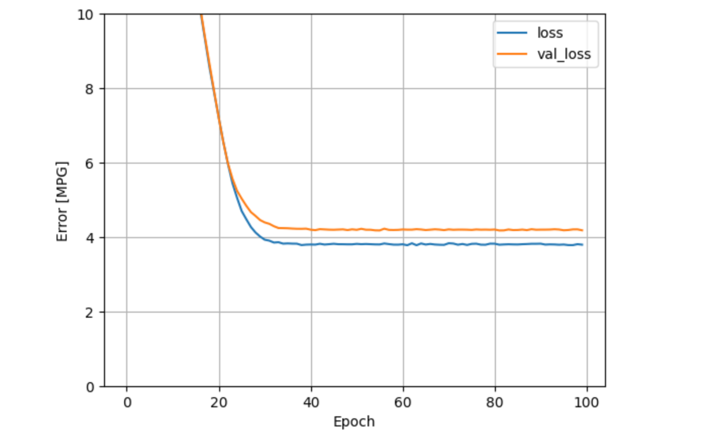

## **TF Version of the code**

```
import numpy as np
import matplotlib.pyplot as plt
from sklearn.model_selection import train_test_split
from sklearn.preprocessing import StandardScaler
from sklearn.datasets import make_regression
import tensorflow as tf
from tensorflow.keras.models import Sequential
from tensorflow.keras.layers import Dense
from tensorflow.keras.optimizers import SGD
from tensorflow.keras.losses import MeanSquaredError
```
```
# Generate synthetic data
X, y = make_regression(n_samples=1000, n_features=10, noise=0.1)
y = y.reshape(-1, 1)  # Reshape to match output dimensions

# Split data into training and test sets
X_train, X_test, y_train, y_test = train_test_split(X, y, test_size=0.2, random_state=42)

# Standardize the data
scaler_X = StandardScaler()
scaler_y = StandardScaler()

X_train = scaler_X.fit_transform(X_train)
X_test = scaler_X.transform(X_test)
y_train = scaler_y.fit_transform(y_train)
y_test = scaler_y.transform(y_test)
```

```
# Define the model
model = Sequential()
model.add(Dense(units=1, input_dim=X_train.shape[1], activation='linear'))

# Compile the model
model.compile(optimizer=SGD(learning_rate=0.01), loss=MeanSquaredError())
```

```
# Train the model
history = model.fit(X_train, y_train, epochs=1000, batch_size=32, verbose=1)
```

```
# Evaluate the model
y_pred = model.predict(X_test)
y_pred = scaler_y.inverse_transform(y_pred)
y_test_inverse = scaler_y.inverse_transform(y_test)

# Plot predictions vs actual
plt.scatter(y_test_inverse, y_pred, color='blue')
plt.plot([y_test_inverse.min(), y_test_inverse.max()], [y_test_inverse.min(), y_test_inverse.max()], 'k--', lw=2)
plt.xlabel('Actual')
plt.ylabel('Predicted')
plt.title('Predicted vs Actual')
plt.show()
```

## **Tensorflow version of the code**

```
# Split data into training and test sets
X_train, X_test, y_train, y_test = train_test_split(X, y, test_size=0.2, random_state=42)

# Standardize the data
scaler_X = StandardScaler()
scaler_y = StandardScaler()

X_train = scaler_X.fit_transform(X_train)
X_test = scaler_X.transform(X_test)
y_train = scaler_y.fit_transform(y_train)
y_test = scaler_y.transform(y_test)

# Convert to TensorFlow tensors
X_train = tf.constant(X_train, dtype=tf.float32)
X_test = tf.constant(X_test, dtype=tf.float32)
y_train = tf.constant(y_train, dtype=tf.float32)
y_test = tf.constant(y_test, dtype=tf.float32)
```

```
model = tf.keras.Sequential([
    tf.keras.layers.Dense(units=1, input_dim=X_train.shape[1], activation='linear')
])
```

```
model.compile(optimizer='sgd', loss='mean_squared_error')
```

```
history = model.fit(X_train, y_train, epochs=1000, batch_size=32, verbose=1)
```

```
y_pred = model.predict(X_test)
y_pred = scaler_y.inverse_transform(y_pred)
y_test_inverse = scaler_y.inverse_transform(y_test)

plt.scatter(y_test_inverse, y_pred, color='blue')
plt.plot([y_test_inverse.min(), y_test_inverse.max()], [y_test_inverse.min(), y_test_inverse.max()], 'k--', lw=2)
plt.xlabel('Actual')
plt.ylabel('Predicted')
plt.title('Predicted vs Actual')
plt.show()
```

```
# making it deep using TF
# Split data into training and test sets
X_train, X_test, y_train, y_test = train_test_split(X, y, test_size=0.2, random_state=42)

# Standardize the data
scaler_X = StandardScaler()
scaler_y = StandardScaler()

X_train = scaler_X.fit_transform(X_train)
X_test = scaler_X.transform(X_test)
y_train = scaler_y.fit_transform(y_train)
y_test = scaler_y.transform(y_test)
```

```
# Convert to TensorFlow tensors
X_train = tf.constant(X_train, dtype=tf.float32)
X_test = tf.constant(X_test, dtype=tf.float32)
y_train = tf.constant(y_train, dtype=tf.float32)
y_test = tf.constant(y_test, dtype=tf.float32)
```

```
# Define the model
model = tf.keras.Sequential([
    tf.keras.layers.Dense(64, input_dim=X_train.shape[1], activation='relu'),
    tf.keras.layers.Dense(32, activation='relu'),
    tf.keras.layers.Dense(16, activation='relu'),
    tf.keras.layers.Dense(1, activation='linear')
])
```

```
model.summary()
```

```
# Compile the model
model.compile(optimizer='adam', loss='mean_squared_error')
```

```
# Train the model
history = model.fit(X_train, y_train, epochs=100, batch_size=32, verbose=1)
```

```
# Evaluate the model
y_pred = model.predict(X_test)
y_pred = scaler_y.inverse_transform(y_pred)
y_test_inverse = scaler_y.inverse_transform(y_test)
```

```
# Plot predictions vs actual
plt.scatter(y_test_inverse, y_pred, color='blue')
plt.plot([y_test_inverse.min(), y_test_inverse.max()], [y_test_inverse.min(), y_test_inverse.max()], 'k--', lw=2)
plt.xlabel('Actual')
plt.ylabel('Predicted')
plt.title('Predicted vs Actual')
plt.show()
```

## **Refined Intro to TF**

```
import tensorflow as tf
```

```
string = tf.Variable("this is a string", tf.string)
string
```

```
string = tf.Variable("this is a string", tf.string)
number = tf.Variable(324, tf.int16)
floating = tf.Variable(3.567, tf.float32)
```

```
11*8*8*8*8*8*8*4
```

```
rank1_tensor = tf.Variable(["Test"], tf.string)
rank2_tensor = tf.Variable([["test", "ok"], ["test", "yes"]], tf.string)
```

```
tf.rank(rank1_tensor)
#tf.shape(rank2_tensor)
```

```
t1 = tf.zeros([1,2,3])
t2 = tf.reshape(t1, [2,3,1])
t3 = tf.reshape(t2, [3,-1])
```

```
### Refined Code for TensorFlow 2.x

import tensorflow as tf

# Tensor Creation Examples
string = tf.Variable("this is a string", tf.string)
number = tf.Variable(324, tf.int16)
floating = tf.Variable(3.567, tf.float32)

# Tensor Rank Examples
rank1_tensor = tf.Variable(["Test"], tf.string)
rank2_tensor = tf.Variable([["test", "ok"], ["test", "yes"]], tf.string)

# Tensor Shape Examples
print(tf.rank(rank2_tensor))
print(tf.shape(rank2_tensor))

# Reshaping Tensors
t1 = tf.zeros([1,2,3])
t2 = tf.reshape(t1, [2,3,1])
t3 = tf.reshape(t2, [3,-1])

# Placeholder Example (TensorFlow 2.x does not have placeholders)
@tf.function
def func(x):
    return x

output = func(tf.constant('Hello World'))
print(output)

# Placeholder with feed_dict Example (Converted to TensorFlow 2.x)
@tf.function
def func(x, y, z):
    return x, y, z

output_x, output_y, output_z = func(tf.constant('Test String'), tf.constant(123), tf.constant(45.67))
print(output_x)
print(output_y)
print(output_z)

# TensorFlow Math Functions
x = tf.add(5, 2)
y = tf.subtract(10, 4)
z = tf.multiply(2, 5)

# Matrix Multiplication
x = tf.constant([[1,2], [3,4]])
y = tf.constant([[1,1], [1,1]])

z = tf.matmul(x, y)

# Softmax Function
x = tf.constant([2.0, 1.0, 0.1])
print(tf.nn.softmax(x))

# Cross Entropy Example
softmax_data = [0.7, 0.2, 0.1]
one_hot_data = [1.0, 0.0, 0.0]

softmax = tf.constant(softmax_data)
one_hot = tf.constant(one_hot_data)

cross_entropy = -tf.reduce_sum(tf.multiply(one_hot, tf.math.log(softmax)))
print(cross_entropy)
```

```
import tensorflow as tf

@tf.function
def func(x):
    return x

output = func(tf.constant('Hello World'))
print(output)
```

```
import tensorflow as tf

# Tensor Creation Examples
string = tf.Variable("this is a string", tf.string)
number = tf.Variable(324, tf.int16)
floating = tf.Variable(3.567, tf.float32)

# Tensor Rank Examples
rank1_tensor = tf.Variable(["Test"], tf.string)
rank2_tensor = tf.Variable([["test", "ok"], ["test", "yes"]], tf.string)

# Tensor Shape Examples
print(tf.rank(rank2_tensor))
print(tf.shape(rank2_tensor))

# Reshaping Tensors
t1 = tf.zeros([1,2,3])
t2 = tf.reshape(t1, [2,3,1])
t3 = tf.reshape(t2, [3,-1])

# Placeholder Example (TensorFlow 2.x does not have placeholders)
@tf.function
def func(x):
    return x

output = func(tf.constant('Hello World'))
print(output)

# Placeholder with feed_dict Example (Converted to TensorFlow 2.x)
@tf.function
def func(x, y, z):
    return x, y, z

output_x, output_y, output_z = func(tf.constant('Test String'), tf.constant(123), tf.constant(45.67))
print(output_x)
print(output_y)
print(output_z)

# TensorFlow Math Functions
x = tf.add(5, 2)
y = tf.subtract(10, 4)
z = tf.multiply(2, 5)

# Matrix Multiplication
x = tf.constant([[1,2], [3,4]])
y = tf.constant([[1,1], [1,1]])

z = tf.matmul(x, y)

# Softmax Function
x = tf.constant([2.0, 1.0, 0.1])
print(tf.nn.softmax(x))

# Cross Entropy Example
softmax_data = [0.7, 0.2, 0.1]
one_hot_data = [1.0, 0.0, 0.0]

softmax = tf.constant(softmax_data)
one_hot = tf.constant(one_hot_data)

cross_entropy = -tf.reduce_sum(tf.multiply(one_hot, tf.math.log(softmax)))
print(cross_entropy)
```

## **TF regression**

## **Basic regression: Predict fuel efficiency**

In a regression problem, the aim is to predict the output of a continuous value, like a price or a probability. Contrast this with a classification problem, where the aim is to select a class from a list of classes (for example, where a picture contains an apple or an orange, recognizing which fruit is in the picture).

This tutorial uses the classic Auto MPG dataset and demonstrates how to build models to predict the fuel efficiency of the late-1970s and early 1980s automobiles. To do this, you will provide the models with a description of many automobiles from that time period. This description includes attributes like cylinders, displacement, horsepower, and weight.

```
# Use seaborn for pairplot.
!pip install -q seaborn
```

```
import matplotlib.pyplot as plt
import numpy as np
import pandas as pd
import seaborn as sns

# Make NumPy printouts easier to read.
np.set_printoptions(precision=3, suppress=True)
```

```
import tensorflow as tf

from tensorflow import keras
from tensorflow.keras import layers

print(tf.__version__)
```

## **The Auto MPG dataset**

The dataset is available from the UCI Machine Learning Repository.
https://archive.ics.uci.edu/


**Get the data**

First download and import the dataset using pandas:

```
url = 'http://archive.ics.uci.edu/ml/machine-learning-databases/auto-mpg/auto-mpg.data'
column_names = ['MPG', 'Cylinders', 'Displacement', 'Horsepower', 'Weight',
                'Acceleration', 'Model Year', 'Origin']

raw_dataset = pd.read_csv(url, names=column_names,
                          na_values='?', comment='\t',
                          sep=' ', skipinitialspace=True)
```

```
dataset = raw_dataset.copy()
dataset.tail()
```

**Clean the data**

The dataset contains a few unknown values:

```
dataset.isna().sum()
```

Drop those rows to keep this initial tutorial simple:

```
dataset = dataset.dropna()
```

The "Origin" column is categorical, not numeric. So the next step is to one-hot encode the values in the column with pd.get_dummies.

Note: You can set up the tf.keras.Model to do this kind of transformation for you but that's beyond the scope of this tutorial.

```
dataset['Origin'] = dataset['Origin'].map({1: 'USA', 2: 'Europe', 3: 'Japan'})
```

```
dataset = pd.get_dummies(dataset, columns=['Origin'], prefix='', prefix_sep='')
dataset.tail()
```

**Split the data into training and test sets:**

Now, split the dataset into a training set and a test set. You will use the test set in the final evaluation of your models.

```
train_dataset = dataset.sample(frac=0.8, random_state=0)
test_dataset = dataset.drop(train_dataset.index)
```

**Inspect the data**

Review the joint distribution of a few pairs of columns from the training set.

The top row suggests that the fuel efficiency (MPG) is a function of all the other parameters. The other rows indicate they are functions of each other.

```
sns.pairplot(train_dataset[['MPG', 'Cylinders', 'Displacement', 'Weight']], diag_kind='kde')
```


```
train_dataset.describe().transpose()
```

**Split features from labels**

Separate the target value—the "label"—from the features. This label is the value that you will train the model to predict.

```
train_features = train_dataset.copy()
test_features = test_dataset.copy()

train_labels = train_features.pop('MPG')
test_labels = test_features.pop('MPG')
```

**Normalization**

In the table of statistics it's easy to see how different the ranges of each feature are:

```
train_dataset.describe().transpose()[['mean', 'std']]
```

It is good practice to normalize features that use different scales and ranges.

One reason this is important is because the features are multiplied by the model weights. So, the scale of the outputs and the scale of the gradients are affected by the scale of the inputs.

Although a model might converge without feature normalization, normalization makes training much more stable.

Note: There is no advantage to normalizing the one-hot features—it is done here for simplicity. For more details on how to use the preprocessing layers, refer to the Working with preprocessing layers guide and the Classify structured data using Keras preprocessing layers tutorial.

**The Normalization layer**

The tf.keras.layers.Normalization is a clean and simple way to add feature normalization into your model.

The first step is to create the layer:

```
normalizer = tf.keras.layers.Normalization(axis=-1)
```

Then, fit the state of the preprocessing layer to the data by calling Normalization.adapt:

```
normalizer.adapt(np.array(train_features))
```

Calculate the mean and variance, and store them in the layer:

```
print(normalizer.mean.numpy())
```

When the layer is called, it returns the input data, with each feature independently normalized:

```
first = np.array(train_features[:1])

with np.printoptions(precision=2, suppress=True):
  print('First example:', first)
  print()
  print('Normalized:', normalizer(first).numpy())
```

## **Linear regression**

Before building a deep neural network model, start with linear regression using one and several variables.

**Linear regression with one variable**

Begin with a single-variable linear regression to predict 'MPG' from 'Horsepower'.

Training a model with tf.keras typically starts by defining the model architecture. Use a tf.keras.Sequential model, which represents a sequence of steps.

There are two steps in your single-variable linear regression model:

   - Normalize the 'Horsepower' input features using the tf.keras.layers.Normalization preprocessing layer.
   - Apply a linear transformation () to produce 1 output using a linear layer (tf.keras.layers.Dense).

The number of inputs can either be set by the input_shape argument, or automatically when the model is run for the first time.

First, create a NumPy array made of the 'Horsepower' features. Then, instantiate the tf.keras.layers.Normalization and fit its state to the horsepower data:

```
horsepower = np.array(train_features['Horsepower'])

horsepower_normalizer = layers.Normalization(input_shape=[1,], axis=None)
horsepower_normalizer.adapt(horsepower)
```

Build the Keras Sequential model:

```
horsepower_model = tf.keras.Sequential([
    horsepower_normalizer,
    layers.Dense(units=1)
])

horsepower_model.summary()
```

This model will predict 'MPG' from 'Horsepower'
Run the untrained model on the first 10 'Horsepower' values. The output won't be good, but notice that it has the expected shape of (10, 1):


Once the model is built, configure the training procedure using the Keras Model.compile method. The most important arguments to compile are the loss and the optimizer, since these define what will be optimized (mean_absolute_error) and how (using the tf.keras.optimizers.Adam).

```
horsepower_model.compile(
    optimizer=tf.keras.optimizers.Adam(learning_rate=0.1),
    loss='mean_absolute_error')
```

Use Keras Model.fit to execute the training for 100 epochs:

```
%%time
history = horsepower_model.fit(
    train_features['Horsepower'],
    train_labels,
    epochs=100,
    # Suppress logging.
    verbose=0,
    # Calculate validation results on 20% of the training data.
    validation_split = 0.2)
```

Visualize the model's training progress using the stats stored in the history object:

```
hist = pd.DataFrame(history.history)
hist['epoch'] = history.epoch
hist.tail()
```

```
def plot_loss(history):
  plt.plot(history.history['loss'], label='loss')
  plt.plot(history.history['val_loss'], label='val_loss')
  plt.ylim([0, 10])
  plt.xlabel('Epoch')
  plt.ylabel('Error [MPG]')
  plt.legend()
  plt.grid(True)
```

```
plot_loss(history)
```



Collect the results on the test set for later:

```
test_results = {}

test_results['horsepower_model'] = horsepower_model.evaluate(
    test_features['Horsepower'],
    test_labels, verbose=0)
```

```
x = tf.linspace(0.0, 250, 251)
y = horsepower_model.predict(x)
```

```
def plot_horsepower(x, y):
  plt.scatter(train_features['Horsepower'], train_labels, label='Data')
  plt.plot(x, y, color='k', label='Predictions')
  plt.xlabel('Horsepower')
  plt.ylabel('MPG')
  plt.legend()
```

Since this is a single variable regression, it's easy to view the model's predictions as a function of the input:

```
def plot_horsepower(x, y):
  plt.scatter(train_features['Horsepower'], train_labels, label='Data')
  plt.plot(x, y, color='k', label='Predictions')
  plt.xlabel('Horsepower')
  plt.ylabel('MPG')
  plt.legend()
```

```
plot_horsepower(x, y)
```


## **Linear regression with multiple inputs**

You can use an almost identical setup to make predictions based on multiple inputs. This model still does the same y = mx + b except that m is a matrix and x is a vector.

Create a two-step Keras Sequential model again with the first layer being normalizer (tf.keras.layers.Normalization(axis=-1)) you defined earlier and adapted to the whole dataset:

```
linear_model = tf.keras.Sequential([
    normalizer,
    layers.Dense(units=1)
])
```

When you call Model.predict on a batch of inputs, it produces units=1 outputs for each example:

```
linear_model.predict(train_features[:10])
```

When you call the model, its weight matrices will be built—check that the kernel weights (the m in y  = mx + b) have a shape (9, 1)

```
linear_model.layers[1].kernel
```

Configure the model with Keras Model.compile and train with Model.fit for 100 epochs:

```
linear_model.compile(
    optimizer=tf.keras.optimizers.Adam(learning_rate=0.1),
    loss='mean_absolute_error')
```

```
%%time
history = linear_model.fit(
    train_features,
    train_labels,
    epochs=100,
    # Suppress logging.
    verbose=0,
    # Calculate validation results on 20% of the training data.
    validation_split = 0.2)
```

Using all the inputs in this regression model achieves a much lower training and validation error than the horsepower_model, which had one input:

plot_loss(history)


