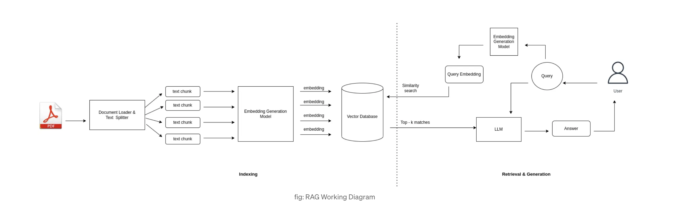
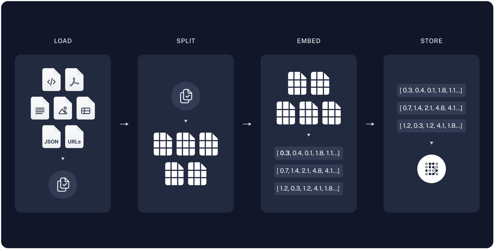
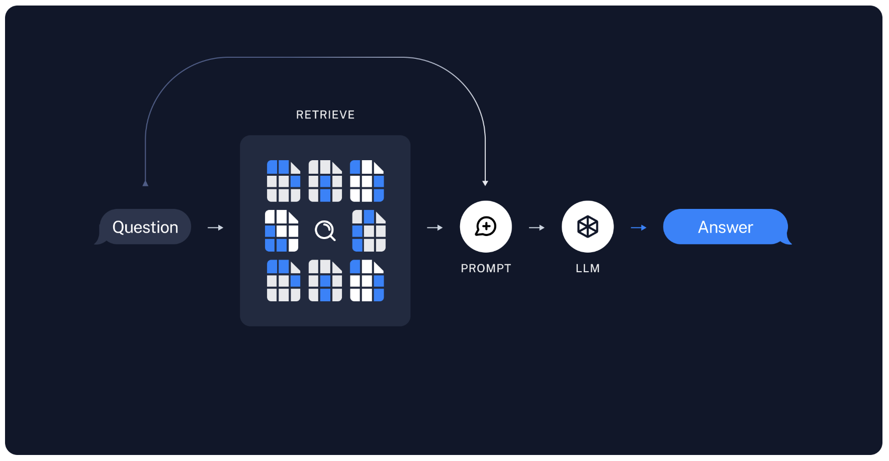
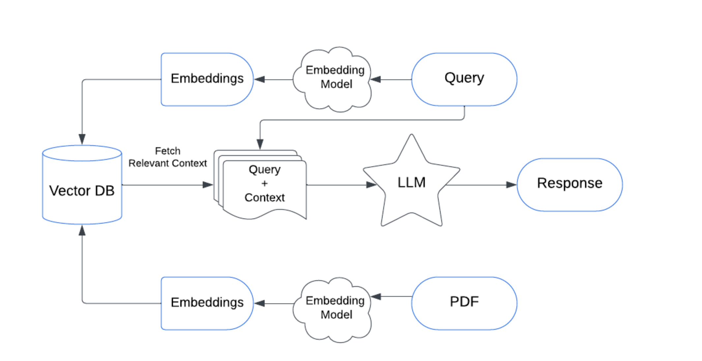

# **Retrieval Augmented Generation (RAG)**

But we have another approach where we can augment the knowledge of LLMs and retrieve information from custom content.It is called Retrieval Augmented Generation (RAG).

Utility tools like ChatPDF have been popular Generative AI tools. The PDF document is connected as an external data source and we can interact with it as we are assisted by an LLM.

What we do in RAG is inserting additional data into the context (prompt) of a model at inference time. That helps the LLM get more precise and relevant content for our queries when compared to zero-shot prompting.

Another way of looking at it is in the context of a doctor and patient. A doctor’s diagnosis can be significantly more precise and accurate when they have access to the patient’s test results and charts, as opposed to relying solely on symptomatic observations.







**The workflow of the RAG based LLM application will be as follows:**

1. Receive query from the user.
2. Convert it to an embedded query vector preserving the semantics, using an embedding model.
3. Retrieve the top-k relevant content from the vector database by computing similarity between the query embedding and the content embedding in the database.
4. Pass the retrieved content and query as a prompt to an LLM.
5. The LLM gives the required response.





1. Download Ollama(Macos)
   https://ollama.com/download
   https://github.com/ollama/ollama

2. Unzip the zip file
3. Move to Application 

```
(base) gggggggg:~ ganesh$ ollama
Usage:
  ollama [flags]
  ollama [command]

Available Commands:
  serve       Start ollama
  create      Create a model from a Modelfile
  show        Show information for a model
  run         Run a model
  stop        Stop a running model
  pull        Pull a model from a registry
  push        Push a model to a registry
  list        List models
  ps          List running models
  cp          Copy a model
  rm          Remove a model
  help        Help about any command

Flags:
  -h, --help      help for ollama
  -v, --version   Show version information

Use "ollama [command] --help" for more information about a command.
(base) ggggggggg:~ ganesh$ 
```
4. Run the llama2

```
(base) gggggg:~ ganesh$ ollama run llama2
pulling manifest 
pulling 8934d96d3f08... 100% ▕██████████████████████████████████████████████████████████████████████████████████████████████████████████████████████████████████████████████████▏ 3.8 GB                         
pulling 8c17c2ebb0ea... 100% ▕██████████████████████████████████████████████████████████████████████████████████████████████████████████████████████████████████████████████████▏ 7.0 KB                         
pulling 7c23fb36d801... 100% ▕██████████████████████████████████████████████████████████████████████████████████████████████████████████████████████████████████████████████████▏ 4.8 KB                         
pulling 2e0493f67d0c... 100% ▕██████████████████████████████████████████████████████████████████████████████████████████████████████████████████████████████████████████████████▏   59 B                         
pulling fa304d675061... 100% ▕██████████████████████████████████████████████████████████████████████████████████████████████████████████████████████████████████████████████████▏   91 B                         
pulling 42ba7f8a01dd... 100% ▕██████████████████████████████████████████████████████████████████████████████████████████████████████████████████████████████████████████████████▏  557 B                         
verifying sha256 digest 
writing manifest 
success 
>>> 
>>> Send a message (/? for help)


```

# RAG Pipeline with Vector DataBase

```
## Data Ingetion
#pip install pypdf
#pip install langchain_community
from langchain_community.document_loaders import TextLoader
from langchain_community.document_loaders import PyPDFLoader
from langchain_community.document_loaders import WebBaseLoader
from langchain_community.document_loaders import CSVLoader
from langchain.text_splitter import RecursiveCharacterTextSplitter
from langchain.schema import Document
#from bs4 import SoupStrainer
import bs4
import os
from dotenv import load_dotenv
```

```
load_dotenv()
os.environ['OPENAPI_API_KEY']=os.getenv("OPENAPI_API_KEY")
```

```
Text reader
loader = TextLoader('Speech.txt')
docs = loader.load()
```

```
for doc in docs:
    print(doc.page_content)  # or any other attribute like `metadata`
```

```
#Web based loader
#Load, chunk and Index the content of HTML page

loader = WebBaseLoader(web_paths=("https://lilianweng.github.io/posts/2023-06-23-agent/",),\
                                   bs_kwargs=dict(parse_only=bs4.SoupStrainer( \
                                   class_=("post-title","post-content","post-header")
                                 )))

docs=loader.load()
```

```
for doc in docs:
    print(doc.page_content)  # or any other attribute like `metadata`
```

```
# PDF Reader
loader = PyPDFLoader('docs/Ganesh_Kinkar_Giri_DevSecOps.pdf')
docs = loader.load()
```

```
for doc in docs:
    print(doc.page_content)  # or any other attribute like `metadata`
```

```
#CSV Loader
loader = CSVLoader("issue.csv")
docs = loader.load()
```

```
for doc in docs:
    print(doc.page_content)  # or any other attribute like `metadata`
```

# Chunk & Split the text data

```
text_splitter = RecursiveCharacterTextSplitter(chunk_size=200,chunk_overlap=50)
chunk_documents = text_splitter.split_documents(docs)
chunk_documents
```

# Vector Embedding and Vector Store
## Either you can use Embeddings model OpenAI or ollama

```
from langchain_openai import OpenAIEmbeddings
from langchain_community.embeddings import OpenAIEmbeddings
from langchain_community.embeddings import OllamaEmbeddings
from langchain_community.vectorstores import FAISS

db=FAISS.from_documents(chunk_documents,OllamaEmbeddings())
db
```

# Query

```
query = "unable to connect VM/ VM not accessible"
retrive_result = db.similarity_search(query)
print(retrive_result[0].page_content)
```


# Retirever and Chain with Langchain

```
## Data Ingetion
#pip install pypdf
#pip install langchain_community
from langchain_community.document_loaders import TextLoader
from langchain_community.document_loaders import PyPDFLoader
from langchain_community.document_loaders import WebBaseLoader
from langchain_community.document_loaders import CSVLoader
from langchain.text_splitter import RecursiveCharacterTextSplitter
from langchain.schema import Document
#from bs4 import SoupStrainer
import bs4
import os
from dotenv import load_dotenv
```

```
load_dotenv()
os.environ['OPENAPI_API_KEY']=os.getenv("OPENAPI_API_KEY")
```

```
#Text Loader
loader = TextLoader("issue.txt")
docs = loader.load()
docs
```

# Chunk & Split the text data

```
text_splitter = RecursiveCharacterTextSplitter(chunk_size=200,chunk_overlap=50)
chunk_documents = text_splitter.split_documents(docs)
chunk_documents
```

# Vector Embedding and Vector Store
## Either you can use Embeddings model OpenAI or ollama

```
from langchain_openai import OpenAIEmbeddings
from langchain_community.embeddings import OpenAIEmbeddings
from langchain_community.embeddings import OllamaEmbeddings
from langchain_community.vectorstores import FAISS

db=FAISS.from_documents(chunk_documents,OllamaEmbeddings())
db
```

# Design ChatPrompt Template

```
from langchain_core.prompts import ChatPromptTemplate
prompt=ChatPromptTemplate.from_template("""
Answer the following question based only on the provided context.
Think step by step before providing a detailed answer.
<context>
{context}                                                                                                                        
</context>

Question: {input}                                                                                
""")
```

# To integrate with LLM - here will use opensource LLM(Ollama) model llama2 

```
from langchain_community.llms import Ollama

llm=Ollama(model="llama2")
llm
```

## Chain

```
from langchain.chains.combine_documents import create_stuff_documents_chain
document_chain = create_stuff_documents_chain(llm, prompt)
document_chain
```

## Retrievers

```
retrievers = db.as_retriever()
retrievers
```

## Retrievers chain

```
from langchain.chains import create_retrieval_chain
retrieval_chain = create_retrieval_chain(retrievers, document_chain)
```

```
import textwrap
response = retrieval_chain.invoke({"input":"Low disk space"})
formatted_answer = textwrap.fill(response['answer'], width=80)
#wrapped_text = "\n\n".join(textwrap.fill(paragraph, width=80) for paragraph in formatted_answer.split("\n\n"))
#print(wrapped_text)
print(formatted_answer)
```

## Ans:

```
Based on the provided context, the answer to the question "Low disk space" is:
To resolve low disk space issues, the team should first check which application
is using the most disk space by running the command `df -h` in the terminal.
This will display a list of all mounted file systems and their usage in
percentage. The application that is using the most disk space should be
identified and the team should then take steps to free up space for that
application.  One possible solution is to increase the SKU size for the
application by running the command `sudoedit /etc/systemd/multi-
user/sockets.d/skusize` and updating the value of `SKU_SIZE` to a larger value.
This will allow the application to use more disk space without running out of
space.  Another solution is to clean up any unnecessary files or data that are
taking up space on the system by using the command `gzip -d <filename>` to
decompress files and then removing them with the command `rm <filename>`. This
will free up space on the disk without affecting the application's
functionality.  The team should also consider optimizing the application's code
to reduce its dependencies on disk space, such as by using caching or other
memory-based storage solutions. This may involve working with the application's
developers to make changes to the application's architecture.  Finally, the team
can check if there are any other applications that are using excessive amounts
of disk space and take steps to free up space for those applications as well.
```