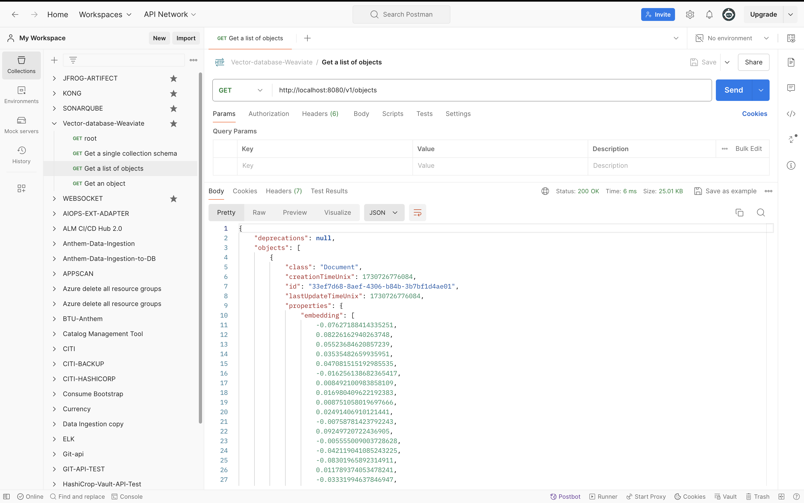
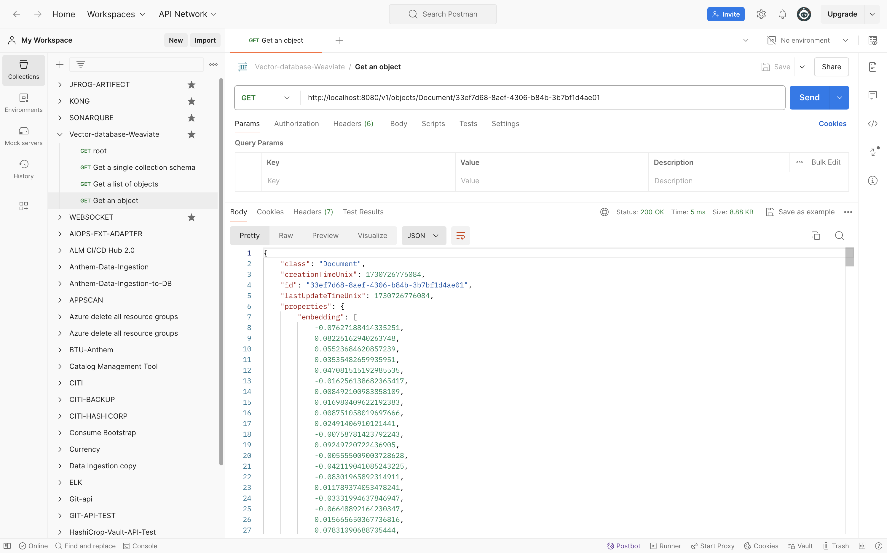

# <span style="color:Blue">**What is vector database?**</span>

- A vector database is a type of database optimized for storing, indexing, and searching high-dimensional vectors, which are mathematical representations of data points (like words, images, or other objects) in vector space.
- Vector databases are especially useful for handling data from applications in AI and machine learning, particularly in tasks involving similarity search and recommendation engines.
- A Vector Database, at its essence, is a relational database system specifically designed to process vectorized data. Unlike conventional databases that contain information in tables, rows, and columns, vector databases work with vectors–arrays of numerical values that signify points in multidimensional space.
- Vectors, in turn, are everywhere and are commonly used in, for instance, machine learning, artificial intelligence, genomics, and geospatial analysis. At these datasets, there are frequently high-dimensional vectors where each dimension represents a particular attribute or feature.
- Such data place a heavy burden on traditional databases as they are tabular in form and do not allow efficiency in the storage and retrieval of such data and there comes the bottleneck in the performance of the database.


# <span style="color:Blue">**What is a Vector?**</span>

- Vector in the field of mathematics and data science refers to a serial arrangement of numerical values.
- It is a node in a many-dimensional space where one weight from each vector corresponds to a specific dimension.
- In the domain of vector databases, such arrays of numerical values, thus, turn into primitive concepts of information, making it possible for the store and processing of data in high dimensions.


# <span style="color:Blue">**How Vector Databases Work?**</span>

Vector Database is a type of database that is used in various machine learning use cases. They are specialized for the storage and retrieval of vector data.

**What are embeddings?**

Embedding is a data like words that have been converted into an array of numbers known as a vector that contains patterns of relationships the combination of these numbers that make up the vector act as a multi-dimensional map to measure similarity.


The combination of these numbers that make up the vector act as a multi-dimensional map to measure similarity.


Let’s see an example describe a 2d graph the words dog and puppy are often used in similar situations.


So in a word embedding they would be represented by vectors that are close together.


Well this is a simple 2D example of a single dimension in reality the vector has hundreds of Dimensions that cover the rich multi-dimensional complex relationship between words.

**Example**

Images can also be turned into vectors. Google does similar images searches and the image sections are broken down into arrays of numbers allowing you to find patterns of similarity for those with closely resembling vectors.


Once an embedding is created it can be stored in a database and a database full of these is considered as a vector database.


Vector database can be used in several ways, searching where results are ranked by relevance to a query string or clustering where text strings are grouped by similarity and recommendations where items with related text strings are recommended also classification where text strings are classified by their most similar label.


# <span style="color:Blue">**Key Components of Vector Databases**</span>

1. **Embedding Storage:** Stores high-dimensional vectors.
2. **Indexing and Search:** Uses specialized indexing techniques like **HNSW (Hierarchical Navigable Small World)** or **FAISS (Facebook AI Similarity Search)** for fast similarity search across massive vector datasets.
3. **Scalability:** Optimized for handling millions to billions of vectors.
4. **Metadata Support:** Allows for filtering and adding metadata alongside vectors for refined search capabilities.

# <span style="color:Blue">**Popular Use Cases**</span>

1. **Semantic Search:** Finds documents, images, or videos similar in meaning to a search query, even if they don’t share keywords.
2. **Recommendation Systems:** Suggests items similar to user preferences (like items with similar vector embeddings).
3. **Anomaly Detection:** Identifies outliers in datasets, as anomalies often have unique embeddings.
4. **Image and Video Recognition:** Matches similar images or videos based on visual features encoded in vectors.

# <span style="color:Blue">**Examples of Vector Databases**</span>

1. **Weaviate:** An open-source vector search engine with strong support for text, image, and video embeddings.
2. **Pinecone:** A managed vector database with a focus on scalable similarity search and recommendations.
3. **FAISS:** Primarily a library developed by Facebook AI for fast nearest neighbor search but also used in building vector search systems.
4. **Milvus:** Another open-source vector database that provides highly scalable, low-latency vector searches.

# <span style="color:Blue">**Why Vector Databases Are Important**</span>

With the rise of LLMs (large language models) and computer vision, the demand for efficiently storing and retrieving high-dimensional embeddings has grown.

Traditional databases like SQL and NoSQL are not optimized for these kinds of searches. Vector databases are specifically designed to handle such data, making them a crucial component in building advanced, intelligent applications in AI, recommendation systems, and search.


## **faiss**

```
!pip install faiss-cpu
!pip install sentence-transformers
```

```
import faiss
import numpy as np
from sentence_transformers import SentenceTransformer

# Initialize embedding model
model = SentenceTransformer('all-MiniLM-L6-v2')

# Sample data
documents = ["This is document 1", "This is document 2", "Document 3 content"]

# Generate embeddings
embeddings = model.encode(documents)
dimension = embeddings.shape[1]

# Create FAISS index
index = faiss.IndexFlatL2(dimension)  # L2 distance index
index.add(np.array(embeddings))       # Add embeddings to the index
```

```
query = "What is document retrieval?"
query_embedding = model.encode([query])

# Search for top 3 nearest neighbors
D, I = index.search(np.array(query_embedding), k=2)
print("Top documents:", [documents[i] for i in I[0]])
```

## **weaviate**

```
docker run -d -p 8080:8080 semitechnologies/weaviate
```

```
http://localhost:8080/v1
```

```
import weaviate

# Connect to your Weaviate instance
client = weaviate.Client("http://localhost:8080")

# Define a schema for your documents
client.schema.create_class({
    "class": "Document",
    "properties": [
        {
            "name": "text",
            "dataType": ["text"]
        },
        {
            "name": "embedding",
            "dataType": ["number[]"]
        }
    ]
})
```

```
# Sample data and embeddings
documents = ["This is document 1", "This is document 2", "Document 3 content"]
embeddings = model.encode(documents)

# Upload documents with embeddings
for i, (doc, embedding) in enumerate(zip(documents, embeddings)):
    client.data_object.create(
        {
            "text": doc,
            "embedding": embedding.tolist()
        },
        "Document"
    )
```

```
query_embedding = model.encode(["What is document retrieval?"])
result = client.query.get("Document", ["text"]) \
    .with_near_vector({"vector": query_embedding.tolist()}) \
    .with_limit(3) \
    .do()
print("Top results:", result)
```


**Get a single collection schema**


**Get a list of objects**



**Get an object**



```
https://weaviate.io/developers/weaviate/api/rest#description/introduction
```