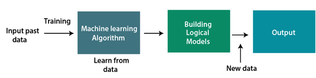
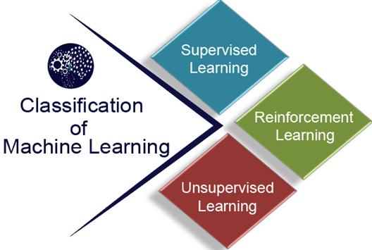

## **What is Machine Learning**

In the real world, we are surrounded by humans who can learn everything from their experiences with their learning capability, and we have computers or machines which work on our instructions. But can a machine also learn from experiences or past data like a human does? So here comes the role of Machine Learning.

## **Introduction to Machine Learning**

- A subset of artificial intelligence known as machine learning focuses primarily on the creation of algorithms that enable a computer to independently learn from data and previous experiences. 
- Machine learning algorithms create a mathematical model that, without being explicitly programmed, aids in making predictions or decisions with the assistance of sample historical data, or training data.
- For the purpose of developing predictive models, machine learning brings together statistics and computer science. 

## **Classification of Machine Learning**

### At a broad level, machine learning can be classified into three types:

- ## **Supervised learning**
- ## **Unsupervised learning**
- ## **Reinforcement learning**

