# **AZ-500: Microsoft Certified: Azure Security Engineer Associate**
## **Implement platform protection**
1. **Implement perimeter security**
    - Introduction
    - Define defense in depth
    - Explore virtual network security
    - Enable Distributed Denial of Service (DDoS) Protection
    - Configure a distributed denial of service protection implementation
    - Explore Azure Firewall features
    - Deploy an Azure Firewall implementation
    - Configure VPN forced tunneling
    - Create User Defined Routes and Network Virtual Appliances
    - Explore hub and spoke topology
    - Perform try-this exercises
    - Knowledge check
    - Summary
2. **Configure network security**
    - Introduction
    - Explore Network Security Groups (NSG)
    - Deploy a Network Security Groups implementation
    - Create Application Security Groups
    - Enable service endpoints
    - Configure service endpoint services
    - Deploy private links
    - Implement an Azure application gateway
    - Deploy a web application firewall
    - Configure and manage Azure front door
    - Review ExpressRoute
    - Perform try-this exercises
    - Knowledge check
    - Summary
3 **Configure and manage host security**
    - Introduction
    - Enable endpoint protection
    - Define a privileged access device strategy
    - Deploy privileged access workstations
    - Create virtual machine templates
    - Enable and secure remote access management
    - Configure update management
    - Deploy disk encryption
    - Managed disk encryption options
    - Deploy and configure Windows Defender
    - Microsoft cloud security benchmark in Defender for Cloud
    - Explore Microsoft Defender for Cloud recommendations
    - Perform Try-This exercises
    - Knowledge check
    - Summary
4 **Enable Containers security**
    - Introduction
    - Explore containers
    - Configure Azure Container Instances security
    - Manage security for Azure Container Instances (ACI)​
    - Explore the Azure Container Registry (ACR)
    - Enable Azure Container Registry authentication
    - Review Azure Kubernetes Service (AKS)
    - Implement an Azure Kubernetes Service architecture​
    - Configure Azure Kubernetes Service networking
    - Deploy Azure Kubernetes Service storage​
    - Secure authentication to Azure Kubernetes Service with Active Directory
    - Manage access to Azure Kubernetes Service using Azure role-based access controls
    - Knowledge check
    - Summary

# **Introduction**
Think of security in layers. You need to lock down the perimeter first, and then work your way inward locking down each layer. The more work and cost a bad-actor has to invest to get to valuable information the more likely they are to leave you alone.

# **Scenario**
A security engineer uses perimeter security features to block network traffic away from your primary network resources; you will work on such tasks as:

   - Setup DDoS (denial-of-service) Protection.
   - Configure and maintain firewalls.
   - Use dedicated routes and network appliance to protect your network.

# **Define defense in depth**
The Defense in depth approach includes other controls in the design to mitigate risk to the organization in the event a primary security control fails. This design should consider how likely the primary control is to fail, the potential organizational risk if it does, and the effectiveness of the additional control (especially in the likely cases that would cause the primary control to fail).

During this module, we will explore the defense-in-depth design of Azure services and capabilities to help you securely manage and monitor your cloud data and infrastructure as a managed service. Microsoft designs and operates its cloud services with security at the core and provides you built-in controls and tools to meet your security needs. In addition, with Machine Learning (ML) and Microsoft's significant investments in cyber defense you can benefit from unique intelligence and proactive measures to protect you from threats. Azure offers unified security management and advanced threat protection for your resources whether they're in the cloud, your data center, or both. Each Service in Azure is built with security in mind from the ground up to host your infrastructure apps and data. All services are designed and operated to support multiple layers of defense, spanning your data apps, virtual machines, network perimeter-related policies, and physical security within our data centers. Including how the data sensors and systems that run Azure are architected and operated to the controls you can apply as part of your defense in-depth security management. An example strategy is illustrated in the following image.

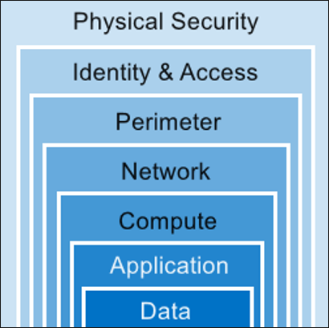

As more of a company’s digital resources reside outside the corporate network, in the cloud and on personal devices, it becomes obvious that a perimeter only based security, i.e. firewalls, DMZ, VNets, are no longer adequate. The adoption of software-defined networking (SDN) and software-defined data center (SDDC) technologies are driving Network Segmentation concepts to be more granular, i.e. Network Micro-Segmentation.

# **Network Micro-Segmentation**
Micro-segmentation is a way to create secure zones in data centers and Azure deployments that allow you to isolate workloads and protect them individually. Security policies in a virtual environment can be assigned to virtual connections that can move with an application if the network is reconfigured – making the security policy persistent.

A best practice recommendation is to adopt a Zero Trust strategy based on user, device, and application identities. In contrast to network access controls that are based on elements such as source and destination IP address, protocols, and port numbers, Zero Trust enforces and validates access control at “access time”. Granting access at access-time avoids the need to play a prediction game for an entire deployment, network, or subnet – only the destination resource needs to provide the necessary access controls.

   - **Azure Network Security Groups** can be used for basic layer 3 & 4 access controls between Azure Virtual Networks, their subnets, and the Internet.
   - **Application Security Groups** enable you to define fine-grained network security policies based on workloads, centralized on applications, instead of explicit IP addresses.
   - **Azure Web Application Firewall** and the **Azure Firewall** can be used for more advanced network access controls that require application layer support.
   - **Local Admin Password Solution (LAPS)** or a third-party Privileged Access Management can set strong local admin passwords and just in time access to them.

Additionally, third parties offer micro-segmentation approaches that may enhance your network controls by applying zero trust principles to networks you control with legacy assets on them.

# **Explore virtual network security**

# **Azure Networking Components**

The following sections define key terminology for Azure networking. Later, this course will cover each of these areas in more detail.

Azure Virtual Networks are a key component of Azure security services. The Azure network infrastructure enables you to securely connect Azure resources to each other with virtual networks (VNets). A VNet is a representation of your own network in the cloud. A VNet is a logical isolation of the Azure cloud network dedicated to your subscription. You can connect VNets to your on-premises networks.

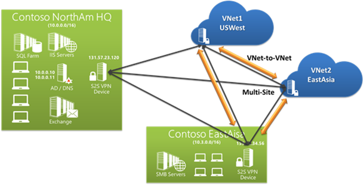

Azure supports dedicated WAN link connectivity to your on-premises network and an Azure Virtual Network with ExpressRoute. The link between Azure and your site uses a dedicated connection that does not go over the public Internet. If your Azure application is running in multiple datacenters, you can use Azure Traffic Manager to route requests from users intelligently across instances of the application. You can also route traffic to services not running in Azure if they are accessible from the Internet.

# **Virtual networks**

Organizations can use virtual networks to connect resources. Virtual networks in Azure are network overlays that you can use to configure and control the connectivity among Azure resources, such as VMs and load balancers.

Azure Virtual Network enables many types of Azure resources, such as Azure Virtual Machines (VM), to securely communicate with each other, the internet, and on-premises networks. A virtual network is scoped to a single Azure region. An Azure region is a set of datacenters deployed within a latency-defined perimeter and connected through a dedicated regional low-latency network.

Virtual networks are made up of subnets. A subnet is a range of IP addresses within your virtual network. Subnets, like virtual networks, are scoped to a single Azure region. You can implement multiple virtual networks within each Azure subscription and Azure region. Each virtual network is isolated from other virtual networks. For each virtual network you can:

   - Specify a custom private IP address space using public and private addresses. Azure assigns resources in a virtual network a private IP address from the address space that you assign.
   - Segment the virtual network into one or more subnets and allocate a portion of the virtual network's address space to each subnet.
   - Use Azure-provided name resolution, or specify your own DNS server, for use by resources in a virtual network.

# **IP addresses**

VMs, Azure load balancers, and application gateways in a single virtual network require unique Internet Protocol (IP) addresses the same way that clients in an on-premises subnet do. This enables these resources to communicate with each other. A virtual network uses two types of IP addresses:

   - **Private** - A private IP address is dynamically or statically allocated to a VM from the defined scope of IP addresses in the virtual network. VMs use these addresses to communicate with other VMs in the same or connected virtual networks through a gateway / Azure ExpressRoute connection. These private IP addresses, or non-routable IP addresses, conform to RFC 1918.
   - **Public** - Public IP addresses, which allow Azure resources to communicate with external clients, are assigned directly at the virtual network adapter of the VM or to the load balancer. Public IP address can also be added to Azure-only virtual networks. All IP blocks in the virtual network will be routable only within the customer's network, and they won't be reachable from outside. Virtual network packets travel through the high-speed Azure backplane.

You can control the dynamic IP addresses assigned to VMs and cloud services within an Azure virtual network by specifying an IP addressing scheme. Planning an IP addressing scheme within an Azure virtual network is much like planning an IP addressing scheme on-premises. The same ranges are often used, and the same rules applied. However, conditions exist that are unique to Azure virtual networks.

# **Subnets**

You can further divide your network by using subnets for the logical and security-related isolation of Azure resources. Each subnet contains a range of IP addresses that fall within the virtual network address space. Subnetting hides the details of internal network organization from external routers. Subnetting also segments the host within the network, making it easier to apply network security at the interconnections between subnets.

# **Network adapters**

VMs communicate with other VMs and other resources on the network by using virtual network adapters. Virtual network adapters configure VMs with private and, optionally, public IP address. A VM can have more than one network adapter for different network configurations.

# **Enable Distributed Denial of Service (DDoS) Protection**

A denial of service attack (DoS) is an attack that has the goal of preventing access to services or systems. If the attack originates from one location, it is called a DoS. If the attack originates from multiple networks and systems, it is called distributed denial of service (DDoS).

Before learning more about DDoS, you need to know what botnets are. Botnets are collections of internet-connected systems that an individual controls and uses without their owners’ knowledge. Botnet owners use them to perform various actions of their choosing.

Often, they use them for spamming, data storage, DDoS, or various other actions that are up to the person in control of the botnet. In the past, botnets were made up just of compromised computers, but now, botnets are also made up of Internet of Things (IoT) devices. Malicious hackers can get these poorly secured security cameras, digital video recorders, thermostats, and other internet-connected devices under their control.

So, DDoS is a collection of attack types aimed at disrupting the availability of a target. These attacks involve a coordinated effort that uses multiple internet-connected systems to launch many network requests against DNS, web services, email, and more. Pretty much any application that the malicious hacker can access might become the target of a DDoS. The malicious hacker’s goal is to overwhelm system resources on targeted servers so they can no longer process legitimate traffic, effectively making the system inaccessible.

A DDoS generally involves many systems sending traffic to targets as part of a botnet. In most cases, the owners of the systems in a botnet don’t know that their devices are compromised and participating in an attack. Botnets are becoming a bigger problem than before because of the increasing numbers of connected devices.

Designing and building for DDoS resiliency requires planning and designing for a variety of failure modes. The following table lists the best practices for building DDoS-resilient services in Azure.


# **Best practice 1**

Ensure that security is a priority throughout the entire lifecycle of an application, from design and implementation to deployment and operations. Applications might have bugs that allow a relatively low volume of requests to use a lot of resources, resulting in a service outage.

# **Solution 1**

To help protect a service running in Azure, understand your application architecture, and focus on the five pillars of software quality. They are:

| Pillar       | Description                                                                 |
|--------------|-----------------------------------------------------------------------------|
| Scalability  | The ability of a system to handle increased load                            |
| Availability | The proportion of time that a system is functional and   working            |
| Resiliency   | The ability of a system to recover from failures and   continue to function |
| Management   | Operations processes that keep a system running in   production             |
| Security     | Protecting applications and data from threats                               |


You should know typical traffic volumes, the connectivity model between the application and other applications, and the service endpoints that are exposed to the public internet.

Helping ensure that an application is resilient enough to handle a DoS targeted at the application itself is most important. Security and privacy features are built in to the Azure platform, beginning with the Microsoft Security Development Lifecycle (SDL). The SDL addresses security at every development phase and ensures that Azure is continually updated to make it even more secure. We will look at SDL later in this course.

# **Best practice 2**
Design your applications to scale horizontally to meet the demands of an amplified load—specifically, in the event of a DDoS. If your application depends on a single instance of a service, it creates a single point of failure. Provisioning multiple instances makes your system more resilient and more scalable.

# **Solution 2**
For Azure App Service, select an App Service plan that offers multiple instances.
For Azure Cloud Services, configure each of your roles to use multiple instances.
For Azure Virtual Machines, ensure that your VM architecture includes more than one VM and that each VM is included in an availability set. We recommend using virtual machine scale sets for autoscaling capabilities.

# **Best practice 3**
Layer security defenses in an application to reduce the chance of a successful attack. Implement security-enhanced designs for your applications by using the built-in capabilities of the Azure platform.

# **Solution 3**
Be aware that the risk of attack increases with the size, or surface area, of the application. You can reduce the surface area by using IP allowlists to close down the exposed IP address space and listening ports that aren’t needed on the load balancers (for Azure Load Balancer and Azure Application Gateway).

You can also use NSGs to reduce the attack surface. You can use service tags and application security groups as a natural extension of an application’s structure to minimize complexity for creating security rules and configuring network security.

# **Configure a distributed denial of service protection implementation**

Azure Distributed Denial of Service (DDoS) protection, combined with application design best practices, provide defense against DDoS attacks. Azure DDoS protection provides the following service tiers:

   - **Basic**: Automatically enabled as part of the Azure platform. Always-on traffic monitoring, and real-time mitigation of common network-level attacks, provide the same defenses utilized by Microsoft's online services. The entire scale of Azure's global network can be used to distribute and mitigate attack traffic across regions. Protection is provided for IPv4 and IPv6 Azure public IP addresses.
   - **Standard**: Provides additional mitigation capabilities over the Basic service tier that are tuned specifically to Azure Virtual Network resources. DDoS Protection Standard is simple to enable, and requires no application changes. Protection policies are tuned through dedicated traffic monitoring and machine learning algorithms. Policies are applied to public IP addresses associated to resources deployed in virtual networks, such as Azure Load Balancer, Azure Application Gateway, and Azure Service Fabric instances, but this protection does not apply to App Service Environments. Real-time telemetry is available through Azure Monitor views during an attack, and for history. Rich attack mitigation analytics are available via diagnostic settings. Application layer protection can be added through the Azure Application Gateway Web Application Firewall or by installing a 3rd party firewall from Azure Marketplace. Protection is provided for IPv4 and IPv6 Azure public IP addresses.

# **How Azure denial-of-service protection works**
DDoS Protection Standard monitors actual traffic utilization and constantly compares it against the thresholds defined in the DDoS policy. When the traffic threshold is exceeded, DDoS mitigation is automatically initiated. When traffic returns to a level below the threshold, the mitigation is removed.

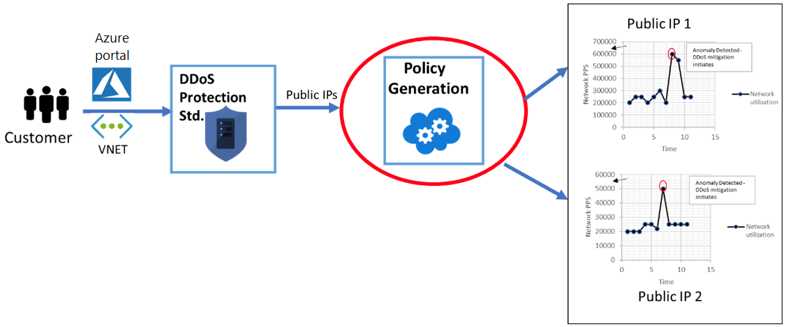

During mitigation, DDoS Protection redirects traffic sent to the protected resource and performs several checks, including:
   - Helping ensure that packets conform to internet specifications and aren’t malformed.
   - Interacting with the client to determine if the traffic might be a spoofed packet (for example, using SYN Auth or SYN Cookie or dropping a packet for the source to retransmit it).
   - Using rate-limit packets if it can’t perform any other enforcement method.

DDoS Protection blocks attack traffic and forwards the remaining traffic to its intended destination. Within a few minutes of attack detection, you’ll be notified with Azure Monitor metrics. By configuring logging on DDoS Protection Standard telemetry, you can write the logs to available options for future analysis. Azure Monitor retains metric data for DDoS Protection Standard for 30 days.

# **Types of denial-of-service attacks that Azure protection mitigates**
DDoS Protection Standard can mitigate the following types of attacks:

   - **Volumetric attacks**: The attack's goal is to flood the network layer with a substantial amount of seemingly legitimate traffic. It includes UDP floods, amplification floods, and other spoofed-packet floods. DDoS Protection Standard mitigates these potential multi-gigabyte attacks by absorbing and scrubbing them, with Azure's global network scale, automatically.
   - **Protocol attacks**: These attacks render a target inaccessible, by exploiting a weakness in the layer 3 and layer 4 protocol stack. It includes, SYN flood attacks, reflection attacks, and other protocol attacks. DDoS Protection Standard mitigates these attacks, differentiating between malicious and legitimate traffic, by interacting with the client, and blocking malicious traffic.
   - **Resource (application) layer attacks**: These attacks target web application packets, to disrupt the transmission of data between hosts. The attacks include HTTP protocol violations, SQL injection, cross-site scripting, and other layer 7 attacks. Use a Web Application Firewall, such as the Azure Application Gateway web application firewall, as well as DDoS Protection Standard to provide defense against these attacks. There are also third-party web application firewall offerings available in the Azure Marketplace.

** Important**
```
DDoS Protection Standard protects resources in a virtual network including public IP addresses associated with virtual machines, load balancers, and application gateways. When coupled with the Application Gateway web application firewall, or a third-party web application firewall deployed in a virtual network with a public IP, DDoS Protection Standard can provide full layer 3 to layer 7 mitigation capability.
```

# **Explore Azure Firewall features**

Azure Firewall is a managed, cloud-based network security service that protects your Azure Virtual Network resources. It’s a fully stateful firewall-as-a-service with built-in high availability and unrestricted cloud scalability. By default, Azure Firewall blocks traffic.

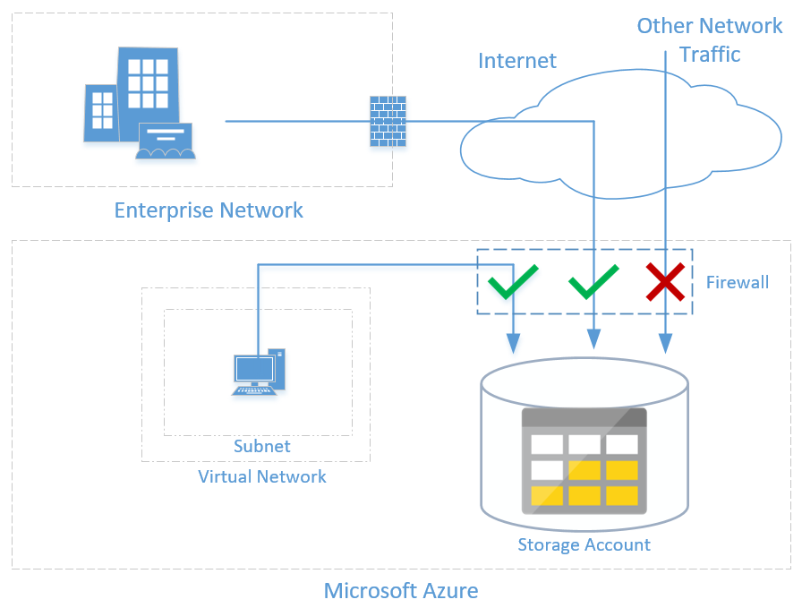

# **The Azure firewall features include**

   - **Built-in high availability** - Because high availability is built in, no additional load balancers are required and there’s nothing you need to configure.
   - **Unrestricted cloud scalability** - Azure Firewall can scale up as much as you need, to accommodate changing network traffic flows so you don't need to budget for your peak traffic.
   - **Application Fully Qualified Domain Name (FQDN) filtering rules** - You can limit outbound HTTP/S traffic to a specified list of FQDNs, including wild cards. This feature does not require SSL termination.
   - **Network traffic filtering rules** - You can centrally create allow or deny network filtering rules by source and destination IP address, port, and protocol. Azure Firewall is fully stateful, so it can distinguish legitimate packets for different types of connections. Rules are enforced and logged across multiple subscriptions and virtual networks.
   - **Qualified domain tags** - Fully Qualified Domain Names (FQDN) tags make it easier for you to allow well known Azure service network traffic through your firewall. For example, say you want to allow Windows Update network traffic through your firewall. You create an application rule and include the Windows Update tag. Now network traffic from Windows Update can flow through your firewall.
   - **Outbound Source Network Address Translation (OSNAT) support** - All outbound virtual network traffic IP addresses are translated to the Azure Firewall public IP. You can identify and allow traffic originating from your virtual network to remote internet destinations.
   - **Inbound Destination Network Address Translation (DNAT) support** - Inbound network traffic to your firewall public IP address is translated and filtered to the private IP addresses on your virtual networks.
   -**Azure Monitor logging**- All events are integrated with Azure Monitor, allowing you to archive logs to a storage account, stream events to your Event Hub, or send them to Azure Monitor logs.


Grouping the features above into logical groups reveals that Azure Firewall has three rule types: NAT rules, network rules, and application rules. The application order precedence for the rules are that network rules are applied first, then application rules. Rules are terminating, which means if a match is found in network rules, then application rules are not processed. If there’s no network rule match, and if the packet protocol is HTTP/HTTPS, the packet is then evaluated by the application rules. If no match continues to be found, then the packet is evaluated against the infrastructure rule collection. If there’s still no match, then the packet is denied by default.

**NAT rules**

You can configure inbound connectivity by configuring Destination Network Address Translation (DNAT) as described in: Filter inbound traffic with Azure Firewall DNAT using the Azure portal. DNAT rules are applied first. If a match is found, an implicit corresponding network rule to allow the translated traffic is added. You can override this behavior by explicitly adding a network rule collection with deny rules that match the translated traffic. No application rules are applied for these connections.

**Firewall rules to secure Azure Storage**

Azure Storage provides a layered security model, which enables you to secure your storage accounts to a specific set of supported networks. When network rules are configured, only applications requesting data from over the specified set of networks can access a storage account.

An application that accesses a storage account when network rules are in effect requires proper authorization on the request. Authorization is supported with Azure AD credentials for blobs and queues, a valid account access key, or a SAS token.

By default, storage accounts accept connections from clients on any network. To limit access to selected networks, you must first change the default action. Making changes to network rules can impact your applications' ability to connect to Azure Storage. Setting the default network rule to Deny blocks all access to the data unless specific network rules that grant access are also applied. Be sure to grant access to any allowed networks using network rules before you change the default rule to deny access.

**Grant access from a virtual network**

You can configure storage accounts to allow access only from specific VNets.

You enable a service endpoint for Azure Storage within the VNet. This endpoint gives traffic an optimal route to the Azure Storage service. The identities of the virtual network and the subnet are also transmitted with each request. Administrators can then configure network rules for the storage account that allow requests to be received from specific subnets in the VNet. Clients granted access via these network rules must continue to meet the authorization requirements of the storage account to access the data.

Each storage account supports up to 100 virtual network rules, which could be combined with IP network rules.

Controlling outbound and inbound network access is an important part of an overall network security plan. Network traffic is subjected to the configured firewall rules when you route your network traffic to the firewall as the default gateway.

# **Deploy an Azure Firewall implementation**

Controlling outbound network access is an important part of an overall network security plan. For example, you may want to limit access to web sites. Or, you may want to limit the outbound IP addresses and ports that can be accessed.

One way you can control outbound network access from an Azure subnet is with Azure Firewall. With Azure Firewall, you can configure:

   - Application rules that define fully qualified domain names (FQDNs) that can be accessed from a subnet.
   - Network rules that define source address, protocol, destination port, and destination address.

Network traffic is subjected to the configured firewall rules when you route your network traffic to the firewall as the subnet default gateway.


**Fully Qualified Domain Name (FQDN) tag**

An FQDN tag represents a group of fully qualified domain names (FQDNs) associated with well known Microsoft services. You can use an FQDN tag in application rules to allow the required outbound network traffic through your firewall.

For example, to manually allow Windows Update network traffic through your firewall, you need to create multiple application rules per the Microsoft documentation. Using FQDN tags, you can create an application rule, include the Windows Updates tag, and now network traffic to Microsoft Windows Update endpoints can flow through your firewall.

**Infrastructure qualified domain names**

Azure Firewall includes a built-in rule collection for infrastructure FQDNs that are allowed by default. These FQDNs are specific for the platform and can't be used for other purposes.

The following services are included in the built-in rule collection:

   - Compute access to storage Platform Image Repository (PIR)
   - Managed disks status storage access
   - Azure Diagnostics and Logging (MDS)

**Logs and metrics**

You can monitor Azure Firewall using firewall logs. You can also use activity logs to audit operations on Azure Firewall resources.

You can access some of these logs through the portal. Logs can be sent to Azure Monitor logs, Storage, and Event Hubs and analyzed in Azure Monitor logs or by different tools such as Excel and Power BI.

Metrics are lightweight and can support near real-time scenarios making them useful for alerting and fast issue detection.

**Threat intelligence-based filtering**

Threat intelligence-based filtering can be enabled for your firewall to alert and deny traffic from/to known malicious IP addresses and domains. The IP addresses and domains are sourced from the Microsoft Threat Intelligence feed. Intelligent Security Graph powers Microsoft threat intelligence and is used by multiple services including Microsoft Defender for Cloud. If you've enabled threat intelligence-based filtering, the associated rules are processed before any of the NAT rules, network rules, or application rules.

You can choose to just log an alert when a rule is triggered, or you can choose alert and deny mode. By default, threat intelligence-based filtering is enabled in alert mode.

**Rule processing logic**
You can configure NAT rules, network rules, and applications rules on Azure Firewall. Rule collections are processed according to the rule type in priority order, lower numbers to higher numbers from 100 to 65,000. A rule collection name can have only letters, numbers, underscores, periods, or hyphens. It must begin with a letter or number, and end with a letter, number or underscore. The maximum name length is 80 characters.

It's best to initially space your rule collection priority numbers in 100 increments (100, 200, 300, and so on) so you have room to add more rule collections if needed.

**Service tags**

A service tag represents a group of IP address prefixes to help minimize complexity for security rule creation. You cannot create your own service tag, nor specify which IP addresses are included within a tag. Microsoft manages the address prefixes encompassed by the service tag, and automatically updates the service tag as addresses change.

Azure Firewall service tags can be used in the network rules destination field. You can use them in place of specific IP addresses.

**Remote work support**

**VDI**

Work from home policies requires many IT organizations to address fundamental changes in capacity, network, security, and governance. Employees aren't protected by the layered security policies associated with on-premises services while working from home. Virtual Desktop Infrastructure (VDI) deployments on Azure can help organizations rapidly respond to this changing environment. However, you need a way to protect inbound/outbound Internet access to and from these VDI deployments. You can use Azure Firewall DNAT rules along with its threat intelligence-based filtering capabilities to protect your VDI deployments.

**Virtual Desktop support**

Azure Virtual Desktop is a comprehensive desktop and app virtualization service running in Azure. It’s the only virtual desktop infrastructure (VDI) that delivers simplified management, multi-session Windows 10, optimizations for Microsoft 365 ProPlus, and support for Remote Desktop Services (RDS) environments. You can deploy and scale your Windows desktops and apps on Azure in minutes and get built-in security and compliance features. Windows Virtual Desktop doesn't require you to open any inbound access to your virtual network. However, you must allow a set of outbound network connections for the Windows Virtual Desktop virtual machines that run in your virtual network.

# **Configure VPN forced tunneling**

Why do some cases require forced tunneling? - A virtual private network (VPN) consists of remote peers sending private data securely to one another over an unsecured network, such as the Internet. This is called Internet tunneling. Site-to-site (S2S) VPNs use tunnels to encapsulate data packets within normal IP packets for forwarding over IP-based networks, using encryption to ensure privacy and authentication to ensure integrity of data.

Forced tunneling lets you redirect, or force, all internet-bound traffic back to your on-premises location via a site-to-site VPN tunnel for inspection and auditing. This is a critical security requirement for most enterprise IT policies. Without forced tunneling, internet-bound traffic from your VMs in Azure always traverses from the Azure network infrastructure directly to the internet—without the option to allow you to inspect or audit the traffic. Unauthorized internet access potentially leads to information disclosure or other types of security breaches.

As stated earlier, Azure currently works with two deployment models: The Resource Manager deployment model and the classic deployment model. The two models aren’t completely compatible with each other. The following exercise goes through configuring tunneling for virtual networks that were created via the Resource Manager deployment model.

The following figure depicts how forced tunneling works.


In the preceding figure, the front-end subnet doesn’t use forced tunneling. The workloads in the front-end subnet can continue to accept and respond to customer requests that come directly from the internet. The mid-tier and back-end subnets use forced tunneling. Any outbound connections from these two subnets to the internet are forced back to an on-premises site via one of the S2S VPN tunnels.

This allows you to restrict and inspect internet access from your VMs or cloud services in Azure while continuing to enable your multi-tier service architecture. If no internet-facing workloads exist in your VMs, you can also apply forced tunneling to the entire virtual network.

You configure forced tunneling in Azure via virtual network User Defined Routes (UDR). Redirecting traffic to an on-premises site is expressed as a default route to the Azure VPN gateway. This example uses UDRs to create a routing table to first add a default route and then associate the routing table with your virtual network subnets to enable forced tunneling on those subnets.

# **Create User Defined Routes and Network Virtual Appliances**

**User Defined Routes**

A User Defined Routes (UDR) is a custom route in Azure that overrides Azure's default system routes or adds routes to a subnet's route table. In Azure, you create a route table and then associate that route table with zero or more virtual network subnets. Each subnet can have zero or one route table associated with it. If you create a route table and associate it to a subnet, Azure either combines its routes with the default routes that Azure adds to a subnet or overrides those default routes.

In this diagram UDRs are used to direct traffic from the Gateway subnet and the Web tier to the Network Virtual Appliance (NVA).


**Network Virtual Appliances**

You can deploy an NVA to a perimeter network in many architectures. In the previous diagram, the NVA helps provide a secure network boundary by checking all inbound and outbound network traffic and then passing only the traffic that meets the network security rules. However, the fact that all network traffic passes through the NVA means that the NVA is a single point of failure in the network. If the NVA fails, no other path will exist for network traffic, and all the back-end subnets will become unavailable.

To make an NVA highly available, deploy more than one NVA into an availability set.

The following figure shows a high-availability architecture that implements an ingress perimeter network behind an internet-facing load balancer. This architecture is designed to provide connectivity to Azure workloads for layer 7 traffic, such as HTTP or HTTPS traffic.


The benefit of this architecture is that all NVAs are active, and if one fails, the load balancer directs network traffic to the other NVA. Both NVAs route traffic to the internal load balancer, so if one NVA is active, traffic will continue to flow. The NVAs are required to terminate SSL traffic intended for the web tier VMs. These NVAs can’t be extended to handle on-premises traffic, because on-premises traffic requires another dedicated set of NVAs with their own network.

UDRs and NSGs help provide layer 3 and layer 4 (of the OSI model) security. NVAs help provide layer 7, application layer, security.

# **Explore hub and spoke topology**

This reference architecture shows how to implement a hub-spoke topology in Azure. The hub is a virtual network in Azure that acts as a central point of connectivity to your on-premises network. The spokes are virtual networks that peer with the hub and can be used to isolate workloads. Traffic flows between the on-premises datacenter and the hub through an ExpressRoute or VPN gateway connection.


Typical uses for this architecture include:

   - Workloads deployed in different environments, such as development, testing, and production, that require shared services such as DNS, IDS, NTP, or AD DS. Shared services are placed in the hub virtual network, while each environment is deployed to a spoke to maintain isolation.
   - Workloads that do not require connectivity to each other, but require access to shared services.
   - Enterprises that require central control over security aspects, such as a firewall in the hub as a DMZ, and segregated management for the workloads in each spoke.

The architecture consists of the following components.

   - **On-premises network** - A private local-area network running within an organization.
   - **VPN device** - A device or service that provides external connectivity to the on-premises network. The VPN device may be a hardware device or a software solution such as the Routing and Remote Access Service (RRAS) in Windows Server 2012. For a list of supported VPN appliances and information on configuring selected VPN appliances for connecting to Azure, see About VPN devices for Site-to-Site VPN Gateway connections.
   - **VPN virtual network gateway or ExpressRoute gateway** - The virtual network gateway enables the virtual network to connect to the VPN device, or ExpressRoute circuit, used for connectivity with your on-premises network. For more information, see Connect an on-premises network to a Microsoft Azure virtual network.
   - **Hub virtual network** - The virtual network is used as the hub in the hub-spoke topology. The hub is the central point of connectivity to your on-premises network, and a place to host services that can be consumed by the different workloads hosted in the spoke virtual networks.
   - **Gateway subnet** - The virtual network gateways are held in the same subnet.
   - **Spoke virtual networks** - One or more virtual networks that are used as spokes in the hub-spoke topology. Spokes can be used to isolate workloads in their own virtual networks, managed separately from other spokes. Each workload might include multiple tiers, with multiple subnets connected through Azure load balancers. For more information about the application infrastructure, see Running Windows VM workloads and Running Linux VM workloads.
   - **Virtual network peering** - Two virtual networks can be connected using a peering connection. Peering connections are non-transitive, low latency connections between virtual networks. Once peered, the virtual networks exchange traffic by using the Azure backbone, without the need for a router. In hub-spoke network topology, you use virtual network peering to connect the hub to each spoke. You can peer virtual networks in the same region or different regions. For more information, see Requirements and constraints.

# **Perform try-this exercises**

**VNet Peering**

This lab requires two virtual machines. Each virtual machine should be in a different virtual network. For these instructions, we have AZ500vm01, AZ500vm02, AZ500-vnet, AZ500-vnet1, and az500-rg.

To save time, you can connect to each virtual machine. Also, it might be helpful to edit the default.htm page on each machine, so the page provides the virtual machine name. For example, This is AZ500vm01.

In this demonstration, you will configure and test VNet peering.

**Review the infrastructure setup**

In this task, you will review the infrastructure that has been configured for this demonstration.

   1. In the Portal, navigate to Virtual Machines.
   2. Show there are two virtual machines, AZ500vm01 and AZ500vm02.
   3. Select AZ500vm01 and review the IP addresses.
   4. Select AZ500vm02 and review the IP addresses. Make a note of the private IP address.
   5. Based on the addressing, discuss how each machine is in a different subnet.
   6. In the Portal navigate to Virtual networks.
   7. Show there are two virtual networks, AZ500-vnet and AZ500-vnet1.

**Test the virtual machine connections**

In this task, you will test connecting from AZ500vm01 to AZ500vm02's private IP address. This connection will not work. The virtual machines are in different virtual networks.

   1. Use RDP to connect to AZ500vm01.
   2. In a browser, view the http://localhost.default.htm
   3. This page should display without error.
   4. Use RDP to connect to AZ500vm02
   5. In a browser, view the http://localhost.default.htm
   6. This page should display without error.
   7. The above steps show that IIS is working on the virtual machines.
   8. Return to your AZ500vm01 RDP session.
   9. We will now try to access AZ500vm02.
  10. In a browser, view the http://private_IP_address_of_AZ500vm02/default.htm
  11. The page will not display.
  12. AZ500vm01 cannot access AZ500vm02 using the private address.

**Configure VNet peering and test the connections**

In this task, you will configure VNet peering and test the previous connection. The connection will now work.

   1. In the Portal, navigate to the AZ500-vnet virtual network.
   2. Under Settings select Peerings.
   3. + Add a virtual network peering. The page adapts as you make selections.

      - Name of the peering from az500-vnet to remote virtual network: Peering-A-to-B
      - Virtual network: AZ500-vnet1 (az500-rg)
      - Name of the peering from az500-vnet1 to az500-vnet: Peering-B-to-A
      - Discuss the other configuration options.
      - Click OK.
    4. Follow the notifications while the virtual network peerings are deployed.
    5. Return to your AZ500vm01 RDP session.
    6. In the browser, refresh the http://private_IP_address_of_AZ500vm02/default.htm
    7. This page should now display.

**Azure Firewall**

This task requires a virtual network with two subnets, Subnet1 and Jumpnet. Subnet1 has the 10.0.0.0/24 address range. Jumpnet has the 10.0.1.0/24 address range. Subnet1 includes a Windows virtual machine. Your resource names may be different.

**Configure the firewall subnet**

   1. In the Portal, select your virtual network.
   2. Under Settings, select Subnets.
   3. Click + Subnet to add a new subnet for the firewall.

      - Name: AzureFirewallSubnet
      - Address range: 10.0.2.0/24
      - There is not need for a NAT Gateway, NSG, Route table, or services.
      - Click Add.
    4. Wait for the subnet to deploy.

**Add and configure the firewall**

   1. Search for and select Firewalls.
   2. Discuss the benefits of a firewall and how it can be used to increase perimeter security.
   3. Click + Add.
   4. Complete the required configuration information: subscription, resource group, name, and region.
   5. Select your Virtual network.
   6. Add a new Firewall public IP address.
   7. Create the firewall and wait for it to deploy.
   8. Navigate to your new firewall.
   9. On the Overview blade, locate the Firewall private IP.
  10. Copy the address to the clipboard.

**Create a route table and route that uses the firewall**

   1. Search for and select Route tables.
   2. Add a new route table.
   3. Complete the required configuration information: name, subscription, resource group, and location.
   4. Disable Virtual network gateway route propagation. Review what this means.
   5. Create the route table and wait for it to deploy.
   6. Navigate to the new route table.
   7. Under Settings, click Routes.
   8. Add a new route. This route will ensure traffic goes through the firewall. Discuss the different next hop types.
      - Route name: your choice
      - Address prefix: 0.0.0.0/0/
      - Next hop type: Virtual appliance
      - Next hope address: Firewall_private_IP_address
    9. When finished click Ok and wait for the new route to deploy.

**Associate the route table with Subnet1**

   1. Still in the route table resource, under Settings click Subnets.
   2. Associate your virtual network and Subnet1. This will ensure Subnet1 uses the route table.
   3. When you are finished click Ok and wait for the association to complete.

**Test the firewall**

   1. In the Portal, navigate to a virtual machine in Subnet1.
   2. From the Overview blade, ensure the VM is running.
   3. Click Connect and RDP into the VM.
   4. On the virtual machine, open a browser.
   5. Try to access: www.msn.com
   6. Notice the error. Action denied. No rule matches.

**Add a firewall application rule**

   1. In the Portal, navigate to your firewall.
   2. Under Settings select Rules.
   3. Select the Application rule selection tab.
   4. Click Add application rule collection.
   5. Review how application rules work and complete the required information.
      - Name: your choice
      - Priority: 300
      - Action: Allow
   6. Continue completing the rule, under Target FQDNs. This will allow Subnet1 IP address to traverse the firewall.
      - Name: Allow-MSN
      - Source type: IP address
      - Source: 10.0.0.0/24
      - Protocol:Port: http,https
      - Target FQDNs: www.msn.com
   7. Click Add and wait for the firewall to be updated.

**Test the firewall again**
   
   1. In your VM RDP session, refresh the browser page.
   2. The MSN.com page should now display.

**Knowledge check**

   1. Which of the following features of Azure networking enables the redirect of Internet traffic back to the company's on-premises servers for packet inspection?
      - User Defined Routes (**Ans**)
        User-defined routes and forced tunneling. Use forced tunneling to redirect internet bound traffic back to the company's on-premises infrastructure. Forced tunneling is commonly used in scenarios where organizations want to implement packet inspection or corporate audits. Forced tunneling in Azure is configured via virtual network user-defined routes (UDR).
      - Cross-premises network connectivity
      - Traffic Manager

   2. When configuring Azure Firewall, the organization needs to allow Windows Update network traffic through the firewall. Which of the following rules should be configured?
      - Destination inbound rules
      - NAT rules
      - Application rules(**Ans**)
        Application rules. Application rules define fully qualified domain names (FQDNs) that can be accessed from a subnet. Usage of FQDNs would be appropriate to allow Windows Update network traffic.
   3. An organization would like to limit outbound Internet traffic from a subnet, which product should be installed and configured?
      - Azure Web Application Firewall
      - Azure Firewall(**Ans**)
        Azure Firewall. Azure Firewall can limit the outbound IP addresses and ports that can be accessed. Define network rules that assign source address, protocol, destination port, and destination address.
      - Load Balancer

   4. An organization has a web application and is concerned about attacks that flood the network layer with a substantial amount of seemingly legitimate traffic, how can this type of attack be blocked?
      - Add a Web Application Firewall
      - Add an Azure Firewall
      - Create a DDoS policy(**Ans**)
        Create a DDoS policy to provide defense against the exhaustion resources. This exhaustion could make an application unavailable to legitimate users for example.

# **Configure network security**

**Introduction**
Network security could be defined as the process of protecting resources from unauthorized access or attack by applying controls to network traffic. The goal is to ensure that only legitimate traffic is allowed. Azure includes a robust networking infrastructure to support your application and service connectivity requirements. Network connectivity is possible between resources located in Azure, between on-premises and Azure hosted resources, and to and from the internet and Azure.

**Scenario**
A security engineer uses network security features to restrict, monitor, and manage network traffic once it reaches your Azure network; you will work on such tasks as:

   - Setup network security groups and application security groups.
   - Deploy Service Endpoints and Private Links.
   - Configure Front Door and ExpressRoute.

**Skills measured**
Securing the Azure platform your cloud solutions run on is a part of Exam AZ-500: Microsoft Azure Security Engineer.

Implement platform protection (15-20%)

**Implement advanced network security**
   - Secure the connectivity of virtual networks (VPN authentication, Express Route encryption)
   - Configure Network Security Groups (NSGs) and Application Security Groups (ASGs)
   - Configure Azure Front Door service as an Application Gateway
   - Configure a Web Application Firewall (WAF) on Azure Application Gateway
   - Implement Service Endpoints

**Explore Network Security Groups (NSG)**
Network traffic can be filtered to and from Azure resources in an Azure virtual network with a network security group. A network security group contains security rules that allow or deny inbound network traffic to, or outbound network traffic from, several types of Azure resources. For each rule, you can specify source and destination, port, and protocol.

VMs that you create via the Resource Manager deployment model can have direct connectivity to the internet by using a public IP address that is directly assigned to the VMs. Only the host firewall configured inside the VMs helps protect these VMs from the internet.

VMs that you create by using the classic deployment model communicate with internet resources through the cloud service that is assigned the public IP address, which is also known as the VIP. VMs that reside inside the cloud service share that VIP and establish communication with internet resources by using endpoints. If you remove the VM endpoints that map the public port and public IP address of the cloud service to the private port and private IP address of the VM, the VM becomes unreachable from the internet via the public IP address.

Network Security Groups (NSGs) help provide advanced security for the VMs you create via either deployment model (Resource Manager or classic). NSGs control inbound and outbound traffic passing through a network adapter (in the Resource Manager deployment model), a VM (in the classic deployment model), or a subnet (in both deployment models).

**Network Security Group rules**
NSGs contain rules that specify whether traffic will be approved or denied. Each rule is based on a source IP address, a source port, a destination IP address, and a destination port. Based on whether the traffic matches this combination, the rule either allows or denies the traffic. Each rule consists of the following properties:

   - **Name**. This is a unique identifier for the rule.
   - **Direction**. This specifies whether the traffic is inbound or outbound.
   - **Priority**. If multiple rules match the traffic, rules with a higher priority apply.
   - **Access**. This specifies whether the traffic is allowed or denied.
   - **Source IP address prefix**. This prefix identifies where the traffic originated from. It can be based on a single IP address; a range of IP addresses in Classless Interdomain Routing (CIDR) notation; or the asterisk (*), which is a wildcard that matches all possible IP addresses.
   - **Source port range**. This specifies source ports by using either a single port number from 1 through 65,535; a range of ports (for example, 200–400); or the asterisk (*) to denote all possible ports.
   - **Destination IP address prefix**. This identifies the traffic destination based on a single IP address, a range of IP addresses in CIDR notation, or the asterisk (*) to match all possible IP addresses.
   - **Destination port range**. This specifies destination ports by using either a single port number from 1 through 65,535; a range of ports (for example, 200–400); or the asterisk (*) to denote all possible ports.
   - **Protocol**. This specifies a protocol that matches the rule. It can be UDP, TCP, or the asterisk (*).

**Custom Network Security Group rules**
Predefined default rules exist for inbound and outbound traffic. You can’t delete these rules, but you can override them, because they have the lowest priority. The default rules allow all inbound and outbound traffic within a virtual network, allow outbound traffic towards the internet, and allow inbound traffic to an Azure load balancer. A default rule with the lowest priority also exists in both the inbound and outbound sets of rules that denies all network communication.

When you create a custom rule, you can use default tags in the source and destination IP address prefixes to specify predefined categories of IP addresses. These default tags are:

   - Internet. This tag represents internet IP addresses.
   - Virtual_network. This tag identifies all IP addresses that the IP range for the virtual network defines. It also includes IP address ranges from on-premises networks when they are defined as local network to virtual network.
   - Azure_loadbalancer. This tag specifies the default Azure load balancer destination.

**Planning Network Security Groups**
You can design NSGs to isolate virtual networks in security zones, like the model used by on-premises infrastructure does. You can apply NSGs to subnets, which allows you to create protected screened subnets, or DMZs, that can restrict traffic flow to all the machines residing within that subnet. With the classic deployment model, you can also assign NSGs to individual computers to control traffic that is both destined for and leaving the VM. With the Resource Manager deployment model, you can assign NSGs to a network adapter so that NSG rules control only the traffic that flows through that network adapter. If the VM has multiple network adapters, NSG rules won’t automatically be applied to traffic that is designated for other network adapters.

You create NSGs as resources in a resource group, but you can share them with other resource groups in your subscription.

**Deploy a Network Security Groups implementation**
When implementing NSGs, these are the limits to keep in mind:

   - By default, you can create 100 NSGs per region per subscription. You can raise this limit to 400 by contacting Azure support.
   - You can apply only one NSG to a VM, subnet, or network adapter.
   - By default, you can have up to 200 rules in a single NSG. You can raise this limit to 500 by contacting Azure support.
   - You can apply an NSG to multiple resources.

An individual subnet can have zero, or one, associated NSG. An individual network interface can also have zero, or one, associated NSG. So, you can effectively have dual traffic restriction for a virtual machine by associating an NSG first to a subnet, and then another NSG to the VM's network interface. The application of NSG rules in this case depends on the direction of traffic and priority of applied security rules.

Consider a simple example with one virtual machine as follows:

   - The virtual machine is placed inside the Contoso Subnet.
   - Contoso Subnet is associated with Subnet NSG.
   - The VM network interface is additionally associated with VM NSG.

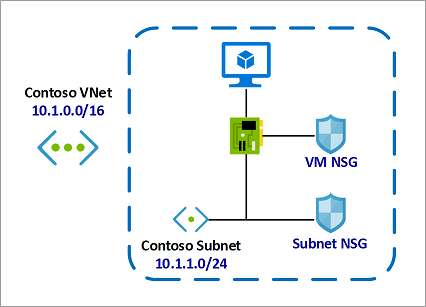

In this example, for inbound traffic, the Subnet NSG is evaluated first. Any traffic allowed through Subnet NSG is then evaluated by VM NSG. The reverse is applicable for outbound traffic, with VM NSG being evaluated first. Any traffic allowed through VM NSG is then evaluated by Subnet NSG.

This allows for granular security rule application. For example, you might want to allow inbound internet access to a few application VMs (such as frontend VMs) under a subnet but restrict inbound internet access to other VMs (such as database and other backend VMs). In this case you can have a more lenient rule on the Subnet NSG, allowing internet traffic, and restrict access to specific VMs by denying access on VM NSG. The same can be applied for outbound traffic.

To help secure and protect your Azure resources, make sure NSG planning is standard operating procedure (SOP) for your deployments.

**How traffic is evaluated**
Several resources from Azure services can be deployed into an Azure virtual network. You can associate zero, or one, network security group to each virtual network subnet and network interface in a virtual machine. The same network security group can be associated to as many subnets and network interfaces as you choose.

The following picture illustrates different scenarios for how network security groups might be deployed to allow network traffic to and from the internet over TCP port 80:


Reference the above diagram, along with the following text, to understand how Azure processes inbound and outbound rules for network security groups:

**Inbound traffic**

For inbound traffic, Azure processes the rules in a network security group associated to a subnet first, if there is one, and then the rules in a network security group associated to the network interface, if there is one.

   - VM1: The security rules in NSG1 are processed, since it is associated to Subnet1 and VM1 is in Subnet1. Unless you've created a rule that allows port 80 inbound, the traffic is denied by the DenyAllInbound default security rule, and never evaluated by NSG2, since NSG2 is associated to the network interface. If NSG1 has a security rule that allows port 80, the traffic is then processed by NSG2. To allow port 80 to the virtual machine, both NSG1 and NSG2 must have a rule that allows port 80 from the internet.
   - VM2: The rules in NSG1 are processed because VM2 is also in Subnet1. Since VM2 does not have a network security group associated to its network interface, it receives all traffic allowed through NSG1 or is denied all traffic denied by NSG1. Traffic is either allowed or denied to all resources in the same subnet when a network security group is associated to a subnet.
   - VM3: Since there is no network security group associated to Subnet2, traffic is allowed into the subnet and processed by NSG2, because NSG2 is associated to the network interface attached to VM3.
   - VM4: Traffic is allowed to VM4, because a network security group isn't associated to Subnet3, or the network interface in the virtual machine. All network traffic is allowed through a subnet and network interface if they don't have a network security group associated to them.

**Outbound traffic**

For outbound traffic, Azure processes the rules in a network security group associated to a network interface first, if there is one, and then the rules in a network security group associated to the subnet, if there is one.

   - VM1: The security rules in NSG2 are processed. Unless you create a security rule that denies port 80 outbound to the internet, the traffic is allowed by the AllowInternetOutbound default security rule in both NSG1 and NSG2. If NSG2 has a security rule that denies port 80, the traffic is denied, and never evaluated by NSG1. To deny port 80 from the virtual machine, either, or both of the network security groups must have a rule that denies port 80 to the internet.
   - VM2: All traffic is sent through the network interface to the subnet, since the network interface attached to VM2 does not have a network security group associated to it. The rules in NSG1 are processed.
   - VM3: If NSG2 has a security rule that denies port 80, the traffic is denied. If NSG2 has a security rule that allows port 80, then port 80 is allowed outbound to the internet, since a network security group is not associated to Subnet2.
   - VM4: All network traffic is allowed from VM4, because a network security group isn't associated to the network interface attached to the virtual machine, or to Subnet3.

**Intra-subnet traffic**
It's important to note that security rules in an NSG associated to a subnet can affect connectivity between VM's within it. For example, if a rule is added to NSG1 which denies all inbound and outbound traffic, VM1 and VM2 will no longer be able to communicate with each other. Another rule would have to be added specifically to allow this.

**General guidelines**
Unless you have a specific reason to, we recommended that you associate a network security group to a subnet, or a network interface, but not both. Since rules in a network security group associated to a subnet can conflict with rules in a network security group associated to a network interface, you can have unexpected communication problems that require troubleshooting.

**Create Application Security Groups**

In this topic we look at Application Security Groups (ASGs), which are built on network security groups. A quick review of Security groups reminds us that you can filter network traffic to and from Azure resources in an Azure virtual network with a network security group. A network security group contains security rules that allow or deny inbound network traffic to, or outbound network traffic from, several types of Azure resources.

For each rule, you can specify source and destination, port, and protocol. You can enable network security group flow logs to analyze network traffic to and from resources that have an associated network security group.

**Application security groups**
ASGs enable you to configure network security as a natural extension of an application's structure. You then can group VMs and define network security policies based on those groups.

You also can reuse your security policy at scale without manual maintenance of explicit IP addresses. The platform manages the complexity of explicit IP addresses and multiple rule sets, allowing you to focus on your business logic. Consider the following illustration.


In the illustration, NIC1 and NIC2 are members of the AsgWeb ASG. NIC3 is a member of the AsgLogic ASG. NIC4 is a member of the AsgDb ASG. Though each network interface in this example is a member of only one ASG, a network interface can be a member of multiple ASGs, up to the Azure limits. None of the network interfaces have an associated network security group. NSG1 is associated to both subnets and contains the following rules:

   - Allow-HTTP-Inbound-Internet
   - Deny-Database-All
   - Allow-Database-BusinessLogic

The rules that specify an ASG as the source or destination are only applied to the network interfaces that are members of the ASG. If the network interface is not a member of an ASG, the rule is not applied to the network interface even though the network security group is associated to the subnet.


**Application security groups have the following constraints**

   - There are limits to the number of ASGs you can have in a subscription, in addition to other limits related to ASGs.
   - You can specify one ASG as the source and destination in a security rule. You cannot specify multiple ASGs in the source or destination.
   - All network interfaces assigned to an ASG must exist in the same virtual network that the first network interface assigned to the ASG is in. For example, if the first network interface assigned to an ASG named AsgWeb is in the virtual network named VNet1, then all subsequent network interfaces assigned to ASGWeb must exist in VNet1. You cannot add network interfaces from different virtual networks to the same ASG.
   - If you specify an ASG as the source and destination in a security rule, the network interfaces in both ASGs must exist in the same virtual network. For example, if AsgLogic contained network interfaces from VNet1, and AsgDb contained network interfaces from VNet2, you could not assign AsgLogic as the source and AsgDb as the destination in a rule. All network interfaces for both the source and destination ASGs need to exist in the same virtual network.

**Summary**
Application Security Groups along with NSGs, have brought multiple benefits on the network security area:

   - A single management experience
   - Increased limits on multiple dimensions
   - A great level of simplification
   - A seamless integration with your architecture

**Enable service endpoints**

A virtual network service endpoint provides the identity of your virtual network to the Azure service. Once service endpoints are enabled in your virtual network, you can secure Azure service resources to your virtual network by adding a virtual network rule to the resources.

Today, Azure service traffic from a virtual network uses public IP addresses as source IP addresses. With service endpoints, service traffic switches to use virtual network private addresses as the source IP addresses when accessing the Azure service from a virtual network. This switch allows you to access the services without the need for reserved, public IP addresses used in IP firewalls.

A common usage case for service endpoints is a virtual machine accessing storage. The storage account restricts access to the virtual machines private IP address.


**Why use a service endpoint?**

   - Improved security for your Azure service resources. VNet private address space can be overlapping and so, cannot be used to uniquely identify traffic originating from your VNet. Service endpoints provide the ability to secure Azure service resources to your virtual network, by extending VNet identity to the service. Once service endpoints are enabled in your virtual network, you can secure Azure service resources to your virtual network by adding a virtual network rule to the resources. This provides improved security by fully removing public Internet access to resources, and allowing traffic only from your virtual network.
   - Optimal routing for Azure service traffic from your virtual network. Today, any routes in your virtual network that force Internet traffic to your premises and/or virtual appliances, known as forced-tunneling, also force Azure service traffic to take the same route as the Internet traffic. Service endpoints provide optimal routing for Azure traffic.
   - Endpoints always take service traffic directly from your virtual network to the service on the Microsoft Azure backbone network. Keeping traffic on the Azure backbone network allows you to continue auditing and monitoring outbound Internet traffic from your virtual networks, through forced-tunneling, without impacting service traffic.
   - Simple to set up with less management overhead. You no longer need reserved, public IP addresses in your virtual networks to secure Azure resources through IP firewall. There are no NAT or gateway devices required to set up the service endpoints. Service endpoints are configured through a simple click on a subnet. There is no additional overhead to maintaining the endpoints.

```
Important:

With service endpoints, the source IP addresses of the virtual machines in the subnet for service traffic switches from using public IPv4 addresses to using private IPv4 addresses. Existing Azure service firewall rules using Azure public IP addresses will stop working with this switch. Please ensure Azure service firewall rules allow for this switch before setting up service endpoints. You may also experience temporary interruption to service traffic from this subnet while configuring service endpoints.
```

**Configure service endpoint services**

Service endpoints would provide benefits in the following Scenarios.

**Scenarios**

   - Peered, connected, or multiple virtual networks: To secure Azure services to multiple subnets within a virtual network or across multiple virtual networks, you can enable service endpoints on each of the subnets independently, and secure Azure service resources to all of the subnets.
   - Filtering outbound traffic from a virtual network to Azure services: If you want to inspect or filter the traffic sent to an Azure service from a virtual network, you can deploy a network virtual appliance within the virtual network. You can then apply service endpoints to the subnet where the network virtual appliance is deployed, and secure Azure service resources only to this subnet. This scenario might be helpful if you want use network virtual appliance filtering to restrict Azure service access from your virtual network only to specific Azure resources.
   - Securing Azure resources to services deployed directly into virtual networks: You can directly deploy various Azure services into specific subnets in a virtual network. You can secure Azure service resources to managed service subnets by setting up a service endpoint on the managed service subnet.
   - Disk traffic from an Azure virtual machine: Virtual Machine Disk traffic for managed and unmanaged disks isn't affected by service endpoints routing changes for Azure Storage. This traffic includes diskIO as well as mount and unmount. You can limit REST access to page blobs to select networks through service endpoints and Azure Storage network rules.


**Deploy private links**

Azure Private Link works on an approval call flow model wherein the Private Link service consumer can request a connection to the service provider for consuming the service. The service provider can then decide whether to allow the consumer to connect or not. Azure Private Link enables the service providers to manage the private endpoint connection on their resources

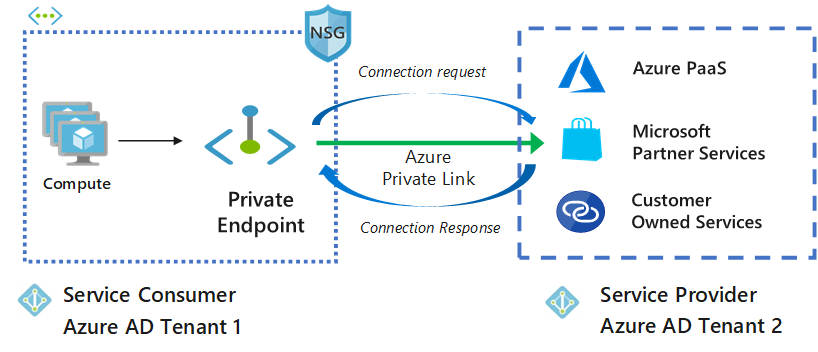

There are two connection approval methods that a Private Link service consumer can choose from:

   - Automatic: If the service consumer has RBAC permissions on the service provider resource, the consumer can choose the automatic approval method. In this case, when the request reaches the service provider resource, no action is required from the service provider and the connection is automatically approved.
   - Manual: On the contrary, if the service consumer doesn’t have RBAC permissions on the service provider resource, the consumer can choose the manual approval method. In this case, the connection request appears on the service resources as Pending. The service provider has to manually approve the request before connections can be established. In manual cases, service consumer can also specify a message with the request to provide more context to the service provider.

The service provider has following options to choose from for all Private Endpoint connections:

   - Approved
   - Reject
   - Remove

**Manage private endpoint connections on Azure PaaS resources**

Portal is the preferred method for managing private endpoint connections on Azure PaaS resources.

**Implement an Azure application gateway**

Azure Application Gateway is a web traffic load balancer that enables you to manage traffic to your web applications. Traditional load balancers operate at the transport layer (OSI layer 4 - TCP and UDP) and route traffic based on the source IP address and port to a destination IP address and port.

Application Gateway can make routing decisions based on additional attributes of an HTTP request, for example, URI path or host headers. For example, you can route traffic based on the incoming URL. So if /images are in the incoming URL, you can route traffic to a specific set of servers (known as a pool) configured for images. If /video is in the URL, that traffic is routed to another pool that's optimized for videos. This type of routing is known as application layer (OSI layer 7) load balancing.


Application Gateway includes the following features:

   - Secure Sockets Layer (SSL/TLS) termination - Application gateway supports SSL/TLS termination at the gateway, after which traffic typically flows unencrypted to the backend servers. This feature allows web servers to be unburdened from costly encryption and decryption overhead.
   - Autoscaling - Application Gateway Standard_v2 supports autoscaling and can scale up or down based on changing traffic load patterns. Autoscaling also removes the requirement to choose a deployment size or instance count during provisioning.
   - Zone redundancy - A Standard_v2 Application Gateway can span multiple Availability Zones, offering better fault resiliency and removing the need to provision separate Application Gateways in each zone.
   - Static VIP - The application gateway Standard_v2 SKU supports static VIP type exclusively. This ensures that the VIP associated with application gateway doesn't change even over the lifetime of the Application Gateway.
   - Web Application Firewall - Web Application Firewall (WAF) is a service that provides centralized protection of your web applications from common exploits and vulnerabilities. WAF is based on rules from the OWASP (Open Web Application Security Project) core rule sets 3.1 (WAF_v2 only), 3.0, and 2.2.9.
   - Ingress Controller for AKS - Application Gateway Ingress Controller (AGIC) allows you to use Application Gateway as the ingress for an Azure Kubernetes Service (AKS) cluster.
   - URL-based routing - URL Path Based Routing allows you to route traffic to back-end server pools based on URL Paths of the request. One of the scenarios is to route requests for different content types to different pool.
   - Multiple-site hosting - Multiple-site hosting enables you to configure more than one web site on the same application gateway instance. This feature allows you to configure a more efficient topology for your deployments by adding up to 100 web sites to one Application Gateway (for optimal performance).
   - Redirection - A common scenario for many web applications is to support automatic HTTP to HTTPS redirection to ensure all communication between an application and its users occurs over an encrypted path.
   - Session affinity - The cookie-based session affinity feature is useful when you want to keep a user session on the same server.
   - Websocket and HTTP/2 traffic - Application Gateway provides native support for the WebSocket and HTTP/2 protocols. There's no user-configurable setting to selectively enable or disable WebSocket support.
   - Connection draining - Connection draining helps you achieve graceful removal of backend pool members during planned service updates.
   - Custom error pages - Application Gateway allows you to create custom error pages instead of displaying default error pages. You can use your own branding and layout using a custom error page.
   - Rewrite HTTP headers - HTTP headers allow the client and server to pass additional information with the request or the response.
   - Sizing - Application Gateway Standard_v2 can be configured for autoscaling or fixed size deployments. This SKU doesn't offer different instance sizes.

New Application Gateway v1 SKU deployments can take up to 20 minutes to provision. Changes to instance size or count aren't disruptive, and the gateway remains active during this time.

Most deployments that use the v2 SKU take around 6 minutes to provision. However it can take longer depending on the type of deployment. For example, deployments across multiple Availability Zones with many instances can take more than 6 minutes.

**Deploy a web application firewall**

Web Application Firewall (WAF) provides centralized protection of your web applications from common exploits and vulnerabilities. Web applications are increasingly targeted by malicious attacks that exploit commonly known vulnerabilities. SQL injection and cross-site scripting are among the most common attacks.

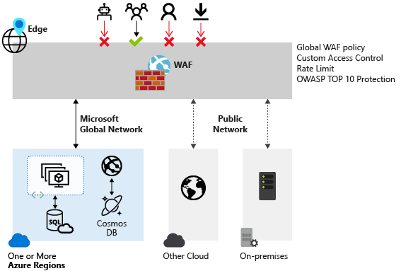

Preventing such attacks in application code is challenging. It can require rigorous maintenance, patching, and monitoring at multiple layers of the application topology. A centralized web application firewall helps make security management much simpler. A WAF also gives application administrators better assurance of protection against threats and intrusions.

A WAF solution can react to a security threat faster by centrally patching a known vulnerability, instead of securing each individual web application.

**Supported service**

WAF can be deployed with Azure Application Gateway, Azure Front Door, and Azure Content Delivery Network (CDN) service from Microsoft. WAF on Azure CDN is currently under public preview. WAF has features that are customized for each specific service.

**Configure and manage Azure front door**

Azure Front Door enables you to define, manage, and monitor the global routing for your web traffic by optimizing for best performance and instant global failover for high availability. With Front Door, you can transform your global (multi-region) consumer and enterprise applications into robust, high-performance personalized modern applications, APIs, and content that reaches a global audience with Azure.

Front Door works at Layer 7 or HTTP/HTTPS layer and uses split TCP-based anycast protocol. Front Door ensures that your end users promptly connect to the nearest Front Door POP (Point of Presence). So, per your routing method selection in the configuration, you can ensure that Front Door is routing your client requests to the fastest and most available application backend. An application backend is any Internet-facing service hosted inside or outside of Azure. Front Door provides a range of traffic-routing methods and backend health monitoring options to suit different application needs and automatic failover models. Like Traffic Manager, Front Door is resilient to failures, including the failure of an entire Azure region.


The following features are included with Front Door:

   - Accelerate application performance - Using split TCP-based anycast protocol, Front Door ensures that your end users promptly connect to the nearest Front Door POP (Point of Presence).
   - Increase application availability with smart health probes - Front Door delivers high availability for your critical applications using its smart health probes, monitoring your backends for both latency and availability and providing instant automatic failover when a backend goes down.
   - URL-based routing - URL Path Based Routing allows you to route traffic to backend pools based on URL paths of the request. One of the scenarios is to route requests for different content types to different backend pools.
   - Multiple-site hosting - Multiple-site hosting enables you to configure more than one web site on the same Front Door configuration.
   - Session affinity - The cookie-based session affinity feature is useful when you want to keep a user session on the same application backend.
   - TLS termination - Front Door supports TLS termination at the edge that is, individual users can set up a TLS connection with Front Door environments instead of establishing it over long haul connections with the application backend.
   - Custom domains and certificate management - When you use Front Door to deliver content, a custom domain is necessary if you would like your own domain name to be visible in your Front Door URL.
   - Application layer security - Azure Front Door allows you to author custom Web Application Firewall (WAF) rules for access control to protect your HTTP/HTTPS workload from exploitation based on client IP addresses, country code, and http parameters.
   - URL redirection - With the strong industry push on supporting only secure communication, web applications are expected to automatically redirect any HTTP traffic to HTTPS.
   - URL rewrite - Front Door supports URL rewrite by allowing you to configure an optional Custom Forwarding Path to use when constructing the request to forward to the backend.
   - Protocol support - IPv6 and HTTP/2 traffic - Azure Front Door natively supports end-to-end IPv6 connectivity and HTTP/2 protocol.

As mentioned above, routing to the Azure Front Door environments leverages Anycast for both DNS (Domain Name System) and HTTP (Hypertext Transfer Protocol) traffic, so user traffic will go to the closest environment in terms of network topology (fewest hops). This architecture typically offers better round-trip times for end users (maximizing the benefits of Split TCP). Front Door organizes its environments into primary and fallback "rings". The outer ring has environments that are closer to users, offering lower latencies. The inner ring has environments that can handle the failover for the outer ring environment in case an issue happens. The outer ring is the preferred target for all traffic, but the inner ring is necessary to handle traffic overflow from the outer ring. In terms of VIPs (Virtual Internet Protocol addresses), each frontend host, or domain served by Front Door is assigned a primary VIP, which is announced by environments in both the inner and outer ring, as well as a fallback VIP, which is only announced by environments in the inner ring.

This overall strategy ensures that requests from your end users always reach the closest Front Door environment and that even if the preferred Front Door environment is unhealthy then traffic automatically moves to the next closest environment.

**Review ExpressRoute**

ExpressRoute is a direct, private connection from your WAN (not over the public Internet) to Microsoft Services, including Azure. Site-to-Site VPN traffic travels encrypted over the public Internet. Being able to configure Site-to-Site VPN and ExpressRoute connections for the same virtual network has several advantages.

You can configure a Site-to-Site VPN as a secure failover path for ExpressRoute, or use Site-to-Site VPNs to connect to sites that are not part of your network, but that are connected through ExpressRoute. Notice that this configuration requires two virtual network gateways for the same virtual network, one using the gateway type 'Vpn', and the other using the gateway type 'ExpressRoute'.


**ExpressRoute encryption**

**IPsec over ExpressRoute for Virtual WAN**

Azure Virtual WAN uses an Internet Protocol Security (IPsec) Internet Key Exchange (IKE) VPN connection from your on-premises network to Azure over the private peering of an Azure ExpressRoute circuit. This technique can provide an encrypted transit between the on-premises networks and Azure virtual networks over ExpressRoute, without going over the public internet or using public IP addresses. The following diagram shows an example of VPN connectivity over ExpressRoute private peering.

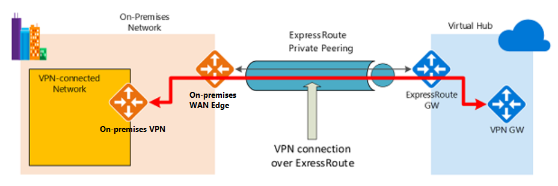

The diagram shows a network within the on-premises network connected to the Azure hub VPN gateway over ExpressRoute private peering. The connectivity establishment is straightforward:

   1. Establish ExpressRoute connectivity with an ExpressRoute circuit and private peering.
   2. Establish the VPN connectivity.

An important aspect of this configuration is routing between the on-premises networks and Azure over both the ExpressRoute and VPN paths.

ExpressRoute supports a couple of encryption technologies to ensure confidentiality and integrity of the data traversing between your network and Microsoft's network.

**Point-to-point encryption by MACsec**

MACsec is an IEEE standard. It encrypts data at the Media Access control (MAC) level or Network Layer 2. You can use MACsec to encrypt the physical links between your network devices and Microsoft's network devices when you connect to Microsoft via ExpressRoute Direct. MACsec is disabled on ExpressRoute Direct ports by default. You bring your own MACsec key for encryption and store it in Azure Key Vault. You decide when to rotate the key.

**End-to-end encryption by IPsec and MACsec**

IPsec is an IETF standard. It encrypts data at the Internet Protocol (IP) level or Network Layer 3. You can use IPsec to encrypt an end-to-end connection between your on-premises network and your virtual network (VNET) on Azure.

MACsec secures the physical connections between you and Microsoft. IPsec secures the end-to-end connection between you and your virtual networks on Azure. You can enable them independently.

**ExpressRoute Direct**

ExpressRoute Direct gives you the ability to connect directly into Microsoft’s global network at peering locations strategically distributed across the world. ExpressRoute Direct provides dual 100 Gbps or 10 Gbps connectivity, which supports Active/Active connectivity at scale


Key features that ExpressRoute Direct provides include, but aren't limited to:

   - Massive Data Ingestion into services like Storage and Cosmos DB
   - Physical isolation for industries that are regulated and require dedicated and isolated connectivity like: Banking, Government, and Retail
   - Granular control of circuit distribution based on business unit

ExpressRoute Direct supports massive data ingestion scenarios into Azure storage and other big data services. ExpressRoute circuits on 100 Gbps ExpressRoute Direct now also support 40 Gbps and 100 Gbps circuit SKUs. The physical port pairs are 100 or 10 Gbps only and can have multiple virtual circuits.

ExpressRoute Direct supports both QinQ and Dot1Q VLAN tagging.

   - QinQ VLAN Tagging allows for isolated routing domains on a per ExpressRoute circuit basis. Azure dynamically allocates an S-Tag at circuit creation and cannot be changed. Each peering on the circuit (Private and Microsoft) will utilize a unique C-Tag as the VLAN. The C-Tag is not required to be unique across circuits on the ExpressRoute Direct ports.
   - Dot1Q VLAN Tagging allows for a single tagged VLAN on a per ExpressRoute Direct port pair basis. A C-Tag used on a peering must be unique across all circuits and peerings on the ExpressRoute Direct port pair.

ExpressRoute Direct provides the same enterprise-grade SLA with Active/Active redundant connections into the Microsoft Global Network. ExpressRoute infrastructure is redundant and connectivity into the Microsoft Global Network is redundant and diverse and scales accordingly with customer requirements.

**Perform try-this exercises**

Use this short Try-This exercises to get some hands-on experience with using Azure. An individual Azure subscription is required to perform the exercise tasks. To subscribe, browse to https://www.azure.microsoft.com/free.

**Task 1 - Network security groups**

This task requires a Windows virtual machine associated with a network security group. The NSG should have an inbound security rule that allows RDP. The virtual machine should be in a running state and have a public IP address.

In this task, we will review networking rules, confirm the public IP page does not display, configure an inbound NSG rule, and confirm the public IP page now displays.

**Review networking rules**

   1. In the Portal, navigate to your virtual machine.
   2. Under Settings, click Networking.
   3. Discuss the default inbound and outbound rules.
   4. Review the inbound rules and ensure RDP is allowed.
   5. Make a note of the public IP address.

**Connect to the virtual machine and test the public IP address**

   1. From the Overview blade, click Connect and RDP into the virtual machine.
   2. On the virtual machine, open a browser.
   3. Test the default localhost IIS HTML page: http://localhost/default.htm. This page should appear.
   4. Test the default public IP IIS HTML page: http://public_IP_address/default.htm. This page should not display.

**Configure an inbound rule to allow public access on port 80**

   1. Return to the Portal and the Networking blade.
   2. Make a note of the virtual machine's private IP address.
   3. On the Inbound port rules tab, click Add inbound port rule. This rule will only allow certain IP addresses on port 80. As you go through the configuration settings, be sure to discuss each one.

      - Source: Service Tag
      - Source service tag: Internet
      - Destination: IP addresses
      - Destination IP addresses/CIDR range: private_IP_address/32
      - Destination port range: 80
      - Protocol: TCP
      - Action: Allow
      - Name: Allow_Port_80
      - Click Add

   4. Wait for your new inbound rule to be added.

**Retest the public IP address**

   1. On the virtual machine, return to the browser.
   2. Refresh the default public IP IIS HTML page: http://public_IP_address/default.htm. This page should now display.

**Task 2 - Application service groups**

This task requires a Windows virtual machine with IIS installed. These steps use VM1. Your machine name may be different.

In this task, we will connect to a virtual machine, create an inbound deny rule, configure an application security group, and test connectivity.

**Connect to the virtual machine**

   1. In the Portal, navigate to VM1.
   2. On the Networking blade, make a note of the private IP address.
   3. Ensure there is an Inbound port rule that allows RDP.
   4. From the Overview blade, ensure VM1 is running.
   5. Click Connect and RDP into the VM1.
   6. On VM1, open a browser.
   7. Ensure the default IIS page display for the private IP address: http://private_IP_address/default.htm.

**Add an inbound deny rule and test the rule**

   1. Continue in the Portal from the Networking blade.
   2. On the Inbound port rules tab, click Add inbound port rule. Add a rule that denies all inbound traffic.

      - Destination port ranges: *
      - Action: Deny
      - Name: Deny_All
      - Click Add

   3. Wait for your new inbound rule to be added.
   4. On VM1, refresh the browser page: http://private_IP_address/default.htm.
   5. Verify that the page does not display.

**Configure an application security group**

   1. In the Portal, search for and select Application security groups.
   2. Create a new Application security group.
   3. Provide the required information: subscription, resource group, name, and region.
   4. Wait for the ASG to deploy.
   5. In the Portal, return to VM1.
   6. On the Networking blade, select the Application security groups tab.
   7. Click Configure the application security groups.
   8. Select your new application security group, and Save your changes.
   9. From the Inbound port rules tab, click Add inbound rule. This will allow the ASG.

      - Source: Application security group
      - Source application security group: your_ASG
      - Destination: IP addresses
      - Destination IP addresses: private_IP_address/32
      - Destination port range: 80
      - Priority: 250
      - Name: Allow_ASG
      - Click Add

   10. Wait for your new inbound rule to be added.

**Test the application security group**

   1. On VM1, refresh the browser page: http://private_IP_address/default.htm.
   2. Verify that the page now displays.

**Task 3 - Storage endpoints (you could do this in the storage lesson)**

This task requires a storage account and virtual network with a subnet. Storage Explorer is also required.

In this task, we will secure a storage endpoint.

   1. In the Portal.
   2. Locate your storage account.
   3. Create a file share, and upload a file.
   4. Use the Shared Access Signature blade to Generate SAS and connection string.
   5. Use Storage Explorer and the connection string to access the file share.
   6. Ensure you can view your uploaded file.
   7. Locate your virtual network, and then select a subnet in the virtual network.
   8. Under Service Endpoints, view the Services drop-down and the different services that can be secured with an endpoint.
   9. Check the Microsoft.Storage option.
  10. Save your changes.
  11. Return to your storage account.
  12. Select Firewalls and virtual networks.
  13. Change to Selected networks.
  14. Add your virtual network and verify your subnet with the new service endpoint is listed.
  15. Save your changes.
  16. Return to the Storage Explorer.
  17. Refresh the storage account.
  18. Verify you can no longer access the file share.

**Knowledge check**

1. When deploying the Azure Application Gateway and there's a need to ensure incoming requests are checked for common security threats like cross-site scripting and crawlers; how can this concern be addressed?
   - Install a load balancer
   - Install Azure Firewall
   - Install the Web Application Firewall(**Ans**)
     Install the Web Application Firewall. The web application firewall (WAF) is an optional component that handles incoming requests before they reach a listener. The web application firewall checks each request for many common threats, based on the Open Web Application Security Project (OWASP).

2. Which services below are features of Azure Application Gateway?
   - Authentication
   - Layer 7 load balancing(**Ans**)
     Layer 7 load balancing, Offloading of CPUT intensive SSL termination, Round robin distribution of incoming traffic. Azure Application Gateway is a dedicated virtual offering various layer 7 load balancing capabilities for your application. It lets customers optimize web farm productivity by offloading CPU intensive SSL termination to the application gateway, round robin distribution of incoming traffic, cookie-based session affinity, URL path-based routing, and the ability to host multiple websites behind a single Application Gateway.
   - Vulnerability assessments

3. A company is configuring a Network Security Group. To configure the group to allow traffic from public sources, what rule needs to be added to the default rules?
   - Allow all virtual networks inbound and outbound
   - Allow Azure load balancer inbound
   - Allow Internet inbound(**Ans**)
     Allow Internet inbound. NSGs have default inbound and outbound rules. There is a default allow Internet outbound rule, but not an allow Internet inbound rule.


4. An organization has web servers in different regions and this organization wants to optimize the availability of the servers. Which of the network security is best suited for this purpose?
   - Azure Application Gateway
   - Azure Front Door(**Ans**)
     Azure Front Door. Azure Front Door grants the ability to define, manage, and monitor the global routing for web traffic by optimizing for best performance and instant global failover for high availability.
   - Custom routing

# **Configure and manage host security**

**Introduction**
Once you have your network and perimeter secure, you need to lock down the host machines where your applications run. Installing updates, using jump boxes to only access servers, and following Microsoft Defender for Cloud recommendations are great tools to keep your hosts secure.

**Scenario**
A security engineer uses host security tools like privilege access workstation and virtual machine templates to keep application host machines secure; you will work on such tasks as:

   - Deploy endpoint protection.
   - Create and use a privileged access workstation.
   - Set up protection tools like disk encryption and Windows Defender.

**Enable endpoint protection**
Microsoft Defender for Endpoint is an enterprise endpoint security platform designed to help enterprise networks prevent, detect, investigate, and respond to advanced threats.

Defender for Endpoint uses the following combination of technology built into Windows 10 and Microsoft's robust cloud service:

   - Endpoint behavioral sensors: Embedded in Windows 10, these sensors collect and process behavioral signals from the operating system and send this sensor data to your private, isolated cloud instance of Microsoft Defender for Endpoint.
   - Cloud security analytics: Leveraging big data, device learning, and unique Microsoft optics across the Windows ecosystem, enterprise cloud products (such as Office 365), and online assets, behavioral signals are translated into insights, detections, and recommended responses to advanced threats.
   - Threat intelligence: Generated by Microsoft hunters, security teams, and augmented by threat intelligence provided by partners, threat intelligence enables Defender for Endpoint to identify attacker tools, techniques, and procedures and generate alerts when they are observed in collected sensor data.

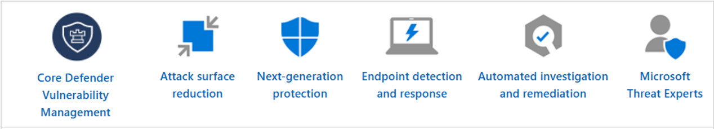

```
Important

The capabilities on non-Windows platforms may be different from the ones for Windows.
```

**Core Defender Vulnerability Management**
Built-in core vulnerability management capabilities use a modern risk-based approach to the discovery, assessment, prioritization, and remediation of endpoint vulnerabilities and misconfigurations.

**Attack surface reduction**
The attack surface reduction set of capabilities provides the first line of defense in the stack. By ensuring configuration settings are properly set and exploit mitigation techniques are applied, the capabilities resist attacks and exploitation. This set of capabilities also includes network protection and web protection, which regulate access to malicious IP addresses, domains, and URLs.

**Next-generation protection**
To further reinforce the security perimeter of your network, Microsoft Defender for Endpoint uses next-generation protection designed to catch all types of emerging threats.

**Endpoint detection and response**
Endpoint detection and response capabilities are put in place to detect, investigate, and respond to advanced threats that may have made it past the first two security pillars. Advanced hunting provides a query-based threat-hunting tool that lets you proactively find breaches and create custom detections.

**Automated investigation and remediation**
In conjunction with being able to quickly respond to advanced attacks, Microsoft Defender for Endpoint offers automatic investigation and remediation capabilities that help reduce the volume of alerts in minutes at scale.

**Microsoft Secure Score for Devices**
Defender for Endpoint includes Microsoft Secure Score for Devices to help you dynamically assess the security state of your enterprise network, identify unprotected systems, and take recommended actions to improve the overall security of your organization.

**Microsoft Threat Experts**
Microsoft Defender for Endpoint's new managed threat hunting service provides proactive hunting, prioritization, and additional context and insights that further empower Security operation centers (SOCs) to identify and respond to threats quickly and accurately.

```
Important

Defender for Endpoint customers need to apply for the Microsoft Threat Experts managed threat hunting service to get proactive Targeted Attack Notifications and to collaborate with experts on demand. Experts on Demand is an add-on service. Targeted Attack Notifications are always included after you have been accepted into Microsoft Threat Experts managed threat hunting service.
```

**Centralized configuration and administration, APIs**

Integrate Microsoft Defender for Endpoint into your existing workflows.

**Integration with Microsoft solutions**

Defender for Endpoint directly integrates with various Microsoft solutions, including:

   - Microsoft Defender for Cloud
   - Microsoft Sentinel
   - Intune
   - Microsoft Defender for Cloud Apps
   - Microsoft Defender for Identity
   - Microsoft Defender for Office
   - Skype for Business

**Microsoft 365 Defender**
With Microsoft 365 Defender, Defender for Endpoint, and various Microsoft security solutions, form a unified pre- and post-breach enterprise defense suite that natively integrates across endpoint, identity, email, and applications to detect, prevent, investigate, and automatically respond to sophisticated attacks.

**Define a privileged access device strategy**
To ensure the most secure conditions for your company to you need to ensure security from the time of purchase of a new device, to its first usage, and beyond. Zero Trust, means that you don't purchase from generic retailers but only supply hardware from an authorized OEM that support Autopilot.

For this solution, root of trust will be deployed using Windows Autopilot technology with hardware that meets the modern technical requirements. To secure a workstation, Autopilot lets you leverage Microsoft OEM-optimized Windows 10 devices. These devices come in a known good state from the manufacturer. Instead of reimaging a potentially insecure device, Autopilot can transform a Windows 10 device into a “business-ready” state. It applies settings and policies, installs apps, and even changes the edition of Windows 10.


**Hardware root-of-trust**
To have a secured workstation you need to make sure the following security technologies are included on the device:

   - Trusted Platform Module (TPM) 2.0
   - BitLocker Drive Encryption
   - UEFI Secure Boot
   - Drivers and Firmware Distributed through Windows Update
   - Virtualization and HVCI Enabled
   - Drivers and Apps HVCI-Ready
   - Windows Hello
   - DMA I/O Protection
   - System Guard
   - Modern Standby

**Levels of device security**

| Device Type        	| Common usage scenario                                                        	| Permitted activities                                                                                  	| Security guidance                                                                                             	|
|--------------------	|------------------------------------------------------------------------------	|-------------------------------------------------------------------------------------------------------	|---------------------------------------------------------------------------------------------------------------	|
| Enterprise Device  	| Home users, small business users, general purpose developers, and enterprise 	| Run any application, browse any website                                                               	| Anti-malware and virus protection and policy based security posture for the enterprise.                       	|
| Specialized Device 	| Specialized or secure enterprise users                                       	| Run approved applications, but cannot install apps. Email and web browsing allowed. No admin controls 	| No self administration of device, no application installation, policy based security, and endpoint management 	|
| Privileged Device  	| Extremely sensitive roles                                                    	| IT Operations                                                                                         	| No local admins, no productivity tools, locked down browsing. PAW device                                      	|

This chart shows the level of device security controls based on how the device will be used.


**Device security controls**

A secure workstation requires it be part of an end-to-end approach including device security, account security, and security policies applied to the device at all times. Here are some common security measures you should consider implementing based on the users' needs. Using a device with security measures directly aligned to the security needs of it users is the more secure solution.

| Security Control                          	| Enterprise Device 	| Specialized Device 	| Privileged Device 	|
|-------------------------------------------	|-------------------	|--------------------	|-------------------	|
| Microsoft Endpoint Manager (MEM) managed  	| Yes               	| Yes                	| Yes               	|
| Deny BYOD Device enrollment               	| No                	| Yes                	| Yes               	|
| MEM security baseline applied             	| Yes               	| Yes                	| Yes               	|
| Microsoft Defender for Endpoint           	| Yes               	| Yes                	| Yes               	|
| Join personal device via Autopilot        	| Yes               	| Yes                	| No                	|
| URLs restricted to approved list          	| Allow Most        	| Allow Most         	| Deny Default      	|
| Removal of admin rights                   	|                   	| Yes                	| Yes               	|
| Application execution control (AppLocker) 	|                   	| Audit -> Enforced  	| Yes               	|
| Applications installed only by MEM        	|                   	| Yes                	| Yes               	|


**Deploy privileged access workstations**
Privileged Access Workstations (PAWs) provide a dedicated system for sensitive tasks that is protected from Internet attacks and threat vectors. Separating these sensitive tasks and accounts from the daily use workstations and devices provides very strong protection from phishing attacks, application and OS vulnerabilities, various impersonation attacks, and credential theft attacks such as keystroke logging, Pass-the-Hash, and Pass-The-Ticket.

**PAW workstations**
PAW is a hardened and locked down workstation designed to provide high security assurances for sensitive accounts and tasks. PAWs are recommended for administration of identity systems, cloud services, and private cloud fabric as well as sensitive business functions. In order to provide the greatest security, PAWs should always run the most up-to-date and secure operating system available: Microsoft strongly recommends Windows 10 Enterprise, which includes several additional security features not available in other editions (in particular, Credential Guard and Device Guard).

The PAW security controls are focused on mitigating high impact and high probability risks of compromise. These include mitigating attacks on the environment and risks that can decrease the effectiveness of PAW controls over time:

   - Internet attacks - Isolating the PAW from the open internet is a key element to ensuring the PAW is not compromised.
   - Usability risk - If a PAW is too difficult to use for daily tasks, administrators will be motivated to create workarounds to make their jobs easier.
   - Environment risks - Minimizing the use of management tools and accounts that have access to the PAWs to secure and monitor these specialized workstations.
   - Supply chain tampering - Taking a few key actions can mitigate critical attack vectors that are readily available to attackers. This includes validating the integrity of all installation media (Clean Source Principle) and using a trusted and reputable supplier for hardware and software.
   - Physical attacks - Because PAWs can be physically mobile and used outside of physically secure facilities, they must be protected against attacks that leverage unauthorized physical access to the computer.

**Architecture overview**
The diagram below depicts a separate "channel" for administration (a highly sensitive task) that is created by maintaining separate dedicated administrative accounts and workstations.


This architectural approach builds on the protections found in the Windows 10 Credential Guard and Device Guard features and goes beyond those protections for sensitive accounts and tasks.

This methodology is appropriate for accounts with access to high value assets:

   - Administrative Privileges - PAWs provide increased security for high impact IT administrative roles and tasks. This architecture can be applied to administration of many types of systems including Active Directory Domains and Forests, Microsoft Azure Active Directory tenants, Microsoft 365 tenants, Process Control Networks (PCN), Supervisory Control and Data Acquisition (SCADA) systems, Automated Teller Machines (ATMs), and Point of Sale (PoS) devices.
   - High Sensitivity Information workers - The approach used in a PAW can also provide protection for highly sensitive information worker tasks and personnel such as those involving pre-announcement Merger and Acquisition activity, pre-release financial reports, organizational social media presence, executive communications, unpatented trade secrets, sensitive research, or other proprietary or sensitive data. This guidance does not discuss the configuration of these information worker scenarios in depth or include this scenario in the technical instructions.

Securing privileged access is a critical first step to establishing security assurances for business assets in a modern organization. The security of most or all business assets in an IT organization depends on the integrity of the privileged accounts used to administer, manage, and develop.

**Jump Box**

Administrative "Jump Box" architectures set up a small number administrative console servers and restrict personnel to using them for administrative tasks. This is typically based on remote desktop services, a 3rd-party presentation virtualization solution, or a Virtual Desktop Infrastructure (VDI) technology.

This approach is frequently proposed to mitigate risk to administration and does provide some security assurances, but the jump box approach by itself is vulnerable to certain attacks because it violates the clean source principle. The clean source principle requires all security dependencies to be as trustworthy as the object being secured.


This figure depicts a simple control relationship. Any subject in control of an object is a security dependency of that object. If an adversary can control a security dependency of a target object (subject), they can control that object.

The administrative session on the jump server relies on the integrity of the local computer accessing it. If this computer is a user workstation subject to phishing attacks and other internet-based attack vectors, then the administrative session is also subject to those risks.

While some advanced security controls like multifactor authentication can increase the difficulty of an attacker taking over this administrative session from the user workstation, no security feature can fully protect against technical attacks when an attacker has administrative access of the source computer (e.g. injecting illicit commands into a legitimate session, hijacking legitimate processes, and so on.)

The default configuration in this PAW guidance installs administrative tools on the PAW, but a jump server architecture can also be added if required.


This above figure shows how reversing the control relationship and accessing user apps from an admin workstation gives the attacker no path to the targeted object. The user jump box is still exposed to risk so appropriate protective controls, detective controls, and response processes should still be applied for that internet-facing computer.

**Create virtual machine templates**

Before diving into configuring VM policies and templates, you need to understand the features and functionality of Azure Resource Manager.

Resource Manager is the deployment and management service for your Azure subscription. It provides a consistent management layer that allows you to create, update, and delete resources in your Azure subscription. You can use its access control, auditing, and tagging features to help secure and organize your resources after deployment.

When you take actions through the Azure portal, Azure PowerShell, the Azure CLI, REST APIs, or client SDKs, the Resource Manager API handles your request. Because the same API handles all requests, you get consistent results and capabilities in all the different tools.

Here are some additional terms to know when using Resource Manager:

   - Resource provider. A service that supplies Azure resources. For example, a common resource provider is Microsoft.Compute, which supplies the VM resource. Microsoft.Storage is another common resource provider.
   - Resource Manager template. A JSON file that defines one or more resources to deploy to a resource group or subscription. You can use the template to consistently and repeatedly deploy the resources.
   - Declarative syntax. Syntax that lets you state, "Here’s what I intend to create" without having to write the sequence of programming commands to create it. The Resource Manager template is an example of declarative syntax. In the file, you define the properties for the infrastructure to deploy to Azure.

You can use the Resource Manager template to define your VMs. After they are defined you can easily deploy and redeploy them. We recommend periodically redeploying your VMs to force the deployment of a freshly updated and security-enhanced VM OS.

**Template design**
How you define templates and resource groups is entirely up to you and how you want to manage your solution. For example, you can deploy your three tier application through a single template to a single resource group.


But, you don't have to define your entire infrastructure in a single template. Often, it makes sense to divide your deployment requirements into a set of targeted, purpose-specific templates. You can easily reuse these templates for different solutions. To deploy a particular solution, you create a master template that links all the required templates. If you envision your tiers having separate lifecycles, you can deploy your three tiers to separate resource groups. Notice the resources can still be linked to resources in other resource groups.


```
Important

When you deploy a template, Resource Manager converts the template into REST API operations.
```

**Enable and secure remote access management**

This topic explains how to connect to and sign into the virtual machines (VMs) you created on Azure. Once you've successfully connected, you can work with the VM as if you were locally logged on to its host server.

**Connect to a Windows VM**

The most common way to connect to a Windows based VM running in Azure is by using Remote Desktop Protocol (RDP). Most versions of Windows natively contain support for the remote desktop protocol (RDP). If you are connecting to a Windows VM from a Mac, you will need to install an RDP client for Mac.

If you are using PowerShell and have the Azure PowerShell module installed you may also connect using the Get-AzRemoteDesktopFile cmdlet.

**Connect to a Linux-based VM**

To connect the Linux-based VM, you need a secure shell protocol (SSH) client. The most used free tool is PuTTY SSH terminal. The following shows the PuTTY configuration dialog.


**Azure Bastion**
The Azure Bastion service is a fully platform-managed PaaS service that you provision inside your virtual network. It provides secure and seamless RDP/SSH connectivity to your virtual machines directly in the Azure portal over TLS. When you connect using Azure Bastion, your virtual machines do not need a public IP address.

Bastion provides secure RDP and SSH connectivity to all the VMs in the virtual network in which it is provisioned. Using Azure Bastion protects your virtual machines from exposing RDP/SSH ports to the outside world, while still providing secure access using RDP/SSH. With Azure Bastion, you connect to the virtual machine directly from the Azure portal.

**Architecture**
Azure Bastion is deployed to a virtual network and supports virtual network peering. Specifically, Azure Bastion manages RDP/SSH connectivity to VMs created in the local or peered virtual networks.

RDP and SSH are some of the fundamental means through which you can connect to your workloads running in Azure. Exposing RDP/SSH ports over the Internet isn't desired and is seen as a significant threat surface. This is often due to protocol vulnerabilities. To contain this threat surface, you can deploy bastion hosts (also known as jump-servers) at the public side of your perimeter network. Bastion host servers are designed and configured to withstand attacks. Bastion servers also provide RDP and SSH connectivity to the workloads sitting behind the bastion, as well as further inside the network.


This figure shows the architecture of an Azure Bastion deployment. In this diagram:

   - The Bastion host is deployed in the virtual network.
   - The user connects to the Azure portal using any HTML5 browser.
   - The user selects the virtual machine to connect to.
   - With a single click, the RDP/SSH session opens in the browser.
   - No public IP is required on the Azure VM.

**Key features**

The following features are available:

   - RDP and SSH directly in Azure portal: You can directly get to the RDP and SSH session directly in the Azure portal using a single click seamless experience.
   - Remote Session over TLS and firewall traversal for RDP/SSH: Azure Bastion uses an HTML5 based web client that is automatically streamed to your local device, so that you get your RDP/SSH session over TLS on port 443 enabling you to traverse corporate firewalls securely.
   - No Public IP required on the Azure VM: Azure Bastion opens the RDP/SSH connection to your Azure virtual machine using private IP on your VM. You don't need a public IP on your virtual machine.
   - No hassle of managing NSGs: Azure Bastion is a fully managed platform PaaS service from Azure that is hardened internally to provide you secure RDP/SSH connectivity. You don't need to apply any NSGs on Azure Bastion subnet. Because Azure Bastion connects to your virtual machines over private IP, you can configure your NSGs to allow RDP/SSH from Azure Bastion only.
   - Protection against port scanning: Because you do not need to expose your virtual machines to public Internet, your VMs are protected against port scanning by rogue and malicious users located outside your virtual network.
   - Protect against zero-day exploits. Hardening in one place only: Azure Bastion is a fully platform-managed PaaS service. Because it sits at the perimeter of your virtual network, you don’t need to worry about hardening each of the virtual machines in your virtual network.

**Configure update management**

Azure Update Management is a service included as part of your Azure subscription. With Update Management, you can assess your update status across your environment and manage your Windows Server and Linux server updates from a single location—for both your on-premises and Azure environments.

Update Management is available at no additional cost (you pay only for the log data that Azure Log Analytics stores), and you can easily enable it for Azure and on-premises VMs. To try it, navigate to your VM tab in Azure, and then enable Update Management for one or more of your VMs. You can also enable Update Management for VMs directly from your Azure Automation account. Making updates easy, is one of the key factors in maintaining good security hygiene.

**Azure Update Management overview**

Computers that Update Management manages use the following configurations to perform assessment and update deployments:

   - Microsoft Monitoring Agent (MMA) for Windows or Linux
   - Desired State Configuration (DSC) in Windows PowerShell for Linux
   - Hybrid Runbook Worker in Azure Automation
   - Microsoft Update or Windows Server Update Services (WSUS) for Windows computers

Azure Automation uses runbooks to install updates. You can't view these runbooks, and they don’t require any configuration. When an update deployment is created, it creates a schedule that starts a master update runbook at the specified time for the included computers. The master runbook starts a child runbook on each agent to install the required updates.

The following diagram is a conceptual depiction of the behavior and data flow together with how the solution assesses and applies security updates to all connected Windows Server and Linux computers in a workspace.


**Manage updates for multiple machines**

You can use the Update Management solution to manage updates and patches for your Windows and Linux virtual machines. From your Azure Automation account, you can:

   - Onboard virtual machines
   - Assess the status of available updates
   - Schedule installation of required updates
   - Review deployment results to verify that updates were applied successfully to all virtual machines for which Update Management is enabled

The Log Analytics agent for Windows and Linux needs to be installed on the VMs that are running on your corporate network or other cloud environment in order to enable them with Update Management.

After you enable Update Management for your machines, you can view machine information by selecting Computers. You can view information about machine name, compliance status, environment, OS type, critical and security updates installed, other updates installed, and update agent readiness for your computers.


Computers that have recently been enabled for Update Management might not have been assessed yet. The compliance state status for those computers is Not assessed.

**Update inclusion**

Azure Update Management provides the ability to deploy patches based on classifications. However, there are scenarios where you may want to explicitly list the exact set of patches. Common scenarios include allowing specific patches after canary environment testing and zero-day patch rollouts.

With update inclusion lists you can choose exactly which patches you want to deploy instead of relying on patch classifications.

**Deploy disk encryption**

Azure Disk Encryption for Windows VMs helps protect and safeguard your data to meet your organizational security and compliance commitments. It uses the BitLocker feature of Windows to provide volume encryption for the OS and data disks of Azure virtual machines (VMs), and is integrated with Azure Key Vault to help you control and manage the disk encryption keys and secrets.

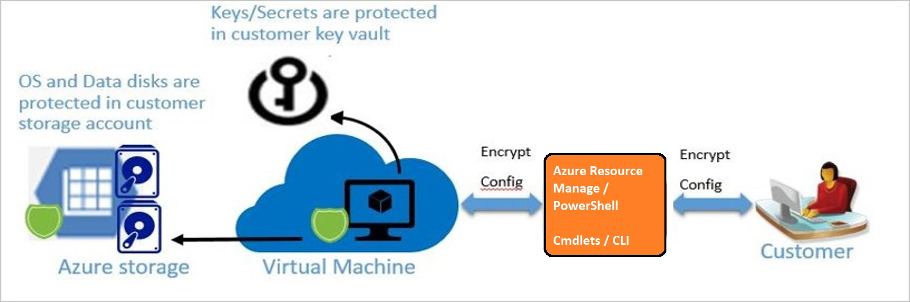

If you use Microsoft Defender for Cloud, you'll be alerted if you have VMs that aren't encrypted. The alerts show as High Severity and the recommendation is to encrypt these VMs.

Azure Disk Encryption is zone resilient, the same way as Virtual Machines.


**Supported VMs and operating systems**

**Supported VMs**
Windows VMs are available in a range of sizes. Azure Disk Encryption is supported on Generation 1 and Generation 2 VMs. Azure Disk Encryption is also available for VMs with premium storage.

Azure Disk Encryption is not available on Basic, A-series VMs, or on virtual machines with less than 2 GB of memory.

**Supported operating systems**
   - Windows client: Windows 8 and later.
   - Windows Server: Windows Server 2008 R2 and later.
   - Windows 10 Enterprise multi-session.

**Networking requirements**
To enable Azure Disk Encryption, the VMs must meet the following network endpoint configuration requirements:

   - To get a token to connect to your key vault, the Windows VM must be able to connect to an Azure Active Directory endpoint, [login.microsoftonline.com].
   - To write the encryption keys to your key vault, the Windows VM must be able to connect to the key vault endpoint.
   - The Windows VM must be able to connect to an Azure storage endpoint that hosts the Azure extension repository and an Azure storage account that hosts the VHD files.
   - If your security policy limits access from Azure VMs to the Internet, you can resolve the preceding URI and configure a specific rule to allow outbound connectivity to the IPs.

**Group Policy requirements**

Azure Disk Encryption uses the BitLocker external key protector for Windows VMs. For domain joined VMs, don't push any group policies that enforce TPM protectors.

BitLocker policy on domain joined virtual machines with custom group policy must include the following setting: Configure user storage of BitLocker recovery information -> Allow 256-bit recovery key. Azure Disk Encryption will fail when custom group policy settings for BitLocker are incompatible. On machines that didn't have the correct policy setting, apply the new policy, force the new policy to update (gpupdate.exe /force), and then restarting may be required.

Azure Disk Encryption will fail if domain level group policy blocks the AES-CBC algorithm, which is used by BitLocker.

**Encryption key storage requirements**

Azure Disk Encryption requires an Azure Key Vault to control and manage disk encryption keys and secrets. Your key vault and VMs must reside in the same Azure region and subscription.

**Azure Disk Encryption for Linux VMs**

Azure Disk Encryption helps protect and safeguard your data to meet your organizational security and compliance commitments. It uses the DM-Crypt feature of Linux to provide volume encryption for the OS and data disks of Azure virtual machines (VMs) and is integrated with Azure Key Vault to help you control and manage the disk encryption keys and secrets.

As for Windows VMs, if you use Microsoft Defender for Cloud, you're alerted if you have VMs that aren't encrypted. The alerts show as High Severity and the recommendation is to encrypt these VMs.

**Supported VMs and operating systems**

**Supported VMs**
Linux VMs are available in a range of sizes. Azure Disk Encryption is supported on Generation 1 and Generation 2 VMs. Azure Disk Encryption is also available for VMs with premium storage.

Note: Azure Disk Encryption is not available on Basic, A-series VMs, or on virtual machines that do not meet these minimum memory requirements:

| Virtual machine                                                                                                  	| Minimum memory requirement                                                                                    	|
|------------------------------------------------------------------------------------------------------------------	|---------------------------------------------------------------------------------------------------------------	|
| Linux VMs when only encrypting data volumes                                                                      	| 2 GB                                                                                                          	|
| Linux VMs when encrypting both data and OS volumes, and where the root (/) file system usage is 4GB or less      	| 8 GB                                                                                                          	|
| Linux VMs when encrypting both data and OS volumes, and where the root (/) file system usage is greater than 4GB 	| The root file system usage * 2. For instance, a 16 GB of root file system usage requires at least 32GB of RAM 	|

Once the OS disk encryption process is complete on Linux virtual machines, the VM can be configured to run with less memory.

Azure Disk Encryption requires the dm-crypt and vfat modules to be present on the system. Removing or disabling vfat from the default image will prevent the system from reading the key volume and obtaining the key needed to unlock the disks on subsequent reboots. System hardening steps that remove the vfat module from the system are not compatible with Azure Disk Encryption

**Managed disk encryption options**

**Managed disk Encryption Options**

There are several types of encryption available for your managed disks, including Azure Disk Encryption (ADE), Server-Side Encryption (SSE), and encryption at the host.

   - Azure Disk Encryption helps protect and safeguard your data to meet organizational security and compliance commitments. ADE encrypts the OS and data disks of Azure virtual machines (VMs) inside your VMs by using the device mapper DM-Crypt feature of Linux or the BitLocker feature of Windows. Azure Disk Encryption (ADE) is integrated with Azure Key Vault to help you control and manage the disk encryption keys and secrets.
   - Azure Disk Storage Server-Side Encryption (also referred to as encryption-at-rest or Azure Storage encryption) automatically encrypts data stored on Azure-managed disks (OS and data disks) when persisting on the Storage Clusters. When configured with a Disk Encryption Set (DES), it supports customer-managed keys as well.
   - Encryption at the host ensures that data stored on the VM host hosting your VM is encrypted at rest and flows encrypted to the Storage clusters.
   - Confidential disk encryption binds disk encryption keys to the virtual machine's TPM (Trusted Platform Module) and makes the protected disk content accessible only to the VM. The TPM and VM guest state is always encrypted in attested code using keys released by a secure protocol that bypasses the hypervisor and host operating system. Currently only available for the OS disk. Encryption at the host may be used for other disks on a Confidential VM in addition to Confidential Disk Encryption.

   Encryption is part of a layered approach to security and should be used with other recommendations to secure Virtual Machines and their disks.

**Comparison**

The following is a comparison of Storage Server-Side Encryption (SSE), Azure Disk Encryption (ADE), encryption at the host, and Confidential disk encryption.


```
Important

For Encryption at the host and Confidential disk encryption, Microsoft Defender for Cloud does not detect the encryption state. We are in the process of updating Microsoft Defender.
```

**Deploy and configure Windows Defender**
Windows 10, Windows Server 2019, and Windows Server 2016 include key security features. They are Windows Defender Credential Guard, Windows Defender Device Guard, and Windows Defender Application Control.

**Windows Defender Credential Guard**
Introduced in Windows 10 Enterprise and Windows Server 2016, Windows Defender Credential Guard uses virtualization-based security enhancement to isolate secrets so that only privileged system software can access them. Unauthorized access to these secrets might lead to credential theft attacks, such as Pass-the-Hash or pass-the-ticket attacks. Windows Defender Credential Guard helps prevent these attacks by helping protect Integrated Windows Authentication (NTLM) password hashes, Kerberos authentication ticket-granting tickets, and credentials that applications store as domain credentials.

By enabling Windows Defender Credential Guard, you get the following features and solutions:

   - Hardware security enhancement. NTLM, Kerberos, and Credential Manager take advantage of platform security features, including Secure Boot and virtualization, to help protect credentials.
   - Virtualization-based security enhancement. NTLM-derived credentials, Kerberos-derived credentials, and other secrets run in a protected environment that is isolated from the running operating system.
   - Better protection against advanced persistent threats. When virtualization-based security enhancement helps protect Credential Manager domain credentials, NTLM-derived credentials, and Kerberos-derived credentials, the credential theft attack techniques and tools that many targeted attacks use are blocked. Malware running in the OS with administrative privileges can’t extract secrets that virtualization-based security helps protect. Although Windows Defender Credential Guard provides powerful mitigation, persistent threat attacks will likely shift to new attack techniques, so you should also incorporate Windows Defender Device Guard and other security strategies and architectures.

**Windows Defender Device Guard and Windows Defender Application Control**

The configuration state of Windows Defender Device Guard was originally designed with a specific security idea in mind. Although no direct dependencies existed between the two main OS features of the Windows Defender Device Guard configuration—that is, between configurable code integrity and Hypervisor-protected code integrity (HVCI)—the discussion intentionally focused on the Windows Defender Device Guard lockdown state that can be achieved when they’re deployed together.

However, the use of the term device guard to describe this configuration state has unintentionally left many IT pros with the impression that the two features are inexorably linked and can’t be separately deployed. Additionally, because HVCI relies on security based on Windows virtualization, it comes with additional hardware, firmware, and kernel driver compatibility requirements that some older systems can’t meet.

As a result, many IT pros assumed that because some systems couldn't use HVCI, they couldn’t use configurable code integrity, either. But configurable code integrity has no specific hardware or software requirements other than running Windows 10, which means that many IT pros were wrongly denied the benefits of this powerful application control capability.

Since the initial release of Windows 10, the world has witnessed numerous hacking and malware attacks where application control alone might have prevented the attack altogether. Configurable code integrity is now documented as an independent technology within the Microsoft security stack and given a name of its own: Windows Defender Application Control.

Application control is a crucial line of defense for helping protect enterprises given today’s threat landscape, and it has an inherent advantage over traditional antivirus solutions. Specifically, application control moves away from the traditional application trust model, in which all applications are assumed trustworthy by default, to one where applications must earn trust to run. Many organizations understand this and frequently cite application control as one of the most effective means for addressing the threat of malware based on executable files (such as .exe and .dll files).

Windows Defender Application Control helps mitigate these types of threats by restricting the applications that users can run and the code that runs in the system core, or kernel. Policies in Windows Defender Application Control also block unsigned scripts and MSIs, and Windows PowerShell runs in Constrained language mode.

Does this mean the Windows Defender Device Guard configuration state is going away? Not at all. The term device guard will continue to describe the fully locked down state achieved using Windows Defender Application Control, HVCI, and hardware and firmware security features. It will also allow Microsoft to work with its original equipment manufacturer (OEM) partners to identify specifications for devices that are device guard capable—so that joint customers can easily purchase devices that meet all the hardware and firmware requirements of the original locked down scenario of Windows Defender Device Guard for Windows 10 devices.

**Microsoft Defender for Endpoint - Supported Operating Systems**


**Microsoft cloud security benchmark in Defender for Cloud**

The Microsoft cloud security benchmark (MCSB) provides prescriptive best practices and recommendations to help improve the security of workloads, data, and services on Azure and your multicloud environment. This benchmark focuses on cloud-centric control areas with input from a set of holistic Microsoft and industry security guidance that includes:

   - Cloud Adoption Framework: Guidance on security, including strategy, roles and responsibilities, Azure Top 10 Security Best Practices, and reference implementation.
   - Azure Well-Architected Framework: Guidance on securing your workloads on Azure.
   - The Chief Information Security Officer (CISO) Workshop: Program guidance and reference strategies to accelerate security modernization using Zero Trust principles.
   - Other industry and cloud service provider's security best practice standards and framework: Examples include the Amazon Web Services (AWS) Well-Architected Framework, Center for Internet Security (CIS) Controls, National Institute of Standards and Technology (NIST), and Payment Card Industry Data Security Standard (PCI-DSS).

**Microsoft cloud security benchmark features**

Comprehensive multicloud security framework: Organizations often have to build an internal security standard to reconcile security controls across multiple cloud platforms to meet security and compliance requirements on each of them. This often requires security teams to repeat the same implementation, monitoring, and assessment across the different cloud environments (often for different compliance standards). This creates unnecessary overhead, cost, and effort. To address this concern, we enhanced the Azure Security Benchmark (ASB) to the Microsoft cloud security benchmark (MCSB) to help you quickly work with different clouds by:

   - Providing a single control framework to easily meet the security controls across clouds
   - Providing consistent user experience for monitoring and enforcing the multicloud security benchmark in Defender for Cloud
   - Staying aligned with Industry Standards (e.g., Center for Internet Security, National Institute of Standards and Technology, Payment Card Industry)

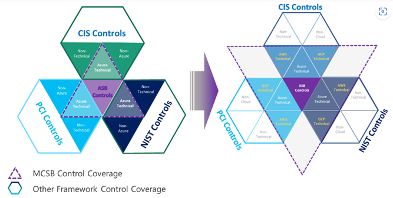

Automated control monitoring for AWS in Microsoft Defender for Cloud: You can use Microsoft Defender for Cloud Regulatory Compliance Dashboard to monitor your AWS environment against Microsoft cloud security benchmark (MCSB), just like how you monitor your Azure environment. We developed approximately 180 AWS checks for the new AWS security guidance in MCSB, allowing you to monitor your AWS environment and resources in Microsoft Defender for Cloud.

**Example: Microsoft Defender for Cloud - Regulatory compliance dashboard**


**Azure guidance and security principles:** Azure security guidance, security principles, features, and capabilities.

**Controls**

| Control Domains                           	| Description                                                                                                                                                                                                                                                                                                                                                                                                                                                                                                 	|
|-------------------------------------------	|-------------------------------------------------------------------------------------------------------------------------------------------------------------------------------------------------------------------------------------------------------------------------------------------------------------------------------------------------------------------------------------------------------------------------------------------------------------------------------------------------------------	|
| Network security (NS)                     	| Network Security covers controls to secure and protect networks, including securing virtual networks, establishing private connections, preventing and mitigating external attacks, and securing Domain Name System (DNS).                                                                                                                                                                                                                                                                                  	|
| Identity Management (IM)                  	| Identity Management covers controls to establish a secure identity and access controls using identity and access management systems, including the use of single sign-on, strong authentications, managed identities (and service principals) for applications, conditional access, and account anomalies monitoring.                                                                                                                                                                                       	|
| Privileged Access (PA)                    	| Privileged Access covers controls to protect privileged access to your tenant and resources, including a range of controls to protect your administrative model, administrative accounts, and privileged access workstations against deliberate and inadvertent risk.                                                                                                                                                                                                                                       	|
| Data Protection (DP)                      	| Data Protection covers control of data protection at rest, in transit, and via authorized access mechanisms, including discover, classify, protect, and monitoring sensitive data assets using access control, encryption, key management, and certificate management.                                                                                                                                                                                                                                      	|
| Asset Management (AM)                     	| Asset Management covers controls to ensure security visibility and governance over your resources, including recommendations on permissions for security personnel, security access to asset inventory and managing approvals for services and resources (inventory, track, and correct).                                                                                                                                                                                                                   	|
| Logging and Threat Detection (LT)         	| Logging and Threat Detection covers controls for detecting threats on the cloud and enabling, collecting, and storing audit logs for cloud services, including enabling detection, investigation, and remediation processes with controls to generate high-quality alerts with native threat detection in cloud services; it also includes collecting logs with a cloud monitoring service, centralizing security analysis with a security event management (SEM), time synchronization, and log retention. 	|
| Incident Response (IR)                    	| Incident Response covers controls in the incident response life cycle - preparation, detection and analysis, containment, and post-incident activities, including using Azure services (such as Microsoft Defender for Cloud and Sentinel) and/or other cloud services to automate the incident response process.                                                                                                                                                                                           	|
| Posture and Vulnerability Management (PV) 	| Posture and Vulnerability Management focuses on controls for assessing and improving the cloud security posture, including vulnerability scanning, penetration testing, and remediation, as well as security configuration tracking, reporting, and correction in cloud resources.                                                                                                                                                                                                                          	|
| Endpoint Security (ES)                    	| Endpoint Security covers controls in endpoint detection and response, including the use of endpoint detection and response (EDR) and anti-malware service for endpoints in cloud environments.                                                                                                                                                                                                                                                                                                              	|
| Backup and Recovery (BR)                  	| Backup and Recovery covers controls to ensure that data and configuration backups at the different service tiers are performed, validated, and protected.                                                                                                                                                                                                                                                                                                                                                   	|
| DevOps Security (DS)                      	| DevOps Security covers the controls related to the security engineering and operations in the DevOps processes, including deployment of critical security checks (such as static application security testing and vulnerability management) prior to the deployment phase to ensure the security throughout the DevOps process; it also includes common topics such as threat modeling and software supply security.                                                                                        	|
| Governance and Strategy (GS)              	| Governance and Strategy provides guidance for ensuring a coherent security strategy and documented governance approach to guide and sustain security assurance, including establishing roles and responsibilities for the different cloud security functions, unified technical strategy, and supporting policies and standards.                                                                                                                                                                            	|

**Explore Microsoft Defender for Cloud recommendations**

**What is a security recommendation?**

Using the policies, Defender for Cloud periodically analyzes the compliance status of your resources to identify potential security misconfigurations and weaknesses. It then provides you with recommendations on how to remediate those issues. Recommendations result from assessing your resources against the relevant policies and identifying resources that aren't meeting your defined requirements.

Defender for Cloud makes its security recommendations based on your chosen initiatives. When a policy from your initiative is compared against your resources and finds one or more that aren't compliant, it is presented as a recommendation in Defender for Cloud.

**Example: Microsoft Defender for Cloud - All recommendations**

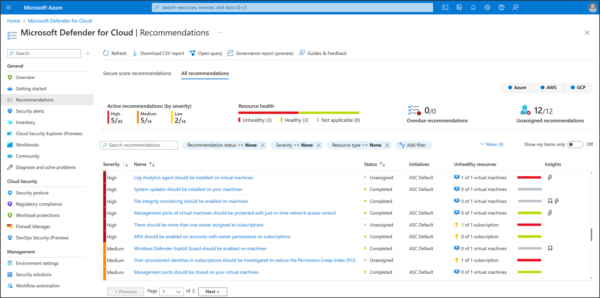

**Recommendations** are actions for you to take to secure and harden your resources. Each recommendation provides you with the following information:

   - A short description of the issue
   - The remediation steps to carry out in order to implement the recommendation
   - The affected resources

In practice, it works like this:

   1. Azure Security Benchmark is an initiative that contains requirements.
      For example, Azure Storage accounts must restrict network access to reduce their attack surface.
   2. The initiative includes multiple policies, each requiring a specific resource type. These policies enforce the requirements in the initiative.
   To continue the example, the storage requirement is enforced with the policy "Storage accounts should restrict network access using virtual network rules."
   3. Microsoft Defender for Cloud continually assesses your connected subscriptions. If it finds a resource that doesn't satisfy a policy, it displays a recommendation to fix that situation and harden the security of resources that aren't meeting your security requirements.

   For example, if an Azure Storage account on your protected subscriptions isn't protected with virtual network rules, you'll see the recommendation to harden those resources.

So, (1) an initiative includes (2) policies that generate (3) environment-specific recommendations.

**Perform Try-This exercises**

Use this Try-This exercises to get some hands-on experience with Azure.

In this demonstration, we'll configure the Bastion service, virtual machine updates, virtual machine extensions, and disk encryption. Optionally, we'll use RDP to connect to a Windows virtual machine and SSH to connect to a Linux machine.

**Task 1 - Use the Bastion service**

```
Note

This task requires a virtual machine. If you are doing the next task, virtual machine updates, use a Windows virtual machine and keep the session running.
```

In this task, we'll configure the Bastion service and connect to a virtual machine with service.

**Configure the Bastion service**

   1. In the Portal navigate to your Windows virtual machine.
   2. Ensure the virtual machine is Running.
   3. Click Connect and select Bastion.
   4. Click Use Bastion. Note installing the service is only required once.
   5. Because you are creating the Bastion service from the target virtual machine, mention that most of the networking information has automatically been filled in. Note the Bastion service will be assigned a public IP address.
   6. To create the Bastion subnet in the virtual network, click Manage subnet configuration.
   7. On the virtual network subnet blade, click + Subnet.
   8. On the Add subnet page, type AzureBastionSubnet as the subnet name. Note this name can't be changed.
   9. Specify the address range in CIDR notation. For example, 10.1.1.0/27.
  10. Click Ok, then click Create. It will take a few minutes for the service to deploy.

**Connect to the virtual machine using Bastion**

   1. From the target virtual machine’s Overview blade, select Connect and then Bastion
   2. On the Connect to Bastion page, enter the virtual machine login credentials.
   3. Notice the checkbox to open the session in a new window.
   4. Click Connect. If you receive a message that popup windows are blocked, allow the session.
   5. Once your session is connected, launch the Bastion clipboard access tool palette by selecting the two arrows. The arrows are located on the left center of the session. Explain this copy and paste feature.
   6. In the Portal, navigate to the Bastion host and under Settings select Sessions.
   7. Review the session management experience and the ability to delete a session.
   8. As you have time, review the Bastion components and how this provides a secure way to access your virtual machines.

**Task 2 - Virtual Machine Updates**

```
Note

This task requires a virtual machine in the running state. You may want to enable Update management prior to this lesson.
```

In this task, we'll review virtual machine update management.

   1. In the Portal, navigate to your virtual machine.
   2. Under Operations select Update management.
   3. Select the Azure Log Analytics workspace and Automation account, and then click Enable.
   4. Wait for update management to deploy. It can take up to 15 minutes for the deployment and longer for results to be provided.
   5. Select Missing Updates and use the Information link to open the support article for the update.
   6. Select Schedule update deployment.
   7. Review the various options including maintenance windows, reboot options, scheduling, classifications, kbs to include and exclude.
   8. You can view the status for the deployment on the Update deployments tab. The available values aren't attempted, succeeded, and failed.

**Task 3 - Virtual Machine Extensions**

In this task, we'll install the IaaSAntimalware extension.

   1. In the Portal, select your virtual machine.
   2. Under Settings, click Extensions. Review how extensions are used.
   3. On the Extensions page, click + Add.
   4. Scroll through the available extensions and review what extensions are available.
   5. Select Microsoft Antimalware. Discuss the features of this extension.
   6. Click Create.
   7. On the Install extension page use the informational icons to explain Excluded files and locations, Excluded file extensions, and Excluded processes.
   8. Review Real-time protection and Run a scheduled scan.
   9. Review other options of interest.
  10. After the extension is deployed, the extensions page will show the IaaSAntimalware extension.

**Task 4 - Disk Encryption**

```
Note

This task requires a storage account.
```

In this task, we'll enable disk encryption for a storage account.

**Review encryption key options**

   1. In the Portal, access your storage account.
   2. Under Security + networking, select Encryption.
   3. Review Storage Service Encryption and why it is used.
   4. Review the two types of keys: Microsoft Managed Keys and Customer Managed Keys.
   5. Select Customer Managed Keys.


**Create the customer managed key**

   1. For Encryption key choose Select from key vault.
   2. Click Select a key vault and key.
   3. You will now create a new key vault. If you already had a key vault you could use that.
   4. For Key vault select Create new.

      - Notice the key vault will be created in the same region as the storage account.
      - Give your key vault a name.
      - Click Review + create.
      - Once the validation passes, click Create.
      - Wait for the key vault to be created.

   5. You will now create a key in the key vault. If you already had a key you could use that.
   6. On the Select key from Azure key vault page, for Key select Create new.
      - Review the options for creating a key.
      - Give your key a name.
      - Notice the activation and expiration options.
      - Click Create.
   7. Now that you have created a key vault and key, Select the key vault and key.
   8. Save your changes on the Encryption page.
   9. Review the information that is now available: Current key, Automated key rotation, and Key version in use.

**Review the key options**

   1. Return to the resource group that includes your storage account.
   2. Refresh the page and ensure your new key vault is listed as a resource.
   3. Select the key vault.
   4. Under Settings click Keys.
   5. Ensure your new key is Enabled. Notice the ability to regenerate the key.
   6. Select the key and review the current version information.
   7. Return to the key vault page.
   8. Under Settings select Access policies.
   9. Under Current access policies your storage account will be listed.
  10. Notice the drop-downs for Key Permissions, Secret Permissions, and Certificate Permissions.
  11. Select Key Permissions and notice the properties that are checked (Get, Unwrap key, and Wrap key).

**Task 5 - Use RDP to connect to a Windows VM (optional)**

```
Note

This task requires a Windows VM with a public IP address. You also need the login credentials for the machine.
```

In this task, we'll use RDP to connect to a Windows virtual machine.

   1. In the Portal navigate to your Windows virtual machine.
   2. Ensure the virtual machine is Running.
   3. From the Overview blade select Connect and then RDP.
   4. In the Connect to virtual machine page, keep the default options to connect by DNS name over port 3389 and click Download RDP file.
   5. Mention that if the VM has a just-in-time policy set, you first need to select the Request access button to request access before you can download the RDP file.
   6. Open the downloaded RDP file and then click Connect.
   7. In the Windows Security window, select More choices and then Use a different account.
   8. Type the username as localhost\username, enter password you created for the virtual machine, and then select OK.
   9. You may receive a certificate warning during the sign-in process. Select Yes or Continue to create the connection.
  10. Explain how RDP is different from the Bastion service.

**Task 6 - Use SSH to connect to a Linux VM (optional)**

```
Note

This task requires a Linux VM. Ensure port 22 is open.
```

In this task, we'll create an SSH private key with PuTTYgen, and then use SSH to connect to a Linux virtual machine.

**Create the SSH Keys**

   1. Download the PuTTY tool. This will include PuTTYgen - https://putty.org/
   2. Once installed, locate and open the PuTTYgen program.
   3. In the Parameters option group choose RSA.
   4. Click the Generate button.
   5. Move your mouse around the blank area in the window to generate some randomness.
   6. Copy the text of the Public key for pasting into authorized keys file.
   7. Optionally you can specify a Key passphrase and then Confirm passphrase. You will be prompted for the passphrase when you authenticate to the VM with your private SSH key. Without a passphrase, if someone obtains your private key, they can sign in to any VM or service that uses that key. We recommend you create a passphrase. However, if you forget the passphrase, there is no way to recover it.
   8. Click Save private key.
   9. Choose a location and filename and click Save. You'll need this file to access the VM.

**Create the Linux machine and assign the public SSH key**

   1. In the portal navigate to your Linux machine.
   2. Choose SSH Public Key for the Authentication type (instead of Password ).
   3. Provide a Username.
   4. Paste the public SSH key from PuTTY into the SSH public key text area. Ensure the key validates with a checkmark.
   5. Create the VM. Wait for it to deploy.
   6. Access the running VM.
   7. From the Overview blade, click Connect.
   8. Make a note of your login information including user and public IP address.

**Access the server using SSH**

   1. Open the PuTTY tool.
   2. Enter username@publicIpAddress where username is the value you assigned when creating the VM and publicIpAddress is the value you obtained from the Azure portal.
   3. Specify 22 for the Port.
   4. Choose SSH in the Connection Type option group.
   5. Navigate to SSH in the Category panel, then click Auth.
   6. Click the Browse button next to Private key file for authentication.
   7. Navigate to the private key file saved when you generated the SSH keys and click Open.
   8. From the main PuTTY screen click Open.
   9. You will now be connected to your server command line.
  10. Explain how SSH is different from the Bastion service.

**Knowledge check**

1. An organization has a security policy that prohibits exposing SSH ports to the outside world. You need to connect to an Azure Linux virtual machine to install software. What should you do?

   1. Configure the Bastion service(**Ans**)
   2. Configure a Guest configuration on the virtual machine
   3. Create a custom script extension

2. What type of disk encryption is used for Linux disks?

   1. BitLocker
   2. DM-Crypt(**Ans**)
   3. FileVault

3. A company with both Azure and on-premises virtual machines needs to ensure virtual machines are up to date with security patches. Update Management is the Azure tool they will use. Which of the following would enable the company to assess the status of available updates and manage the installation of required updates on virtual machines?

   1. The Microsoft Monitoring Agent must be installed for both Windows and Linux virtual machines on-premises.
   2. Both the Update Management feature and the log data storage are free for the customer.
   3. Update Management in Azure Automation collects information about Windows and Linux virtual machines and manages operating system updates.(**Ans**)

4. Which of the following recommendations from Security Center is a medium-severity recommendation for virtual machines and servers?

   1. Disk encryption should be applied on virtual machines.
   2. Install endpoint protection solution on virtual machines.(**Ans**)
   3. System updates should be installed on your machines.

5. Which attacks will using a Privileged access workstations protect companies from?

   1. Protects against attackers who have gained administrative access.
   2. Protects against server-based phishing attacks, various impersonation attacks, and credential theft attacks such as keystroke logging.
   3. Protects high impact IT administrative roles and tasks.(**Ans**)

# **Enable Containers security**

**Introduction**

Containers are a great choice for running applications in Azure. Just like virtual machines, those containers must be locked to protect your data and business. Use the built-in Azure container tools to keep your container-based solutions secure.

**Scenario**

A security engineer uses Azure Container Instances, the Container Registry, and access controls to protect your containers; you will work on such tasks as:

   - Deploy containers from the Container Registry into Azure Container Instances.
   - Use RBAC and Conditional Access to control access.
   - Use proper architecture, storage, and network design to optimize container security.

**Explore containers**
A container is an isolated, lightweight silo for running an application on the host operating system. Containers build on top of the host operating system's kernel (which can be thought of as the buried plumbing of the operating system), and contain only apps and some lightweight operating system APIs and services that run in user mode. While a container shares the host operating system's kernel, the container doesn't get unfettered access to it. Instead, the container gets an isolated–and in some cases virtualized–view of the system. For example, a container can access a virtualized version of the file system and registry, but any changes affect only the container and are discarded when it stops. To save data, the container can mount persistent storage such as an Azure Disk or a file share (including Azure Files).

You need Docker in order to work with Windows Containers. Docker consists of the Docker Engine (dockerd.exe), and the Docker client (docker.exe).

**How it works**
A container builds on top of the kernel, but the kernel doesn't provide all of the APIs and services an app needs to run–most of these are provided by system files (libraries) that run above the kernel in user mode. Because a container is isolated from the host's user mode environment, the container needs its own copy of these user mode system files, which are packaged into something known as a base image. The base image serves as the foundational layer upon which your container is built, providing it with operating system services not provided by the kernel.


Because containers require far fewer resources (for example, they don't need a full OS), they're easy to deploy and they start fast. This allows you to have higher density, meaning that it allows you to run more services on the same hardware unit, thereby reducing costs.

As a side effect of running on the same kernel, you get less isolation than VMs.

**Features of Containers**

| Features                  	| Description                                                                                                                                                                                                                                                  	|
|---------------------------	|--------------------------------------------------------------------------------------------------------------------------------------------------------------------------------------------------------------------------------------------------------------	|
|        Isolation          	| Typically provides lightweight isolation from the host and   other containers, but doesn't provide as strong a security boundary as a VM.   (You can increase the security by using Hyper-V isolation mode to isolate   each container in a lightweight VM). 	|
|        Operating System   	| Runs the user mode portion of an operating system, and can be   tailored to contain just the needed services for your app, using fewer system   resources.                                                                                                   	|
|        Deployment         	| Deploy individual containers by using Docker via command line;   deploy multiple containers by using an orchestrator such as Azure Kubernetes   Service.                                                                                                     	|
|        Persistent storage 	| Use Azure Disks for local storage for a single node, or Azure   Files (SMB shares) for storage shared by multiple nodes or servers.                                                                                                                          	|
|        Fault tolerance    	| If a cluster node fails, any containers running on it are   rapidly recreated by the orchestrator on another cluster node.                                                                                                                                   	|
|        Networking         	| Uses an isolated view of a virtual network adapter, providing   a little less virtualization–the host's firewall is shared with   containers–while using less resources.                                                                                     	|


In Docker, each layer is the resulting set of changes that happen to the filesystem after executing a command, such as, installing a program. So, when you view the filesystem after the layer has been copied, you can view all the files, including the layer when the program was installed. You can think of an image as an auxiliary read-only hard disk ready to be installed in a "computer" where the operating system is already installed. Similarly, you can think of a container as the "computer" with the image hard disk installed. The container, just like a computer, can be powered on or off.

**Configure Azure Container Instances security**

**Use a private registry**

Containers are built from images that are stored in one or more repositories. These repositories can belong to a public registry, like Docker Hub, or to a private registry. An example of a private registry is the Docker Trusted Registry, which can be installed on-premises or in a virtual private cloud. You can also use cloud-based private container registry services, including Azure Container Registry.

A publicly available container image does not guarantee security. Container images consist of multiple software layers, and each software layer might have vulnerabilities. To help reduce the threat of attacks, you should store and retrieve images from a private registry, such as Azure Container Registry or Docker Trusted Registry. In addition to providing a managed private registry, Azure Container Registry supports service principal-based authentication through Azure Active Directory for basic authentication flows. This authentication includes role-based access for read-only (pull), write (push), and other permissions.

**Monitor and scan container images continuously**

Take advantage of solutions to scan container images in a private registry and identify potential vulnerabilities. It’s important to understand the depth of threat detection that the different solutions provide.

For example, Azure Container Registry optionally integrates with Microsoft Defender for Cloud to automatically scan all Linux images pushed to a registry. Microsoft Defender for Cloud integrated Qualys scanner detects image vulnerabilities, classifies them, and provides remediation guidance.

**Protect credentials**
Containers can spread across several clusters and Azure regions. So, you must secure credentials required for logins or API access, such as passwords or tokens. Ensure that only privileged users can access those containers in transit and at rest. Inventory all credential secrets, and then require developers to use emerging secrets-management tools that are designed for container platforms. Make sure that your solution includes encrypted databases, TLS encryption for secrets data in transit, and least-privilege role-based access control. Azure Key Vault is a cloud service that safeguards encryption keys and secrets (such as certificates, connection strings, and passwords) for containerized applications. Because this data is sensitive and business critical, secure access to your key vaults so that only authorized applications and users can access them.

**Use vulnerability management as part of your container development lifecycle**

By using effective vulnerability management throughout the container development lifecycle, you improve the odds that you identify and resolve security concerns before they become a more serious problem.

**Scan for vulnerabilities**

New vulnerabilities are discovered all the time, so scanning for and identifying vulnerabilities is a continuous process. Incorporate vulnerability scanning throughout the container lifecycle:

   - As a final check in your development pipeline, you should perform a vulnerability scan on containers before pushing the images to a public or private registry.
   - Continue to scan container images in the registry both to identify any flaws that were somehow missed during development and to address any newly discovered vulnerabilities that might exist in the code used in the container images.

**Ensure that only approved images are used in your environment**

There’s enough change and volatility in a container ecosystem without allowing unknown containers as well. Allow only approved container images. Have tools and processes in place to monitor for and prevent the use of unapproved container images.

An effective way of reducing the attack surface and preventing developers from making critical security mistakes is to control the flow of container images into your development environment. For example, you might sanction a single Linux distribution as a base image, preferably one that is lean (Alpine or CoreOS rather than Ubuntu), to minimize the surface for potential attacks.

Image signing or fingerprinting can provide a chain of custody that enables you to verify the integrity of the containers. For example, Azure Container Registry supports Docker's content trust model, which allows image publishers to sign images that are pushed to a registry, and image consumers to pull only signed images.

**Enforce least privileges in runtime**

The concept of least privileges is a basic security best practice that also applies to containers. When a vulnerability is exploited, it generally gives the attacker access and privileges equal to those of the compromised application or process. Ensuring that containers operate with the lowest privileges and access required to get the job done reduces your exposure to risk.

**Reduce the container attack surface by removing unneeded privileges**

You can also minimize the potential attack surface by removing any unused or unnecessary processes or privileges from the container runtime. Privileged containers run as root. If a malicious user or workload escapes in a privileged container, the container will then run as root on that system.

**Log all container administrative user access for auditing**

Maintain an accurate audit trail of administrative access to your container ecosystem, including your Kubernetes cluster, container registry, and container images. These logs might be necessary for auditing purposes and will be useful as forensic evidence after any security incident. Azure solutions include:

   - Integration of Azure Kubernetes Service with Microsoft Defender for Cloud to monitor the security configuration of the cluster environment and generate security recommendations
   - Azure Container Monitoring solution
   - Resource logs for Azure Container Instances and Azure Container Registry

**Manage security for Azure Container Instances (ACI)**

Azure Container Instances (ACI), is a PaaS service for scenario that can operate in isolated containers, including simple applications, task automation, and build jobs. For scenarios where you need full container orchestration, including service discovery across multiple containers, automatic scaling, and coordinated application upgrades, we recommend Azure Kubernetes Service (which will be covered later on in this lesson).

**Features of ACI**

Fast startup times Containers offer significant startup benefits over virtual machines (VMs). Azure Container Instances can start containers in Azure in seconds, without the need to provision and manage VMs.

**Container access**

   - Azure Container Instances enables exposing your container groups directly to the internet with an IP address and a fully qualified domain name (FQDN). When you create a container instance, you can specify a custom DNS name label so your application is reachable at customlabel.azureregion.azurecontainer.io.
   - Azure Container Instances also supports executing a command in a running container by providing an interactive shell to help with application development and troubleshooting. Access takes places over HTTPS, using TLS to secure client connections.

**Container deployment**

Deploy containers from DockerHub or Azure Container Registry.

Hypervisor-level security Historically, containers have offered application dependency isolation and resource governance but have not been considered sufficiently hardened for hostile multi-tenant usage. Azure Container Instances guarantees your application is as isolated in a container as it would be in a VM.

Custom sizes Containers are typically optimized to run just a single application, but the exact needs of those applications can differ greatly. Azure Container Instances provides optimum utilization by allowing exact specifications of CPU cores and memory. You pay based on what you need and get billed by the second, so you can fine-tune your spending based on actual need.

For compute-intensive jobs such as machine learning, Azure Container Instances can schedule Linux containers to use NVIDIA Tesla GPU resources.

Persistent storage To retrieve and persist state with Azure Container Instances, we offer direct mounting of Azure Files shares backed by Azure Storage.

**Flexible billing**

Supports per-GB, per-CPU, and per-second billing.

Linux and Windows containers Azure Container Instances can schedule both Windows and Linux containers with the same API. Simply specify the OS type when you create your container groups.

Some features are currently restricted to Linux containers:

   - Multiple containers per container group
   - Volume mounting (Azure Files, emptyDir, GitRepo, secret)
   - Resource usage metrics with Azure Monitor
   - Virtual network deployment
   - GPU resources (preview)

For Windows container deployments, use images based on common Windows base images.

Co-scheduled groups Azure Container Instances supports scheduling of multi-container groups that share a host machine, local network, storage, and lifecycle. This enables you to combine your main application container with other supporting role containers, such as logging sidecars.

Virtual network deployment Currently available for production workloads in a subset of Azure regions, this feature of Azure Container Instances enables deployment of container instances into an Azure virtual network. By deploying container instances into a subnet within your virtual network, they can communicate securely with other resources in the virtual network, including those that are on premises (through VPN gateway or ExpressRoute).

**Explore the Azure Container Registry (ACR)**

A container registry is a service that stores and distributes container images. Docker Hub is a public container registry that supports the open source community and serves as a general catalog of images. Azure Container Registry provides users with direct control of their images, with integrated authentication, geo-replication supporting global distribution and reliability for network-close deployments, virtual network and firewall configuration, tag locking, and many other enhanced features.

In addition to Docker container images, Azure Container Registry supports related content artifacts including Open Container Initiative (OCI) image formats.


**Security and access**

You log in to a registry using the Azure CLI or the standard docker login command. Azure Container Registry transfers container images over HTTPS, and supports TLS to secure client connections. Azure Container Registry requires all secure connections from servers and applications to use TLS 1.2. Enable TLS 1.2 by using any recent docker client (version 18.03.0 or later). You control access to a container registry using an Azure identity, an Azure Active Directory-backed service principal, or a provided admin account. Use role-based access control (RBAC) to assign users or systems fine-grained permissions to a registry.

Security features of the Premium SKU include content trust for image tag signing, and firewalls and virtual networks to restrict access to the registry. Microsoft Defender for Cloud optionally integrates with Azure Container Registry to scan images whenever an image is pushed to a registry.

**Repository**

Container registries manage repositories, collections of container images or other artifacts with the same name, but different tags. For example, the following three images are in the "acr-helloworld" repository:

   - acr-helloworld:latest
   - acr-helloworld:v1
   - acr-helloworld:v2

**Image**

A container image or other artifact within a registry is associated with one or more tags, has one or more layers, and is identified by a manifest. Understanding how these components relate to each other can help you manage your registry effectively.

**Monitor container activity and user access**

As with any IT environment, you should consistently monitor activity and user access to your container ecosystem to quickly identify any suspicious or malicious activity. The container monitoring solution in Log Analytics can help you view and manage your Docker and Windows container hosts in a single location.

By using Log Analytics, you can:

   - View detailed audit information that shows commands used with containers.
   - Troubleshoot containers by viewing and searching centralized logs without having to remotely view Docker or Windows hosts.
   - Find containers that may be noisy and consuming excess resources on a host.
   - View centralized CPU, memory, storage, and network usage and performance information for containers.

On computers running Windows, you can centralize and compare logs from Windows Server, Hyper-V, and Docker containers. The solution supports container orchestrators such as Docker Swarm, DC/OS, Kubernetes, Service Fabric, and Red Hat OpenShift.

Container technology is causing a structural change in the cloud-computing world. Containers make it possible to run multiple instances of an application on a single instance of an operating system, thereby using resources more efficiently. Containers give organizations consistency and flexibility. They enable continuous deployment because the application can be developed on a desktop, tested in a virtual machine, and then deployed for production in the cloud. Containers provide agility, streamlined operations, scalability, and reduced costs due to resource optimization.

**Enable Azure Container Registry authentication**

There are several ways to authenticate with an Azure container registry, each of which is applicable to one or more registry usage scenarios.

Recommended ways include authenticating to a registry directly via individual login, or your applications and container orchestrators can perform unattended, or "headless," authentication by using an Azure Active Directory (Azure AD) service principal.

**Authentication options**

The following table lists available authentication methods and recommended scenarios.

| Identity                                                    	| Usage scenario                                                               	| Details                                                	|
|-------------------------------------------------------------	|------------------------------------------------------------------------------	|--------------------------------------------------------	|
| Azure AD identities including   user and service principals 	| Unattended push from DevOps, unattended pull to Azure or   external services 	| Role-based access control - Reader, Contributor, Owner 	|
| Individual AD Identity                                      	| Interactive push/pull by developers and testers                              	|                                                        	|
| Admin user                                                  	| Interactive push/pull by individual developers and testers                   	| By default, disabled.                                  	|


**Individual login with Azure AD**

When working with your registry directly, such as pulling images to and pushing images from a development workstation, authenticate by using the az acr login command in the Azure CLI. When you log in with az acr login, the CLI uses the token created when you executed az login to seamlessly authenticate your session with your registry. To complete the authentication flow, Docker must be installed and running in your environment. az acr login uses the Docker client to set an Azure Active Directory token in the docker.config file. Once you've logged in this way, your credentials are cached, and subsequent docker commands in your session do not require a username or password.

**Service principal**

If you assign a service principal to your registry, your application or service can use it for headless authentication. Service principals allow role-based access to a registry, and you can assign multiple service principals to a registry. Multiple service principals allow you to define different access for different applications.

The available roles for a container registry include:

   - AcrPull: pull
   - AcrPush: pull and push
   - Owner: pull, push, and assign roles to other users

**Admin account**

Each container registry includes an admin user account, which is disabled by default. You can enable the admin user and manage its credentials in the Azure portal, or by using the Azure CLI or other Azure tools. The admin account is provided with two passwords, both of which can be regenerated. Two passwords allow you to maintain connection to the registry by using one password while you regenerate the other. If the admin account is enabled, you can pass the username and either password to the docker login command when prompted for basic authentication to the registry.

**Review Azure Kubernetes Service (AKS)**

As application development moves towards a container-based approach, the need to orchestrate and manage resources is important. Kubernetes is the leading platform that provides the ability to provide reliable scheduling of fault-tolerant application workloads. Azure Kubernetes Service (AKS) is a managed Kubernetes offering that further simplifies container-based application deployment and management.

**Kubernetes is ...**

Kubernetes is a rapidly evolving platform that manages container-based applications and their associated networking and storage components. The focus is on the application workloads, not the underlying infrastructure components. Kubernetes provides a declarative approach to deployments, backed by a robust set of APIs for management operations.

You can build and run modern, portable, microservices-based applications that benefit from Kubernetes orchestrating and managing the availability of those application components. Kubernetes supports both stateless and stateful applications as teams progress through the adoption of microservices-based applications.
Deployment of containers
As an open platform, Kubernetes allows you to build your applications with your preferred programming language, OS, libraries, or messaging bus. Existing continuous integration and continuous delivery (CI/CD) tools can integrate with Kubernetes to schedule and deploy releases.

Azure Kubernetes Service (AKS) provides a managed Kubernetes service that reduces the complexity for deployment and core management tasks, including coordinating upgrades. The AKS control plane is managed by the Azure platform, and you only pay for the AKS nodes that run your applications. AKS is built on top of the open-source Azure Kubernetes Service Engine (aks-engine).

**Kubernetes cluster architecture**

A Kubernetes cluster is divided into two components:

   - Control plane nodes provide the core Kubernetes services and orchestration of application workloads.
   - Nodes run your application workloads.

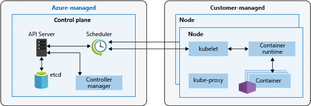

**Features of Azure Kubernetes Service**

   - Fully managed
   - Public IP and FQDN (Private IP option)
   - Accessed with RBAC or Azure AD
   - Deployment of containers
   - Dynamic scale containers
   - Automation of rolling updates and rollbacks of containers
   - Management of storage, network traffic, and sensitive information

**Implement an Azure Kubernetes Service architecture**

Kubernetes cluster architecture is a set of design recommendations for deploying your containers in a secure and managed configuration.

**Cluster master**

When you create an AKS cluster, a cluster master is automatically created and configured. This cluster master is provided as a managed Azure resource abstracted from the user. There is no cost for the cluster master, only the nodes that are part of the AKS cluster.

The cluster master includes the following core Kubernetes components:

   - kube-apiserver - The API server is how the underlying Kubernetes APIs are exposed. This component provides the interaction for management tools, such as kubectl or the Kubernetes dashboard.
   - etcd - To maintain the state of your Kubernetes cluster and configuration, the highly available etcd is a key value store within Kubernetes.
   - kube-scheduler - When you create or scale applications, the Scheduler determines what nodes can run the workload and starts them.
   - kube-controller-manager - The Controller Manager oversees a number of smaller Controllers that perform actions such as replicating pods and handling node operations.


AKS provides a single-tenant cluster master, with a dedicated API server, Scheduler, etc. You define the number and size of the nodes, and the Azure platform configures the secure communication between the cluster master and nodes. Interaction with the cluster master occurs through Kubernetes APIs, such as kubectl or the Kubernetes dashboard.

This managed cluster master means that you do not need to configure components like a highly available store, but it also means that you cannot access the cluster master directly. Upgrades to Kubernetes are orchestrated through the Azure CLI or Azure portal, which upgrades the cluster master and then the nodes. To troubleshoot possible issues, you can review the cluster master logs through Azure Log Analytics.

If you need to configure the cluster master in a particular way or need direct access to them, you can deploy your own Kubernetes cluster using aks-engine.

**Nodes and node pools**

To run your applications and supporting services, you need a Kubernetes node. An AKS cluster has one or more nodes, which is an Azure virtual machine (VM) that runs the Kubernetes node components and container runtime:

   - The kubelet is the Kubernetes agent that processes the orchestration requests from the control plane and scheduling of running the requested containers.
   - Virtual networking is handled by the kube-proxy on each node. The proxy routes network traffic and manages IP addressing for services and pods.
   - The container runtime is the component that allows containerized applications to run and interact with additional resources such as the virtual network and storage. In AKS, Moby is used as the container runtime.

The Azure VM size for your nodes defines how many CPUs, how much memory, and the size and type of storage available (such as high-performance SSD or regular HDD). If you anticipate a need for applications that require large amounts of CPU and memory or high-performance storage, plan the node size accordingly. You can also scale out the number of nodes in your AKS cluster to meet demand.

In AKS, the VM image for the nodes in your cluster is currently based on Ubuntu Linux or Windows Server 2019. When you create an AKS cluster or scale out the number of nodes, the Azure platform creates the requested number of VMs and configures them. There's no manual configuration for you to perform. Agent nodes are billed as standard virtual machines, so any discounts you have on the VM size you're using (including Azure reservations) are automatically applied.

If you need to use a different host OS, container runtime, or include custom packages, you can deploy your own Kubernetes cluster using aks-engine. The upstream aks-engine releases features and provides configuration options before they are officially supported in AKS clusters. For example, if you wish to use a container runtime other than Moby, you can use aks-engine to configure and deploy a Kubernetes cluster that meets your current needs.

Cluster master nodes provide the core Kubernetes services and orchestration of application workloads. Nodes (virtual machines) run your application workloads.


**AKS Terminology**

| Term       	| Description                                                                       	|
|------------	|-----------------------------------------------------------------------------------	|
|     Pools  	|        Group   of nodes with identical configuration                              	|
| Node       	|        Individual   VM running containerized applications                         	|
| Pods       	|        Single   instance of an application. A pod can contain multiple containers 	|
| Deployment 	|        One   or more identical pods managed by Kubernetes                         	|
| Manifest   	|        YAML   file describing a deployment                                        	|


**Master security**

In AKS, the Kubernetes master components are part of the managed service provided by Microsoft. Each AKS cluster has its own single-tenanted, dedicated Kubernetes master to provide the API Server, Scheduler, etc. This master is managed and maintained by Microsoft.

By default, the Kubernetes API server uses a public IP address and a fully qualified domain name (FQDN). You can control access to the API server using Kubernetes role-based access controls and Azure Active Directory.

**Node security**

AKS nodes are Azure virtual machines that you manage and maintain. Linux nodes run an optimized Ubuntu distribution using the Moby container runtime. Windows Server nodes run an optimized Windows Server 2019 release and also use the Moby container runtime. When an AKS cluster is created or scaled up, the nodes are automatically deployed with the latest OS security updates and configurations.

The Azure platform automatically applies OS security patches to Linux nodes on a nightly basis. If a Linux OS security update requires a host reboot, that reboot is not automatically performed. You can manually reboot the Linux nodes, or a common approach is to use Kured, an open-source reboot daemon for Kubernetes. Kured runs as a DaemonSet and monitors each node for the presence of a file indicating that a reboot is required. Reboots are managed across the cluster using the same cordon and drain process as a cluster upgrade.

For Windows Server nodes, Windows Update does not automatically run and apply the latest updates. On a regular schedule around the Windows Update release cycle and your own validation process, you should perform an upgrade on the Windows Server node pool(s) in your AKS cluster. This upgrade process creates nodes that run the latest Windows Server image and patches, then removes the older nodes. Nodes are deployed into a private virtual network subnet, with no public IP addresses assigned. For troubleshooting and management purposes, SSH is enabled by default. This SSH access is only available using the internal IP address.

To provide storage, the nodes use Azure Managed Disks. For most VM node sizes, these are Premium disks backed by high-performance SSDs. The data stored on managed disks is automatically encrypted at rest within the Azure platform. To improve redundancy, these disks are also securely replicated within the Azure datacenter.

Kubernetes environments, in AKS or elsewhere, currently aren't completely safe for hostile multi-tenant usage. Additional security features such as Pod Security Policies or more fine-grained role-based access controls (RBAC) for nodes make exploits more difficult. However, for true security when running hostile multi-tenant workloads, a hypervisor is the only level of security that you should trust. The security domain for Kubernetes becomes the entire cluster, not an individual node. For these types of hostile multi-tenant workloads, you should use physically isolated clusters.

To protect your customer data as you run application workloads in Azure Kubernetes Service (AKS), the security of your cluster is a key consideration.


**Configure Azure Kubernetes Service networking**

To allow access to your applications, or for application components to communicate with each other, Kubernetes provides an abstraction layer to virtual networking. Kubernetes nodes are connected to a virtual network, and can provide inbound and outbound connectivity for pods. The kube-proxy component runs on each node to provide these network features.

In Kubernetes, Services logically group pods to allow for direct access via an IP address or DNS name and on a specific port. You can also distribute traffic using a load balancer. More complex routing of application traffic can also be achieved with Ingress Controllers. Security and filtering of the network traffic for pods is possible with Kubernetes network policies.

The Azure platform also helps to simplify virtual networking for AKS clusters. When you create a Kubernetes load balancer, the underlying Azure load balancer resource is created and configured. As you open network ports to pods, the corresponding Azure network security group rules are configured. For HTTP application routing, Azure can also configure external DNS as new ingress routes are configured.

**Services**

To simplify the network configuration for application workloads, Kubernetes uses Services to logically group a set of pods together and provide network connectivity. The following Service types are available:

   - Cluster IP - Creates an internal IP address for use within the AKS cluster. Good for internal-only applications that support other workloads within the cluster.
   - NodePort - Creates a port mapping on the underlying node that allows the application to be accessed directly with the node IP address and port.
   - LoadBalancer - Creates an Azure load balancer resource, configures an external IP address, and connects the requested pods to the load balancer backend pool. To allow customers' traffic to reach the application, load balancing rules are created on the desired ports.
   - ExternalName - Creates a specific DNS entry for easier application access.


