# **AZ-500: Microsoft Certified: Azure Security Engineer Associate**
## **Manage Identity and Access**
1. **Secure Azure solutions with Azure Active Directory**
    - Introduction
    - Explore Azure Active Directory features
    - Self-managed Active Directory Domain Services, Azure Active Directory, and managed Azure Active Directory Domain Services
    - Azure AD DS and self-managed AD DS
    - Azure AD DS and Azure AD
    - Investigate roles in Azure AD
    - Azure AD built-in roles
    - Deploy Azure AD Domain Services
    - Create and manage Azure AD users
    - Manage users with Azure AD groups
    - Configure Azure AD administrative units
    - Implement passwordless authentication
    - Exercises
2. **Implement Hybrid identity**
    - Introduction
    - Deploy Azure AD connect
    - Explore authentication options
    - Configure Password Hash Synchronization (PHS)
    - Implement Pass-through Authentication (PTA)
    - Deploy Federation with Azure AD
    - Explore the authentication decision tree
    - Configure password writeback
3. **Deploy Azure AD identity protection**
    - Introduction
    - Explore Azure AD identity protection
    - Configure risk event detections
    - Implement user risk policy
    - Implement sign-in risk policy
    - Deploy multifactor authentication in Azure
    - Explore multifactor authentication settings
    - Enable multifactor authentication
    - Implement Azure AD conditional access
    - Configure conditional access conditions
    - Implement access reviews
    - Exercises
4. **Configure Azure AD privileged identity management**
    - Introduction
    - Explore the zero trust model
    - Review the evolution of identity management
    - Deploy Azure AD privileged identity management
    - Configure privileged identity management scope
    - Implement privileged identity management onboarding
    - Explore privileged identity management configuration settings
    - Implement a privileged identity management workflow
    - Exercises
5. **Design an enterprise governance strategy**
    - Introduction
    - Review the shared responsibility model
    - Review Azure hierarchy of systems
    - Configure Azure policies
    - Enable Azure role-based access control (RBAC)
    - Compare and contrast Azure RBAC vs Azure policies
    - Configure built-in roles
    - Enable resource locks
    - Deploy Azure blueprints
    - Design an Azure subscription management plan
    - Exercises


The Azure security engineer implements, manages, and monitors security for resources in Azure, multi-cloud, and hybrid environments as part of an end-to-end infrastructure. They recommend security components and configurations to protect identity & access, data, applications, and networks.

Responsibilities for an Azure security engineer include managing the security posture, identifying and remediating vulnerabilities, performing threat modelling, and implementing threat protection. They may also participate in responding to security incidents.

Azure security engineers work with architects, administrators, and developers to plan and implement solutions that meet security and compliance requirements.

The Azure security engineer should have practical experience in administration of Microsoft Azure and hybrid environments. The Azure security engineer should have a strong familiarity with compute, network, and storage in Azure, as well as Azure Active Directory, part of Microsoft Entra.

# **AZ-500: Manage Identity and Access**
Explore how identity is the starting point for all security within your company. Learn to authenticate and authorize users and apps with Azure Active Directory.

## **Introduction**
Azure Active Directory (Azure AD) is Microsoft’s cloud-based identity and access management service, which helps your employee's sign in and access resources in:

- External resources, such as Microsoft 365, the Azure portal, and thousands of other SaaS applications.
- Internal resources, such as apps on your corporate network and intranet, along with any cloud apps developed by your own organization.

## **Scenario**
A security engineer uses Azure Active Directory's identity and access management services to execute and facilitate the following tasks:

- Create users, groups, and administrative units to securely access resources and services.
- Configure access to systems to be passwordless.
- Define a strategy for using Azure AD and Azure AD Domain Services to lock down access to your solutions.

## **Skills measured**
Azure Active Directory is a part of Exam AZ-500: Microsoft Azure Security Engineer.
Manage identity and access (30-35%)

- Manage Azure AD identities
    - Manage Azure AD directory groups
    - Manage Azure AD users
    - Manage administrative unit

## **Learning objectives**
- Compare and contrast Azure AD versus on-premises directory services with Azure AD Domain Services.
- Configure and deploy users, groups, and administrative units to securely access resources in your tenant.
- Deploy a passwordless login solution for your Azure users and resources.

## **Explore Azure Active Directory features**
Azure Active Directory (Azure AD) is a cloud-based identity and access management service. This service helps employees access external resources, such as Microsoft 365, the Azure portal, and thousands of other software-as-a-service (SaaS) applications. Azure Active Directory also helps them access internal resources like apps on your corporate intranet network, along with any cloud apps developed for your organization.


## **Who uses Azure AD?**
Azure AD is intended for:

- IT admins: As an IT admin, use Azure AD to control access to your apps and your app resources based on your business requirements. For example, you can use Azure AD to require multi-factor authentication when accessing important organizational resources. You can also use Azure AD to automate user provisioning between your existing Windows Server AD and your cloud apps, including Microsoft 365. Finally, Azure AD gives you powerful tools to automatically help protect user identities and credentials and to meet your access governance requirements.

    - App developers: As an app developer, you can use Azure AD as a standards-based approach for adding single sign-on (SSO) to your app, allowing it to work with a user's pre-existing credentials. Azure AD also provides APIs that can help you build personalized app experiences using existing organizational data.

    - Microsoft 365, Office 365, Azure, or Dynamics Customer relationship management (CRM) Online subscribers: As a subscriber, you're already using Azure AD. Each Microsoft 365, Office 365, Azure, and Dynamics CRM Online tenant is automatically an Azure AD tenant. You can immediately start to manage access to your integrated cloud apps.

## **What are the Azure AD licenses?**
Microsoft Online business services, such as Microsoft 365 or Microsoft Azure, require Azure AD for sign-in activities and to help with identity protection. If you subscribe to any Microsoft Online business service, you automatically get Azure AD with access to all the free features.

To enhance your Azure AD implementation, you can also add paid capabilities by upgrading to Azure Active Directory Premium P1 or Premium P2 licenses. 

Azure AD paid licenses are built on top of your existing free directory. The licenses provide self-service, enhanced monitoring, security reporting, and secure access for your mobile users.

- **Azure Active Directory Free:** Provides user and group management, on-premises directory synchronization, basic reports, self-service password change for cloud users, and single sign-on across Azure, Microsoft 365, and many popular SaaS apps.

    - **Azure Active Directory Premium P1:** In addition to the Free features, P1 lets your hybrid users access both on-premises and cloud resources. It also supports advanced administration, such as dynamic groups, self-service group management, Microsoft Identity Manager, and cloud write-back capabilities, which allow self-service password reset for your on-premises users.

    - **Azure Active Directory Premium P2:** In addition to the Free and P1 features, P2 also offers Azure Active Directory Identity Protection to help provide risk-based Conditional Access to your apps and critical company data and Privileged Identity Management to help discover, restrict, and monitor administrators and their access to resources and to provide just-in-time access when needed.

    - **"Pay as you go" feature licenses:** You also get additional feature licenses, such as Azure Active Directory Business-to-Customer (B2C). B2C can help you provide identity and access management solutions for your customer-facing apps.

## **Which features work in Azure AD?**

After you choose your Azure AD license, you'll get access to some or all of the following features:

|                Category                | Description                                                                                                                                                                                          |
|:--------------------------------------:|------------------------------------------------------------------------------------------------------------------------------------------------------------------------------------------------------|
|         Application management         | Manage your cloud and on-premises apps using Application Proxy, single sign-on, the My Apps portal, and Software as a Service (SaaS) apps.                                                           |
|             Authentication             | Manage Azure Active Directory self-service password reset, Multi-Factor Authentication, custom banned password list, and smart lockout.                                                              |
|  Azure Active Directory for developers | Build apps that sign in all Microsoft identities, and get tokens to call Microsoft Graph, other Microsoft APIs, or custom APIs.                                                                      |
|       Business-to-Business (B2B)       | Manages your guest users and external partners while maintaining control over your own corporate data.                                                                                               |
|       Business-to-Customer (B2C)       | Manages your guest users and external partners while maintaining control over your own corporate data.                                                                                               |
|           Conditional Access           | Manage access to your cloud apps.                                                                                                                                                                    |
|            Device Management           | Manage how your cloud or on-premises devices access your corporate data.                                                                                                                             |
|             Domain services            | Join Azure virtual machines to a domain without using domain controllers.                                                                                                                            |
|            Enterprise users            | Manage license assignments, access to apps, and set up delegates using groups and administrator roles.                                                                                               |
|             Hybrid identity            | Use Azure Active Directory Connect and Connect Health to provide a single user identity for authentication and authorization to all resources, regardless of location (cloud or on-premises).        |
|           Identity governance          | Manage your organization's identity through employee, business partner, vendor, service, and app access controls. You can also perform access reviews.                                               |
|           Identity protection          | Detect potential vulnerabilities affecting your organization's identities, configure policies to respond to suspicious actions, and then take appropriate action to resolve them.                    |
| Managed identities for Azure resources | Provide your Azure services with an automatically managed identity in Azure AD that can authenticate any Azure AD-supported authentication service, including Key Vault.                             |
|  Privileged identity management (PIM)  | Manages, controls, and monitors access within your organization. This feature includes access to resources in Azure AD and Azure, and other Microsoft Online Services, like Microsoft 365 or Intune. |
|         Reports and monitoring         | Gain insights into the security and usage patterns in your environment.                                                                                                                              |


## **Self-managed Active Directory Domain Services, Azure Active Directory, and managed Azure Active Directory Domain Services**

To provide applications, services, or devices access to a central identity, there are three common ways to use Active Directory-based services in Azure. This choice in identity solutions gives you the flexibility to use the most appropriate directory for your organization's needs.

For example, if you mostly manage cloud-only users that run mobile devices, it may not make sense to build and run your own Active Directory Domain Services (AD DS) identity solution. Instead, you could use Azure Active Directory.


Although the three Active Directory-based identity solutions share a common name and technology, they're designed to provide services that meet different customer demands. At a high level, these identity solutions and feature sets are:

1. **Azure Active Directory (Azure AD) -** Cloud-based identity and mobile device management that provides user account and authentication services for resources such as Microsoft 365, the Azure portal, or SaaS applications.
    - Azure AD can be synchronized with an on-premises AD DS environment to provide a single identity to users that works natively in the cloud.

2. **Active Directory Domain Services (AD DS) -** Enterprise-ready lightweight directory access protocol (LDAP) server that provides key features such as identity and authentication, computer object management, group policy, and trusts.
    - AD DS is a central component in many organizations with an on-premises IT environment and provides core user account authentication and computer management features.

3. **Azure Active Directory Domain Services (Azure AD DS) -** Provides managed domain services with a subset of fully compatible traditional AD DS features such as domain join, group policy, LDAP, and Kerberos / New Technology LAN Manager (NTLM) authentication.
    - Azure AD DS integrates with Azure AD, which can synchronize with an on-premises AD DS environment. This ability extends central identity use cases to traditional web applications that run in Azure as part of a lift-and-shift strategy.

## **Azure AD DS and self-managed AD DS**

If you have applications and services that need access to traditional authentication mechanisms such as Kerberos or NTLM, there are two ways to provide Active Directory Domain Services in the cloud:

- A managed domain that you create using Azure Active Directory Domain Services (Azure AD DS). Microsoft creates and manages the required resources.
- A self-managed domain that you create and configure using traditional resources such as virtual machines (VMs), Windows Server guest OS, and Active Directory Domain Services (AD DS). You then continue to administer these resources.

With Azure AD DS, the core service components are deployed and maintained for you by Microsoft as a managed domain experience. You don't deploy, manage, patch, and secure the AD DS infrastructure for components like the VMs, Windows Server OS, or domain controllers (DCs).

Azure AD DS provides a smaller subset of features to traditional self-managed AD DS environment, which reduces some of the design and management complexity. For example, there are no AD forests, domains, sites, and replication links to design and maintain.

For applications and services that run in the cloud and need access to traditional authentication mechanisms such as Kerberos or NTLM, Azure AD DS provides a managed domain experience with a minimal amount of administrative overhead.

When you deploy and run a self-managed AD DS environment, you must maintain all of the associated infrastructure and directory components. There's additional maintenance overhead with a self-managed AD DS environment, but you're then able to do additional tasks, such as extending the schema or create forest trusts.

Common deployment models for a self-managed AD DS environment that provides identity to applications and services in the cloud include the following:

- **Standalone cloud-only AD DS -** Azure VMs are configured as domain controllers, and a separate, cloud-only AD DS environment is created. This AD DS environment doesn't integrate with an on-premises AD DS environment. A different set of credentials is used to sign in and administer VMs in the cloud.
- **Resource forest deployment -** Azure VMs are configured as domain controllers, and an AD DS domain that's part of an existing forest is created. A trust relationship is then configured to an on-premises AD DS environment. Other Azure VMs can domain-join this resource forest in the cloud. User authentication runs over a VPN / ExpressRoute connection to the on-premises AD DS environment.
- **Extend on-premises domain to Azure -** An Azure virtual network connects to an on-premises network using a VPN / ExpressRoute connection. Azure VMs connect to this Azure virtual network, which lets them domain-join to the on-premises AD DS environment.

An alternative is to create Azure VMs and promote them as replica domain controllers from the on-premises AD DS domain. These domain controllers replicate over a VPN / ExpressRoute connection to the on-premises AD DS environment. The on-premises AD DS domain is effectively extended into Azure.

The following table outlines some of the features you may need for your organization and the differences between a managed Azure AD DS domain or a self-managed AD DS domain:

| Feature                                                                    | Azure Active Directory Services (Azure AD DS) | Self-managed AD DS                       |
|----------------------------------------------------------------------------|-----------------------------------------------|------------------------------------------|
| Managed service                                                            | ✓                                             | ✕                                        |
| Secure deployments                                                         | ✓                                             | The administrator secures the deployment |
| Domain Name System (DNS) server                                            | ✓ (managed service)                           | ✓                                        |
| Domain or Enterprise administrator privileges                              | ✕                                             | ✓                                        |
| Domain join                                                                | ✓                                             | ✓                                        |
| Domain authentication using New Technology LAN Manager (NTLM) and Kerberos | ✓                                             | ✓                                        |
| Kerberos constrained delegation                                            | Resource-based                                | Resource-based & account-based           |
| Custom organizational unit (OU) structure                                  | ✓                                             | ✓                                        |
| Group Policy                                                               | ✓                                             | ✓                                        |
| Schema extensions                                                          | ✕                                             | ✓                                        |
| Active Directory domain/forest trusts                                      | ✓ (one-way outbound forest trusts only)       | ✓                                        |
| Secure Lightweight Directory Access Protocols (LDAPs)                      | ✓                                             | ✓                                        |
| Lightweight Directory Access Protocol (LDAP) read                          | ✓                                             | ✓                                        |
| Lightweight Directory Access Protocol (LDAP) write                         | ✓ (within the managed domain)                 | ✓                                        |
| Geographical-distributed (Geo-distributed) deployments                     | ✓                                             | ✓                                        |

## **Azure AD DS and Azure AD**

Azure AD lets you manage the identity of devices used by the organization and control access to corporate resources from those devices. Users can also register their personal device (a bring-your-own (BYO) model) with Azure AD, which provides the device with an identity. Azure AD then authenticates the device when a user signs in to Azure AD and uses the device to access secured resources. The device can be managed using Mobile Device Management (MDM) software like Microsoft Intune. This management ability lets you restrict access to sensitive resources to managed and policy-compliant devices.

Traditional computers and laptops can also join Azure AD. This mechanism offers the same benefits of registering a personal device with Azure AD, such as allowing users to sign in to the device using their corporate credentials.

Azure AD joined devices give you the following benefits:

- Single sign-on (SSO) to applications secured by Azure AD.
- Enterprise policy-compliant roaming of user settings across devices.
- Access to the Windows Store for Business using corporate credentials.
- Windows Hello for Business.
- Restricted access to apps and resources from devices compliant with corporate policy.

Devices can be joined to Azure AD with or without a hybrid deployment that includes an on-premises AD DS environment. The following table outlines common device ownership models and how they would typically be joined to a domain:

| Type of device                                            | Device platforms                | Mechanism              |
|-----------------------------------------------------------|---------------------------------|------------------------|
| Personal devices                                          | Windows 10, iOS, Android, macOS | Azure AD registered    |
| Organization-owned device not joined to on-premises AD DS | Windows 10                      | Azure AD joined        |
| Organization-owned device joined to an on-premises AD DS  | Windows 10                      | Hybrid Azure AD joined |

On an Azure AD-joined or registered device, user authentication happens using modern OAuth / OpenID Connect-based protocols. These protocols are designed to work over the internet, so are great for mobile scenarios where users access corporate resources from anywhere.

With Azure AD DS-joined devices, applications can use the Kerberos and New Technology LAN Manager (NTLM) protocols for authentication, so can support legacy applications migrated to run on Azure VMs as part of a lift-and-shift strategy. The following table outlines differences in how the devices are represented and can authenticate themselves against the directory:

| Aspect                          | Azure AD-joined                                           | Azure AD DS-joined                                                                             |
|---------------------------------|-----------------------------------------------------------|------------------------------------------------------------------------------------------------|
| Device controlled by            | Azure AD                                                  | Azure AD Domain Services managed domain                                                        |
| Representation in the directory | Device objects in the Azure AD directory                  | Computer objects in the Azure AD DS managed domain                                             |
| Authentication                  | Open Authorization OAuth / OpenID Connect-based protocols | Kerberos and NTLM protocols                                                                    |
| Management                      | Mobile Device Management (MDM) software like Intune       | Group Policy                                                                                   |
| Networking                      | Works over the internet                                   | Must be connected to, or peered with, the virtual network where the managed domain is deployed |
| Great for...                    | End-user mobile or desktop devices                        | Server VMs deployed in Azure                                                                   |

If on-premises AD DS and Azure AD are configured for federated authentication using Active Directory Federation Services (ADFS), then there's no (current/valid) password hash available in Azure DS. Azure AD user accounts created before fed auth was implemented might have an old password hash that doesn't match a hash of their on-premises password. Hence Azure AD DS won't validate the user's credentials.

## **Investigate roles in Azure AD**
## **Categories of Azure AD roles**

Azure AD built-in roles differ in where they can be used, which fall into the following three broad categories.

- **Azure AD-specific roles:** These roles grant permissions to manage resources within Azure AD only. For example, User Administrator, Application Administrator, and Groups Administrator all grant permissions to manage resources that live in Azure AD.

- **Service-specific roles:** For major Microsoft 365 services (non-Azure AD), we have built service-specific roles that grant permissions to manage all features within the service. For example, Exchange Administrator, Intune Administrator, SharePoint Administrator, and Teams Administrator roles can manage features with their respective services. Exchange Administrator can manage mailboxes, Intune Administrator can manage device policies, SharePoint Administrator can manage site collections, Teams Administrator can manage call qualities, and so on.

- **Cross-service roles:** There are some roles that span services. We have two global roles - Global Administrator and Global Reader. All Microsoft 365 services honor these two roles. Also, there are some security-related roles like Security Administrator and Security Reader that grant access across multiple security services within Microsoft 365. For example, using Security Administrator roles in Azure AD, you can manage Microsoft 365 Defender portal, Microsoft Defender Advanced Threat Protection, and Microsoft Defender for Cloud Apps. Similarly, in the Compliance Administrator role, you can manage Compliance-related settings in the Compliance portal, Exchange, and so on.


The following table is offered as an aid to understanding these role categories. The categories are named arbitrarily and aren't intended to imply any other capabilities beyond the documented Azure AD role permissions.

| Category                | Role                                                                                                                                                                                                                                                                                                                                                                                                                                                                                                                                                                                                                                                                                                                                                                                                                                                                                                                                            |
|-------------------------|-------------------------------------------------------------------------------------------------------------------------------------------------------------------------------------------------------------------------------------------------------------------------------------------------------------------------------------------------------------------------------------------------------------------------------------------------------------------------------------------------------------------------------------------------------------------------------------------------------------------------------------------------------------------------------------------------------------------------------------------------------------------------------------------------------------------------------------------------------------------------------------------------------------------------------------------------|
| Azure AD-specific roles | Application Administrator<br>Application Developer<br>Authentication Administrator<br>Business to consumer (B2C) Identity Experience Framework (IEF) Keyset Administrator<br>Business to consumer (B2C) Identity Experience Framework (IEF) Policy Administrator<br>Cloud Application Administrator<br>Cloud Device Administrator<br>Conditional Access Administrator<br>Device Administrators<br>Directory Readers<br>Directory Synchronization Accounts<br>Directory Writers<br>External ID User Flow Administrator<br>External ID User Flow Attribute Administrator<br>External Identity Provider Administrator<br>Groups Administrator<br>Guest Inviter<br>Helpdesk Administrator<br>Hybrid Identity Administrator<br>License Administrator<br>Partner Tier1 Support<br>Partner Tier2 Support<br>Password Administrator<br>Privileged Authentication Administrator<br>Privileged Role Administrator<br>Reports Reader<br>User Administrator |
| Cross-service roles     | Global Administrator<br>Compliance Administrator<br>Compliance Data Administrator<br>Global Reader<br>Security Administrator<br>Security Operator<br>Security Reader<br>Service Support Administrator                                                                                                                                                                                                                                                                                                                                                                                                                                                                                                                                                                                                                                                                                                                                           |
| Service-specific roles  | Azure DevOps Administrator<br>Azure Information Protection Administrator<br>Billing Administrator<br>Customer relationship management (CRM) Service Administrator<br>Customer Lockbox Access Approver<br>Desktop Analytics Administrator<br>Exchange Service Administrator<br>Insights Administrator<br>Insights Business Leader<br>Intune Service Administrator<br>Kaizala Administrator<br>Lync Service Administrator<br>Message Center Privacy Reader<br>Message Center Reader<br>Modern Commerce User<br>Network Administrator<br>Office Apps Administrator<br>Power BI Service Administrator<br>Power Platform Administrator<br>Printer Administrator<br>Printer Technician<br>Search Administrator<br>Search Editor<br>SharePoint Service Administrator<br>Teams Communications Administrator<br>Teams Communications Support Engineer<br>Teams Communications Support Specialist<br>Teams Devices Administrator<br>Teams Administrator   |


# **Azure AD built-in roles**
In Azure Active Directory (Azure AD), if another administrator or nonadministrator needs to manage Azure AD resources, you assign them an Azure AD role that provides the permissions they need. For example, you can assign roles to allow adding or changing users, resetting user passwords, managing user licenses, or managing domain names.

## **All Roles**
| Role                                                                                | Description                                                                                                                                                                                                                                                                                                                                                                                                                                                                                                                                                                                                                                                                                                                                                                                                                                                                                                                                                                                                                                                                                                                                                                                                                                                                                                                                                                                    |
|-------------------------------------------------------------------------------------|------------------------------------------------------------------------------------------------------------------------------------------------------------------------------------------------------------------------------------------------------------------------------------------------------------------------------------------------------------------------------------------------------------------------------------------------------------------------------------------------------------------------------------------------------------------------------------------------------------------------------------------------------------------------------------------------------------------------------------------------------------------------------------------------------------------------------------------------------------------------------------------------------------------------------------------------------------------------------------------------------------------------------------------------------------------------------------------------------------------------------------------------------------------------------------------------------------------------------------------------------------------------------------------------------------------------------------------------------------------------------------------------|
| Application Administrator                                                           | Users in this role can create and manage all aspects of enterprise applications, application registrations, and application proxy settings.<br>Users assigned to this role aren't added as owners when creating new application registrations or enterprise applications.<br>This role also grants the ability to consent for delegated permissions and application permissions, except for application permissions for Microsoft Graph.                                                                                                                                                                                                                                                                                                                                                                                                                                                                                                                                                                                                                                                                                                                                                                                                                                                                                                                                                       |
| Application Developer                                                               | Can create application registrations independent of the Users can register applications setting.                                                                                                                                                                                                                                                                                                                                                                                                                                                                                                                                                                                                                                                                                                                                                                                                                                                                                                                                                                                                                                                                                                                                                                                                                                                                                               |
| Attack Payload Author                                                               | Users in this role can create attack payloads but not actually launch or schedule them. Attack payloads are then available to all administrators in the tenant, who can use them to create a simulation.                                                                                                                                                                                                                                                                                                                                                                                                                                                                                                                                                                                                                                                                                                                                                                                                                                                                                                                                                                                                                                                                                                                                                                                       |
| Attack Simulation Administrator                                                     | Users in this role can create and manage all aspects of attack simulation creation, launch/scheduling of a simulation, and the review of simulation results. Members of this role have this access for all simulations in the tenant.                                                                                                                                                                                                                                                                                                                                                                                                                                                                                                                                                                                                                                                                                                                                                                                                                                                                                                                                                                                                                                                                                                                                                          |
| Attribute Assignment Administrator                                                  | Users with this role can assign and remove custom security attribute keys and values for supported Azure AD objects such as users, service principals, and devices. By default, Global Administrator and other administrator roles don't have permissions to read, define, or assign custom security attributes. To work with custom security attributes, you must be assigned one of the custom security attribute roles.                                                                                                                                                                                                                                                                                                                                                                                                                                                                                                                                                                                                                                                                                                                                                                                                                                                                                                                                                                     |
| Attribute Assignment Reader                                                         | Users with this role can read custom security attribute keys and values for supported Azure AD objects. By default, Global Administrator and other administrator roles don't have permissions to read, define, or assign custom security attributes. You must be assigned one of the custom security attribute roles to work with custom security attributes.                                                                                                                                                                                                                                                                                                                                                                                                                                                                                                                                                                                                                                                                                                                                                                                                                                                                                                                                                                                                                                  |
| Attribute Definition Administrator                                                  | Users with this role can define a valid set of custom security attributes that can be assigned to supported Azure AD objects. This role can also activate and deactivate custom security attributes. By default, Global Administrator and other administrator roles don't have permissions to read, define, or assign custom security attributes. To work with custom security attributes, you must be assigned one of the custom security attribute roles.                                                                                                                                                                                                                                                                                                                                                                                                                                                                                                                                                                                                                                                                                                                                                                                                                                                                                                                                    |
| Authentication Administrator                                                        | Assign the Authentication Administrator role to users who need to do the following:<br><br>-Set or reset any authentication method (including passwords) for nonadministrators and some roles.<br>-Require users who are nonadministrators or assigned to some roles to re-register against existing nonpassword credentials (for example, Multifactor authentication (MFA) or Fast ID Online (FIDO), and can also revoke remember MFA on the device, which prompts for MFA on the next sign-in.<br>-Perform sensitive actions for some users.<br>-Create and manage support tickets in Azure and the Microsoft 365 admin center.<br><br>Users with this role can't do the following tasks:<br><br>-Can't change the credentials or reset MFA for members and owners of a role-assignable group.<br>-Can't manage MFA settings in the legacy MFA management portal or Hardware OATH tokens. The same functions can be accomplished using the Set-MsolUser commandlet Azure AD PowerShell module.                                                                                                                                                                                                                                                                                                                                                                                               |
| Authentication Policy Administrator                                                 | Assign the Authentication Policy Administrator role to users who need to do the following:<br><br>-Configure the authentication methods policy, tenant-wide MFA settings, and password protection policy that determine which methods each user can register and use.<br>-Manage Password Protection settings: smart lockout configurations and updating the custom banned passwords list.<br>-Create and manage verifiable credentials.<br>-Create and manage Azure support tickets.<br><br>Users with this role can't do the following tasks:<br><br>-Can't update sensitive properties.<br>-Can't delete or restore users.<br>-Can't manage MFA settings in the legacy MFA management portal or Hardware OATH tokens.                                                                                                                                                                                                                                                                                                                                                                                                                                                                                                                                                                                                                                                                       |
| Azure AD Joined Device Local Administrator                                          | This role is available for assignment only as another local administrator in Device settings. Users with this role become local machine administrators on all Windows 10 devices that are joined to Azure Active Directory. They don't have the ability to manage device objects in Azure Active Directory.                                                                                                                                                                                                                                                                                                                                                                                                                                                                                                                                                                                                                                                                                                                                                                                                                                                                                                                                                                                                                                                                                    |
| Azure DevOps Administrator                                                          | Users with this role can manage all enterprise Azure DevOps policies applicable to all Azure DevOps organizations backed by the Azure AD.<br>Users in this role can manage these policies by navigating to any Azure DevOps organization that is backed by the company's Azure AD.<br>Users in this role can claim ownership of orphaned Azure DevOps organizations. This role grants no other Azure DevOps-specific permissions (for example, Project Collection Administrators) inside any of the Azure DevOps organizations backed by the company's Azure AD organization.                                                                                                                                                                                                                                                                                                                                                                                                                                                                                                                                                                                                                                                                                                                                                                                                                  |
| Azure Information Protection Administrator                                          | Users with this role have all permissions in the Azure Information Protection service. This role allows configuring labels for the Azure Information Protection policy, managing protection templates, and activating protection. This role doesn't grant any permissions in Identity Protection Center, Privileged Identity Management, Monitor Microsoft 365 Service Health, or Office 365 Security and compliance center.                                                                                                                                                                                                                                                                                                                                                                                                                                                                                                                                                                                                                                                                                                                                                                                                                                                                                                                                                                   |
| Business-to-Consumer (B2C) Identity Experience Framework (IEF) Keyset Administrator | Users can create and manage policy keys and secrets for token encryption, token signatures, and claim encryption/decryption.<br>By adding new keys to existing key containers, this limited administrator can roll over secrets as needed without impacting existing applications.<br>This user can see the full content of these secrets and their expiration dates even after their creation.                                                                                                                                                                                                                                                                                                                                                                                                                                                                                                                                                                                                                                                                                                                                                                                                                                                                                                                                                                                                |
| Business-to-Consumer (B2C) Identity Experience Framework (IEF) Policy Administrator | Users in this role have the ability to create, read, update, and delete all custom policies in Azure AD B2C and therefore have full control over the Identity Experience Framework in the relevant Azure AD B2C organization. By editing policies, this user can establish direct federation with external identity providers, change the directory schema, change all user-facing content HyperText Markup Language (HTML), Cascading Style Sheets (CSS), JavaScript), change the requirements to complete authentication, create new users, send user data to external systems including full migrations, and edit all user information including sensitive fields like passwords and phone numbers. Conversely, this role can't change the encryption keys or edit the secrets used for federation in the organization.                                                                                                                                                                                                                                                                                                                                                                                                                                                                                                                                                                     |
| Billing Administrator                                                               | Makes purchases, manages subscriptions, manages support tickets, and monitors service health.                                                                                                                                                                                                                                                                                                                                                                                                                                                                                                                                                                                                                                                                                                                                                                                                                                                                                                                                                                                                                                                                                                                                                                                                                                                                                                  |
| Cloud App Security Administrator                                                    | Users with this role have full permissions in Defender for Cloud Apps. They can add administrators, add Microsoft Defender for Cloud Apps policies and settings, upload logs, and perform governance actions.                                                                                                                                                                                                                                                                                                                                                                                                                                                                                                                                                                                                                                                                                                                                                                                                                                                                                                                                                                                                                                                                                                                                                                                  |
| Cloud Application Administrator                                                     | Users in this role have the same permissions as the Application Administrator role, excluding the ability to manage application proxy. This role grants the ability to create and manage all aspects of enterprise applications and application registrations. Users assigned to this role aren't added as owners when creating new application registrations or enterprise applications. This role also grants the ability to consent for delegated permissions and application permissions, except for application permissions for Microsoft Graph.                                                                                                                                                                                                                                                                                                                                                                                                                                                                                                                                                                                                                                                                                                                                                                                                                                          |
| Cloud Device Administrator                                                          | Users in this role can enable, disable, and delete devices in Azure AD and read Windows 10 BitLocker keys (if present) in the Azure portal. The role doesn't grant permissions to manage any other properties on the device.                                                                                                                                                                                                                                                                                                                                                                                                                                                                                                                                                                                                                                                                                                                                                                                                                                                                                                                                                                                                                                                                                                                                                                   |
| Compliance Administrator                                                            | Users with this role have permissions to manage compliance-related features in the Microsoft Purview compliance portal, Microsoft 365 admin center, Azure, and Office 365 Security and compliance center. Assignees can also manage all features within the Exchange admin center and create support tickets for Azure and Microsoft 365.                                                                                                                                                                                                                                                                                                                                                                                                                                                                                                                                                                                                                                                                                                                                                                                                                                                                                                                                                                                                                                                      |
| Compliance Data Administrator                                                       | Users with this role have permissions to track data in the Microsoft Purview compliance portal, Microsoft 365 admin center, and Azure. Users can also track compliance data within the Exchange admin center, Compliance Manager, and Teams and Skype for Business admin center and create support tickets for Azure and Microsoft 365.                                                                                                                                                                                                                                                                                                                                                                                                                                                                                                                                                                                                                                                                                                                                                                                                                                                                                                                                                                                                                                                        |
| Conditional Access Administrator                                                    | Users with this role have the ability to manage Azure Active Directory Conditional Access settings.                                                                                                                                                                                                                                                                                                                                                                                                                                                                                                                                                                                                                                                                                                                                                                                                                                                                                                                                                                                                                                                                                                                                                                                                                                                                                            |
| Customer Lockbox Access Approver                                                    | Manages Microsoft Purview Customer Lockbox requests in your organization. They receive email notifications for Customer Lockbox requests and can approve and deny requests from the Microsoft 365 admin center. They can also turn the Customer Lockbox feature on or off. Only Global Administrators can reset the passwords of people assigned to this role.                                                                                                                                                                                                                                                                                                                                                                                                                                                                                                                                                                                                                                                                                                                                                                                                                                                                                                                                                                                                                                 |
| Desktop Analytics Administrator                                                     | Users in this role can manage the Desktop Analytics service, including viewing asset inventory, creating deployment plans, and viewing deployment and health status.                                                                                                                                                                                                                                                                                                                                                                                                                                                                                                                                                                                                                                                                                                                                                                                                                                                                                                                                                                                                                                                                                                                                                                                                                           |
| Directory Readers                                                                   | Users in this role can read basic directory information. This role should be used for:<br><br>-Granting a specific set of guest users read access instead of granting it to all guest users.<br>-Granting a specific set of nonadmin users access to the Azure portal when "Restrict access to Azure AD portal to admins only" is set to "Yes".<br>-Granting service principals access to the directory where Directory.Read.All isn't an option.                                                                                                                                                                                                                                                                                                                                                                                                                                                                                                                                                                                                                                                                                                                                                                                                                                                                                                                                              |
| Directory Synchronization Accounts                                                  | Don't use. This role is automatically assigned to the Azure AD Connect service and isn't intended or supported for any other use.                                                                                                                                                                                                                                                                                                                                                                                                                                                                                                                                                                                                                                                                                                                                                                                                                                                                                                                                                                                                                                                                                                                                                                                                                                                              |
| Directory Writers                                                                   | Users in this role can read and update basic information of users, groups, and service principals.                                                                                                                                                                                                                                                                                                                                                                                                                                                                                                                                                                                                                                                                                                                                                                                                                                                                                                                                                                                                                                                                                                                                                                                                                                                                                             |
| Domain Name Administrator                                                           | Users with this role can manage (read, add, verify, update, and delete) domain names. They can also read directory information about users, groups, and applications, as these objects possess domain dependencies. For on-premises environments, users with this role can configure domain names for federation so that associated users are always authenticated on-premises. These users can then sign into Azure AD-based services with their on-premises passwords via single sign-on. Federation settings need to be synced via Azure AD Connect so users also have permissions to manage Azure AD Connect.                                                                                                                                                                                                                                                                                                                                                                                                                                                                                                                                                                                                                                                                                                                                                                              |
| Dynamics 365 Administrator                                                          | Users with this role have global permissions within Microsoft Dynamics 365 Online when the service is present, and the ability to manage support tickets and monitor service health.                                                                                                                                                                                                                                                                                                                                                                                                                                                                                                                                                                                                                                                                                                                                                                                                                                                                                                                                                                                                                                                                                                                                                                                                           |
| Edge Administrator                                                                  | Users in this role can create and manage the enterprise site list required for Internet Explorer mode on Microsoft Edge. This role grants permissions to create, edit, and publish the site list and additionally allows access to manage support tickets.                                                                                                                                                                                                                                                                                                                                                                                                                                                                                                                                                                                                                                                                                                                                                                                                                                                                                                                                                                                                                                                                                                                                     |
| Exchange Administrator                                                              | Users with this role have global permissions within Microsoft Exchange Online, when the service is present. Also has the ability to create and manage all Microsoft 365 groups, manage support tickets, and monitor service health.                                                                                                                                                                                                                                                                                                                                                                                                                                                                                                                                                                                                                                                                                                                                                                                                                                                                                                                                                                                                                                                                                                                                                            |
| Exchange Recipient Administrator                                                    | Users with this role have read access to recipients and write access to the attributes of those recipients in Exchange Online.                                                                                                                                                                                                                                                                                                                                                                                                                                                                                                                                                                                                                                                                                                                                                                                                                                                                                                                                                                                                                                                                                                                                                                                                                                                                 |
| External ID User Flow Administrator                                                 | Users with this role can create and manage user flows (also called "built-in" policies) in the Azure portal. These users can customize HTML/CSS/JavaScript content, change MFA requirements, select claims in the token, manage API connectors and their credentials, and configure session settings for all user flows in the Azure AD organization. On the other hand, this role doesn't include the ability to review user data or make changes to the attributes that are included in the organization schema. Changes to Identity Experience Framework policies (also known as custom policies) are also outside the scope of this role.                                                                                                                                                                                                                                                                                                                                                                                                                                                                                                                                                                                                                                                                                                                                                  |
| External ID User Flow Attribute Administrator                                       | Users with this role add or delete custom attributes available to all user flows in the Azure AD organization.<br>Users with this role can change or add new elements to the end-user schema and impact the behavior of all user flows, and indirectly result in changes to what data may be asked of end users and ultimately sent as claims to applications. This role can't edit user flows.                                                                                                                                                                                                                                                                                                                                                                                                                                                                                                                                                                                                                                                                                                                                                                                                                                                                                                                                                                                                |
| External Identity Provider Administrator                                            | This administrator manages federation between Azure AD organizations and external identity providers. With this role, users can add new identity providers and configure all available settings (for example, authentication path, service ID, assigned key containers). This user can enable the Azure AD organization to trust authentications from external identity providers. The resulting impact on end-user experiences depends on the type of organization:<br><br>-Azure AD organizations for employees and partners: The addition of a federation (for example, with Gmail) immediately impacts all guest invitations not yet redeemed. See Adding Google as an identity provider for B2B guest users.<br><br>-Azure Active Directory B2C organizations: The addition of a federation (for example, with Facebook, or with another Azure AD organization) doesn't immediately impact end-user flows until the identity provider is added as an option in a user flow (also called a built-in policy).                                                                                                                                                                                                                                                                                                                                                                               |
| Global Administrator                                                                | Users with this role have access to all administrative features in Azure Active Directory, and services that use Azure Active Directory identities like the Microsoft 365 Defender portal, the Microsoft Purview compliance portal, Exchange Online, SharePoint Online, and Skype for Business Online. Furthermore, Global Administrators can elevate their access to manage all Azure subscriptions and management groups. This allows Global Administrators to get full access to all Azure resources using the respective Azure AD Tenant. The person who signs up for the Azure AD organization becomes a Global Administrator. There can be more than one Global Administrator at your company. Global Administrators can reset the password for any user and all other administrators.                                                                                                                                                                                                                                                                                                                                                                                                                                                                                                                                                                                                   |
| Global Administrator                                                                | As a best practice, Microsoft recommends that you assign the Global Administrator role to fewer than five people in your organization.                                                                                                                                                                                                                                                                                                                                                                                                                                                                                                                                                                                                                                                                                                                                                                                                                                                                                                                                                                                                                                                                                                                                                                                                                                                         |
| Global Reader                                                                       | Users in this role can read settings and administrative information across Microsoft 365 services but can't take management actions. Global Reader is the read-only counterpart to Global Administrator. Assign Global Reader instead of Global Administrator for planning, audits, or investigations. Use Global Reader in combination with other limited admin roles like Exchange Administrator to make it easier to get work done without the assigning the Global Administrator role. Global Reader works with Microsoft 365 admin center, Exchange admin center, SharePoint admin center, Teams admin center, Security center, compliance center, Azure AD admin center, and Device Management admin center.<br><br>Users with this role can't do the following tasks:<br><br>-Can't access the Purchase Services area in the Microsoft 365 admin center.                                                                                                                                                                                                                                                                                                                                                                                                                                                                                                                                |
| Groups Administrator                                                                | Users in this role can create/manage groups and its settings like naming and expiration policies. It's important to understand that assigning a user to this role gives them the ability to manage all groups in the organization across various workloads like Teams, SharePoint, Yammer in addition to Outlook. Also the user is able to manage the various groups settings across various admin portals like Microsoft admin center, Azure portal, and workload specific ones like Teams and SharePoint admin centers.                                                                                                                                                                                                                                                                                                                                                                                                                                                                                                                                                                                                                                                                                                                                                                                                                                                                      |
| Guest Inviter                                                                       | Users in this role can manage Azure Active Directory B2B guest user invitations when the Members can invite user setting is set to No.                                                                                                                                                                                                                                                                                                                                                                                                                                                                                                                                                                                                                                                                                                                                                                                                                                                                                                                                                                                                                                                                                                                                                                                                                                                         |
| Helpdesk Administrator                                                              | Users with this role can change passwords, invalidate refresh tokens, create and manage support requests with Microsoft for Azure and Microsoft 365 services, and monitor service health. Invalidating a refresh token forces the user to sign in again. Whether a Helpdesk Administrator can reset a user's password and invalidate refresh tokens depends on the role the user is assigned.<br><br>Users with this role can't do the following:<br><br>-Can't change the credentials or reset MFA for members and owners of a role-assignable group.                                                                                                                                                                                                                                                                                                                                                                                                                                                                                                                                                                                                                                                                                                                                                                                                                                         |
| Hybrid Identity Administrator                                                       | Users in this role can create, manage and deploy provisioning configuration setup from AD to Azure AD using Cloud Provisioning and manage Azure AD Connect, Pass-through Authentication (PTA), Password hash synchronization (PHS), Seamless single sign-on (Seamless SSO), and federation settings. Users can also troubleshoot and monitor logs using this role.                                                                                                                                                                                                                                                                                                                                                                                                                                                                                                                                                                                                                                                                                                                                                                                                                                                                                                                                                                                                                             |
| Identity Governance Administrator                                                   | Users with this role can manage Azure AD identity governance configuration, including access packages, access reviews, catalogs and policies, ensuring access is approved and reviewed and guest users who no longer need access are removed.                                                                                                                                                                                                                                                                                                                                                                                                                                                                                                                                                                                                                                                                                                                                                                                                                                                                                                                                                                                                                                                                                                                                                  |
| Insights Administrator                                                              | Users in this role can access the full set of administrative capabilities in the Microsoft Viva Insights app. This role has the ability to read directory information, monitor service health, file support tickets, and access the Insights Administrator settings aspects.                                                                                                                                                                                                                                                                                                                                                                                                                                                                                                                                                                                                                                                                                                                                                                                                                                                                                                                                                                                                                                                                                                                   |
| Insights Analyst                                                                    | Assign the Insights Analyst role to users who need to do the following tasks:<br><br>-Analyze data in the Microsoft Viva Insights app, but can't manage any configuration settings<br>-Create, manage, and run queries<br>-View basic settings and reports in the Microsoft 365 admin center<br>-Create and manage service requests in the Microsoft 365 admin center                                                                                                                                                                                                                                                                                                                                                                                                                                                                                                                                                                                                                                                                                                                                                                                                                                                                                                                                                                                                                          |
| Insights Business Leader                                                            | Users in this role can access a set of dashboards and insights via the Microsoft Viva Insights app. This includes full access to all dashboards and presented insights and data exploration functionality. Users in this role don't have access to product configuration settings, which is the responsibility of the Insights Administrator role.                                                                                                                                                                                                                                                                                                                                                                                                                                                                                                                                                                                                                                                                                                                                                                                                                                                                                                                                                                                                                                             |
| Intune Administrator                                                                | Users with this role have global permissions within Microsoft Intune Online, when the service is present. Additionally, this role contains the ability to manage users and devices to associate policy and create and manage groups. This role can create and manage all security groups. However, Intune Administrator doesn't have admin rights over Office groups. That means the admin can't update owners or memberships of all Office groups in the organization. However, you can manage the Office group that's created, which comes as a part of end-user privileges. So, any Office group (not security group) that you create should be counted against your quota of 250.                                                                                                                                                                                                                                                                                                                                                                                                                                                                                                                                                                                                                                                                                                          |
| Kaizala Administrator                                                               | Users with this role have global permissions to manage settings within Microsoft Kaizala, when the service is present and the ability to manage support tickets and monitor service health. Additionally, the user can access reports related to adoption and usage of Kaizala by Organization members and business reports generated using the Kaizala actions.                                                                                                                                                                                                                                                                                                                                                                                                                                                                                                                                                                                                                                                                                                                                                                                                                                                                                                                                                                                                                               |
| Knowledge Administrator                                                             | Users in this role have full access to all knowledge, learning and intelligent features settings in the Microsoft 365 admin center. They have a general understanding of the suite of products, licensing details and have responsibility to control access. Knowledge Administrator can create and manage content, like topics, acronyms and learning resources. Additionally, these users can create content centers, monitor service health, and create service requests.                                                                                                                                                                                                                                                                                                                                                                                                                                                                                                                                                                                                                                                                                                                                                                                                                                                                                                                   |
| Knowledge Manager                                                                   | Users in this role can create and manage content, like topics, acronyms and learning content. These users are primarily responsible for the quality and structure of knowledge. This user has full rights to topic management actions to confirm a topic, approve edits, or delete a topic. This role can also manage taxonomies as part of the term store management tool and create content centers.                                                                                                                                                                                                                                                                                                                                                                                                                                                                                                                                                                                                                                                                                                                                                                                                                                                                                                                                                                                         |
| License Administrator                                                               | Users in this role can add, remove, and update license assignments on users, groups (using group-based licensing), and manage the usage location on users. The role doesn't grant the ability to purchase or manage subscriptions, create or manage groups, or create or manage users beyond the usage location. This role has no access to view, create, or manage support tickets.                                                                                                                                                                                                                                                                                                                                                                                                                                                                                                                                                                                                                                                                                                                                                                                                                                                                                                                                                                                                           |
| Lifecycle Workflows Administrator                                                   | Assign the Lifecycle Workflows Administrator role to users who need to do the following tasks:<br><br>-Create and manage all aspects of workflows and tasks associated with Lifecycle Workflows in Azure AD<br>-Check the execution of scheduled workflows<br>-Launch on-demand workflow runs<br>-Inspect workflow execution logs                                                                                                                                                                                                                                                                                                                                                                                                                                                                                                                                                                                                                                                                                                                                                                                                                                                                                                                                                                                                                                                              |
| Message Center Privacy Reader                                                       | Users in this role can monitor all notifications in the Message Center, including data privacy messages. Message Center Privacy Readers get email notifications including those related to data privacy and they can unsubscribe using Message Center Preferences. Only the Global Administrator and the Message Center Privacy Reader can read data privacy messages. Additionally, this role contains the ability to view groups, domains, and subscriptions. This role has no permission to view, create, or manage service requests.                                                                                                                                                                                                                                                                                                                                                                                                                                                                                                                                                                                                                                                                                                                                                                                                                                                       |
| Message Center Reader                                                               | Users in this role can monitor notifications and advisory health updates in Message center for their organization on configured services such as Exchange, Intune, and Microsoft Teams. Message Center Readers receive weekly email digests of posts, updates, and can share message center posts in Microsoft 365. In Azure AD, users assigned to this role will only have read-only access on Azure AD services such as users and groups. This role has no access to view, create, or manage support tickets.                                                                                                                                                                                                                                                                                                                                                                                                                                                                                                                                                                                                                                                                                                                                                                                                                                                                                |
| Microsoft Hardware Warranty Administrator                                           | Assign the Microsoft Hardware Warranty Administrator role to users who need to do the following tasks:<br><br>-Create new warranty claims for Microsoft manufactured hardware, like Surface and HoloLens<br>-Search and read opened or closed warranty claims<br>-Search and read warranty claims by serial number<br>-Create, read, update, and delete shipping addresses<br>-Read shipping status for open warranty claims<br>-Create and manage service requests in the Microsoft 365 admin center<br>-Read Message center announcements in the Microsoft 365 admin center                                                                                                                                                                                                                                                                                                                                                                                                                                                                                                                                                                                                                                                                                                                                                                                                                  |
| Microsoft Hardware Warranty Specialist                                              | Assign the Microsoft Hardware Warranty Specialist role to users who need to do the following tasks:<br><br>-Create new warranty claims for Microsoft manufactured hardware, like Surface and HoloLens<br>-Read warranty claims that they created<br>-Read and update existing shipping addresses<br>-Read shipping status for open warranty claims they created<br>-Create and manage service requests in the Microsoft 365 admin center                                                                                                                                                                                                                                                                                                                                                                                                                                                                                                                                                                                                                                                                                                                                                                                                                                                                                                                                                       |
| Modern Commerce User                                                                | Don't use. This role is automatically assigned from Commerce, and isn't intended or supported for any other use.<br>The Modern Commerce User role gives certain users permission to access Microsoft 365 admin center and see the left navigation entries for Home, Billing, and Support. The content available in these areas is controlled by commerce-specific roles assigned to users to manage products that they bought for themselves or your organization. This might include tasks like paying bills, or for access to billing accounts and billing profiles. Users with the Modern Commerce User role typically have administrative permissions in other Microsoft purchasing systems, but don't have Global Administrator or Billing Administrator roles used to access the admin center.                                                                                                                                                                                                                                                                                                                                                                                                                                                                                                                                                                                           |
| Network Administrator                                                               | Users in this role can review network perimeter architecture recommendations from Microsoft that are based on network telemetry from their user locations. Network performance for Microsoft 365 relies on careful enterprise customer network perimeter architecture, which is generally user location specific. This role allows for editing of discovered user locations and configuration of network parameters for those locations to facilitate improved telemetry measurements and design recommendations                                                                                                                                                                                                                                                                                                                                                                                                                                                                                                                                                                                                                                                                                                                                                                                                                                                                               |
| Office Apps Administrator                                                           | Users in this role can manage Microsoft 365 apps' cloud settings. This includes managing cloud policies, self-service download management and the ability to view Office apps related report. This role additionally grants the ability to manage support tickets, and monitor service health within the main admin center. Users assigned to this role can also manage communication of new features in Office apps.                                                                                                                                                                                                                                                                                                                                                                                                                                                                                                                                                                                                                                                                                                                                                                                                                                                                                                                                                                          |
| Organizational Messages Writer                                                      | Assign the Organizational Messages Writer role to users who need to do the following tasks:<br>-Write, publish, and delete organizational messages using Microsoft 365 admin center or Microsoft Endpoint Manager<br>-Manage organizational message delivery options using Microsoft 365 admin center or Microsoft Endpoint Manager<br>-Read organizational message delivery results using Microsoft 365 admin center or Microsoft Endpoint Manager<br>-View usage reports and most settings in the Microsoft 365 admin center, but can't make changes                                                                                                                                                                                                                                                                                                                                                                                                                                                                                                                                                                                                                                                                                                                                                                                                                                         |
| Partner Tier1 Support                                                               | Don't use. This role has been deprecated and will be removed from Azure AD in the future. This role is intended for use by a few Microsoft resale partners, and isn't intended for general use.                                                                                                                                                                                                                                                                                                                                                                                                                                                                                                                                                                                                                                                                                                                                                                                                                                                                                                                                                                                                                                                                                                                                                                                                |
| Partner Tier2 Support                                                               | Don't use. This role has been deprecated and will be removed from Azure AD in the future. This role is intended for use by a few Microsoft resale partners, and isn't intended for general use.                                                                                                                                                                                                                                                                                                                                                                                                                                                                                                                                                                                                                                                                                                                                                                                                                                                                                                                                                                                                                                                                                                                                                                                                |
| Password Administrator                                                              | Users with this role have limited ability to manage passwords. This role doesn't grant the ability to manage service requests or monitor service health. Whether a Password Administrator can reset a user's password depends on the role the user is assigned.Users with this role can't do the following tasks:<br><br>-Can't change the credentials or reset MFA for members and owners of a role-assignable group.                                                                                                                                                                                                                                                                                                                                                                                                                                                                                                                                                                                                                                                                                                                                                                                                                                                                                                                                                                         |
| Permissions Management Administrator                                                | Assign the Permissions Management Administrator role to users who need to do the following tasks:<br>-Manage all aspects of Entra Permissions Management, when the service is present                                                                                                                                                                                                                                                                                                                                                                                                                                                                                                                                                                                                                                                                                                                                                                                                                                                                                                                                                                                                                                                                                                                                                                                                          |
| Power Business Intelligence (BI) Administrator                                      | Users with this role have global permissions within Microsoft Power BI, when the service is present and the ability to manage support tickets and monitor service health.                                                                                                                                                                                                                                                                                                                                                                                                                                                                                                                                                                                                                                                                                                                                                                                                                                                                                                                                                                                                                                                                                                                                                                                                                      |
| Power Platform Administrator                                                        | Users in this role can create and manage all aspects of environments, Power Apps, Flows, Data Loss Prevention policies. Additionally, users with this role have the ability to manage support tickets and monitor service health.                                                                                                                                                                                                                                                                                                                                                                                                                                                                                                                                                                                                                                                                                                                                                                                                                                                                                                                                                                                                                                                                                                                                                              |
| Printer Administrator                                                               | Users in this role can register printers and manage all aspects of all printer configurations in the Microsoft Universal Print solution, including the Universal Print Connector settings. They can consent to all delegated print permission requests. Printer Administrators also have access to print reports.                                                                                                                                                                                                                                                                                                                                                                                                                                                                                                                                                                                                                                                                                                                                                                                                                                                                                                                                                                                                                                                                              |
| Printer Technician                                                                  | Users with this role can register printers and manage printer status in the Microsoft Universal Print solution. They can also read all connector information. Key task a Printer Technician can't do is set user permissions on printers and sharing printers.                                                                                                                                                                                                                                                                                                                                                                                                                                                                                                                                                                                                                                                                                                                                                                                                                                                                                                                                                                                                                                                                                                                                 |
| Privileged Authentication Administrator                                             | Assign the Privileged Authentication Administrator role to users who need to do the following tasks:<br>-Set or reset any authentication method (including passwords) for any user, including Global Administrators.<br>-Delete or restore any users, including Global Administrators. For more information, see Who can perform sensitive actions.<br><br>-Force users to re-register against existing nonpassword credential (such as MFA or FIDO) and revoke remember MFA on the device, prompting for MFA on the next sign-in of all users.<br>-Update sensitive properties for all users. For more information, see Who can perform sensitive actions.<br>-Create and manage support tickets in Azure and the Microsoft 365 admin center.<br><br>Users with this role can't do the following tasks:<br><br>-Can't manage per-user MFA in the legacy MFA management portal. The same functions can be accomplished using the Set-MsolUser commandlet Azure AD PowerShell module.                                                                                                                                                                                                                                                                                                                                                                                                           |
| Privileged Role Administrator                                                       | Users with this role can manage role assignments in Azure Active Directory and within Azure AD Privileged Identity Management. They can create and manage groups that can be assigned to Azure AD roles. In addition, this role allows management of all aspects of Privileged Identity Management and administrative units.                                                                                                                                                                                                                                                                                                                                                                                                                                                                                                                                                                                                                                                                                                                                                                                                                                                                                                                                                                                                                                                                   |
| Privileged Role Administrator                                                       | This role grants the ability to manage assignments for all Azure AD roles including the Global Administrator role. This role doesn't include any other privileged abilities in Azure AD like creating or updating users. However, users assigned to this role can grant themselves or others another privilege by assigning extra roles.                                                                                                                                                                                                                                                                                                                                                                                                                                                                                                                                                                                                                                                                                                                                                                                                                                                                                                                                                                                                                                                       |
| Reports Reader                                                                      | Users with this role can view usage reporting data and the reports dashboard in Microsoft 365 admin center and the adoption context pack in Power Business Intelligence (Power BI). Additionally, the role provides access to all sign-in logs, audit logs, and activity reports in Azure AD and data returned by the Microsoft Graph reporting API. A user assigned to the Reports Reader role can access only relevant usage and adoption metrics. They don't have any admin permissions to configure settings or access the product-specific admin centers like Exchange. This role has no access to view, create, or manage support tickets.                                                                                                                                                                                                                                                                                                                                                                                                                                                                                                                                                                                                                                                                                                                                               |
| Search Administrator                                                                | Users in this role have full access to all Microsoft Search management features in the Microsoft 365 admin center. Additionally, these users can view the message center, monitor service health, and create service requests.                                                                                                                                                                                                                                                                                                                                                                                                                                                                                                                                                                                                                                                                                                                                                                                                                                                                                                                                                                                                                                                                                                                                                                 |
| Search Editor                                                                       | Users in this role can create, manage, and delete content for Microsoft Search in the Microsoft 365 admin center, including bookmarks, questions and answers, and locations.                                                                                                                                                                                                                                                                                                                                                                                                                                                                                                                                                                                                                                                                                                                                                                                                                                                                                                                                                                                                                                                                                                                                                                                                                   |
| Security Administrator                                                              | Users with this role have permissions to manage security-related features in the Microsoft 365 Defender portal, Azure Active Directory Identity Protection, Azure Active Directory Authentication, Azure Information Protection, and Office 365 Security and compliance center.                                                                                                                                                                                                                                                                                                                                                                                                                                                                                                                                                                                                                                                                                                                                                                                                                                                                                                                                                                                                                                                                                                                |
| Security Operator                                                                   | Users with this role can manage alerts and have global read-only access on security-related features, including all information in Microsoft 365 security center, Azure Active Directory, Identity Protection, Privileged Identity Management and Office 365 Security & compliance center.                                                                                                                                                                                                                                                                                                                                                                                                                                                                                                                                                                                                                                                                                                                                                                                                                                                                                                                                                                                                                                                                                                     |
| Security Reader                                                                     | Users with this role have global read-only access on security-related feature, including all information in Microsoft 365 security center, Azure Active Directory, Identity Protection, Privileged Identity Management, and the ability to read Azure Active Directory sign-in reports and audit logs, and in Office 365 Security and compliance center.                                                                                                                                                                                                                                                                                                                                                                                                                                                                                                                                                                                                                                                                                                                                                                                                                                                                                                                                                                                                                                       |
| Service Support Administrator                                                       | Users with this role can create and manage support requests with Microsoft for Azure and Microsoft 365 services, and view the service dashboard and message center in the Azure portal and Microsoft 365 admin center.                                                                                                                                                                                                                                                                                                                                                                                                                                                                                                                                                                                                                                                                                                                                                                                                                                                                                                                                                                                                                                                                                                                                                                         |
| SharePoint Administrator                                                            | Users with this role have global permissions within Microsoft SharePoint Online, when the service is present, and the ability to create and manage all Microsoft 365 groups, manage support tickets, and monitor service health.                                                                                                                                                                                                                                                                                                                                                                                                                                                                                                                                                                                                                                                                                                                                                                                                                                                                                                                                                                                                                                                                                                                                                               |
| Skype for Business Administrator                                                    | Users with this role have global permissions within Microsoft Skype for Business, when the service is present, and manage Skype-specific user attributes in Azure Active Directory. Additionally, this role grants the ability to manage support tickets and monitor service health, and to access the Teams and Skype for Business admin center. The account must also be licensed for Teams or it can't run Teams PowerShell cmdlets.                                                                                                                                                                                                                                                                                                                                                                                                                                                                                                                                                                                                                                                                                                                                                                                                                                                                                                                                                        |
| Teams Administrator                                                                 | Users in this role can manage all aspects of the Microsoft Teams workload via the Microsoft Teams and Skype for Business admin center and the respective PowerShell modules. This includes, among other areas, all management tools related to telephony, messaging, meetings, and the teams themselves. This role additionally grants the ability to create and manage all Microsoft 365 groups, manage support tickets, and monitor service health.                                                                                                                                                                                                                                                                                                                                                                                                                                                                                                                                                                                                                                                                                                                                                                                                                                                                                                                                          |
| Teams Communications Administrator                                                  | Users in this role can manage aspects of the Microsoft Teams workload related to voice and telephony. This includes the management tools for telephone number assignment, voice and meeting policies, and full access to the call analytics toolset.                                                                                                                                                                                                                                                                                                                                                                                                                                                                                                                                                                                                                                                                                                                                                                                                                                                                                                                                                                                                                                                                                                                                           |
| Teams Communications Support Engineer                                               | Users in this role can troubleshoot communication issues within Microsoft Teams and Skype for Business using the user call troubleshooting tools in the Microsoft Teams and Skype for Business admin center. Users in this role can view full call record information for all participants involved. This role has no access to view, create, or manage support tickets.                                                                                                                                                                                                                                                                                                                                                                                                                                                                                                                                                                                                                                                                                                                                                                                                                                                                                                                                                                                                                       |
| Teams Communications Support Specialist                                             | Users in this role can troubleshoot communication issues within Microsoft Teams and Skype for Business using the user call troubleshooting tools in the Microsoft Teams and Skype for Business admin center. Users in this role can only view user details in the call for the specific user they've looked up. This role has no access to view, create, or manage support tickets.                                                                                                                                                                                                                                                                                                                                                                                                                                                                                                                                                                                                                                                                                                                                                                                                                                                                                                                                                                                                            |
| Teams Devices Administrator                                                         | Users with this role can manage Teams-certified devices from the Teams admin center. This role allows viewing all devices at single glance, with ability to search and filter devices. The user can check details of each device including logged-in account, make and model of the device. The user can change the settings on the device and update the software versions. This role doesn't grant permissions to check Teams activity and call quality of the device.                                                                                                                                                                                                                                                                                                                                                                                                                                                                                                                                                                                                                                                                                                                                                                                                                                                                                                                       |
| Tenant Creator                                                                      | Assign the Tenant Creator role to users who need to do the following tasks:<br>-Create both Azure Active Directory and Azure Active Directory B2C tenants even if the tenant creation toggle is turned off in the user settings                                                                                                                                                                                                                                                                                                                                                                                                                                                                                                                                                                                                                                                                                                                                                                                                                                                                                                                                                                                                                                                                                                                                                                |
| Usage Summary Reports Reader                                                        | Users with this role can access tenant level aggregated data and associated insights in Microsoft 365 admin center for Usage and Productivity Score but can't access any user level details or insights. In Microsoft 365 admin center for the two reports, we differentiate between tenant level aggregated data and user level details. This role gives an extra layer of protection on individual user identifiable data, which was requested by both customers and legal teams.                                                                                                                                                                                                                                                                                                                                                                                                                                                                                                                                                                                                                                                                                                                                                                                                                                                                                                            |
| User Administrator                                                                  | Assign the User Administrator role to users who need to do the following tasks:<br><br>-Create users<br><br>-Update most user properties for all users, including all administrators<br><br>-Update sensitive properties (including user principal name) for some users<br><br>-Disable or enable some users<br><br>-Delete or restore some users<br><br>-Create and manage user views<br><br>-Create and manage all groups<br><br>-Assign licenses for all users, including all administrators<br><br>-Reset passwords<br><br>-Invalidate refresh tokens<br><br>-Update (FIDO) device keys<br><br>-Update password expiration policies<br><br>-Create and manage support tickets in Azure and the Microsoft 365 admin center<br><br>-Monitor service healthUsers with this role can't do the following tasks:<br><br>-Can't manage MFA.<br><br>-Can't change the credentials or reset MFA for members and owners of a role-assignable group.<br><br>-Can't manage shared mailboxes                                                                                                                                                                                                                                                                                                                                                                                                            |
| User Administrator                                                                  | Users with this role can change passwords for people who may have access to sensitive or private information or critical configuration inside and outside of Azure Active Directory. Changing the password of a user may mean the ability to assume that user's identity and permissions.<br><br>For example:<br>-Application Registration and Enterprise Application owners, who can manage credentials of apps they own. Those apps may have privileged permissions in Azure AD and elsewhere not granted to User Administrators. Through this path, a User Administrator may be able to assume the identity of an application owner and then further assume the identity of a privileged application by updating the credentials for the application.<br>-Azure subscription owners, who may have access to sensitive or private information or critical configuration in Azure.<br>-Security Group and Microsoft 365 group owners, who can manage group membership. Those groups may grant access to sensitive or private information or critical configuration in Azure AD and elsewhere.<br>-Administrators in other services outside of Azure AD like Exchange Online, Office Security and compliance center, and human resources systems.<br>-Nonadministrators like executives, legal counsel, and human resources employees who may have access to sensitive or private information. |
| Virtual Visits Administrator                                                        | Users with this role can do the following tasks:<br><br>-Manage and configure all aspects of Virtual Visits in Bookings in the Microsoft 365 admin center, and in the Teams Electronic Health Record (EHR) connector<br><br>-View usage reports for Virtual Visits in the Teams admin center, Microsoft 365 admin center, and Power BI<br><br>-View features and settings in the Microsoft 365 admin center, but can't edit any settings                                                                                                                                                                                                                                                                                                                                                                                                                                                                                                                                                                                                                                                                                                                                                                                                                                                                                                                                                       |
| Windows 365 Administrator                                                           | Users with this role have global permissions on Windows 365 resources, when the service is present. Additionally, this role contains the ability to manage users and devices in order to associate policy and create and manage groups.<br>This role can create and manage security groups, but doesn't have administrator rights over Microsoft 365 groups. That means administrators can't update owners or memberships of Microsoft 365 groups in the organization. However, they can manage the Microsoft 365 group they create, which is a part of their end-user privileges. So, any Microsoft 365 group (not security group) they create is counted against their quota of 250.<br>Assign the Windows 365 Administrator role to users who need to do the following tasks:<br><br>-Manage Windows 365 Cloud PCs in Microsoft Endpoint Manager<br>-Enroll and manage devices in Azure AD, including assigning users and policies<br>-Create and manage security groups, but not role-assignable groups<br>-View basic properties in the Microsoft 365 admin center<br>-Read usage reports in the Microsoft 365 admin center<br>-Create and manage support tickets in Azure and the Microsoft 365 admin center                                                                                                                                                                             |
| Windows Update Deployment Administrator                                             | Users in this role can create and manage all aspects of Windows Update deployments through the Windows Update for Business deployment service. The deployment service enables users to define settings for when and how updates are deployed, and specify which updates are offered to groups of devices in their tenant. It also allows users to monitor the update progress.                                                                                                                                                                                                                                                                                                                                                                                                                                                                                                                                                                                                                                                                                                                                                                                                                                                                                                                                                                                                                 |
| Yammer Administrator                                                                | Assign the Yammer Administrator role to users who need to do the following tasks:<br>-Manage all aspects of Yammer<br>-Create, manage, and restore Microsoft 365 Groups, but not role-assignable groups<br>-View the hidden members of Security groups and Microsoft 365 groups, including role assignable groups<br>-Read usage reports in the Microsoft 365 admin center<br>-Create and manage service requests in the Microsoft 365 admin center<br>-View announcements in the Message center, but not security announcements<br>-View service health                                                                                                                                                                                                                                                                                                                                                                                                                                                                                                                              # **Deploy Azure AD Domain Services**
Azure Active Directory Domain Services (Azure AD DS) provides managed domain services such as domain join, group policy, lightweight directory access protocol (LDAP), and Kerberos/New Technology LAN Manager (NTLM) authentication. You use these domain services without the need to deploy, manage, and patch domain controllers (DCs) in the cloud.

An Azure AD DS managed domain lets you run legacy applications in the cloud that can't use modern authentication methods or where you don't want directory lookups to always go back to an on-premises AD DS environment. You can lift and shift those legacy applications from your on-premises environment into a managed domain without needing to manage the AD DS environment in the cloud.

Azure AD DS integrates with your existing Azure AD tenant. This integration lets users sign in to services and applications connected to the managed domain using their existing credentials. You can also use existing groups and user accounts to secure access to resources. These features provide a smoother lift-and-shift of on-premises resources to Azure.

## **How does Azure AD DS work?**
When you create an Azure AD DS managed domain, you define a unique namespace. This namespace is the domain name, such as aaddscontoso.com. Two Windows Server domain controllers (DCs) are then deployed into your selected Azure region. This deployment of DCs is known as a replica set.

You don't need to manage, configure, or update these DCs. The Azure platform handles the DCs as part of the managed domain, including backups and encryption at rest using Azure Disk Encryption.

A managed domain is configured to perform a one-way synchronization from Azure AD to provide access to a central set of users, groups, and credentials. You can create resources directly in the managed domain, but they aren't synchronized back to Azure AD. Applications, services, and VMs in Azure that connect to the managed domain can then use common AD DS features such as domain join, group policy, LDAP, and Kerberos/NTLM authentication.

In a hybrid environment with an on-premises AD DS environment, Azure AD Connect synchronizes identity information with Azure AD, which is then synchronized to the managed domain.


Azure AD DS replicates identity information from Azure AD, so it works with Azure AD tenants that are cloud-only or synchronized with an on-premises AD DS environment. The same set of Azure AD DS features exists for both environments.

  - If you have an existing on-premises AD DS environment, you can synchronize user account information to provide a consistent identity for users.
  - For cloud-only environments, you don't need a traditional on-premises AD DS environment to use the centralized identity services of Azure AD DS.

You can expand a managed domain to have more than one replica set per Azure AD tenant. Replica sets can be added to any peered virtual network in any Azure region that supports Azure AD DS. Additional replica sets in different Azure regions provide geographical disaster recovery for legacy applications if an Azure region goes offline.

## **Azure AD DS features and benefits**
To provide identity services to applications and VMs in the cloud, Azure AD DS is fully compatible with a traditional AD DS environment for operations such as domain-join, secure LDAP (LDAPS), Group Policy, DNS management, and LDAP bind and read support. LDAP write support is available for objects created in the managed domain but not resources synchronized from Azure AD.

The following features of Azure AD DS simplify deployment and management operations:

   - Simplified deployment experience: Azure AD DS is enabled for your Azure AD tenant using a single wizard in the Azure portal. 
   - Integrated with Azure AD: User accounts, group memberships, and credentials are automatically available from your Azure AD tenant. New users, groups, or changes to attributes from your Azure AD tenant or your on-premises AD DS environment are automatically synchronized to Azure AD DS.
     - Accounts in external directories linked to your Azure AD aren't available in Azure AD DS. Credentials aren't available for those external directories, so they can't be synchronized into a managed domain.
   - Use your corporate credentials/passwords: Passwords for users in Azure AD DS are the same as in your Azure AD tenant. Users can use their corporate credentials to domain-join machines, sign in interactively or over a remote desktop, and authenticate against the managed domain.
   - NTLM and Kerberos authentication: With support for NTLM and Kerberos authentication, you can deploy applications that rely on Windows-integrated authentication.
   - High availability: Azure AD DS includes multiple domain controllers, which provide high availability for your managed domain. This high availability guarantees service uptime and resilience to failures.
     - In regions that support Azure Availability Zones, these domain controllers are distributed across zones for additional resiliency.
     - Replica sets can also be used to provide geographical disaster recovery for legacy applications if an Azure region goes offline.

Some key aspects of a managed domain include the following:
   - The managed domain is a stand-alone domain. It isn't an extension of an on-premises domain.
       - If needed, you can create one-way outbound forest trusts from Azure AD DS to an on-premises AD DS environment.
   - Your IT team doesn't need to manage, patch, or monitor domain controllers for this managed domain.

For hybrid environments that run AD DS on-premises, you don't need to manage AD replication to the managed domain. User accounts, group memberships, and credentials from your on-premises directory are synchronized to Azure AD via Azure AD Connect. These user accounts, group memberships, and credentials are automatically available within the managed domain.

```
Important

Azure AD DS integrates with Azure AD, which can synchronize with an on-premises AD DS environment. 
This ability extends central identity use cases to traditional web applications that run in Azure as part of a lift-and-shift strategy.
```

# **Create and manage Azure AD users**
Add new users or delete existing users from your Azure Active Directory (Azure AD) tenant. To add or delete users, you must be a User Administrator or Global Administrator.

```
 Note

For information about viewing or deleting personal data, please review Microsoft's guidance on the Windows data subject requests for the General Data Protection Regulation (GDPR) site. For general information about GDPR, see the GDPR section of the Microsoft Trust Center and the GDPR section of the Service Trust portal.
```

## **Add a new user**
You can create a new user for your organization or invite an external user from the same starting point.

   1. Sign in to the **Azure portal** in the User Administrator role.
   2. Navigate to **Azure Active Directory > Users.**
   3. Select either **Create new user** or **Invite external user** from the menu.
   
   
   4. On the **New User** page, provide the new user's information:
       - **Identity:** Add a user name and display name for the user. **User name** and **Name** are required and can't contain accent characters. You can also add a first and last name. 
       The domain part of the user name must use either the initial default domain name,
       **<yourdomainname>.onmicrosoft.com**, or a custom domain name, such as **contoso.com.**
       - **Groups and roles:** Optional. Add the user to one or more existing groups. Group membership can be set at any time.
       - **Settings:** Optional. Toggle the option to block sign-in for the user or set the user's default location.
       - **Job info:** Optional. Add the user's job title, department, company name, and manager. These details can be updated at any time.
   5. Copy the autogenerated password provided in the **Password** box. You'll need to give this password to the user to sign in for the first time.
   6. Select **Create**. 

The user is created and added to your Azure AD organization.

## **Add a new guest user**
You can also invite the new guest user to collaborate with your organization by selecting Invite user from the New user page. If your organization's external collaboration settings are configured to allow guests, the user will be emailed an invitation they must accept in order to begin collaborating.

## **Add other users**
There might be scenarios where you want to manually create consumer accounts in your Azure Active Directory B2C (Azure AD B2C) directory. If you have an environment with Azure Active Directory (cloud) and Windows Server Active Directory (on-premises), you can add new users by syncing the existing user account data.

## **Delete a user**
You can delete an existing user using the Azure Active Directory portal.

   - You must have a Global Administrator, Privileged Authentication Administrator, or User Administrator role assignment to delete users in your organization.
   - Global Admins and Privileged Authentication Admins can delete any users, including other admins.
   - User Administrators can delete any non-admin users, Helpdesk Administrators, and other User Administrators.

   1. Sign in to the **Azure portal** using one of the appropriate roles listed above.
   2. Go to **Azure Active Directory > Users.**
   3. Search for and select the user you want to delete from your Azure AD tenant.
   4. Select **Delete user.**

The user is deleted and no longer appears on the **Users - All users** page. The user can be seen on the **Deleted users** page for the next 30 days and can be restored during that time.

When a user is deleted, any licenses consumed by the user are made available for other users.

```
 Note

To update the identity, contact information, or job information for users whose source of authority is Windows Server Active Directory, you must use Windows Server Active Directory. After you complete the update, you must wait for the next synchronization cycle to complete before you see the changes.
```

# **Manage users with Azure AD groups**
Azure Active Directory (Azure AD) provides several ways to manage access to resources, applications, and tasks. With Azure AD groups, you can grant access and permissions to a group of users instead of each individual user. Limiting access to Azure AD resources to only those users who need access is one of the core security principles of Zero Trust.

Azure AD lets you use groups to manage access to applications, data, and resources. Resources can be:

   - Part of the Azure AD organization, such as permissions to manage objects through roles in Azure AD
   - External to the organization, such as for Software as a Service (SaaS) apps
   - Azure services
   - SharePoint sites
   - On-premises resources

Some groups can't be managed in the Azure AD portal:

   - Groups synced from on-premises Active Directory can be managed only in on-premises Active Directory.
   - Distribution lists and mail-enabled security groups are managed only in Exchange admin center or Microsoft 365 admin center. You must sign in to the Exchange admin center or Microsoft 365 admin center to manage these groups.

## **What to know before creating a group**
There are two group types and three group membership types.

# **Group types:**

**Security:** Used to manage user and computer access to shared resources.
For example, you can create a security group so that all group members have the same set of security permissions. Members of a security group can include users, devices, other groups, and service principals, which define access policy and permissions. Owners of a security group can include users and service principals.

Microsoft 365: Provides collaboration opportunities by giving group members access to a shared mailbox, calendar, files, SharePoint sites, and more.

This option also lets you give people outside of your organization access to the group. Members of a Microsoft 365 group can only include users. Owners of a Microsoft 365 group can include users and service principals.


## **Membership types:**
   - Assigned: Lets you add specific users as members of a group and have unique permissions.
   - Dynamic user: Lets you use dynamic membership rules to automatically add and remove members. If a member's attributes change, the system looks at your dynamic group rules for the directory to see if the member meets the rule requirements (is added), or no longer meets the rules requirements (is removed).
Dynamic device: Lets you use dynamic group rules to automatically add and remove devices. If a device's attributes change, the system looks at your dynamic group rules for the directory to see if the device meets the rule requirements (is added), or no longer meets the rules requirements (is removed).

Important

You can create a dynamic group for either devices or users but not for both. You can't create a device group based on the device owners' attributes. Device membership rules can only reference device attributions.


## **Configure Azure AD administrative units**
An administrative unit is an Azure AD resource that can be a container for other Azure AD resources. An administrative unit can contain only users and groups. Administrative units restrict permissions in a role to any portion of your organization that you define. You could, for example, use administrative units to delegate the Helpdesk Administrator role to regional support specialists, so they can manage users only in the region that they support.

```
Note

To use administrative units, you need an Azure Active Directory Premium license for each administrative unit admin, 
and Azure Active Directory Free licenses for administrative unit members.
```


## **Available roles** 

| Role                         | Description                                                                                                                                |
|------------------------------|--------------------------------------------------------------------------------------------------------------------------------------------|
| Authentication Administrator | Has access to view, set, and reset authentication method information for any non-admin user in the assigned administrative unit only.      |
| Groups Administrator         | Can manage all aspects of groups and groups settings, such as naming and expiration policies, in the assigned administrative unit only.    |
| Helpdesk Administrator       | Can reset passwords for non-administrators and Helpdesk administrators in the assigned administrative unit only.                           |
| License Administrator        | Can assign, remove, and update license assignments within the administrative unit only.                                                    |
| Password Administrator       | Can reset passwords for non-administrators and Password Administrators within the assigned administrative unit only.                       |
| User Administrator           | Can manage all aspects of users and groups, including resetting passwords for limited admins within the assigned administrative unit only. |

## **Implement passwordless authentication**
Features like multifactor authentication (MFA) are a great way to secure your organization. Still, users often get frustrated with the additional security layer on top of having to remember their passwords. Passwordless authentication methods are more convenient because the password is removed and replaced with something you have, plus something you are or something you know.

| Authentication | Something you have                        | Something you are or know |
|----------------|-------------------------------------------|---------------------------|
| Passwordless   | Windows 10 Device, phone, or security key | Biometric or PIN          |

Each organization has different needs when it comes to authentication. Microsoft global Azure and Azure Government offer the following three passwordless authentication options that integrate with Azure Active Directory (Azure AD):
   1. Windows Hello for Business
   2. Microsoft Authenticator
   3. Fast Identity Online2 (FIDO2) security keys


## **Windows Hello for Business**
Windows Hello for Business is ideal for information workers that have their own designated Windows PC. The biometric and PIN credentials are directly tied to the user's PC, which prevents access from anyone other than the owner. With public key infrastructure (PKI) integration and built-in support for single sign-on (SSO), Windows Hello for Business provides a convenient method for seamlessly accessing corporate resources on-premises and in the cloud.

## **Microsoft Authenticator**
You can also allow your employee's phone to become a passwordless authentication method. You may already be using the Authenticator app as a convenient multi-factor authentication option in addition to a password. You can also use the Authenticator App as a passwordless option.

## **Fast Identity Online2 (FIDO2) security keys:**
The FIDO (Fast IDentity Online) Alliance helps to promote open authentication standards and reduce the use of passwords as a form of authentication. FIDO2 is the latest standard that incorporates the web authentication (WebAuthn) standard.

FIDO2 security keys are an unphishable standards-based passwordless authentication method that can come in any form factor. Fast Identity Online (FIDO) is an open standard for passwordless authentication. FIDO allows users and organizations to leverage the standard to sign in to their resources without a username or password using an external security key or a platform key built into a device.

Users can register and then select a FIDO2 security key at the sign-in interface as their main means of authentication. These FIDO2 security keys are typically USB devices but could also use Bluetooth or Near-Field Communication (NFC). With a hardware device that handles the authentication, the security of an account is increased as there's no password that could be exposed or guessed.

FIDO2 security keys can be used to sign into their Azure AD or hybrid Azure AD joined Windows 10 devices and get single-sign-on to their cloud and on-premises resources. Users can also sign in to supported browsers. FIDO2 security keys are a great option for enterprises that are very security sensitive or have scenarios or employees who aren't willing or able to use their phone as a second factor.

# **Explore Try-This exercises**

## **Task 1: Review Azure AD**
In this task, we'll review Azure Active Directory licensing and tenants.

   1. In the **Portal**, search for and select **Azure Active Directory**.
   2. On the **Overview** page, locate the license information.
   3. Go to the [Azure AD pricing page](https://azure.microsoft.com/en-gb/pricing/details/active-directory/) and review the features and pricing for each edition.

## **Task 2: Manage users and groups**

```
Note: 
This task requires some users and groups to be populated. Dynamic groups requires a Premium P1 license.
```

In this task, we'll create users and groups.

   1. Under the **Manage** blade, click **Users**.
   2. Review the different **Sources** such as **Windows Server AD, Invited User, Microsoft Account, and External Azure Active Directory**.
   3. Notice the choice for **New guest user**.
   4. Click **New user**.
   5. Review the two ways to create a user: **Create user** and **Invite user**.
   6. Create a new user. Review **Identity, Groups and roles, Settings**, and **Job Info**.
   7. Navigate to Azure AD, under **Manage** click **Groups**.
   8. Review the **Group types: Security** and **Microsoft 365**.
   9. Create a new group by clicking "New Group" with the **Membership type** as **Assigned**.
   10. Add a user to the same group.
   11. Create another new group with **Membership type** as **Dynamic user**.
   12. Review the details to construct dynamic group membership rules.

## **Task 3: multifactor authentication in Azure**

```
Note

This task requires a user account, AZ500User1.
```

In this demonstration, we will configure and test MFA.

## **Configure MFA**
In this task, we'll enable MFA for a user.

   1. In the **Portal**, search for and select **Azure Active Directory**.
   2. Under **Manage** select **Security**.
   3. Under **Manage** select **MFA**.
   4. In the center pane, under **Configure** select **Additional cloud-based MFA settings**.
   5. Select the **Users** tab.
   6. Select **AZ500User1**. Make a note of their user name in the form user@domain.com.
   7. On the far right click **Enable**.
   8. Read the information about enabling multifactor authentication in Azure.
   9. Click **enable multi-factor auth**.
   10. Wait for update. AZ500User1 will now be required to provide two factor authentication.

## **Question**

1. Your organization is considering multifactor authentication in Azure. Your manager asks about secondary verification methods. Which of the following options could serve as secondary verification method?
    - Automated phone call **(Ans)**.
    - Emailed link to verification website.
    - Microsoft account verification code.

2. Your organization has implemented multifactor authentication in Azure. Your goal is to provide a status report by user account. Which of the following values could be used to provide a valid MFA status?
    - Enrolled
    - Enforced **(Ans)**
    - Required

3. Which of the following options can be used when configuring multifactor authentication in Azure?
    - Block a user if stolen password is suspected.
    - Configure IP addresses outside the company intranet that should be blocked.
    - Configure a one-time bypass to allow a user to authenticate a single time without performing multi-factor authentication. The bypass is temporary and expires after a specified number of seconds. In situations where the mobile app or phone isn't receiving a notification or phone call, you can allow a one-time bypass so the user can access the desired resource **(Ans)**.

4. Which of the following roles would allow the user to manage all the groups in a tenant and would be able to assign other admin roles?
    - Global administrator **(Ans)**
    - Password administrator
    - Security administrator

5. Which of the following methods enable you to automatically add or remove users to security groups or Microsoft 365 groups, so you don't always have to do it manually?
    - Automatic add
    - Dynamic user **(Ans)**
    - Microsoft 365 user


# **Implement Hybrid identity**
Explore how to deploy and configure Azure AD Connect to create a hybrid identity solution for your company.

## **Introduction**
Hybrid Identity is the process of connecting your on-premises Active Directory with your Azure Active Directory. You do this to enable a single account to have access to resources on-premises and in the cloud. There are many other security benefits as well.

## **Scenario**
A security engineer uses Hybrid Identity to share identity, authentication, and access across on-premises and cloud resources; you will work on such tasks as:

  - Connect your on-premises AD with your Azure AD.
  - Select the best authentication option based on your user's needs and your security goals.
  - Configure authentication options to create your most secure environment.

## **Skills measured**
Azure Active Directory is a part of [Exam AZ-500: Microsoft Azure Security Engineer](https://learn.microsoft.com/en-us/certifications/exams/az-500/).

Manage identity and access (30-35%)

   - Manage Azure AD identities
     - configure authentication methods including password hash and Pass-Through Authentication (PTA), OAuth, and passwordless

## **Learning objectives**
   
   - Configure and deploy Azure AD Connect.
   - Configure password hash synchronization.
   - Implement pass-through authentication.
   - Select and configure the optimal authentication method based on your security posture.
   - Deploy password writeback.

## **Deploy Azure AD connect**
Azure AD Connect will integrate your on-premises directories with Azure Active Directory. This allows you to provide a common identity for your users for Microsoft 365, Azure, and SaaS applications integrated with Azure AD.


Azure AD Connect provides the following features:

   - **Password hash synchronization**. A sign-in method that synchronizes a hash of a users on-premises AD password with Azure AD.
   - **Pass-through authentication**. A sign-in method that allows users to use the same password on-premises and in the cloud, but doesn't require the additional infrastructure of a federated environment.
   - **Federation integration**. Federation is an optional part of Azure AD Connect and can be used to configure a hybrid environment using an on-premises AD FS infrastructure. It also provides AD FS management capabilities such as certificate renewal and additional AD FS server deployments.
   - **Synchronization**. Responsible for creating users, groups, and other objects. As well as, making sure identity information for your on-premises users and groups is matching the cloud. This synchronization also includes password hashes.
   - **Health Monitoring**. Azure AD Connect Health can provide robust monitoring and provide a central location in the Azure portal to view this activity.

When you integrate your on-premises directories with Azure AD, your users are more productive because there's a common identity to access both cloud and on-premises resources. However, this integration creates the challenge of ensuring that this environment is healthy so that users can reliably access resources both on premises and in the cloud from any device.

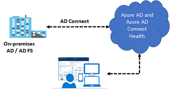

**Azure Active Directory (Azure AD) Connect Health** provides robust monitoring of your on-premises identity infrastructure. It enables you to maintain a reliable connection to Microsoft 365 and Microsoft Online Services. This reliability is achieved by providing monitoring capabilities for your key identity components. Also, it makes the key data points about these components easily accessible. Azure AD Connect Health helps you:

   - Monitor and gain insights into AD FS servers, Azure AD Connect, and AD domain controllers.
   - Monitor and gain insights into the synchronizations that occur between your on-premises AD DS and Azure AD.
   - Monitor and gain insights into your on-premises identity infrastructure that is used to access Microsoft 365 or other Azure AD applications

With Azure AD Connect the key data you need is easily accessible. You can view and act on alerts, setup email notifications for critical alerts, and view performance data.

```
Important

Using AD Connect Health works by installing an agent on each of your on-premises sync servers.
```

## **Explore authentication options**
Choosing the correct authentication method is the first concern for organizations wanting to move their apps to the cloud. Don't take this decision lightly, for the following reasons:

   - It's the first decision for an organization that wants to move to the cloud.
   - The authentication method is a critical component of an organization’s presence in the cloud. It controls access to all cloud data and resources.
   - It's the foundation of all the other advanced security and user experience features in Azure AD.

Identity is the new control plane of IT security, so authentication is an organization’s access guard to the new cloud world. Organizations need an identity control plane that strengthens their security and keeps their cloud apps safe from intruders.

## **Authentication methods**
When the Azure AD hybrid identity solution is your new control plane, authentication is the foundation of cloud access. Choosing the correct authentication method is a crucial first decision in setting up an Azure AD hybrid identity solution. Implement the authentication method that is configured by using Azure AD Connect, which also provisions users in the cloud.

Azure AD supports the following authentication methods for hybrid identity solutions.

## **Cloud authentication**
When you choose this authentication method, Azure AD handles users' sign-in process. Coupled with seamless single sign-on (SSO), users can sign in to cloud apps without having to reenter their credentials. With cloud authentication, you can choose from two options:

**Option 1: Azure AD password hash synchronization**. The simplest way to enable authentication for on-premises directory objects in Azure AD. Users can use the same username and password that they use on-premises without having to deploy any additional infrastructure. Some premium features of Azure AD, like Identity Protection and Azure AD Domain Services, require password hash synchronization, no matter which authentication method you choose.

**Option 2: Azure AD Pass-through Authentication**. Provides a simple password validation for Azure AD authentication services by using a software agent that runs on one or more on-premises servers. The servers validate the users directly with your on-premises Active Directory, which ensures that the password validation doesn't happen in the cloud.

Companies with a security requirement to immediately enforce on-premises user account states, password policies, and sign-in hours might use this authentication method.

## **Federated authentication**
When you choose the Federated authentication method, Azure AD hands off the authentication process to a separate trusted authentication system, such as on-premises Active Directory Federation Services (AD FS), to validate the user’s password.

The authentication system can provide additional advanced authentication requirements. Examples are smartcard-based authentication or third-party multifactor authentication.

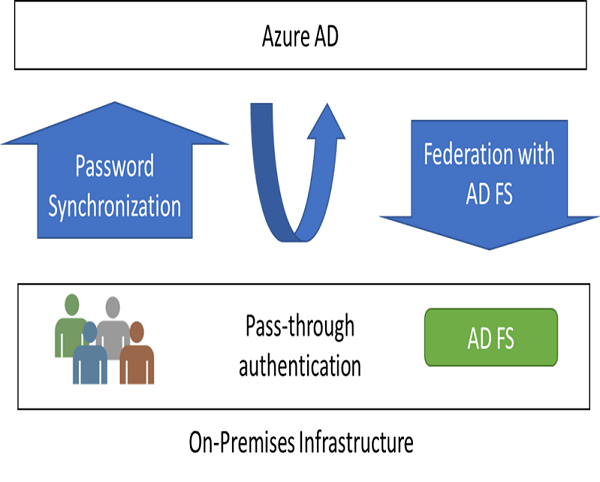

## **Summary**
   - This lesson outlines various authentication options that organizations can configure and deploy to support access to cloud apps.
   - To meet various business, security, and technical requirements, organizations can choose between password hash synchronization, Pass-through Authentication, and federation.
   - Consider each authentication method. Does the effort to deploy the solution, and the user's experience of the sign-in process address your business requirements?
   - Evaluate whether your organization needs the advanced scenarios and business continuity features of each authentication method.
   - Finally, evaluate the considerations of each authentication method. Do any of them prevent you from implementing your choice?

# **Configure Password Hash Synchronization (PHS)**
The probability that you're blocked from getting your work done due to a forgotten password is related to the number of different passwords you need to remember. The more passwords you need to remember, the higher the probability to forget one. Questions and calls about password resets and other password-related issues demand the most helpdesk resources.

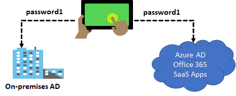

**Password hash synchronization** (PHS) is a feature used to synchronize user passwords from an on-premises Active Directory instance to a cloud-based Azure AD instance. Use this feature to sign in to Azure AD services like Microsoft 365, Microsoft Intune, CRM Online, and Azure Active Directory Domain Services (Azure AD DS). You sign in to the service by using the same password you use to sign in to your on-premises Active Directory instance. Password hash synchronization helps you to:

   - Improve the productivity of your users.
   - Reduce your helpdesk costs.

## **How does this work?**
In the background, the password synchronization component takes the user’s password hash from on-premises Active Directory, encrypts it, and passes it as a string to Azure. Azure decrypts the encrypted hash and stores the password hash as a user attribute in Azure AD.

When the user signs in to an Azure service, the sign-in challenge dialog box generates a hash of the user’s password and passes that hash back to Azure. Azure then compares the hash with the one in that user’s account. If the two hashes match, then the two passwords must also match and the user receives access to the resource. The dialog box provides the facility to save the credentials so that the next time the user accesses the Azure resource, the user will not be prompted.

```
Important

It is important to understand that this is same sign-in, not single sign-on. The user still authenticates against two separate directory services, albeit with the same user name and password. This solution provides a simple alternative to an AD FS implementation.
```

# **Implement Pass-through Authentication (PTA)**
**Azure AD Pass-through Authentication** (PTA) is an alternative to Azure AD Password Hash Synchronization, and provides the same benefit of cloud authentication to organizations. PTA allows users to sign in to both on-premises and cloud-based applications using the same user account and passwords. When users sign-in using Azure AD, Pass-through authentication validates the users’ passwords directly against an organization's on-premise Active Directory.

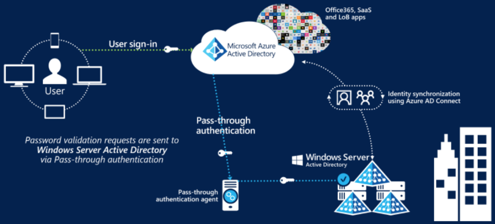

## **Feature benefits**
   - Supports user sign-in into all web browser-based applications and into Microsoft Office client applications that use modern authentication.
   - Sign-in usernames can be either the on-premises default username (userPrincipalName) or another attribute configured in Azure AD Connect (known as Alternate ID).
   - Works seamlessly with conditional access features such as Azure Active Directory Multi-Factor Authentication to help secure your users.
   - Integrated with cloud-based self-service password management, including password writeback to on-premises Active Directory and password protection by banning commonly used passwords.
   - Multi-forest environments are supported if there are forest trusts between your AD forests and if name suffix routing is correctly configured.
   - PTA is a free feature, and you don't need any paid editions of Azure AD to use it.
   - PTA can be enabled via Azure AD Connect.
   - PTA uses a lightweight on-premises agent that listens for and responds to password validation requests.
   - Installing multiple agents provides high availability of sign-in requests.
   - PTA protects your on-premises accounts against brute force password attacks in the cloud.

```
Important

This feature can be configured without using a federation service so that any organization, regardless of size, can implement a hybrid identity solution. Pass-through authentication is not only for user sign-in but allows an organization to use other Azure AD features, such as password management, role-based access control, published applications, and conditional access policies.
```

# **Deploy Federation with Azure AD**
Federation is a collection of domains that have established trust. The level of trust may vary, but typically includes authentication and almost always includes authorization. A typical federation might include a number of organizations that have established trust for shared access to a set of resources.


You can federate your on-premises environment with Azure AD and use this federation for authentication and authorization. This sign-in method ensures that all user authentication occurs on-premises. This method allows administrators to implement more rigorous levels of access control.

# **Explore the authentication decision tree**
Choosing the correct authentication method is the first concern for organizations wanting to move their apps to the cloud. Don't take this decision lightly, for the following reasons:
   - It's the first decision for an organization that wants to move to the cloud.
   - The authentication method is a critical component of an organization’s presence in the cloud. It controls access to all cloud data and resources.
   - It's the foundation of all the other advanced security and user experience features in Azure AD.

Identity is the new control plane of IT security, so authentication is an organization’s access guard to the new cloud world. Organizations need an identity control plane that strengthens their security and keeps their cloud apps safe from intruders.

## **Authentication methods**
**Cloud Authentication** - When you choose this authentication method, Azure AD handles users' sign-in process. Coupled with seamless single sign-on (SSO), users can sign in to cloud apps without having to reenter their credentials. With cloud authentication, you can choose from two options:
  
    - Azure AD password hash Synchronization
    - Azure AD Pass-through Authentication

**Federated Authentication** - When you choose this authentication method, Azure AD hands off the authentication process to a separate trusted authentication system, such as on-premises Active Directory Federation Services (AD FS), to validate the user’s password. The authentication system can provide additional advanced authentication requirements. Examples are smartcard-based authentication or third-party multifactor authentication.

## **Decision tree**


Details on decision questions:

   1. Azure AD can handle sign-in for users without relying on on-premises components to verify passwords.
   2. Azure AD can hand off user sign-in to a trusted authentication provider such as Microsoft’s AD FS.
   3. If you need to apply user-level Active Directory security policies such as account expired, disabled account, password expired, account locked out, and sign-in hours on each user sign-in, Azure AD requires some on-premises components.
   4. Sign-in features not natively supported by Azure AD:
       - Sign-in using on-premises MFA Server.
       - Sign-in using third-party authentication solution.
       - Multi-site on-premises authentication solution.
    5. Azure AD Identity Protection requires Password Hash Sync, regardless of which sign-in method you choose, to provide the Users with leaked credentials report. Organizations can fail over to Password Hash Sync if their primary sign-in method fails and it was configured before the failure event.

```
Important

This decision tree is intended as a starting point to understand your options, but there can be others or even combinations of different options. For example, you can use Azure AD B2C and configure it to allow user sign-in for multi-tenant Azure AD tenants - with or without the traditional support for self-service sign-up and social identity providers.
```

# **Configure password writeback**
Having a cloud-based password reset utility is great but most companies still have an on-premises directory where their users exist. How does Microsoft support keeping traditional on-premises Active Directory Domain Services (AD DS) in sync with password changes in the cloud?

**Password writeback** is a feature enabled with Azure AD Connect that allows password changes in the cloud to be written back to an existing on-premises directory in real time.

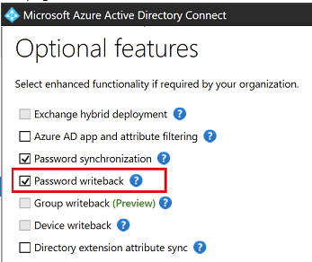

Password writeback provides:

   - **Enforcement of on-premises Active Directory Domain Services password policies**. When a user resets their password, it is checked to ensure it meets your on-premises Active Directory Domain Services policy before committing it to that directory. This review includes checking the history, complexity, age, password filters, and any other password restrictions that you have defined in local Active Directory Domain Services.
   - **Zero-delay feedback**. Password writeback is a synchronous operation. Your users are notified immediately if their password did not meet the policy or could not be reset or changed for any reason.
   - **Supports password changes from the access panel and Microsoft 365**. When federated or password hash synchronized users come to change their expired or non-expired passwords, those passwords are written back to your local Active Directory Domain Services environment.
   - **Supports password writeback when an admin resets them from the Azure portal**. Whenever an admin resets a user’s password in the Azure portal, if that user is federated or password hash synchronized, the password is written back to on-premises. This functionality is currently not supported in the Office admin portal.
   - **Doesn’t require any inbound firewall rules**. Password writeback uses an Azure Service Bus relay as an underlying communication channel. All communication is outbound over port 443.

```
Important

To use self-service password reset (SSPR) you must have already configured Azure AD Connect in your environment.
```

# **Knowledge check**

Choose the best response for each of the questions below. Then select **Check your answers**.

## **Check your knowledge**

1. The IT helpdesk wants to reduce password reset support tickets. You suggest having users sign-in to both on-premises and cloud-based applications using the same password. Your organization does not plan on using Azure AD Identity Protection, so which feature would be easiest to implement given the requirements?
    - Federation 
    - Pass-through authentication
    - Password hash synchronization (**Ans**)
2. Which tool can you use to synchronize Azure AD passwords with on-premises Active Directory?
    - Azure AD Connect (**Ans**)
    - Active Directory Federation Services
    - Password writeback
3. Azure AD supports which of the following security protocols?
    - Kerberos
    - OAuth (**Ans**)
    - OpenID Connect
4. Which of the following is an authentication option that integrates with Azure Active Directory, requiring you to use several differing methods, like your phone, to confirm your identity?
    - FIDO2 security keys
    - Microsoft Authenticator app
    - Azure Active Directory Multi-Factor Authentication (**Ans**)

# **Deploy Azure AD identity protection**
Protect identities in Azure AD using Conditional Access, MFA, access reviews, and other capabilities.

   - Deploy and configure Identity Protection
   - Configure MFA for users, groups, and applications
   - Create Conditional Access policies to ensure your security
   - Create and follow an access review process

## **Introduction**
Identity Protection is a tool that allows organizations to automate the detection and remediation of identity-based risks, investigate risks using data in the portal, and export risk detection data to third-party utilities for further analysis.

## **Scenario**
A security engineer uses Azure AD Identity Protection to configure Azure features that monitor and protect identities in the tenant; you will work on such tasks as:

   - Creating access reviews to check on how each identity is being used and that the correct rights are assigned.
   - Configure policies to identify risky user behaviors and odd sign-in patterns.
   - Control and manage access to resources with conditional access policies.

## **Skills measured**

[Exam AZ-500: Microsoft Azure Security Engineer](https://learn.microsoft.com/en-us/certifications/exams/az-500/)

Manage identity and access (30-35%)
- Configure secure access by using Azure and
   - Configure Access Reviews
   - Implement Conditional Access policies, including multi-factor authentication
   - Configure Azure AD identity protection

## **Learning objectives**
   - Deploy and configure Identity Protection
   - Configure multi-factor authentication for users, groups, and applications
   - Create Conditional Access policies to ensure your security
   - Create and follow an access review process

# **Explore Azure AD identity protection**
Identity Protection is a tool that allows organizations to accomplish three key tasks:

   - Automate the detection and remediation of identity-based risks.
   - Investigate risks using data in the portal.
   - Export risk detection data to third-party utilities for further analysis.

Identity Protection uses the learnings Microsoft has acquired from their position in organizations with Azure AD, the consumer space with Microsoft Accounts, and in gaming with Xbox to protect your users. Microsoft analyzes 6.5 trillion signals per day to identify and protect customers from threats.

Risk detections in Azure AD Identity Protection include any identified suspicious actions related to user accounts in the directory. The signals generated that are fed to Identity Protection, can be further fed into tools like Conditional Access to make access decisions, or fed back to a security information and event management (SIEM) tool for further investigation based on your organization's enforced policies.

Identity Protection provides organizations access to powerful resources so they can quickly respond to suspicious activities.

## **Identity Protection policies**

Azure Active Directory Identity Protection includes three default policies that administrators can choose to enable. These policies include limited customization but are applicable to most organizations. All the policies allow for excluding users such as your emergency access or break-glass administrator accounts.


## **Azure Multi-Factor Authentication registration policy**

Identity Protection can help organizations roll out Azure Multi-Factor Authentication using a Conditional Access policy requiring registration at sign-in. Enabling this policy is a great way to ensure new users in your organization have registered for MFA on their first day. Multi-factor authentication is one of the self-remediation methods for risk events within Identity Protection. Self-remediation allows your users to act on their own to reduce helpdesk call volume.

## **Sign-in risk policy**

Identity Protection analyzes signals from each sign-in, both real-time and offline, and calculates a risk score based on the probability that the sign-in wasn't performed by the user. Administrators can decide based on this risk score signal to enforce organizational requirements. Administrators can choose to block access, allow access, or allow access but require multi-factor authentication.

If risk is detected, users can perform multi-factor authentication to self-remediate and close the risky sign-in event to prevent unnecessary noise for administrators.

## **Custom Conditional Access policy**
Administrators can also choose to create a custom Conditional Access policy, including sign-in risk as an assignment condition.


# **Configure risk event detections**
To protect your users, you can configure risk-based policies in Azure Active Directory (Azure AD) that automatically respond to risky behaviors. Azure AD Identity Protection policies can automatically block a sign-in attempt or require additional action, such as requiring a password change or prompt for Azure AD Multi-Factor Authentication. These policies work with existing Azure AD Conditional Access policies as an extra layer of protection for your organization. Users may never trigger a risky behavior in one of these policies, but your organization is protected if an attempt to compromise your security is made.

Each day, Microsoft collects and analyses trillions of anonymized signals as part of user sign-in attempts. These signals help build patterns of good user sign-in behavior and identify potential risky sign-in attempts. Azure AD Identity Protection can review user sign-in attempts and take additional action if there's suspicious behavior:

Some of the following actions may trigger Azure AD Identity Protection risk detection:
   - Users with leaked credentials.
   - Sign-ins from anonymous IP addresses.
   - Impossible travel to atypical locations.
   - Sign-ins from infected devices.
   - Sign-ins from IP addresses with suspicious activity.

The following three policies are available in Azure AD Identity Protection to protect users and respond to suspicious activity. You can choose to turn the policy enforcement on or off, select users or groups for the policy to apply to, and decide if you want to block access at sign-in or prompt for additional action.

The insight you get for a detected risk detection is tied to your Azure AD subscription.

  - **User risk policy** - Identifies and responds to user accounts that may have compromised credentials. Can prompt the user to create a new password.
  - **Sign-in risk policy** - Identifies and responds to suspicious sign-in attempts. Can prompt the user to provide additional forms of verification using Azure AD Multi-Factor Authentication.
  - **MFA registration policy** - Makes sure users are registered for Azure AD Multi-Factor Authentication. If a sign-in risk policy prompts for MFA, the user must already be registered for Azure AD Multi-Factor Authentication.

When you enable a policy user or sign-in risk policy, you can also choose the threshold for risk level - **low and above**, medium and above, or high. This flexibility lets you decide how aggressive you want to be in enforcing any controls for suspicious sign-in events.

# **Implement user risk policy**
Identity Protection can calculate what it believes is normal for a user's behavior and use that to base decisions for their risk. User risk is a calculation of probability that an identity has been compromised. Administrators can decide based on this risk score signal to enforce organizational requirements. Administrators can choose to block access, allow access, or allow access but require a password change using Azure AD self-service password reset.


The above image shows the configuration of **User Risk Policy** applied

   - To user sign-ins
   - Automatically respond based on a specific user’s risk level
   - Provide the condition (risk level) and action (block or allow)
   - Use a high threshold during policy roll out
   - Use a low threshold for greater security

## **Risky users**
With the information provided by the risky users report, administrators can find:

   - Which users are at risk, have had risk remediated, or have had risk dismissed?
   - Details about detections
   - History of all risky sign-ins
   - Risk history

Administrators can then choose to act on these events. Administrators can choose to:

   - Reset the user password
   - Confirm user compromise
   - Dismiss user risk
   - Block user from signing in
   - Investigate further using Azure ATP

# **Implement sign-in risk policy**
Sign-in risk represents the probability that a given authentication request isn't authorized by the identity owner. For users of Azure Identity Protection, sign-in risk can be evaluated as part of a Conditional Access policy. Sign-in Risk Policy supports the following conditions:

## **Location**
When configuring location as a condition, organizations can choose to include or exclude locations. These named locations may include the public IPv4 network information, country or region, or even unknown areas that don't map to specific countries or regions. Only IP ranges can be marked as a trusted location. When including any location, this option includes any IP address on the internet not just configured named locations. When selecting any location, administrators can choose to exclude all trusted or selected locations.

## **Client apps**
Conditional Access policies by default apply to browser-based applications and applications that utilize modern authentication protocols. In addition to these applications, administrators can choose to include Exchange ActiveSync clients and other clients that utilize legacy protocols.

   - **Browser** - These include web-based applications that use protocols like SAML, WS-Federation, OpenID Connect, or services registered as an OAuth confidential client.
   - **Mobile apps and desktop clients** - These access policies are commonly used when requiring a managed device, blocking legacy authentication, and blocking web applications but allowing mobile or desktop app.

## **Risky sign-ins**
The risky sign-ins report contains filterable data for up to the past 30 days (1 month).

With the information provided by the risky sign-ins report, administrators can find:

   - Which sign-ins are classified as at risk, confirmed compromised, confirmed safe, dismissed, or remediated.
   - Real-time and aggregate risk levels associated with sign-in attempts.
   - Detection types triggered
   - Conditional Access policies applied
   - MFA details
   - Device information
   - Application information
   - Location information

Administrators can then choose to take action on these events. Administrators can choose to:

   - Confirm sign-in compromise
   - Confirm sign-in safe

# **Deploy multifactor authentication in Azure**
Azure Active Directory Multi-Factor Authentication helps safeguard access to data and applications while maintaining simplicity for users. It provides additional security by requiring a second form of authentication and delivers strong authentication through a range of easy to use authentication methods.

For organizations that need to be compliant with industry standards, such as the Payment Card Industry (PCI) Data Security Standard (DSS) version 3.2, MFA is a must have capability to authenticate users. Beyond being compliant with industry standards, enforcing MFA to authenticate users can also help organizations to mitigate credential theft attacks.


The security of MFA two-step verification lies in its layered approach. Compromising multiple authentication factors presents a significant challenge for attackers. Even if an attacker manages to learn the user's password, it is useless without also having possession of the additional authentication method. Authentication methods include:

   - Something you know (typically a password)
   - Something you have (a trusted device that is not easily duplicated, like a phone)
   - Something you are (biometrics)

## **Multi-Factor Authentication Features**

   - **Get more security with less complexity**. Azure MFA helps safeguard access to data and applications and helps to meet customer demand for a simple sign-in process. Get strong authentication with a range of easy verification options—phone call, text message, or mobile app notification—and allow customers to choose the method they prefer.
   - **Mitigate threats with real-time monitoring and alerts**. MFA helps protect your business with security monitoring and machine-learning-based reports that identify inconsistent sign-in patterns. To help mitigate potential threats, real-time alerts notify your IT department of suspicious account credentials.
   - **Use with Microsoft 365, Salesforce, and more**. MFA for Microsoft 365 helps secure access to Microsoft 365 applications at no additional cost. Multifactor authentication is also available with Azure Active Directory Premium and thousands of software-as-a-service (SaaS) applications, including Salesforce, Dropbox, and other popular services.
   - **Add protection for Azure administrator accounts**. MFA adds a layer of security to your Azure administrator account at no additional cost. When it's turned on, you need to confirm your identity to create a virtual machine, manage storage, or use other Azure services.

## **Multi-Factor Authentication Options**


| Method                                                                                                                                                                                                                                                                                                                                                                                                                             |
|------------------------------------------------------------------------------------------------------------------------------------------------------------------------------------------------------------------------------------------------------------------------------------------------------------------------------------------------------------------------------------------------------------------------------------|
| Description                                                                                                                                                                                                                                                                                                                                                                                                                        |
| Call to phone                                                                                                                                                                                                                                                                                                                                                                                                                      |
| Places an automated voice call. The user answers the call and presses # in the phone keypad to authenticate. The phone number is not synchronized to on-premises Active Directory. A voice call to phone is important because it persists through a phone handset upgrade, allowing the user to register the mobile app on the new device.                                                                                         |
| Text message to phone                                                                                                                                                                                                                                                                                                                                                                                                              |
| Sends a text message that contains a verification code. The user is prompted to enter the verification code into the sign-in interface. This process is called one-way SMS. Two-way SMS means that the user must text back a particular code. Two-way SMS is deprecated and not supported after November 14, 2018. Users who are configured for two-way SMS are automatically switched to call to phone verification at that time. |
| Notification through mobile app                                                                                                                                                                                                                                                                                                                                                                                                    |
| Sends a push notification to your phone or registered device. The user views the notification and selects Approve to complete verification. The Microsoft Authenticator app is available for Windows Phone, Android, and iOS. Push notifications through the mobile app provide the best user experience.                                                                                                                          |
| Verification code from mobile app                                                                                                                                                                                                                                                                                                                                                                                                  |
| The Microsoft Authenticator app generates a new OATH verification code every 30 seconds. The user enters the verification code into the sign-in interface. The Microsoft Authenticator app is available for Windows Phone, Android, and iOS. Verification code from mobile app can be used when the phone has no data connection or cellular signal.                                                                               |

## **Explore multifactor authentication settings**

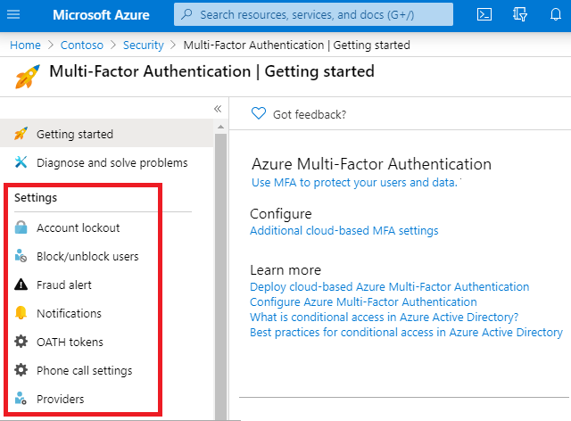

## **Account lockout**
To prevent repeated MFA attempts as part of an attack, the account lockout settings let you specify how many failed attempts to allow before the account becomes locked out for a period of time. The account lockout settings are only applied when a pin code is entered for the MFA prompt. The following settings are available:

   - Number of MFA denials to trigger account lockout
   - Minutes until account lockout counter is reset
   - Minutes until account is automatically unblocked

## **Block and unblock users**
If a user's device has been lost or stolen, you can block authentication attempts for the associated account.

## **Notifications**
Email notifications can be configured when users report fraud alerts. These notifications are typically sent to identity administrators, as the user's account credentials are likely compromised.

## **OATH tokens**
Azure AD supports the use of OATH-TOTP SHA-1 tokens that refresh codes every 30 or 60 seconds. Customers can purchase these tokens from the vendor of their choice.

## **Trusted IPs**

Trusted IPs is a feature to allow federated users or IP address ranges to bypass two-step authentication. Notice there are two selections in this screenshot.

Which selections you can make depends on whether you have managed or federated tenants.

   - **Managed tenants**. For managed tenants, you can specify IP ranges that can skip MFA.
   - **Federated tenants**. For federated tenants, you can specify IP ranges and you can also exempt AD FS claims users.

```
Important

The Trusted IPs bypass works only from inside of the company intranet. If you select the All Federated Users option and a user signs in from outside the company intranet, the user must authenticate by using two-step verification. The process is the same even if the user presents an AD FS claim.
```

# **Enable multifactor authentication**

To enable MFA, go to the User Properties in Azure Active Directory, and then the Multi-Factor Authentication option. From there, you can select the users that you want to modify and enable for MFA. You can also bulk enable groups of users with PowerShell. User's states can be Enabled, Enforced, or Disabled.

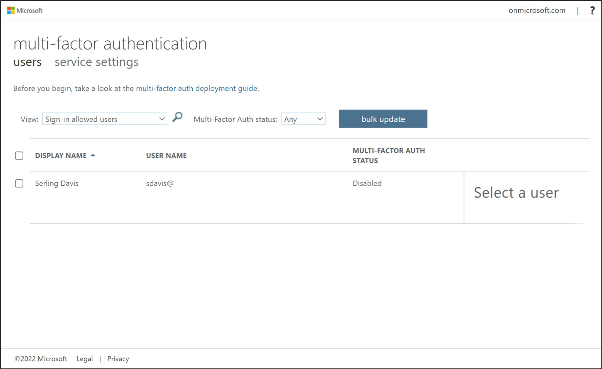

```
Note

On first-time sign-in, after MFA has been enabled, users are prompted to configure their MFA settings. For example, if you enable MFA so that users must use a mobile device, users will be prompted to configure their mobile device for MFA. Users must complete those steps, or they will not be permitted to sign in, which they cannot do until they have validated that their mobile device is MFA-compliant.
```
All users start out Disabled. When you enroll users in per-user Azure AD Multi-Factor Authentication, their state changes to Enabled. When enabled users sign in and complete the registration process, their state changes to Enforced. Administrators may move users between states, including from Enforced to Enabled or Disabled.

## **Enable MFA for Global Admins**

Azure AD Multi-Factor Authentication is included free of charge for global administrator security. Enabling MFA for global administrators provides an added level of security when managing and creating Azure resources like virtual machines, managing storage, or using other Azure services. Secondary authentication includes phone call, text message, and the authenticator app.

```
Important

Remember, you can only enable MFA for organizational accounts stored in Azure Active Directory. These are also called work or school accounts.
```

# **Implement Azure AD conditional access**

The old world of security behind a corporate firewall, having your secure network perimeter just doesn’t work anymore, not with people wanting to work from anywhere, being able to connect to all sorts of cloud applications.

Conditional Access is the tool used by Azure Active Directory to bring signals together, to make decisions, and enforce organizational policies.

Conditional Access is at the heart of the new identity driven control plane.

Conditional access policy is really a next generation policy that’s built for the cloud. It’s able to consider massive amounts of data, as well as contextual data from a user sign-in flow and make sure that the right controls are enforced.

## **Identity as a Service—the new control plane**

What is the basis for saying that identity management is the new control plane? First, what is the control plane? In a switch or router, the control plane is the part that controls where the traffic is to go, but it’s not responsible for the movement of the traffic. The control plane learns the routes, either static or dynamic. The part responsible for moving the traffic is the forwarding plane. The following figure depicts a simple switch diagram.


A user’s identity is like a control plane, because it controls which protocols the user will interact with, which organizational programs the user can access, and which devices the user can employ to access those programs. Identity is what helps protect user and corporate data. For example, should that data be encrypted, deleted, or ignored when an issue occurs?

Now, everything pivots around that user identity. You know what their activities are, and where they are located. You know what devices they’re using. Then we leverage that information in conditional access policy to be able to enforce things like multifactor authentication or require a compliant device.

There are the conditions, which indicate when the policy is going to apply. This can be, again, the location, type of application that you’re on, any detected risk. How is the risk determined? It is determined from all the analysis and intel that we have across organizations using Azure Active Directory, as well as Microsoft consumer identity offerings. Conditional Access is the tool used by Azure Active Directory to bring signals together, to make decisions, and enforce organizational policies. Conditional Access policies at their simplest are if-then statements, if a user wants to access a resource, then they must complete an action. Example: A payroll manager wants to access the payroll application and is required to perform multifactor authentication to access it.

Administrators are faced with two primary goals:

   - Empower users to be productive wherever and whenever
   - Protect the organization's assets

By using Conditional Access policies, you can apply the right access controls when needed to keep your organization secure and stay out of your user’s way when not needed.


Conditional Access policies are enforced after the first-factor authentication has been completed. Conditional Access is not intended as an organization's first line of defense for scenarios like denial-of-service (DoS) attacks but can use signals from these events to determine access.

## **Configure conditional access conditions**

Conditional access is a capability of Azure AD (with an Azure AD Premium license) that enables you to enforce controls on the access to apps in your environment based on specific conditions from a central location. With Azure AD conditional access, you can factor how a resource is being accessed into an access control decision. By using conditional access policies, you can apply the correct access controls under the required conditions.

Conditional access comes with six conditions: user/group, cloud application, device state, location (IP range), client application, and sign-in risk. You can use combinations of these conditions to get the exact conditional access policy you need. Notice on this image the conditions determine the access control from the previous topic.


With access controls, you can either Block Access altogether or Grant Access with more requirements by selecting the desired controls. You can have several options:

   - Require MFA from Azure AD or an on-premises MFA (combined with AD FS).
   - Grant access to only trusted devices.
   - Require a domain-joined device.
   - Require mobile devices to use Intune app protection policies.

Requiring more account verification through MFA is a common conditional access scenario. While users may be able to sign in to most of your organization’s cloud apps, you may want more verification for things like your email system, or apps that contain personnel records or sensitive information. In Azure AD, you can accomplish this with a conditional access policy

```
Important

The Users and Groups condition is mandatory in a conditional access policy. In your policy, you can either select All users or select specific users and groups.
```

# **Implement access reviews**

Azure Active Directory (Azure AD) access reviews enable organizations to efficiently manage group memberships, access to enterprise applications, and role assignments. User's access can be reviewed on a regular basis to make sure only the right people have continued access.

## **Why are access reviews important?**

Azure AD enables you to collaborate internally within your organization and with users from external organizations, such as partners. Users can join groups, invite guests, connect to cloud apps, and work remotely from their work or personal devices. The convenience of leveraging the power of self-service has led to a need for better access management capabilities.

   - As new employees join, how do you ensure they have the right access to be productive?
   - As people move teams or leave the company, how do you ensure their old access is removed, especially when it involves guests?
   - Excessive access rights can lead to audit findings and compromises as they indicate a lack of control over access.
   - You must proactively engage with resource owners to ensure they regularly review who has access to their resources.

## **Use access reviews in the following cases**

   - **Too many users in privileged roles**: It's a good idea to check how many users have administrative access, how many of them are Global Administrators, and if there are any invited guests or partners that have not been removed after being assigned to do an administrative task. You can recertify the role assignment users in Azure AD roles such as Global Administrators, or Azure resources roles such as User Access Administrator in the Azure AD Privileged Identity Management (PIM) experience.
   - **When automation is infeasible**: You can create rules for dynamic membership on security groups or Microsoft 365 Groups, but what if the HR data is not in Azure AD or if users still need access after leaving the group to train their replacement? You can then create a review on that group to ensure those who still need access should have continued access.
   - **When a group is used for a new purpose**: If you have a group that is going to be synced to Azure AD, or if you plan to enable a sales management application for everyone in the Sales team group, it would be useful to ask the group owner to review the group membership prior to the group being used in a different risk content.
   - **Business critical data access**: for certain resources, it might be required to ask people outside of IT to regularly sign out and give a justification on why they need access for auditing purposes.
   - **To maintain a policy's exception list**: In an ideal world, all users would follow the access policies to secure access to your organization's resources. However, sometimes there are business cases that require you to make exceptions. As the IT admin, you can manage this task, avoid oversight of policy exceptions, and provide auditors with proof that these exceptions are reviewed regularly.
   - **Ask group owners to confirm they still need guests in their groups**: Employee access might be automated with some on premises IAM, but not invited guests. If a group gives guests access to business sensitive content, then it's the group owner's responsibility to confirm the guests still have a legitimate business need for access.
   - **Have reviews recur periodically**: You can set up recurring access reviews of users at set frequencies such as weekly, monthly, quarterly or annually, and the reviewers will be notified at the start of each review. Reviewers can approve or deny access with a friendly interface and with the help of smart recommendations.

Depending on what you want to review, you will create your access review in Azure AD access reviews, Azure AD enterprise apps (in preview), or Azure AD PIM. Using this feature requires an Azure AD Premium P2 license.

```
Important

Azure AD Premium P2 licenses are not required for users with the Global Administrator or User Administrator roles that set up access reviews, configure settings, or apply the decisions from the reviews.
```

# **Explore try-this exercises**

## **Task 1 - Configure conditional access (require MFA)**

```
Note

This task requires a user account, AZ500User1. If you want to show the MFA verification, the user account must have a phone number.
```

This task will review conditional access policy settings and create a policy that requires MFA when signing in to the Portal.

## **Configure the policy**

   1. In the **Portal**, search for and select **Azure Active Directory**.
   2. Under **Manage**, select **Security**.
   3. Under **Protect**, select **Conditional access**.
   4. Click **New Policy**.

      - Name: **AZ500Policy1**
      - Users and groups > Select users and groups > Users and Groups > Select: **AZ500User1**
      - Cloud apps or actions > Select apps > Select: **Microsoft Azure Management**
      - Review the warning that this policy impacts Portal access.
      - Conditions > Sign-in risk > Review the risk levels
      - Device platforms > Review the devices that can be included, such as Android and iOS.
      - Locations > Review the physical location selections.
      - Under **Access controls** click **Grant**.
      - Review the Grant options such as MFA. You may require one or more of the controls.
      - Select **Require multi-factor authentication**.
      - For **Enable policy**, select **On**.
    
    5. Click Create.

## **Test the policy**

   1. Sign in to the **Portal** as the **AZ500User1**.
   2. Before you can sign in, a second authentication is required.
   3. If you have a phone number associated with the user, provide and verify the text code. You should be able to sign in to the Portal successfully.
   4. If you do not have a phone number associated with the user, this demonstrates that MFA is in effect.
   5. You may want to return to the **AZ500Policy1** and turn the policy **Off**.

## **Task 2 - Access review**
In this task, we will configure an access review.

## **Configure an access review**

   1. In the **Portal**, search for and select **Identity Governance**.
   2. Under **Access Reviews**, select **Access Reviews**.
   3. Click **New Access Review**.
   4. We will create an access review to ensure we validate the AZ500Admin group membership.
   5. Complete the required information and discuss each setting. Configuration settings are added as you make your selections. For example, if you select a weekly access review, you will be prompted for the duration.

      - Review name: **AZ500Review**
      - Start date: **current date**
      - Frequency: **One-time**
      - Users to review: **Members of a group**
      - Scope: **Everyone**
      - Select a group: **AZ500Admins**
      - Reviewers: **Selected user**
      - Select reviewers: **add yourself as a reviewer**
      - Review the **Upon completion settings**, specifically the action if a reviewer doesn't respond.
      - Review **Advanced settings**.
    
    6. **Start** the access review.
    7. On the **Access review** page, ensure the new access review is listed.
    8. The **Status** will change from **Not started** to **Initializing**.

## **Conduct an access review**

In this task, we will conduct an access review.

   1. When the access review is complete, you will receive an email. This is the email associated with your reviewer account.
   2. View the email and discuss the review instructions. Note when the review period will end.
   3. In the email, click **Start review**.
   4. On the **Access reviews** page, click the **AZ500Review**.
   5. Notice you are reviewing the AZ500Admin group members. There are two members.
   6. Use the **Details** link to view information about the user.
   7. Select **Approve** for one user and **Deny** for the other. Be sure to provide a **Reason**.
   8. **Submit** your reviews.

## **Review the access review results**

In this task, we will review the access review results.

   1. Return to the **Portal**.
   2. Click the **AZ500Review**.
   3. From the **Overview** blade, review the results.
   4. There should be one member **approved** and one member **denied**.
   5. Click **Results** for more detailed information about the reviewer and their reasons.
   6. From the **Overview** blade, click **Stop** and confirm you want to stop the review.
   7. The **Review status** should now be **Complete**.

## **Apply the access review**

In this task, we will apply the review results.

   1. In the **Portal**, search for and select **Azure Active Directory**.
   2. Under **Manage**, select **Groups**.
   3. Locate the **AZ500Admins** group.
   4. Review the members of the group.-
   5. Confirm there are two members.
   6. Return to the **AZ500Review**.
   7. Click **Apply**.
   8. Confirm that you want to remove the denied member.
   9. The **Review status** will change from **Applying** to **Result applied**.
   10. Verify the **AZ500Admins** group now only has one member.

# **Knowledge check**


Choose the best response for each of the questions below. Then select **Check your answers**.

1. The compliance auditors want to ensure as employees change jobs or leave the company that their privileges are also changed or revoked. They are especially concerned about the Administrator group. To address their concerns. you implement which of the following?

   - Access reviews (**Ans**)
   - Azure time-based policies
   - JIT virtual machine access

2. Identity Protection has reported that a user’s credentials have been leaked. According to policy, the user’s password must be reset. Which Azure AD role can reset the password?

    - Global Administrator (**Ans**)
    - Security Administrator
    - Security Operator

3. Identity Protection identifies risks in which of the following classifications?

    - Specific IP address
    - Atypical travel (**Ans**)
    - Unregistered device

4. You have implemented Identity Protection and are reviewing the Risky users report. For each reported event you can choose any of the following actions?

    - Confirm user compromise (**Ans**)
    - Delete the risk event
    - Dismiss user account

5. Conditional Access can be used to enable which of the actions listed below?

    - Block or grant access from specific time of day.
    - Designate privileged user accounts.
    - Require multifactor authentication. (**Ans**)

6. Which licensing plan supports Identity Protection?

    - Azure Active Directory Free
    - Azure Active Directory Premium P1
    - Azure Active Directory Premium P2 (**Ans**)


# **Configure Azure AD privileged identity management**

Ensure that your privileged identities have extra protection and are accessed only with the least amount of access needed to do the job.

## **Introduction**

Azure AD Privileged Identity Management (PIM) allows you to manage, control, and monitor access to the most important resources in your organization. You can give just-in-time access and just-enough-access to users to allow them to do their tasks.

## **Scenario**

A security engineer uses Privileged Identity Management to protect administrator privileges and mitigate the risk of excessive or misused access rights; some common tasks are:

   - Configuring the scope of users and roles based on zero trust.
   - Setting up a PIM workflow to enforce approval for role usage, and monitor the access.
   - Implement just-in-time access.

## **Explore the zero trust model**

Cloud-based services and mobile computing have changed the technology landscape for the modern enterprise. Today’s workforce often requires access to applications and resources outside traditional corporate network boundaries, rendering security architectures that rely on firewalls and virtual private networks (VPNs) insufficient. Changes brought about by cloud migration and a more mobile workforce has led to the development of an access architecture called Zero Trust.

## **The Zero Trust model**

Based on the principle of “never trust, always verify,” Zero Trust helps secure corporate resources by eliminating unknown and unmanaged devices and limiting lateral movement. Implementing a true Zero Trust model requires that all components—user identity, device, network, and applications—be validated and proven trustworthy. Zero Trust verifies identity and device health prior to granting access to corporate resources. When access is granted, applying the principle of least privilege limits user access to only those resources that are explicitly authorized for each user, thus reducing the risk of lateral movement within the environment. In an ideal Zero Trust environment, the following four elements are necessary:

   - Strong identity authentication everywhere (user verification via authentication)
   - Devices are enrolled in device management, and their health is validated
   - Least-privilege user rights (access is limited to only what is needed)
   - The health of services is verified (future goal)

For Microsoft, Zero Trust establishes a strict boundary around corporate and customer data. For end users, Zero Trust delivers a simplified user experience that allows them to easily manage and find their content. And for customers, Zero Trust creates a unified access platform that they can use to enhance the overall security of their entire ecosystem.

## **Zero Trust architecture**

A Zero Trust approach extends throughout the entire digital estate and serves as an integrated security philosophy and end-to-end strategy.

The illustration below provides a representation of the primary elements that contribute to Zero Trust.

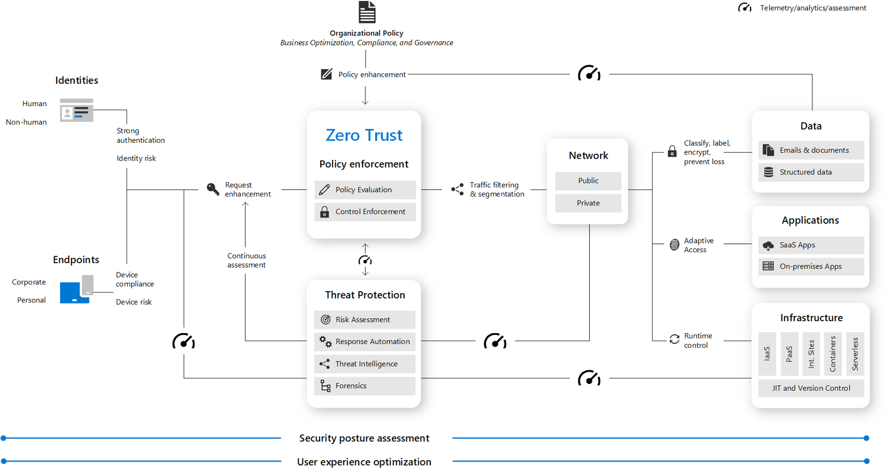

In the illustration above:

Security policy enforcement is at the center of a Zero Trust architecture. This includes Multi-Factor authentication with conditional access that takes into account user account risk, device status, and other criteria and policies that you set.

Identities, devices (also called endpoints), data, applications, network, and other infrastructure components are all configured with appropriate security. Policies that are configured for each of these components are coordinated with your overall Zero Trust strategy. For example, device policies determine the criteria for healthy devices and conditional access policies require healthy devices for access to specific apps and data.

Threat protection and intelligence monitors the environment, surfaces current risks, and takes automated action to remediate attacks.

## **Guiding principles of Zero Trust**

Today, organizations need a new security model that effectively adapts to the complexity of the modern environment, embraces the mobile workforce, and protects people, devices, applications, and data wherever they are located.

To address this new world of computing, Microsoft highly recommends the Zero Trust security model, which is based on these guiding principles:

   - **Verify explicitly** - Always authenticate and authorize based on all available data points.
   - **Use least privilege access** - Limit user access with Just-In-Time and Just-Enough-Access (JIT/JEA), risk-based adaptive policies, and data protection.
   - **Assume breach** - Minimize blast radius and segment access. Verify end-to-end encryption and use analytics to get visibility, drive threat detection, and improve defenses.

## **Microsoft's Zero Trust architecture**

Below is a simplified reference architecture for our approach to implementing Zero Trust. The primary components of this process are Intune for device management and device security policy configuration, Azure AD conditional access for device health validation, and Azure AD for user and device inventory.

The system works with Intune, pushing device configuration requirements to the managed devices. The device then generates a statement of health, which is stored in Azure AD. When the device user requests access to a resource, the device health state is verified as part of the authentication exchange with Azure AD.

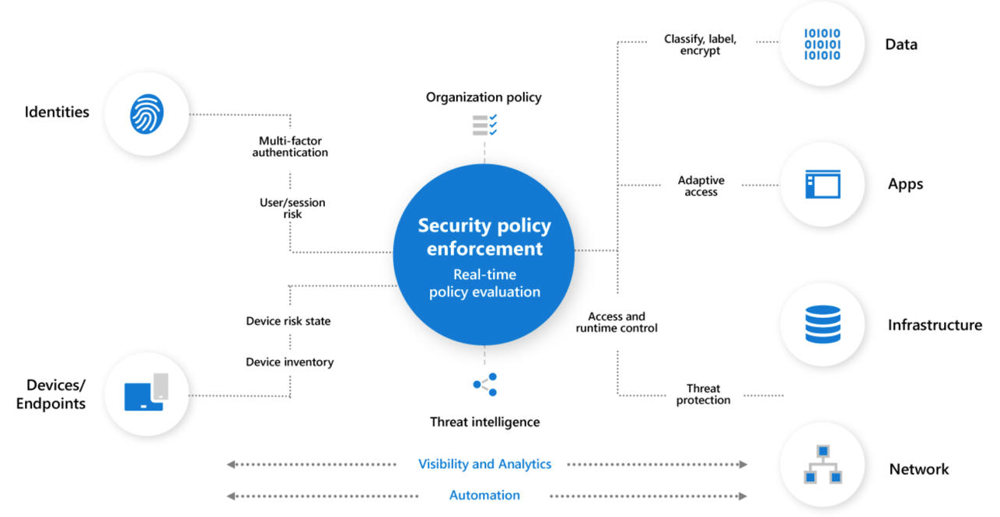

```
Important

The National Institute of Standards and Technology has a Zero Trust Architecture, NIST 800-207, publication.
```

## **Review the evolution of identity management**

**Microsoft Identity Manager** or MIM helps organizations manage the users, credentials, policies, and access within their organizations and hybrid environments. With MIM, organizations can simplify identity lifecycle management with automated workflows, business rules, and easy integration with heterogenous platforms across the datacenter. MIM enables Active Directory Domain Services to have the right users and access rights for on-premises apps. Azure AD Connect can then make those users and permissions available in Azure AD for Microsoft 365 and cloud-hosted apps.

On-premises Active Directory Domain Services, Azure Active Directory (Azure AD), or a hybrid combination of the two all offer services for user and device authentication, identity and role management, and provisioning.

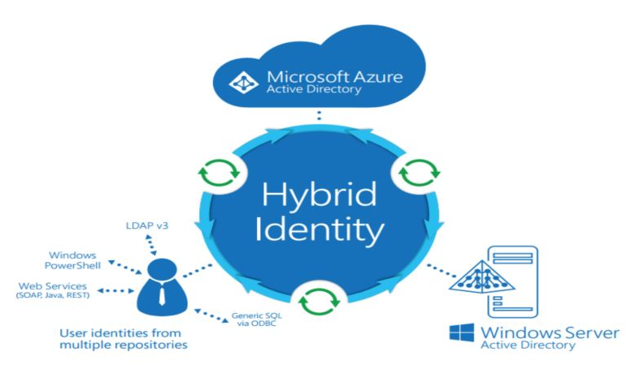

Identity has become the common factor among many services, like Microsoft 365 and Xbox Live, where the person is the center of the services. Identity is now the security boundary, the new firewall, the control plane—whichever comparison you prefer. Your digital identity is the combination of who you are and what you’re allowed to do. That is:

**Credentials + privileges = digital identity**

First step, you need to help protect your privileged accounts.

These identities have more than the normal user rights and, if compromised, allow a malicious hacker to access sensitive corporate assets. Helping secure these privileged identities is a critical step to establishing security assurances for business assets in a modern organization. Cybercriminals target these accounts and other privileged services in their kill chain to carry out their objectives.

## **Evolution of identities**

Identity management approaches have evolved from traditional, to advanced, to optimal.

**Traditional identity approaches**

   - On-premises identity providers.
   - No single sign-on is present between on-premises and cloud apps.
   - Visibility into identity risk is very limited.

**Advanced identity approaches**

   - Conditional access policies gate access and provide remediation actions.
   - Analytics improve visibility into identity risk.

**Optimal identity approaches**

   - Passwordless authentication is enabled.
   - User, location, devices, and behavior are analyzed in real time.
   - Continuous protection to identity risk.

## **Steps for a passwordless world**

- **Enforce MFA** — Conform to the fast identity online (FIDO) 2.0 standard, so you can require a PIN and a biometric for authentication rather than a password. Windows Hello is one good example, but choose the MFA method that works for your organization.
- **Reduce legacy authentication workflows** — Place apps that require passwords into a separate user access portal and migrate users to modern authentication flows most of the time. At Microsoft only 10 percent of our users enter a password on a given day.
- **Remove passwords** — Create consistency across Active Directory Domain Services and Azure Active Directory (Azure AD) to enable administrators to remove passwords from identity directory.

```
Important

We recommend Azure AD Privileged Identity Management as the service to help protect your privileged accounts.
```

## **Deploy Azure AD privileged identity management**

With the Azure AD Privileged Identity Management (PIM) service, you can manage, control, and monitor access to important resources in your organization. This includes access to resources in Azure AD; Azure; and other Microsoft Online Services, like Microsoft 365 and Microsoft Intune. This control does not eliminate the need for users to carry out privileged operations in Azure AD, Azure, Microsoft 365, and Software as a Service (SaaS) apps.

Organizations can give users just-in-time (JIT) privileged access to Azure resources and Azure AD. Oversight is needed for what those users do with their administrator privileges. PIM helps mitigate the risk of excessive, unnecessary, or misused access rights.

## **Key PIM features**

   - Providing **just-in-time** privileged access to Azure AD and Azure resources. IT administrators can pick an activation period between 0.5 and a role's maximum duration (max is 24 hours). They will only receive the privilege for that period of time. After the activation period admins will have to go through the activation process again.
   - Assigning **time-bound** access to resources by using start and end dates. PIM allows you to set an end time for the role. This is particularly useful in a guest scenario. If your organization has guests that are working for a specific time the role privilege will expire automatically.
   - Requiring **approval** to activate privileged roles. You can designate one or more approvers. These approvers will receive an email once a request is made. Approval is required to activate the privilege.
   - Enforcing **Azure Multi-Factor Authentication** (MFA) to activate any role. If your organization already has MFA enabled, PIM will not ask the user to sign in again.
   - Using **justification** to understand why users activate. This benefits both internal and external auditors understanding why the role was activated. You can also require a service ticket number from whatever service product you are using.
   - Getting **notifications** when a user is assigned a privilege and when that privilege is activated.
   - Conducting **access reviews** to know which users have privileged roles in the organization and if they still need them.
   - Downloading an **audit history** for an internal or external audit. This keeps tracks of all PIM events.

**Ways to use PIM**

We use Azure AD PIM in the following ways:

   - View which users are assigned privileged roles to manage Azure resources, as well as which users are assigned administrative roles in Azure AD.
   - Enable on-demand, “just in time” administrative access to Microsoft Online Services like Microsoft 365 and Intune, and to Azure resources of subscriptions, resource groups, and individual resources such as Virtual Machines.
   - Review a history of administrator activation, including what changes administrators made to Azure resources.
   - Get alerts about changes in administrator assignments.
   - Require approval to activate Azure AD privileged admin roles.
   - Review membership of administrative roles and require users to provide a justification for continued membership.

## **Configure privileged identity management scope**

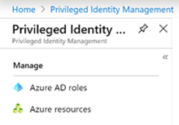

   - **Azure AD roles**. These roles are all in Azure Active Directory (such as Global Administrator, Exchange Administrator, and Security Administrator). You can read more about the roles and their functionality in Administrator role permissions in Azure Active Directory.
   - **Azure resource roles**. These roles are linked to an Azure resource, resource group, subscription, or management group. Privileged Identity Management provides just-in-time access to both built-in roles like Owner, User Access Administrator, and Contributor, as well as custom roles.

## **Azure AD roles**

Users can be assigned to different administrative roles in Azure AD. These role assignments control which tasks, such as adding or removing users or changing service settings, the users are able to perform on Azure AD, Microsoft 365 and other Microsoft Online Services and connected applications.

A global administrator can update which users are permanently assigned to roles in Azure AD, using PowerShell cmdlets such as Add-MsolRoleMember and Remove-MsolRoleMember, or through the Azure portal.

Azure AD Privileged Identity Management (PIM) manages policies for privileged access for users in Azure AD. PIM assigns users to one or more roles in Azure AD, and you can assign someone to be permanently in the role, or eligible for the role. When a user is permanently assigned to a role, or activates an eligible role assignment, then they can manage Azure Active Directory, Microsoft 365, and other applications with the permissions assigned to their roles.

There's no difference in the access given to someone with a permanent versus an eligible role assignment. The only difference is that some people don't need that access all the time. They are made eligible for the role, and can turn it on and off whenever they need to.

## **Roles managed in PIM**

Privileged Identity Management lets you assign users to common administrator roles, including:

   - **Global administrator** (also known as a Company administrator) has access to all administrative features. You can have more than one global admin in your organization. The person who signs up to purchase Microsoft 365 automatically becomes a global admin.
   - **Privileged role administrator** manages Azure AD PIM and updates role assignments for other users.
   - **Billing administrator** makes purchases, manages subscriptions, manages support tickets, and monitors service health.
   - **Password administrator** users with this role have limited ability to manage passwords. This role does not grant the ability to manage service requests or monitor service health. Whether a Password Administrator can reset a user's password depends on the user's role.
   - **Service administrator** manages service requests and monitors service health.
   - **User management administrator** resets passwords, monitors service health, and manages user accounts, user groups, and service requests. The user management admin can’t delete a global admin, create other admin roles, or reset passwords for billing, global, and service admins.
   - **Exchange administrator** has administrative access to Exchange Online through the Exchange admin center (EAC), and can perform almost any task in Exchange Online.
   - **SharePoint administrator** has administrative access to SharePoint Online through the SharePoint Online admin center, and can perform almost any task in SharePoint Online.
   - **Skype for Business administrator** has administrative access to Skype for Business through the Skype for Business admin center, and can perform almost any task in Skype for Business Online.

## **Roles not managed in PIM**

Roles within Exchange Online or SharePoint Online, except for those mentioned above, are not represented in Azure AD and so are not visible in PIM. Azure subscriptions and resource groups are also not represented in Azure AD.

## **Azure resources**

When you first set up Privileged Identity Management for Azure resources, you need to discover and select the resources to protect with Privileged Identity Management. There's no limit to the number of resources that you can manage with Privileged Identity Management. However, we recommend starting with your most critical (production) resources.

## **Implement privileged identity management onboarding**

To use PIM, you need one of the following paid or trial licenses: Azure AD Premium P2, Enterprise Mobility + Security (EMS) E5, or Microsoft 365 M5.

**PIM Access**

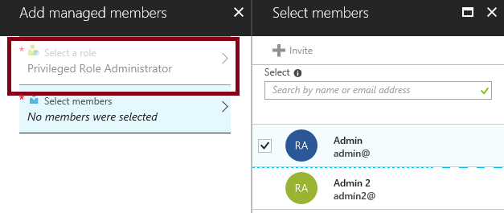

The first Global Administrator to use PIM in your instance of Azure AD is automatically assigned the Security Administrator and Privileged Role Administrator roles in the directory. This person must be an eligible Azure AD user. Only privileged role administrators can manage the Azure AD directory role assignments of users. In addition, you can choose to run the security wizard that walks you through the initial discovery and assignment experience.

Users or members of a group assigned to the Owner or User Access Administrator roles, and Global Administrators that enable subscription management in Azure AD, are Resource Administrators. These administrators can assign roles, configure role settings, and review access by using PIM for Azure resources.

No one else in your Azure Active Directory (Azure AD) organization gets write access by default, though, including other Global administrators. Other Global administrators, Security administrators, and Security readers have read-only access to Privileged Identity Management. To grant access to Privileged Identity Management, the first user can assign others to the Privileged Role Administrator role.

```
Important

Make sure there are always at least two users in a Privileged Role Administrator role, in case one user is locked out or their account is deleted.
```

## **Explore privileged identity management configuration settings**

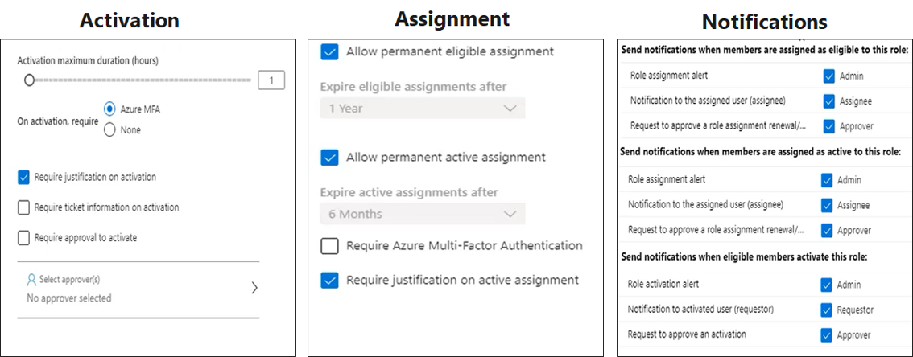

## **Activation settings**

   - **Activation duration**. Set the maximum time, in hours, that a role stays active before it expires. This value can be from one to 24 hours.
   - **Require multifactor authentication on activation**. You can require users who are eligible for a role to prove who they are using Azure Active Directory Multi-Factor Authentication (MFA) before they can activate. Multifactor authentication ensures that the user is who they say they are with reasonable certainty. Enforcing this option protects critical resources in situations when the user account might have been compromised.
   - **Require justification**. You can require that users enter a business justification when they activate.
   - **Require approval to activate**. If setting multiple approvers, approval completes as soon as one of them approves or denies. You can't require approval from at least two users.

## **Assignment settings**

   - **Allow permanent eligible assignment**. Global admins and Privileged role admins can assign permanent eligible assignment. They can also require that all eligible assignments have a specified start and end date.
   - **Allow permanent active assignment**. Global admins and Privileged role admins can assign active eligible assignment. They can also require that all active assignments have a specified start and end date.

```
Note

In some cases, you might want to assign a user to a role for a short duration (one day, for example). In this case, the assigned users don't need to request activation. In this scenario, Privileged Identity Management can't enforce multifactor authentication when the user uses their role assignment because they are already active in the role from the time that it is assigned.
```

## **Notification settings**

   - Notifications can be sent when members are assigned as eligible in a role, assigned as active in a role, and when the role is activated.
   - Notifications can be sent to Admins, Requestors, and Approvers.

## **Implement a privileged identity management workflow**

By configuring Azure AD PIM to manage our elevated access roles in Azure AD, we now have JIT access for more than 28 configurable privileged roles. We can also monitor access, audit account elevations, and receive additional alerts through a management dashboard in the Azure portal.

Elevated access includes job roles that need greater access, including support, resource administrators, resource owners, service administrators, and global administrators. We manage role-based access at the resource level. Because elevated access accounts could be misused if they’re compromised, we rationalize new requests for elevated access and perform regular re-attestation for elevated roles.

The following diagram of the elevated access workflow.

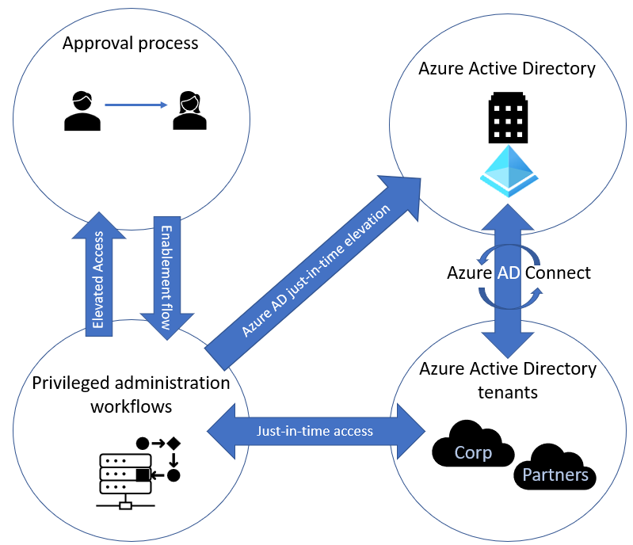

## **JIT administrator access**

Historically, we could assign an employee to an administrative role through the Azure portal or through Windows PowerShell and that employee would be a permanent administrator; their elevated access would remain active in the assigned role.

Azure AD PIM introduced the concept of permanent and eligible administrators in Azure AD and Azure. Permanent administrators have persistent elevated role connections; whereas eligible administrators have privileged access only when they need it. The eligible administrator role is inactive until the employee needs access, then they complete an activation process and become an active administrator for a set amount of time. We’ve stopped using permanent administrators for named individual accounts, although we do have some automated service accounts that still use the role.

## **Role activation in Azure Active Directory**

Azure AD PIM uses administrative roles, such as tenant admin and global admin, to manage temporary access to various roles. With Azure AD PIM, you can manage the administrators by adding or removing permanent or eligible administrators to each role. Azure AD PIM includes several built-in Azure AD roles as well as Azure that we manage.

To activate a role, an eligible admin will initialize Azure AD PIM in the Azure portal and request a time-limited role activation. The activation is requested using the Activate my role option in Azure AD PIM. Users requesting activation must satisfy conditional access policies to ensure that they are coming from authorized devices and locations, and their identities must be verified through multifactor authentication.

To help secure transactions while enabling mobility, we use Azure AD PIM to customize role activation variables in Azure, including the number of sign-in attempts, the length of time the role is activated after sign-in, and the type of credentials required (such as single sign-in or multifactor authentication).

At Microsoft, when an individual joins a team or changes teams, they might need administrative rights for their new business role. For example, someone might join a team in which their user account will require Exchange Online Administrator privileged access rights in the future. That user makes a request, then their manager validates that user’s request, as does a service owner. With those approvals, Core Services Engineering and Operations (CSEO, formerly Microsoft IT) administrators in the Privileged Role Administrator role are notified. A CSEO administrator uses Azure AD PIM via the Azure portal to make that user eligible for that role. The user can then use Azure AD PIM to activate that role.

## **Tracking the use of privileged roles using the dashboard**

A dashboard through the Azure portal gives a centralized view of:

   - Alerts that point out opportunities to improve security.
   - The number of users who are assigned to each privileged role.
   - The number of eligible and permanent admins.
   - Ongoing access reviews.

We can track how employees and admins are using their privileged roles by viewing the audit history or by setting up a regular access review. Both options are available through the PIM dashboard in the Azure portal.

The PIM audit log tracks changes in privileged role assignments and role activation history. We use the audit log to view all user assignments and activations within a specified period. The audit history helps us determine, in real time, which accounts haven’t signed in recently, or if employees have changed roles.

Access reviews can be performed by an assigned reviewer, or employees can review themselves. This is an effective way to monitor who still needs access, and who can be removed.

We’re looking at the data that’s collected, and the monitoring team is assessing the best way to configure monitoring alerts to notify us about out-of-band changes—for example, if too many administrator roles are being created for an Azure resource. The information also helps us determine whether our current elevation time settings are appropriate for the various privileged admin roles.

Like all organizations, we want to minimize the number of people who have access to our secure information or resources, because that reduces the chance of a malicious user getting access or an authorized user inadvertently impacting a sensitive resource. However, our people still need to carry out privileged operations in Azure AD, Azure, Microsoft 365, and SaaS apps. We can give users privileged access to Azure resources like Subscriptions, and Azure AD. Oversight is needed for what our users are doing with their admin privileges. We use Azure AD PIM to mitigate the risk of excessive, unnecessary, and misused access rights.

In Azure AD, we use Azure AD PIM to manage the users we assign to built-in Azure AD organizational roles, such as Global Administrator. In Azure, we use Azure AD PIM to manage our users and groups that we assign via Azure RBAC roles, including Owner and Contributor.

## **Explore Try-This exercises**

## **Task 1: Azure AD PIM for roles**

## **Configure PIM settings**

```
Note

This task requires a AZ500User1 account with no assigned roles.
```

In this task, we will review and configure the basic PIM settings.

   1. In the **Portal**, search for and select **Azure AD Privileged Identity Management**.
   2. Under **Manage** select **Azure AD Roles**.
   3. Under **Manage** select **Settings**.
   4. Select the **Billing Administrator** role.
   5. Click **Edit**.
   6. Notice the **Activation, Assignment**, and **Notification** tabs.
   7. By default, MFA is required on activation. For this demonstration, change the requirement to **None**.
   8. Check the box to **Require approval to activate**.
   9. Discuss the other possible settings including **Activation maximum duration** and **Require approval to activate**.
   10. Switch to the **Assignment** tab and require the settings. 
   11. Notice the ability to expire eligible and active assignments.
   12. Switch to the **Notifications** tab and discuss the settings.
   13. Notice you can send notifications when members are assigned and activated.
   14. Click **Update**.

## **Configure PIM for Roles**

In this task, we will add the Billing Administrator role to PIM.

   1. In the **Portal**, search for and select **Azure AD Privileged Identity Management**.
   2. Under **Manage** select **Azure AD Roles**.
   3. Under **Manage** select **Roles**.
   4. Review the list of roles.
   5. Select the **Billing Administrator** role.
   6. Review **Eligible roles** and **Active roles**.
   7. Click **Add member**.
   8. Click **Select member** and **Select** the **AZ500User1** user. You are now a Billing Administrator.
   9. Select **Set membership settings**. Notice the settings can be permanent or limited in time.
        - Assignment type: **Eligible**
        - Permanently eligible: **check the box**.


    10. **Save** your changes and **Add** the assignment.
    11. Verify the Billing Administrator is listed as an eligible role.

## **Activate a role**

In this task, we will activate the Billing Administrator role.

   1. In the **Portal**, search for and select **Azure Active Directory**.
   2. Under **Manage** click **Users**.
   3. Select **AZ500User1**.
   4. Under **Manage** click **Assigned roles**.
   5. Verify the user is not assigned to any roles.
   6. Sign in the **Portal** as **AZ500User1**.
   7. Search for and select **Azure AD Privileged Identity Management**.
   8. Under **Tasks** select **My roles**.
   9. Under **Activate** select **Azure AD Roles**.
   10. Select the **Active roles** and verify there are no roles listed.
   11. On the **Eligible roles** tab notice the **Billing Administrator** role.
   12. Under the **Action** column, select **Activate**.
   13. **Assignment details** are shown in the Portal. This includes start and end times, and the ability to add a reason.
   14. Add a reason and then click **Activate**.
   15. The **Activation status** should show all the activation stages have been completed.
   16. Use the link to **Sign out**.
   17. You must sign out and log back in to start using your newly activated role.

## **Test the role access**

In this task, test the Billing Administrator role.

   1. Sign in to the Portal as **AZ500User1**.
   2. Search for and select **Azure AD Privileged Identity Management**.
   3. Under **Activate** select **Azure AD Roles**.
   4. Select the **Active roles** tab and verify the **Billing Administrator** role has been activated.
   5. The role should show **Activated**.
   6. Notice the ability to **Deactivate** the role.

## **Task 2: Azure AD PIM for resources**

In this task, we will configure PIM for Azure resources, activate the Virtual Machine Contributor role, and test the role access.

## **Configure PIM for Azure resources**

In this task, we will add the subscription to PIM, then add the Virtual Machine Contributor role as an Active role.

   1. In the **Portal**, search for and select **Azure AD Privileged Identity Management**.
   2. Under **Manage** select **Azure Resources**.
   3. Click **Discover resources**.
   4. Notice the **Resource state** is **Unmanaged**.
   5. Select the subscription you want to manage.
   6. Click **Manage resource**.
   7. Click **Yes** to confirm that PIM will manage all child objects for the selected resource.
   8. Return to the **Azure resources** blade.
   9. Select your subscription.
  10. Under **Manage** click **Roles**.
  11. Search for and select the **Virtual machine contributor** role.
  12. Click **Add assignments**, then click **Select member(s)** and add the **AZ500User1** to the group.
  13. On the **Membership settings** page set the **Assignment type** is **Active**.
  14. **Add** the role and **Save** your changes.
  15. Sign out of the Portal.

## **Activate the role**

In this task, we will sign-in as a user and activate the role.

   1. Sign in to the Portal and AZ500User1.
   2. Search for and select Azure AD Privileged Identity Management.
   3. Under Tasks select My roles.
   4. Under Activate select Azure resources.
   5. On the Active roles tab notice you have no assigned roles.
   6. On the Eligible roles tab scroll to the right and Activate the role.
   7. Notice the Start time and Duration.
   8. Provide a reason for the activation. For example, 'Need to add a NIC'.
   9. Click Activate.
  10. The Activation status should show all the activation stages have been completed.
  11. Use the link to Sign out.
  12. You must sign out and log back in to start using your newly activated role.

## **Test the role access**

In this task, we will check to ensure the role has been assigned.

   1. Sign in to the Portal as AZ500User1.
   2. Search for and select Azure AD Privileged Identity Management.
   3. Under Activate select Azure resources.
   4. Select the Active roles tab and verify the Virtual Machine Contributor role has been activated.
   5. Sign out of the Portal.
   6. Sign in to the Portal using a Global Admin account.
   7. Search for and select Azure Active Directory.
   8. Under Manage click Users.
   9. Select AZ500User1.
  10. Under Manage click Assigned roles.
  11. Verify there are no roles listed.
  12. Under Manage select Azure role assignments.
  13. Verify the Virtual machine contributor role is listed.

## **Knowledge check**

Check your knowledge
1. To enable Azure AD PIM for your directory, what Azure AD Role do you need to enable PIM?

   - Office 365 Admin
   - Co-Administrator
   - Global Admin (**Ans**)

2. A company has implemented Azure AD PIM. There's a need to ensure a new hire's request elevation before they make any changes in Azure, what should you do?

   - Activate the new hire.
   - Assign the new hire the Eligible role membership type. (**Ans**)
   - Include the new hire in an access review.

3. Azure AD PIM is used to manage which of the following roles?

   - Azure privileged users
   - Azure resource groups
   - Azure AD roles (**Ans**)

4. An organization has enabled Azure AD PIM. The senior IT manager wants the role set up so no action is required, what should you do?

   - Give the manager JIT access to the role.
   - Make the manager Permanent Active in the role. (**Ans**)
   - Make the manager Assigned to a role.

# **Design an enterprise governance strategy**

## **Introduction**
The first part of your organization's secure Azure tenant is set up, but you need to monitor and maintain it. Enterprise Governance is the process of setting strategic tools, systems, and process into motion to keep your systems secure and running well.

## **Scenario**
A security engineer uses enterprise governance tools and policies to manage and maintain a secure Azure solution; some common tasks are:

   - Designing an Azure secure access hierarchy.
   - Using RBAC and Azure Policy to control and manage access.
   - Creating blueprints of secure deployments that can be reused.

## **Review the shared responsibility model**

Organizations face many challenges with securing their data centers, including recruiting and keeping security experts, using many security tools, and keeping pace with the volume and complexity of threats.

As computing environments move from customer-controlled data centers to the cloud, the security responsibility also shifts. Security of the operational environment is now a concern shared by both cloud providers and customers. By shifting these responsibilities to a cloud service like Azure, organizations can reduce focus on activities that aren't core business competencies. Depending on the specific technology choices, some security protections will be built into the service, while others will remain the customer’s responsibility. To ensure that the proper security controls are provided, a careful evaluation of the services and technology choices becomes necessary.

The first thing to understand about cloud security is that different scopes of responsibility exist depending on the kinds of services you use.

For example, if you use virtual machines (VMs) in Azure, which provide Infrastructure as a Service (IaaS), Microsoft will be responsible for helping secure the physical network, physical storage, and virtualization platform, which includes updating the virtualization hosts. But you’ll need to take care of helping secure your virtual network and public endpoints and updating the guest operating system (OS) of your VMs.

The following figure depicts the various responsibility zones.


For all cloud deployment types, you own your data and identities. You're responsible for helping secure your data and identities, your on-premises resources, and the cloud components you control (which vary by service type).

Regardless of the deployment type, you always retain responsibility for the following:

   - Data
   - Endpoints
   - Accounts
   - Access management

```
Important

It’s important to understand the division of responsibility between you and Microsoft in a Software as a Service (SaaS), Platform as a Service (PaaS), or Infrastructure as a Service (IaaS) deployment.
```

## **Explore the Azure cloud security advantages**

The cloud offers significant advantages for solving long standing information security challenges. In an on-premises environment, organizations likely have unmet responsibilities and limited resources available to invest in security, which creates an environment where attackers can exploit vulnerabilities at all layers.

The following diagram shows a traditional approach where many security responsibilities are unmet due to limited resources. In the cloud-enabled approach, you can shift day-to-day security responsibilities to your cloud provider and reallocate your resources.

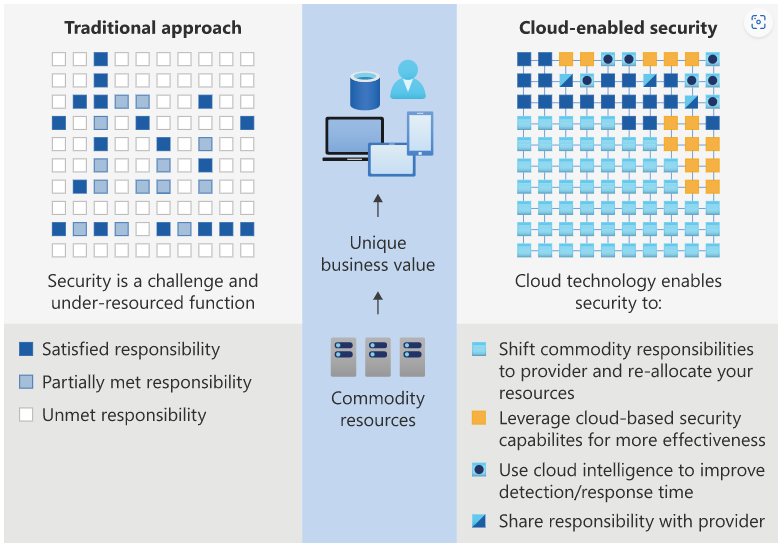

In the cloud-enabled approach, you are also able to leverage cloud-based security capabilities for more effectiveness and use cloud intelligence to improve your threat detection and response time. By shifting responsibilities to the cloud provider, organizations can get more security coverage, which enables them to reallocate security resources and budget to other business priorities.

```
 Important

What security advantages are you expecting from leveraging the cloud?
```

## **Review Azure hierarchy of systems**

**Azure Resource Manager** is the deployment and management service for Azure. It provides a consistent management layer that allows you to create, update, and delete resources in your Azure subscription. You can use its access control, auditing, and tagging features to help secure and organize your resources after deployment.

When you take actions through the portal, Azure PowerShell, the Azure CLI, REST APIs, or client software development kits (SDKs), the Resource Manager API handles your request. Because the same API handles all requests, you get consistent results and capabilities from all the different tools. Functionality initially released through APIs should be represented in the portal within 180 days of the initial release.


## **Understand Scope**

Azure provides four levels of scope: management groups, subscriptions, resource groups, and resources. The following image shows an example of these layers. Though not labeled as such, the blue cubes are resources.


You apply management settings at any of these levels of scope. The level you select determines how widely the setting is applied. Lower levels inherit settings from higher levels. For example, when you apply a policy to the subscription, the policy is applied to all resource groups and resources in your subscription. When you apply a policy on the resource group, that policy is applied to the resource group and all its resources. However, another resource group doesn't have that policy assignment.

You can deploy templates to management groups, subscriptions, or resource groups.

## **Resource Groups**

There are some important factors to consider when defining your resource group:

   - All the resources in your group should share the same lifecycle. You deploy, update, and delete them together. If one resource, such as a database server, needs to exist on a different deployment cycle it should be in another resource group.
   - Each resource can only exist in one resource group.
   - You can add or remove a resource to a resource group at any time.
   - You can move a resource from one resource group to another group.
   - A resource group can contain resources that are located in different regions.
   - A resource group can be used to scope access control for administrative actions.
   - A resource can interact with resources in other resource groups. This interaction is common when the two resources are related but don't share the same lifecycle (for example, web apps connecting to a database).

When creating a resource group, you need to provide a location for that resource group. You may be wondering, "Why does a resource group need a location? And, if the resources can have different locations than the resource group, why does the resource group location matter at all?" The resource group stores metadata about the resources. Therefore, when you specify a location for the resource group, you're specifying where that metadata is stored. For compliance reasons, you may need to ensure that your data is stored in a particular region.

If the resource group's region is temporarily unavailable, you can't update resources in the resource group because the metadata is unavailable. The resources in other regions will still function as expected, but you can't update them.

## **Management Groups**

Management groups are an Azure resource to create flexible and very maintainable hierarchies within the structure of your environment. Management groups exist above the subscription level thus allowing subscriptions to be grouped together. This grouping facilitates applying policies and RBAC permissions to those management groups. Policies and RBAC permissions are inherited to all resources in the management group. Management groups give you enterprise-grade management at a large scale no matter what type of subscriptions you might have. All subscriptions within a single management group must trust the same Azure Active Directory tenant.

Management group hierarchies can be up to six levels deep. This provides you with the flexibility to create a hierarchy that combines several of these strategies to meet your organizational needs. For example, the diagram below shows an organizational hierarchy that combines a business unit strategy with a geographic strategy.


## **The value of management groups**

**Group your subscriptions.**

   - Provide user access to multiple subscriptions
   - Allows for new organizational models and logically grouping of resources.
   - Allows for single assignment of controls that applies to all subscriptions.
   - Provides aggregated views above the subscription level.

**Mirror your organization's structure.**

   - Create a flexible hierarchy that can be updated quickly.
   - The hierarchy does not need to model the organization's billing hierarchy.
   - The structure can easily scale up or down depending on your needs.

**Apply policies or access controls to any service.**

   - Create one RBAC assignment on the management group, which will inherit that access to all the subscriptions.
   - Use Azure Resource Manager integrations that allow integrations with other Azure services: Azure Cost Management, Privileged Identity Management, and Microsoft Defender for Cloud.

```
Important

By using management groups, you can reduce your workload and reduce the risk of error by avoiding duplicate assignments. Instead of applying multiple assignments across numerous resources and subscriptions, you can apply the one assignment on the one management group that contains the target resources. This will save time in the application of assignments, creates one point for maintenance, and allows for better controls on who can control the assignment.
```

## **Configure Azure policies**

Azure Policy is a service you use to create, assign, and manage policies. These policies enforce different rules and effects over your resources so that those resources stay compliant with your corporate standards and service level agreements. Azure Policy meets this need by evaluating your resources for noncompliance with assigned policies. For example, you might have a policy that allows virtual machines of only a certain size in your environment. After this policy is implemented, new and existing resources are evaluated for compliance. With the right type of policy, existing resources can be brought into compliance.

**There are three main pillars in the functionalities of Azure policy.**

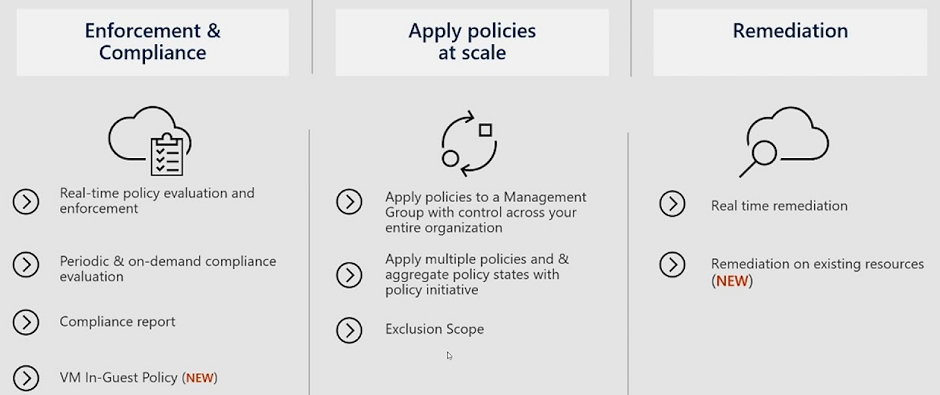

The first pillar is around real-time enforcement and compliance assessment. For example, a policy would block the creation of resources that are located outside of US regions. Each policy also provides compliance assessment on all your existing resources to bring a state of compliance for each resource. The data then powers the compliance view which aggregates results across all of the applied policies. Policies can be used to ensure that resource groups are getting tagged properly and automatically inheriting those tags from the resource group down to the resources.

The second pillar of policy is applying policies at scale by leveraging Management Groups. By assigning policy to a management group one can impact hundreds of subscriptions and all its reach resources through a single policy assignment. There also is the concept called policy initiative that allows you to group policies together so that you can view the aggregated compliance result. At the initiative level there's also a concept called exclusion where one can exclude either the child management group subscription resource group or resources from the policy assignment.

The third pillar of your policy is remediation by leveraging a remediation policy that will automatically remediate the non-compliant resource so that your environment always stays compliant. For existing resources, they will be flagged as non-compliant but they won't automatically be changed because there can be impact to the environment. For these cases you can create a remediation task to bring these resources to compliance. Azure policy is a free service to use.

## **Policy permissions and custom policies**

Azure Policy has several permissions, known as operations, in two resource providers:

   - Microsoft.Authorization
   - Microsoft.PolicyInsights

Many built-in roles grant permissions to Azure Policy resources. The Resource Policy Contributor role includes most Azure Policy operations. The Owner role has full rights. Both Contributor and Reader can use all Azure Policy read operations, but Contributor can also trigger remediation.

If none of the built-in roles have the required permissions, create a custom role. Azure has by default, security policies that work across subscriptions or on management groups. If these policies need to be augmented with your own organizational policies, new policies can be created.

Whatever the business driver for creating a custom policy, the steps are the same for defining the new custom policy. Before creating a custom policy, check the policy samples to determine if a policy that matches your needs already exists.

The approach to creating a custom policy follows these steps:

   - Identify your business requirements
   - Map each requirement to an Azure resource property
   - Map the property to an alias
   - Determine which effect to use
   - Compose the policy definition

## **Composing an Azure Policy**

The steps for composing and implementing a policy in Azure Policy begins with creating:

   - **Policy definition** - Every policy definition has conditions under which it's enforced. And, it has a defined effect that takes place if the conditions are met.
   - **Policy assignment** - A policy definition that has been assigned to take place within a specific scope. This scope could range from a management group to an individual resource. The term scope refers to all the resources, resource groups, subscriptions, or management groups that the policy definition is assigned to.
   - **Policy parameters** - They help simplify your policy management by reducing the number of policy definitions you must create. You can define parameters when creating a policy definition to make it more generic.


## **Create and assign an Initiative definition**

In order to easily track compliance for multiple resources, create and assign an Initiative definition. With an initiative definition, you can group several policy definitions to achieve one overarching goal. An initiative evaluates resources within scope of the assignment for compliance to the included policies.

To implement these policy definitions (both built-in and custom definitions), you'll need to assign them. You can assign any of these policies through the Azure portal, PowerShell, or Azure CLI.

## **Enable Azure role-based access control (RBAC)**

When it comes to identity and access, most organizations that are considering using the public cloud are concerned about two things:

   - Ensuring that when people leave the organization, they lose access to resources in the cloud.
   - Striking the right balance between autonomy and central governance—for example, giving project teams the ability to create and manage virtual machines in the cloud while centrally controlling the networks to which those virtual machines connect.

RBAC is an authorization system built on Azure Resource Manager that provides fine-grained access management of Azure resources. Azure AD and Role Based Access Control (RBAC) make it simple for you to carry out these goals. After you extend your on-premises Active Directory to the cloud by using Azure AD Connect, your employees can use and manage their Azure subscriptions by using their existing work identities. These Azure subscriptions automatically connect to Azure AD for SSO and access management. When you disable an on-premises Active Directory account, it automatically loses access to all Azure subscriptions connected with Azure AD.

Additionally, synchronizing passwords to the cloud to support these checks also add resiliency during some attacks. Customers affected by (Not)Petya attacks were able to continue business operations when password hashes were synced to Azure AD (vs. near zero communications and IT services for customers affected organizations that had not synchronized passwords).

RBAC enables fine-grained access management for Azure. Using RBAC, you can grant just the amount of access that users need to perform their jobs. For example, you can use RBAC to let one employee manage virtual machines in a subscription while another manages SQL databases within the same subscription.

**Each Azure subscription is associated with one Azure AD directory**. Users, groups, and applications in that directory can manage resources in the Azure subscription. Grant access by assigning the appropriate RBAC role to users, groups, and applications at a certain scope. The scope of a role assignment can be a subscription, a resource group, or a single resource. A role assigned at a parent scope also grants access to the child scopes contained within it. For example, a user with access to a resource group can manage all the resources it contains, like websites, virtual machines, and subnets. The RBAC role that you assign dictates what resources the user, group, or application can manage within that scope.

The following diagram depicts how the classic subscription administrator roles, RBAC roles, and Azure AD administrator roles are related at a high level. Roles assigned at a higher scope, like a subscription, are inherited by child scopes, like service instances.

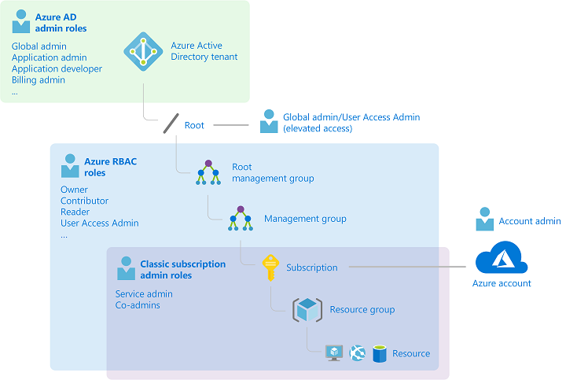

```
Important

Note that a subscription is associated with only one Azure AD tenant. Also note that a resource group can have multiple resources but is associated with only one subscription. Lastly, a resource can be bound to only one resource group.
```

## **Compare and contrast Azure RBAC vs Azure policies**

There are a few key differences between Azure Policy and Azure role-based access control (Azure RBAC). Azure Policy evaluates the state by examining properties on resources that are represented in Resource Manager and properties of some Resource Providers. Azure Policy ensures that the resource state is compliant with your business rules without concern for who made the change or who has permission to make a change. Azure Policy, through the DenyAction effect, can also block specific actions on resources. Some Azure Policy resources, such as policy definitions, initiative definitions, and assignments, are visible to all users. This design enables transparency to all users and services regarding what policy rules are set in their environment.

Azure RBAC focuses on managing user actions at different scopes. If control of an action is required based on user information, then Azure RBAC is the correct tool to use. Even if an individual has access to perform an action, if the result is a non-compliant resource, Azure Policy still blocks the create or update task.

The combination of Azure role-based access control (Azure RBAC) and Azure Policy provides full-scope control in Azure.

Azure Policy has several permissions, known as operations, in two Resource Providers:

   1. Microsoft.Authorization
   2. Microsoft.PolicyInsights

Many built-in roles grant permission to Azure Policy resources. The Resource Policy Contributor role includes most Azure Policy operations. The owner has full rights. Both Contributor and Reader have access to all read Azure Policy operations.

A contributor may trigger resource remediation but can't create or update definitions and assignments. User Access Administrator is necessary to grant the managed identity on deployIfNotExists or modify the assignment's necessary permissions.

```
Note

All Policy objects, including definitions, initiatives, and assignments, will be readable to all roles over its scope. For example, a Policy assignment scoped to an Azure subscription will be readable by all role holders at the subscription scope and below.
```

If none of the built-in roles have the permissions required, create a custom role.

Azure Policy operations can have a significant impact on your Azure environment. Only the minimum set of permissions necessary to perform a task should be assigned and these permissions should not be granted to users who do not need them.

```
 Note

The managed identity of a deployIfNotExists or modify policy assignment needs enough permissions to create or update targeted resources.
```

## **Example: Role-Based Access Control (RBAC) vs. Azure Policy**


```
Important

RBAC and Polices in Azure play a vital role in a governance strategy. While different, they both work together to ensure organizational business rules are followed by ensuring proper access and resource creation guidelines are met.
```

## **Configure built-in roles**

Azure role-based access control (RBAC) has several Azure built-in roles that you can assign to users, groups, service principals, and managed identities. Role assignments are the way you control access to Azure resources. If the built-in roles don't meet the specific needs of your organization, you can create your own Azure custom roles.

The four general built-in roles are:

| Built-in Role                                                                                                                                                       |
|---------------------------------------------------------------------------------------------------------------------------------------------------------------------|
| Description                                                                                                                                                         |
| Contributor                                                                                                                                                         |
| Grants full access to manage all resources, but does not allow you to assign roles in Azure RBAC, manage assignments in Azure Blueprints, or share image galleries. |
| Owner                                                                                                                                                               |
| Grants full access to manage all resources, including the ability to assign roles in Azure RBAC.                                                                    |
| Reader                                                                                                                                                              |
| View all resources, but does not allow you to make any changes.                                                                                                     |
| User Access Administrator                                                                                                                                           |
| Lets you manage user access to Azure resources.                                                                                                                     |

## **Custom roles for Azure resources**

If the built-in roles for Azure resources don't meet the specific needs of your organization, you can create your own custom roles. Just like built-in roles, you can assign custom roles to users, groups, and service principals at management group, subscription, and resource group scopes.

Custom roles can be shared between subscriptions that trust the same Azure AD directory. There is a limit of 5,000 custom roles per directory. (For Azure Germany and Azure China 21Vianet, the limit is 2,000 custom roles.) Custom roles can be created using the Azure portal, Azure PowerShell, Azure CLI, or the REST API.

## **Custom role limits**

The following list describes the limits for custom roles.

   - Each directory can have up to 5000 custom roles.
   - Azure Germany and Azure China 21Vianet can have up to 2000 custom roles for each directory.
   - You cannot set AssignableScopes to the root scope ("/").
   - You can only define one management group in AssignableScopes of a custom role. Adding a management group to AssignableScopes is currently in preview.
   - Custom roles with DataActions cannot be assigned at the management group scope.
   - Azure Resource Manager doesn't validate the management group's existence in the role definition's assignable scope.

## **Enable resource locks**

As an administrator, you may need to lock a subscription, resource group, or resource to prevent other users in your organization from accidentally deleting or modifying critical resources. You can set the lock level to CanNotDelete or ReadOnly. In the portal, the locks are called Delete and Read-only respectively.


   - **CanNotDelete** means authorized users can still read and modify a resource, but they can't delete the resource.
   - **ReadOnly** means authorized users can read a resource, but they can't delete or update the resource. Applying this lock is similar to restricting all authorized users to the permissions granted by the Reader role.

## **Who can create or delete locks**
```
To create or delete management locks, you must have access to **Microsoft.Authorization/***or Microsoft.Authorization/locks/* actions. Of the built-in roles, only Owner and User Access Administrator are granted those actions.
```

## **Deploy Azure blueprints**

Just as a blueprint allows an engineer or an architect to sketch a project's design parameters, Azure Blueprints enables cloud architects and central information technology groups to define a repeatable set of Azure resources that implements and adheres to an organization's standards, patterns, and requirements. Azure Blueprints allows development teams to rapidly build and stand up new environments with the trust they're building within organizational compliance with a set of built-in components, such as networking, to speed up development and delivery.

Blueprints are a declarative way to orchestrate the deployment of various resource templates and other artifacts, such as:

   - Role Assignments
   - Policy Assignments
   - Azure Resource Manager templates
   - Resource Groups

The Azure Blueprints service is supported by the globally distributed Azure Cosmos Data Base. Blueprint objects are replicated in multiple Azure regions. This replication provides low latency, high availability, and consistent access to your blueprint objects, regardless of which region Blueprints deploys your resources to.

## **How is it different from Azure Resource Manager templates?**

The service design helps with environment setup. This setup often includes resource groups, policies, role assignments, and Resource Manager template deployments assigned to a subscription in a single audited and tracked operation. A blueprint is a package to bring each artifact type together and allows you to compose and version that package into a continuous integration and pipeline.

Nearly everything that you want to include for deployment in Blueprints is also with a Resource Manager template. However, a Resource Manager template is a document that doesn't exist natively in Azure – it's stored either locally or in source control. The template gets used for deployments of one or more Azure resources, but once those resources deploy, there's no active connection or relationship to the template.

Blueprints save the relationship between the blueprint definition and the blueprint assignment. This connection supports improved tracking and auditing of deployments. Blueprints can upgrade several subscriptions governed by the exact blueprint.

There's no need to choose between a Resource Manager template and a blueprint. Each blueprint can consist of zero or more Resource Manager template artifacts. This support means that previous efforts to develop and maintain a library of Resource Manager templates are reusable in Blueprints.

## **How it's different from Azure Policy**

A blueprint is a package or container for composing focus-specific standards, patterns, and requirements for implementing Azure cloud services, security, and design reused to maintain consistency and compliance.

An Azure policy is a default allow and explicit deny system focused on resource properties during deployment and for existing resources. It supports cloud governance by validating that help within a subscription adhere to requirements and standards.

Including an Azure policy in a blueprint enables the creation of the correct pattern or design during the assignment of the blueprint. The policy inclusion ensures that only approved or expected changes can be made to the environment to protect ongoing compliance with the intent of the blueprint.

An Azure policy is available as one of many artifacts in a blueprint definition. Blueprints also support using parameters with policies and initiatives.

## **Blueprint definition**

A blueprint is composed of artifacts. Azure Blueprints currently supports the following resources as artifacts:

| Resource                                                                                                                                                                                                                                                                                                                         |
|----------------------------------------------------------------------------------------------------------------------------------------------------------------------------------------------------------------------------------------------------------------------------------------------------------------------------------|
| Hierarchy options                                                                                                                                                                                                                                                                                                                |
| Description                                                                                                                                                                                                                                                                                                                      |
| Resource Groups                                                                                                                                                                                                                                                                                                                  |
| Subscription                                                                                                                                                                                                                                                                                                                     |
| Create a new resource group for use by other artifacts within the blueprint. These placeholder resource groups enable you to organize resources exactly how you want them structured and provide a scope limiter for included policy and role assignment artifacts and ARM templates.                                            |
| ARM template                                                                                                                                                                                                                                                                                                                     |
| Subscription, Resource Group                                                                                                                                                                                                                                                                                                     |
| Templates, including nested and linked templates, are used to compose complex environments. Example environments: a SharePoint farm, Azure Automation State Configuration, or a Log Analytics workspace.                                                                                                                         |
| Policy Assignment                                                                                                                                                                                                                                                                                                                |
| Subscription, Resource Group                                                                                                                                                                                                                                                                                                     |
| Allows assignment of a policy or initiative to the subscription the blueprint is assigned to. The policy or initiative must be within the scope of the blueprint definition location. If the policy or initiative has parameters, these parameters are assigned at the creation of the blueprint or during blueprint assignment. |
| Role Assignment                                                                                                                                                                                                                                                                                                                  |
| Subscription, Resource Group                                                                                                                                                                                                                                                                                                     |
| Add an existing user or group to a built-in role to make sure the right people always have the right access to your resources. Role assignments can be defined for the entire subscription or nested to a specific resource group included in the blueprint.                                                                     |

## **Blueprint definition locations**

When creating a blueprint definition, you'll define where the blueprint is saved. Blueprints can be saved to a management group or subscription that you have Contributor access to. If the location is a management group, the blueprint is available to assign to any child subscription of that management group.

## **Blueprint parameters**

Blueprints can pass parameters to either a policy/initiative or an ARM template. When adding either artifact to a blueprint, the author decides to provide a defined value for each blueprint assignment or to allow each blueprint assignment to provide a value at assignment time. This flexibility provides the option to define a pre-determined value for all uses of the blueprint or to enable that decision to be made at the time of assignment.

```
Note

Assigning a blueprint definition to a management group means the assignment object exists in the management group. The deployment of artifacts still targets a subscription. To perform a management group assignment, the Create Or Update REST API must be used, and the request body must include a value for properties.scope to define the target subscription.
```

## **Design an Azure subscription management plan**

An Azure Active Directory (AD) tenant is created for you when you sign up for Azure. The tenant represents your account. You use the tenant to manage access to your subscriptions and resources.

When you create a new subscription, it's hosted in your account's Azure AD tenant. If you want to give others access to your subscription or its resources, you need to invite them to join your tenant. Doing so helps you control access to your subscriptions and resources. You can create additional subscriptions for your account in Azure. You might want an additional subscription to avoid reaching subscription limits, to create separate environments for billing and security, or to isolate data for compliance reasons.

If you want to create Azure subscriptions under your organization's Enterprise Agreement (EA), you need to have the Account Owner role for your organization.

If you need to transfer billing ownership of your Azure subscription if you're leaving your organization, or you want your subscription to be billed to another account. Transferring billing ownership to another account provides the administrators in the new account permission for billing tasks. They can change the payment method, view charges, and cancel the subscription.

## **Manage API access to Azure subscriptions and resources**

When you publish APIs through API Management, it's easy and common to gain access to those APIs by using subscription keys. Client applications that consume the published APIs need to include a valid subscription key in HTTP requests when they make calls to those APIs. To get a subscription key for accessing APIs, a subscription is required. A subscription is essentially a named container for a pair of subscription keys. Developers who need to consume the published APIs can get subscriptions, and they don't need approval from API publishers. API publishers can also directly create subscriptions for API consumers.

API Management supports additional mechanisms for gaining access to APIs, including:

   - OAuth 2.0
   - Client certificates
   - IP allowlists

Azure policies encapsulate common API management functions, like those for access control, protection, transformation, and caching. You can chain these policies together into a pipeline that mutates a request’s context or changes the API behavior. You can apply these policies to a variety of scopes, trigger them on an error, and set them in the inbound and outbound directions.

## **Who can transfer a subscription?**

A billing administrator or the account administrator is a person who has permission to manage billing for an account. They're authorized to access billing on the Azure portal and do various billing tasks like create subscriptions, view and pay invoices, or update payment methods. If you're an Enterprise Agreement (EA) customer, your enterprise administrators can transfer billing ownership of your subscriptions between accounts.

To identify accounts for which you're a billing administrator, use the following steps:

   - Visit the Cost Management + Billing page in Azure portal.
   - Select All billing scopes from the left-hand pane.
   - The subscriptions page lists all subscriptions where you're a billing administrator.

## **Explore Try-This exercises**

Use your own Azure subscription to perform these Try-This exercises - Enterprise Governance.

## **Task 1 - Navigating Azure**

In this task, you'll learn how to access and use the Azure portal.

**Locate the Azure portal**

In this task, you'll access the lab environment and the Azure portal.


   1. Ask your instructor how to access the lab environment.
   2. After accessing the lab environment, navigate to the Azure portal.
   3. Bookmark this page. You'll use the Portal throughout the course labs and demonstrations.
   4. In the top right corner of the Portal, select your user account.
   5. Notice you can View account and Switch directory.
   6. Switch directory lets you view My permissions and View my bill.
   7. Select the Settings icon (top right menu bar - cog icon).
   8. Review the Portal settings including the General and Language & region settings.
   9. Use the Search resources, services, and docs textbox to search for Virtual machines.
  10. You can search for not only general Azure resources but specifically but named resources.
  11. Select Use the Portal menu (left corner three bars icon).
  12. Notice you can Create a resource, view All services, and view All resources.
  13. Take some time to browse around the interface, search and explore different areas.
  14. Launch the Cloud Shell (first icon top menu bar).
  15. Notice the drop-down for PowerShell or Bash.

## **Task 2 - Azure RBAC Role Assignments**

In this task, we'll learn about role assignments.

**Locate Access Control blade**

   1. Access the Azure portal, and select a resource group. Make a note of what resource group you use.
   2. Select the Access Control (IAM) blade.
   3. This blade is available for many different resources so you can control access.

**Review role permissions**

   1. Click the Roles tab (top).
   2. Select a desired role from the list by clicking the associated box next to the Role Name.
   3. Click the View link under the Details column on the far right of the page.
   4. The Permissions view is displayed including three columns from left to right that is (i.e., Other, Read, Write, and Delete) Permissions, and Description.
   5. Return to the Access Control (IAM) blade.

## **Task 3 - Manage resource locks**

Note: This task requires a resource group.

In this task, we'll create resource locks.

   1. In the Portal navigate to a resource group.
   2. In the Settings section, click Locks, and then click + Add.
   3. Discuss the different types of locks and applying the locks at different levels.
   4. Create a new lock with a Lock type of Delete.
   5. From the Overview blade, click Delete resource group. Type the name of the resource group and click OK.
   6. You should receive an error message stating the resource group is locked and can't be deleted.
   7. Add a Storage Account to the resource group.
   8. After the storage account is created, try to delete the storage account.
   9. You receive an error message stating the resource or its parent has a delete lock.
  10. Review how the storage account inherits the lock from the parent and can't be deleted.
  11. Return to the resource group blade and, in the Settings section, click Locks.
  12. Scroll all the way to the right, then click the Delete link to the right of the lock.
  13. Return to the storage account and confirm you can now delete the resource.

## **Knowledge check**

Choose the best response for each of the questions below. Then select Check your answers.

## **Check your knowledge**

1. The company hires a new administrator and needs to create a new Azure AD user account for them. The new hire must be able to: - Read/write resource deployments they're responsible for. - Read Azure AD access permissions They shouldn't be able to view Azure subscription information. What should be configured to make this work?

   1. Assign the user the Contributor role at the resource group level. (**Ans**)
   2. Assign the user the Owner role at the resource level.
   3. Assign the user the Global Administrator role.

2. Which of the following would be good example of when to use a resource lock?

   1. An ExpressRoute circuit with connectivity back to your on-premises network. (**Ans**)
   2. A virtual machine used to test occasional application builds.
   3. A storage account used to store images processed in a development environment.

3. A company has three virtual machines (VM1, VM2, and VM3) in a resource group. The Helpdesk hires a new employee. The new employee must be able to modify the settings on VM3, but not on VM1 and VM2. Your solution must minimize administrative overhead. What should be set up?

   1. Assign the user to the Contributor role on the resource group.
   2. Assign the user to the Contributor role on VM3. (**Ans**)
   3. Move VM3 to a new resource group and assign the user to the Contributor role on VM3.

4. You need to target policies and review spend budgets across several subscriptions you manage. What should be created for the subscriptions?

   1. A billing group
   2. A management group (**Ans**)
   3. A nested resource group

5. A manager asks for an explanation of how Azure uses resource groups. Which of the following capabilities is a feature of how Azure uses resource groups?

   1. Resources can be in multiple resource groups.
   2. Resources can be moved from one resource group to another resource group. (**Ans**)
   3. Resource groups can be nested.