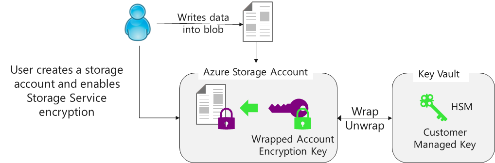
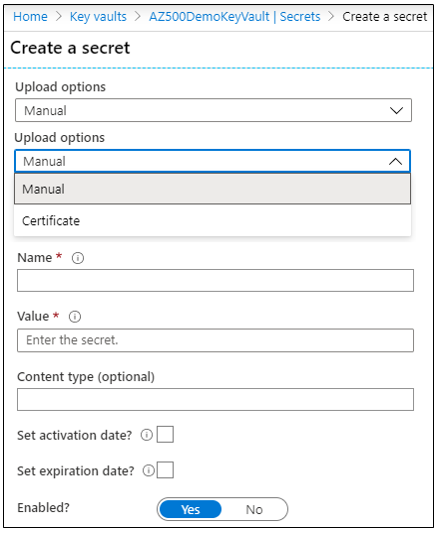
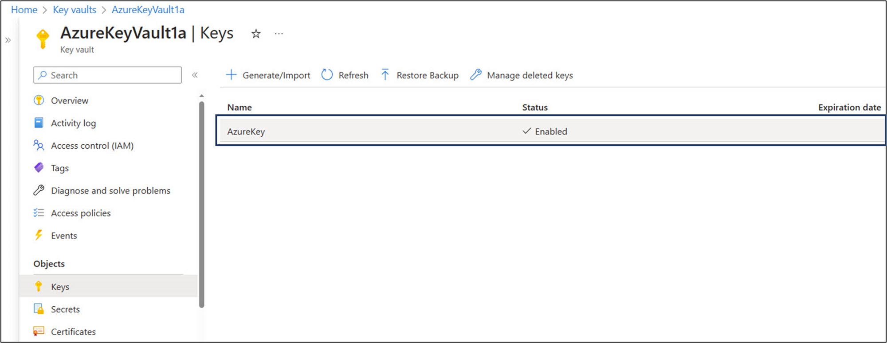
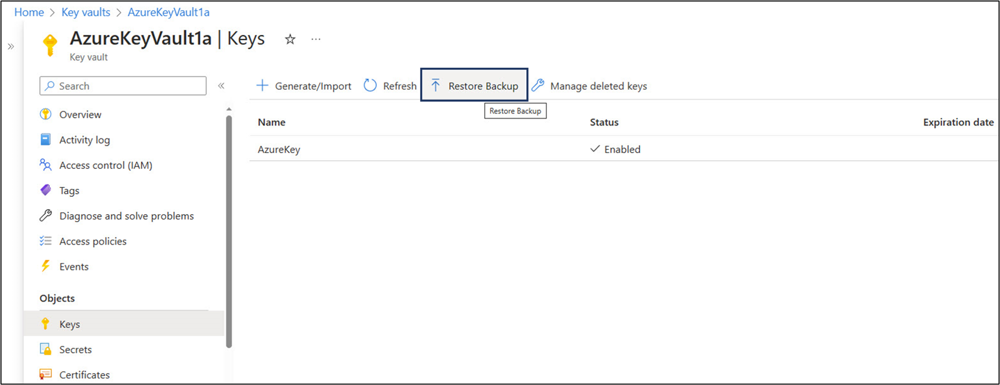

# **AZ-500: Microsoft Certified: Azure Security Engineer Associate**

## **Secure your data and applications**
Application running within Azure access your confidential data need to be locked down. Learn to secure your applications, storage, databases, and key vaults.

This learning path helps prepare you for [Exam AZ-500: Microsoft Azure Security Technologies](https://learn.microsoft.com/en-gb/certifications/exams/az-500/).

1. **Deploy and secure Azure Key Vault**
      - Introduction
      - Explore Azure Key Vault
      - Configure Key Vault access
      - Review a secure Key Vault example
      - Deploy and manage Key Vault certificates
      - Create Key Vault keys
      - Manage customer managed keys
      - Enable Key Vault secrets
      - Configure key rotation
      - Manage Key Vault safety and recovery features
      - Perform Try-This exercises
      - Explore the Azure Hardware Security Module
      - Knowledge check
      - Summary
2. **Configure application security features**
      - Introduction
      - Review the Microsoft identity platform
      - Explore Azure AD application scenarios
      - Register an application with App Registration
      - Configure Microsoft Graph permissions
      - Enable managed identities
      - Azure App Services
      - App Service Environment
      - Azure App Service plan
      - App Service Environment networking
      - Availability Zone Support for App Service Environments
      - App Service Environment Certificates
      - Perform Try-This exercises
      - Knowledge check
      - Summary
3. **Implement storage security**
      - Introduction
      - Define data sovereignty
      - Configure Azure storage access
      - Deploy shared access signatures
      - Manage Azure AD storage authentication
      - Implement storage service encryption
      - Configure blob data retention policies
      - Configure Azure files authentication
      - Enable the secure transfer required​ property
      - Perform Try-This exercises
      - Knowledge check
      - Summary
4. **Configure and manage SQL database security**
      - Introduction
      - Enable SQL database authentication
      - Configure SQL database firewalls
      - Enable and monitor database auditing
      - Implement data discovery and classification
      - Microsoft Defender for SQL
      - Vulnerability assessment for SQL Server
      - SQL Advanced Threat Protection
      - Explore detection of a suspicious event
      - SQL vulnerability assessment express and classic configurations
      - Configure dynamic data masking
      - Implement transparent data encryption
      - Deploy always encrypted​ features
      - Deploy an always encrypted implementation
      - Perform Try-This exercises
      - Knowledge check
      - Summary


# **Explore Azure Key Vault**

Protecting your keys is essential to protecting your identity and data in the cloud.

Azure Key Vault helps safeguard cryptographic keys and secrets that cloud applications and services use. Key Vault streamlines the key management process and enables you to maintain control of keys that access and encrypt your data. Developers can create keys for development and testing in minutes, and then migrate them to production keys. Security administrators can grant (and revoke) permission to keys, as needed.

You can use Key Vault to create multiple secure containers, called vaults. Vaults help reduce the chances of accidental loss of security information by centralizing application secrets storage. Key vaults also control and log the access to anything stored in them.

Azure Key Vault can manage requesting and renewing TLS certificates. It provides features for a robust solution for certificate lifecycle management.

Azure Key Vault helps address the following issues:

   - Secrets management. You can use Azure Key Vault to securely store and tightly control access to tokens, passwords, certificates, API keys, and other secrets.
   - Key management. You use Azure Key Vault as a key management solution, making it easier to create and control the encryption keys used to encrypt your data.
   - Certificate management. Azure Key Vault is also a service that lets you easily provision, manage, and deploy public and private SSL/TLS certificates for use with Azure and your internal connected resources.
   - Store secrets backed by hardware security modules (HSMs). The secrets and keys can be protected either by software, or FIPS 140-2 Level 2 validates HSMs.

Azure Key Vault is designed to support application keys and secrets. Key Vault is not intended as storage for user passwords.

The following table lists security best practices for using Key Vault.

| Best practice                                                              	| Solution                                                                                                                                                                                                                                                                                                                                                                                                                                                                                                                                                                                                                                                                                                         	|
|----------------------------------------------------------------------------	|------------------------------------------------------------------------------------------------------------------------------------------------------------------------------------------------------------------------------------------------------------------------------------------------------------------------------------------------------------------------------------------------------------------------------------------------------------------------------------------------------------------------------------------------------------------------------------------------------------------------------------------------------------------------------------------------------------------	|
| Grant access to users, groups, and applications at a specific scope.       	| Use RBAC’s predefined roles. For example, to grant access to a user to manage key vaults, you would assign the predefined role Key Vault Contributor to this user at a specific scope. The scope in this case would be a subscription, a resource group, or just a specific key vault. If the predefined roles don’t fit your needs, you can define your own roles.                                                                                                                                                                                                                                                                                                                                              	|
| Control what users have access to.                                         	| Access to a key vault is controlled through two separate interfaces: management plane, and data plane. The management plane and data plane access controls work independently. Use RBAC to control what users have access to. For example, if you want to grant an application access to use keys in a key vault, you only need to grant data plane access permissions by using key vault access policies, and no management plane access is needed for this application. Conversely, if you want a user to be able to read vault properties and tags but not have any access to keys, secrets, or certificates, you can grant this user read access by using RBAC, and no access to the data plane is required. 	|
| Store certificates in your key vault.                                      	| Azure Resource Manager can securely deploy certificates stored in Azure Key Vault to Azure VMs when the VMs are deployed. By setting appropriate access policies for the key vault, you also control who gets access to your certificate. Another benefit is that you manage all your certificates in one place in Azure Key Vault.                                                                                                                                                                                                                                                                                                                                                                              	|
| Ensure that you can recover a deletion of key vaults or key vault objects. 	| Deletion of key vaults or key vault objects can be either inadvertent or malicious. Enable the soft delete and purge protection features of Key Vault, particularly for keys that are used to encrypt data at rest. Deletion of these keys is equivalent to data loss, so you can recover deleted vaults and vault objects if needed. Practice Key Vault recovery operations on a regular basis.                                                                                                                                                                                                                                                                                                                 	|

**Azure Key Vault is offered in two service tiers—standard and premium**

The main difference between Standard and Premium is that Premium supports HSM-protected keys.

```
Important

If a user has contributor permissions (RBAC) to a key vault management plane, they can grant themselves access to the data plane by setting a key vault access policy. We recommend that you tightly control who has contributor access to your key vaults, to ensure that only authorized persons can access and manage your key vaults, keys, secrets, and certificates.
```

**Configure Key Vault access**

Access to a key vault is controlled through two interfaces: the management plane, and the data plane. The management plane is where you manage Key Vault itself. Operations in this plane include creating and deleting key vaults, retrieving Key Vault properties, and updating access policies. The data plane is where you work with the data stored in a key vault. You can add, delete, and modify keys, secrets, and certificates from here.


To access a key vault in either plane, all callers (users or applications) must have proper authentication and authorization. Authentication establishes the identity of the caller. Authorization determines which operations the caller can execute.

Both planes use Azure AD for authentication. For authorization, the management plane uses RBAC, and the data plane can use either newly added RBAC or a Key Vault access policy.

**Active Directory authentication**

When you create a key vault in an Azure subscription, its automatically associated with the Azure AD tenant of the subscription. All callers in both planes must register in this tenant and authenticate to access the key vault. In both cases, applications can access Key Vault in two ways:

   - User plus application access. The application accesses Key Vault on behalf of a signed-in user. Examples of this type of access include Azure PowerShell and the Azure portal. User access is granted in two ways. They can either access Key Vault from any application, or they must use a specific application (referred to as compound identity).
   - Application-only access. The application runs as a daemon service or background job. The application identity is granted access to the key vault.

For both types of access, the application authenticates with Azure AD. The application uses any supported authentication method based on the application type. The application acquires a token for a resource in the plane to grant access. The resource is an endpoint in the management or data plane, based on the Azure environment. The application uses the token and sends a REST API request to Key Vault. To learn more, review the whole authentication flow.

**Benefits**

The model of a single mechanism for authentication to both planes has several benefits:

   - Organizations can centrally control access to all key vaults in their organization.
   - If a user leaves, they instantly lose access to all key vaults in the organization.
   - Organizations can customize authentication by using the options in Azure AD, such as to enable multifactor authentication for added security.

**Review a secure Key Vault example**

In this example, we're developing an application that uses a certificate for SSL, Azure Storage to store data, and an RSA 2,048-bit key for sign operations. Our application runs in an Azure virtual machine (VM) (or a virtual machine scale set). We can use a key vault to store the application secrets. We can store the bootstrap certificate that's used by the application to authenticate with Azure AD.

We need access to the following stored keys and secrets:

   - SSL certificate - Used for SSL.
   - Storage key - Used to access the Storage account.
   - RSA 2,048-bit key - Used for sign operations.
   - Bootstrap certificate - Used to authenticate with Azure AD. After access is granted, we can fetch the storage key and use the RSA key for signing.

We need to define the following roles to specify who can manage, deploy, and audit our application:

   - Security team - IT staff from the office of the CSO (Chief Security Officer) or similar contributors. The security team is responsible for the proper safekeeping of secrets. The secrets can include SSL certificates, RSA keys for signing, connection strings, and storage account keys.
   - Developers and operators - The staff who develop the application and deploy it in Azure. The members of this team aren't part of the security staff. They shouldn't have access to sensitive data like SSL certificates and RSA keys. Only the application that they deploy should have access to sensitive data.
   - Auditors - This role is for contributors who aren't members of the development or general IT staff. They review the use and maintenance of certificates, keys, and secrets to ensure compliance with security standards.

There is another role that is outside the scope of our application: the subscription (or resource group) administrator. The subscription admin sets up initial access permissions for the security team. They grant access to the security team by using a resource group that has the resources required by the application.

**Security team**

   - Create key vaults.
   - Turn on Key Vault logging.
   - Add keys and secrets.
   - Create backups of keys for disaster recovery.
   - Set Key Vault access policies to grant permissions to users and applications for specific operations.
   - Roll the keys and secrets periodically.

**Developers and operators**

   - Get references from the security team for the bootstrap and SSL certificates (thumbprints), storage key (secret URI), and RSA key (key URI) for signing.
   - Develop and deploy the application to access keys and secrets programmatically.

**Auditors**

   - Review the Key Vault logs to confirm proper use of keys and secrets, and compliance with data security standards.

The following table summarizes the access permissions for our roles and application.

| Role                     	| Management plane permissions                                                                             	| Data plane permissions                                                                                                                                                          	|
|--------------------------	|----------------------------------------------------------------------------------------------------------	|---------------------------------------------------------------------------------------------------------------------------------------------------------------------------------	|
| Security team            	| Key Vault Contributor                                                                                    	| Keys: backup, create, delete, get, import, list, restore. Secrets: all operations                                                                                               	|
| Developers and operators 	| Key Vault deploy permission Note: This permission allows deployed VMs to fetch secrets from a key vault. 	| None                                                                                                                                                                            	|
| Auditors                 	| None                                                                                                     	| Keys: list Secrets: list. Note: This permission enables auditors to inspect attributes (tags, activation dates, expiration dates) for keys and secrets not emitted in the logs. 	|
| Application              	| None                                                                                                     	| Keys: sign Secrets: get                                                                                                                                                         	|

The three team roles need access to other resources along with Key Vault permissions. To deploy VMs (or the Web Apps feature of Azure App Service), developers and operators need Contributor access to those resource types. Auditors need read access to the Storage account where the Key Vault logs are stored.

**Deploy and manage Key Vault certificates**

Key Vault certificates support provides for management of your x509 certificates and enables:

   - A certificate owner to create a certificate through a Key Vault creation process or through the import of an existing certificate. Includes both self-signed and CA-generated certificates.
   - A Key Vault certificate owner to implement secure storage and management of X509 certificates without interaction with private key material.
   - A certificate owner to create a policy that directs Key Vault to manage the life-cycle of a certificate.
   - Certificate owners to provide contact information for notification about lifecycle events of expiration and renewal of certificate.
   - Automatic renewal with selected issuers - Key Vault partner X509 certificate providers and CAs.

When a Key Vault certificate is created, an addressable key and secret are also created with the same name. The Key Vault key allows key operations and the Key Vault secret allows retrieval of the certificate value as a secret. A Key Vault certificate also contains public x509 certificate metadata.

The identifier and version of certificates is similar to that of keys and secrets. A specific version of an addressable key and secret created with the Key Vault certificate version is available in the Key Vault certificate response.


When a Key Vault certificate is created, it can be retrieved from the addressable secret with the private key in either PFX or PEM format. However, the policy used to create the certificate must indicate that the key is exportable. If the policy indicates non-exportable, then the private key isn't a part of the value when retrieved as a secret.

The addressable key becomes more relevant with non-exportable Key Vault certificates. The addressable Key Vault key’s operations are mapped from the keyusage field of the Key Vault certificate policy used to create the Key Vault certificate. If a Key Vault certificate expires, it’s addressable key and secret become inoperable.

Two types of key are supported – RSA or RSA HSM with certificates. Exportable is only allowed with RSA, and is not supported by RSA HSM.

**Certificate policy**

A certificate policy contains information on how to create and manage the Key Vault certificate lifecycle. When a certificate with private key is imported into the Key Vault, a default policy is created by reading the x509 certificate.

When a Key Vault certificate is created from scratch, a policy needs to be supplied. This policy specifies how to create the Key Vault certificate version, or the next Key Vault certificate version. After a policy has been established, it’s not required with successive create operations for future versions. There's only one instance of a policy for all the versions of a Key Vault certificate.

At a high level, a certificate policy contains the following information:

   - X509 certificate properties. Contains subject name, subject alternate names, and other properties used to create an x509 certificate request.
   - Key Properties. Contains key type, key length, exportable, and reuse key fields. These fields instruct key vault on how to generate a key.
   - Secret properties. Contains secret properties such as content type of addressable secret to generate the secret value, for retrieving certificate as a secret.
   - Lifetime Actions. Contains lifetime actions for the Key Vault certificate. Each lifetime action contains:
      - Trigger, which specifies via days before expiry or lifetime span percentage.
      - Action, which specifies the action type: emailContacts, or autoRenew.
   - Issuer: Contains the parameters about the certificate issuer to use to issue x509 certificates.
   - Policy attributes: Contains attributes associated with the policy.

**Certificate Issuer**
Before you can create a certificate issuer in a Key Vault, the following two prerequisite steps must be completed successfully:

   1. Onboard to CA providers:
      - An organization administrator must onboard their company with at least one CA provider.
   2. Admin creates requester credentials for Key Vault to enroll (and renew) SSL certificates:
      - Provides the configuration to be used to create an issuer object of the provider in the key vault.

**Certificate contacts**
Certificate contacts contain contact information to send notifications triggered by certificate lifetime events. The contacts information is shared by all the certificates in the key vault. A notification is sent to all the specified contacts for an event for any certificate in the key vault.

If a certificate's policy is set to auto renewal, then a notification is sent for the following events:

   - Before certificate renewal
   - After certificate renewal, and stating if the certificate was successfully renewed, or if there was an error, requiring manual renewal of the certificate
   - When it’s time to renew a certificate for a certificate policy that is set to manually renew (email only)

**Certificate access control**
The Key Vault that contains certificates manages access control for those same certificates. The access control policy for certificates is distinct from the access control policies for keys and secrets in the same Key Vault. Users might create one or more vaults to hold certificates, to maintain scenario appropriate segmentation and management of certificates.

The following permissions closely mirror the operations allowed on a secret object, and can be used on a per-principal basis in the secrets access control entry on a key vault:

   - Permissions for certificate management operations:
      - get: Get the current certificate version, or any version of a certificate.
      - list: List the current certificates, or versions of a certificate.
      - update: Update a certificate.
      - create: Create a Key Vault certificate.
      - import: Import certificate material into a Key Vault certificate.
      - delete: Delete a certificate, its policy, and all of its versions.
      - recover: Recover a deleted certificate.
      - backup: Back up a certificate in a key vault.
      - restore: Restore a backed-up certificate to a key vault.
      - managecontacts: Manage Key Vault certificate contacts.
      - manageissuers: Manage Key Vault certificate authorities/issuers.
      - getissuers: Get a certificate's authorities/issuers.
      - listissuers: List a certificate's authorities/issuers.
      - setissuers: Create or update a Key Vault certificate's authorities/issuers.
      - deleteissuers: Delete a Key Vault certificate's authorities/issuers.
   - Permissions for privileged operations:
      - purge: Purge (permanently delete) a deleted certificate.

**Create Key Vault keys**

Cryptographic keys in Key Vault are represented as JSON Web Key (JWK) objects. There are two types of keys, depending on how they were created.

   - Soft keys: A key processed in software by Key Vault, but is encrypted at rest using a system key that is in a Hardware Security Module (HSM). Clients may import an existing RSA or EC (Elliptic Curve) key, or request that Key Vault generates one.
   - Hard keys: A key processed in an HSM (Hardware Security Module). These keys are protected in one of the Key Vault HSM Security Worlds (there's one Security World per geography to maintain isolation). Clients may import an RSA or EC key, in soft form or by exporting from a compatible HSM device. Clients may also request Key Vault to generate a key.

**Key operations**
Key Vault supports many operations on key objects. Here are a few:

   - Create: Allows a client to create a key in Key Vault. The value of the key is generated by Key Vault and stored, and isn't released to the client. Asymmetric keys may be created in Key Vault.
   - Import: Allows a client to import an existing key to Key Vault. Asymmetric keys may be imported to Key Vault using many different packaging methods within a JWK construct.
   - Update: Allows a client with sufficient permissions to modify the metadata (key attributes) associated with a key previously stored within Key Vault.
   - Delete: Allows a client with sufficient permissions to delete a key from Key Vault

**Cryptographic operations**
Once a key has been created in Key Vault, the following cryptographic operations may be performed using the key. For best application performance, verify that operations are performed locally.

   - Sign and Verify: Strictly, this operation is "sign hash" or "verify hash", as Key Vault doesn't support hashing of content as part of signature creation. Applications should hash the data to be signed locally, then request that Key Vault signs the hash. Verification of signed hashes is supported as a convenience operation for applications that may not have access to [public] key material.
   - Key Encryption / Wrapping: A key stored in Key Vault may be used to protect another key, typically a symmetric content encryption key (CEK). When the key in Key Vault is asymmetric, key encryption is used. When the key in Key Vault is symmetric, key wrapping is used.
   - Encrypt and Decrypt: A key stored in Key Vault may be used to encrypt or decrypt a single block of data. The size of the block is determined using the key type and selected encryption algorithm. The Encrypt operation is provided for convenience, for applications that may not have access to [public] key material.


**Application services plan**
More organizations are adopting secrets management policies, where secrets are stored centrally with expectations around expiration and access control. Azure Key Vault provides these management capabilities to your applications in Azure, but some applications can’t easily take on code changes to start integrating with it. Key Vault references are a way to introduce secrets management into your app without code changes.

Apps hosted in App Service and Azure Functions can now define a reference to a secret managed in Key Vault as part of their application settings. The app’s system-assigned identity is used to securely fetch the secret and make it available to the app as an environment variable. Teams can replace existing secrets stored in app settings with references to the same secret in Key Vault, and the app continues to operate as normal.

**Configure a hardware security module key-generation solution**
For added assurance, when you use Azure Key Vault, you can import or generate keys in hardware security modules (HSMs) that never leave the HSM boundary. This scenario is often referred to as Bring Your Own Key (BYOK). The HSMs are FIPS 140-2 Level 2 validated. Azure Key Vault uses Thales nShield family of HSMs to protect your keys. (This functionality isn't available for Azure China.)

Generating and transferring an HSM-protected key over the Internet:

   - You generate the key from an offline workstation, which reduces the attack surface.
   - The key is encrypted with a Key Exchange Key (KEK), which stays encrypted until transferred to the Azure Key Vault HSMs. Only the encrypted version of your key leaves the original workstation.
   - The toolset sets properties on your tenant key that binds your key to the Azure Key Vault security world. After the Azure Key Vault HSMs receive and decrypt your key, only these HSMs can use it. Your key can't be exported. This binding is enforced using the Thales HSMs.
   - The KEK that encrypts your key is generated inside the Azure Key Vault HSMs, and isn't exportable. The HSMs enforce that there can be no clear version of the KEK outside the HSMs. In addition, the toolset includes attestation from Thales that the KEK isn't exportable and was generated inside a genuine HSM manufactured by Thales.
   - The toolset includes attestation from Thales that the Azure Key Vault security world was also generated on a genuine HSM manufactured by Thales.
   - Microsoft uses separate KEKs and separate security worlds in each geographical region. This separation ensures that your key can be used only in data centers in the region in which you encrypted it. For example, a key from a European customer can't be used in data centers in North American or Asia.

**Manage customer managed keys**
Once you have created your Key Vault and have populated it with keys and secrets. The next step is to set up a rotation strategy for the values you store as Key Vault secrets. Secrets can be rotated in several ways:

   - As part of a manual process
   - Programmatically by using REST API calls
   - Through an Azure Automation script

**Example of storage service encryption with customer-managed Keys.**

This service uses Azure Key Vault that provides highly available and scalable secure storage for RSA cryptographic keys backed by FIPS 140-2 Level 2 validated HSMs (Hardware Security Modules). Key Vault streamlines the key management process and enables customers to maintain control of keys that are used to encrypt data, manage, and audit their key usage, in order to protect sensitive data as part of their regulatory or compliance needs, HIPAA and BAA compliant.



Customers can generate/import their RSA key to Azure Key Vault and enable Storage Service Encryption. Azure Storage handles the encryption and decryption in a fully transparent fashion using envelope encryption in which data is encrypted using an AES-based key, which in turn is protected using the Customer-Managed Key stored in Azure Key Vault.

Customers can rotate their key in Azure Key Vault as per their compliance policies. When they rotate their key, Azure Storage detects the new key version and re-encrypts the Account Encryption Key for that storage account. Key rotation doesn't result in re-encryption of all data and there's no other action required from user.

Customers can also revoke access to the storage account by revoking access on their key in Azure Key Vault. There are several ways to revoke access to your keys. Revoking access effectively blocks access to all blobs in the storage account as the Account Encryption Key is inaccessible by Azure Storage.

Customers can enable this feature on all available redundancy types of Azure Blob storage including premium storage and can toggle from using Microsoft managed to using customer-managed keys. There's no extra charge for enabling this feature.

You can enable this feature on any Azure Resource Manager storage account using the Azure portal, Azure PowerShell, Azure CLI, or the Microsoft Azure Storage Resource Provider API.

**Enable Key Vault secrets**
Key Vault provides secure storage of secrets, such as passwords and database connection strings.

From a developer's perspective, Key Vault APIs accept and return secret values as strings. Internally, Key Vault stores and manages secrets as sequences of octets (8-bit bytes), with a maximum size of 25k bytes each. The Key Vault service doesn't provide semantics for secrets. It merely accepts the data, encrypts it, stores it, and returns a secret identifier ("ID"). The identifier can be used to retrieve the secret at a later time.

For highly sensitive data, clients should consider additional layers of protection for data. Encrypting data using a separate protection key prior to storage in Key Vault is one example.

Key Vault also supports a contentType field for secrets. Clients may specify the content type of a secret to assist in interpreting the secret data when it's retrieved. The maximum length of this field is 255 characters. There are no pre-defined values. The suggested usage is as a hint for interpreting the secret data. For instance, an implementation may store both passwords and certificates as secrets, then use this field to differentiate. There are no predefined values.



As shown above, the values for Key Vault Secrets are:

   - Name-value pair - Name must be unique in the Vault
   - Value can be any Unicode Transformation Format (UTF-8) string - max of 25 KB in size
   - Manual or certificate creation
   - Activation date
   - Expiration date

**Encryption**
All secrets in your Key Vault are stored encrypted. Key Vault encrypts secrets at rest with a hierarchy of encryption keys, with all keys in that hierarchy are protected by modules that are Federal Information Processing Standards (FIPS) 140-2 compliant. This encryption is transparent, and requires no action from the user. The Azure Key Vault service encrypts your secrets when you add them, and decrypts them automatically when you read them.

The encryption leaf key of the key hierarchy is unique to each key vault. The encryption root key of the key hierarchy is unique to the security world, and its protection level varies between regions:

   - China: root key is protected by a module that is validated for FIPS 140-2 Level 1.
   - Other regions: root key is protected by a module that is validated for FIPS 140-2 Level 2 or higher.

**Secret attributes**
In addition to the secret data, the following attributes may be specified:

   - exp: IntDate, optional, default is forever. The exp (expiration time) attribute identifies the expiration time on or after which the secret data SHOULD NOT be retrieved, except in particular situations. This field is for informational purposes only as it informs users of key vault service that a particular secret may not be used. Its value MUST be a number containing an IntDate value.
   - nbf: IntDate, optional, default is now. The nbf (not before) attribute identifies the time before which the secret data SHOULD NOT be retrieved, except in particular situations. This field is for informational purposes only. Its value MUST be a number containing an IntDate value.
   - enabled: boolean, optional, default is true. This attribute specifies whether the secret data can be retrieved. The enabled attribute is used with nbf and exp when an operation occurs between nbf and exp, it will only be permitted if enabled is set to true. Operations outside the nbf and exp window are automatically disallowed, except in particular situations.

There are more read-only attributes that are included in any response that includes secret attributes:

   - created: IntDate, optional. The created attribute indicates when this version of the secret was created. This value is null for secrets created prior to the addition of this attribute. Its value must be a number containing an IntDate value.
   - updated: IntDate, optional. The updated attribute indicates when this version of the secret was updated. This value is null for secrets that were last updated prior to the addition of this attribute. Its value must be a number containing an IntDate value.

For information on common attributes for each key vault object type, see Azure Key Vault keys, secrets and certificates overview.

**Date-time controlled operations**
A secret's get operation will work for not-yet-valid and expired secrets, outside the nbf / exp window. Calling a secret's get operation, for a not-yet-valid secret, can be used for test purposes. Retrieving (getting) an expired secret, can be used for recovery operations.

**Secret access control**
Access Control for secrets managed in Key Vault, is provided at the level of the Key Vault that contains those secrets. The access control policy for secrets is distinct from the access control policy for keys in the same Key Vault. Users may create one or more vaults to hold secrets, and are required to maintain scenario appropriate segmentation and management of secrets.

The following permissions can be used, on a per-principal basis, in the secrets access control entry on a vault, and closely mirror the operations allowed on a secret object:

   - Permissions for secret management operations
      - get: Read a secret
      - list: List the secrets or versions of a secret stored in a Key Vault
      - set: Create a secret
      - delete: Delete a secret
      - recover: Recover a deleted secret
      - backup: Back up a secret in a key vault
      - restore: Restore a backed up secret to a key vault

   - Permissions for privileged operations
      - purge: Purge (permanently delete) a deleted secret

**Secret tags**
You can specify more application-specific metadata in the form of tags. Key Vault supports up to 15 tags, each of which can have a 256 character name and a 256 character value.

```
 Note

Tags are readable by a caller if they have the list or get permission.
```

**Usage Scenarios**

| When to use                                                                                                                                                   	| Examples                                                                                    	|
|---------------------------------------------------------------------------------------------------------------------------------------------------------------	|---------------------------------------------------------------------------------------------	|
| Securely store, manage lifecycle, and monitor credentials for service-to-service communication like passwords, access keys, service principal client secrets. 	| Use Azure Key Vault with a Virtual MachineUse Azure Key Vault with an Azure Web Application 	|


**Configure key rotation**
Once you have keys and secrets stored in the key vault it's important to think about a rotation strategy. There are several ways to rotate the values:

   - As part of a manual process
   - Programmatically by using API calls
   - Through an Azure Automation script

This diagram shows how Event Grid and Function Apps can be used to automate the process.


1. Thirty days before the expiration date of a secret, Key Vault publishes the "near expiry" event to Event Grid.
2. Event Grid checks the event subscriptions and uses HTTP POST to call the function app endpoint subscribed to the event.
3. The function app receives the secret information, generates a new random password, and creates a new version for the secret with the new password in Key Vault.
4. The function app updates SQL Server with the new password.

**Manage Key Vault safety and recovery features**
Key Vault's soft-delete feature allows recovery of the deleted vaults and deleted key vault objects (for example, keys, secrets, certificates), known as soft-delete. Specifically, we address the following scenarios: This safeguard offer the following protections:

   - Once a secret, key, certificate, or key vault is deleted, it remains recoverable for a configurable period of 7 to 90 calendar days. If no configuration is specified, the default recovery period is set to 90 days. Users are provided with sufficient time to notice an accidental secret deletion and respond.
   - Two operations must be made to permanently delete a secret. First a user must delete the object, which puts it into the soft-deleted state. Second, a user must purge the object in the soft-deleted state. The purge operation requires extra access policy permissions. These extra protections reduce the risk of a user accidentally or maliciously deleting a secret or a key vault.
   - To purge a secret in the soft-deleted state, a service principal must be granted another "purge" access policy permission. The purge access policy permission isn't granted by default to any service principal including key vault and subscription owners and must be deliberately set. By requiring an elevated access policy permission to purge a soft-deleted secret, it reduces the probability of accidentally deleting a secret.

**Supporting interfaces**
The soft-delete feature is available through the REST API, the Azure CLI, PowerShell, .NET/C# interfaces, and ARM templates.

**Scenarios**
Azure Key Vaults are tracked resources, managed by Azure Resource Manager. Azure Resource Manager also specifies a well-defined behavior for deletion, which requires that a successful DELETE operation must result in that resource not being accessible anymore. The soft-delete feature addresses the recovery of the deleted object, whether the deletion was accidental or intentional.

   1. In the typical scenario, a user may have inadvertently deleted a key vault or a key vault object. If that key vault or key vault object were to be recoverable for a predetermined period, the user may undo the deletion and recover their data.
   2. In a different scenario, a rogue user may attempt to delete a key vault or a key vault object, such as a key inside a vault, to cause a business disruption. Separation and deletion of the key vault or key vault object from the actual deletion of the underlying data can be used as a safety measure by, for instance, restricting permissions on data deletion to a different, trusted role. This approach effectively requires quorum for an operation that might otherwise result in an immediate data loss.

**Soft-delete behavior**
When soft-delete is enabled, resources marked as deleted resources are retained for a specified period (90 days by default). The service further provides a mechanism for recovering the deleted object, essentially undoing the deletion.

When creating a new key vault, soft-delete is on by default. Once soft-delete is enabled on a key vault, it can't be disabled.

The default retention period is 90 days but, during key vault creation, it's possible to set the retention policy interval to a value from 7 to 90 days through the Azure portal. The purge protection retention policy uses the same interval. Once set, the retention policy interval can't be changed.

You can't reuse the name of a key vault that has been soft-deleted until the retention period has passed.

**Purge protection**
Permanently deleting, purging, a key vault is possible via a POST operation on the proxy resource and requires special privileges. Generally, only the subscription owner is able to purge a key vault. The POST operation triggers the immediate and irrecoverable deletion of that vault.

Exceptions are:

   - When the Azure subscription has been marked as undeletable. In this case, only the service may then perform the actual deletion, and does so as a scheduled process.
   - When the enable-purge-protection argument is enabled on the vault itself. In this case, Key Vault waits for 90 days from when the original secret object was marked for deletion to permanently delete the object.

**Key vault recovery**
Upon deleting a key vault object, such as a key, the service will place the object in a deleted state, making it inaccessible to any retrieval operations. While in this state, the key vault object can only be listed, recovered, or forcefully/permanently deleted. To view the objects, use the Azure CLI az keyvault key list-deleted command, or the PowerShell Get-AzKeyVault -InRemovedState command.

At the same time, Key Vault will schedule the deletion of the underlying data corresponding to the deleted key vault or key vault object for execution after a predetermined retention interval. The DNS record corresponding to the vault is also retained during the retention interval.

**Soft-delete retention period**
Soft-deleted resources are retained for a set period of time, 90 days. During the soft-delete retention interval, the following apply:
   
   - You may list all of the key vaults and key vault objects in the soft-delete state for your subscription as well as access deletion and recovery information about them.
      - Only users with special permissions can list deleted vaults. We recommend that our users create a custom role with these special permissions for handling deleted vaults.
   - A key vault with the same name can't be created in the same location; correspondingly, a key vault object can't be created in a given vault if that key vault contains an object with the same name and which is in a deleted state.
   - Only a privileged user may restore a key vault or key vault object by issuing a recover command on the corresponding proxy resource.
      - The user, member of the custom role, who has the privilege to create a key vault under the resource group can restore the vault.
   - Only a privileged user may forcibly delete a key vault or key vault object by issuing a delete command on the corresponding proxy resource.

Unless a key vault or key vault object is recovered, at the end of the retention interval the service performs a purge of the soft-deleted key vault or key vault object and its content. Resource deletion may not be rescheduled.


**Billing implications**
In general, when an object (a key vault or a key or a secret) is in deleted state, there are only two operations possible: 'purge' and 'recover'. All the other operations fail. Therefore, even though the object exists, no operations can be performed and hence no usage will occur, so no bill. However there are following exceptions:

   - In general, when an object (a key vault or a key or a secret) is in deleted state, there are only two operations possible: 'purge' and 'recover'. All the other operations fail. Therefore, even though the object exists, no operations can be performed and hence no usage will occur, so no bill. However there are following exceptions:
   - If the object is an HSM-key, the 'HSM Protected key' charge per key version per month charge applies if a key version has been used in last 30 days. After that, since the object is in deleted state no operations can be performed against it, so no charge will apply.

**Key vault soft-delete on by default**
If a secret is deleted and the key vault doesn't have soft-deleted protection, it's deleted permanently. Although users can currently opt out of soft-delete during key vault creation, this ability is deprecated. In February 2025, Microsoft enables soft-delete protection on all key vaults, and users are no longer be able to opt out of or turn off soft-delete. This, protect secrets from accidental or malicious deletion by a user.

This diagram shows how the process flow of deleting a key with and without soft-delete protection.


When a secret is deleted from a key vault without soft-delete protection, the secret is permanently deleted. Users can currently opt out of soft-delete during key vault creation. However, Microsoft enables soft-delete protection on all key vaults to protect secrets from accidental or malicious deletion by a user. Users are no longer be able to opt out of or turn off soft-delete.

**Key vault backup**
Azure Key Vault automatically provides features to help you maintain availability and prevent data loss. Back up secrets only if you have a critical business justification. Backing up secrets in your key vault may introduce operational challenges such as maintaining multiple sets of logs, permissions, and backups when secrets expire or rotate.

Key Vault maintains availability in disaster scenarios and will automatically fail over requests to a paired region without any intervention from a user.

If you want protection against accidental or malicious deletion of your secrets, configure soft-delete and purge protection features on your key vault.

**Limitations**
```
Important

Key Vault does not support the ability to backup more than 500 past versions of a key, secret, or certificate object. Attempting to backup a key, secret, or certificate object may result in an error. It is not possible to delete previous versions of a key, secret, or certificate.
```

Key Vault doesn't currently provide a way to back up an entire key vault in a single operation. Any attempt to use the commands listed in this document to do an automated backup of a key vault may result in errors and not supported by Microsoft or the Azure Key Vault team.

Also consider the following consequences:

   - Backing up secrets that have multiple versions might cause time-out errors.
   - A backup creates a point-in-time snapshot. Secrets might renew during a backup, causing a mismatch of encryption keys.
   - If you exceed key vault service limits for requests per second, your key vault is throttled, and the backup fails.

**Design considerations**
When you back up a key vault object, such as a secret, key, or certificate, the backup operation downloads the object as an encrypted blob. This blob can't be decrypted outside of Azure. To get usable data from this blob, you must restore the blob into a key vault within the same Azure subscription and Azure geography.

**Prerequisites**
To back up a key vault object, you must have:

   - Contributor-level or higher permissions on an Azure subscription.
   - A primary key vault that contains the secrets you want to back up.
   - A secondary key vault where secrets are restored.

**Back up and restore from the Azure portal**

**Back up**
   1. Navigate to the Azure portal.
   2. Select your key vault.
   3. Navigate to the key you want to back up.




   4. Select the object
   5. Select Download Back up


   6. Select Download


   7. Store the encrypted blob in a secure location.

**Restore**
   1. Navigate to the Azure portal.
   2. Select your key vault.
   3. Navigate to the key you want to restore.
   4. Select Restore Backup.



   5. Navigate to the location where you stored the encrypted blob.
   6. Select OK.
