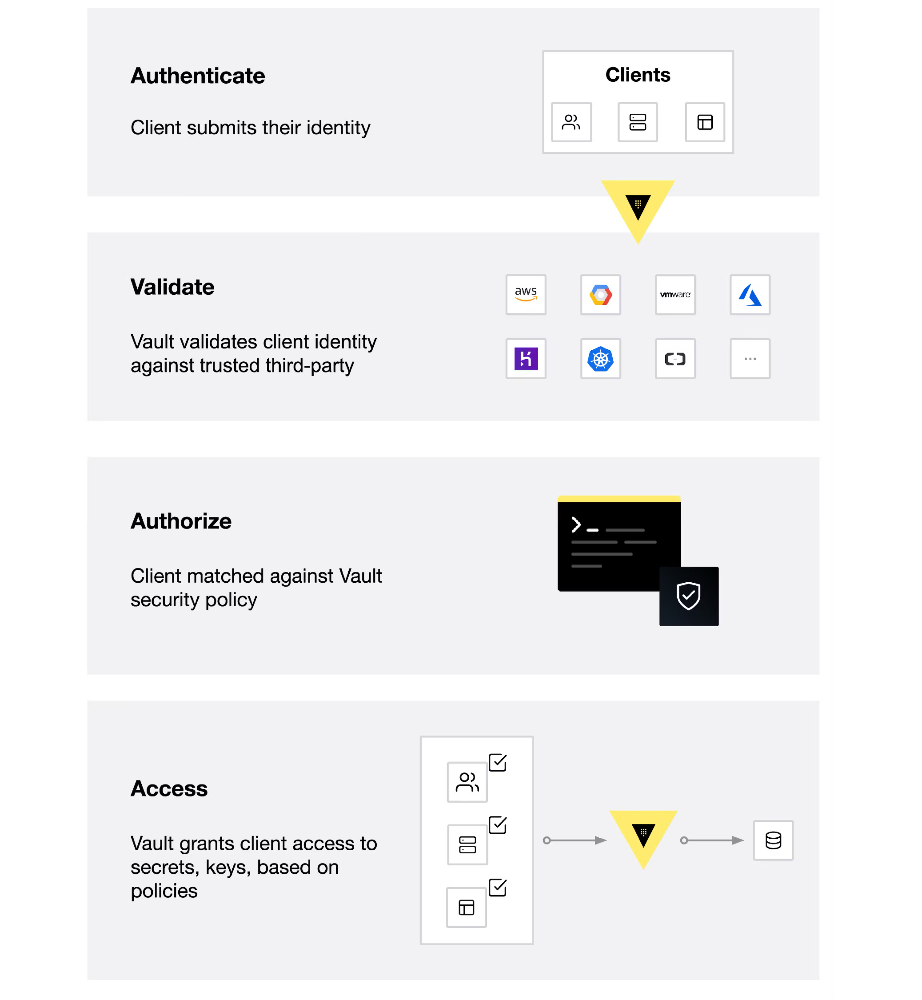

## What is Vault?
HashiCorp Vault is an identity-based secrets and encryption management system.A secret is anything that you want to tightly control access to, such as API encryption keys, passwords, and certificates. Vault provides encryption services that are gated by authentication and authorization methods. Using Vault’s UI, CLI, or HTTP API, access to secrets and other sensitive data can be securely stored and managed, tightly controlled (restricted), and auditable.

A modern system requires access to a multitude of secrets, including database credentials, API keys for external services, credentials for service-oriented architecture communication, etc. It can be difficult to understand who is accessing which secrets, especially since this can be platform-specific. Adding on key rolling, secure storage, and detailed audit logs is almost impossible without a custom solution. This is where Vault steps in.

Vault validates and authorizes clients (users, machines, apps) before providing them access to secrets or stored sensitive data.


## How does Vault work?
Vault works primarily with tokens and a token is associated to the client's policy. Each policy is path-based and policy rules constrains the actions and accessibility to the paths for each client. With Vault, you can create tokens manually and assign them to your clients, or the clients can log in and obtain a token. The illustration below displays Vault's core workflow.



The core Vault workflow consists of four stages:

- Authenticate: Authentication in Vault is the process by which a client supplies information that Vault uses to determine if they are who they say they are. Once the client is authenticated against an auth method, a token is generated and associated to a policy.
- Validation: Vault validates the client against third-party trusted sources, such as Github, LDAP, AppRole, and more.
- Authorize: A client is matched against the Vault security policy. This policy is a set of rules defining which API endpoints a client has access to with its Vault token. Policies provide a declarative way to grant or forbid access to certain paths and operations in Vault.
- Access: Vault grants access to secrets, keys, and encryption capabilities by issuing a token based on policies associated with the client’s identity. The client can then use their Vault token for future operations.

## Why Vault?
Most enterprises today have credentials sprawled across their organizations. Passwords, API keys, and credentials are stored in plain text, app source code, config files, and other locations. Because these credentials live everywhere, the sprawl can make it difficult and daunting to really know who has access and authorization to what. Having credentials in plain text also increases the potential for malicious attacks, both by internal and external attackers.

Vault was designed with these challenges in mind. Vault takes all of these credentials and centralizes them so that they are defined in one location, which reduces unwanted exposure to credentials. But Vault takes it a few steps further by making sure users, apps, and systems are authenticated and explicitly authorized to access resources, while also providing an audit trail that captures and preserves a history of clients' actions.

The key features of Vault are:

- Secure Secret Storage: Arbitrary key/value secrets can be stored in Vault. Vault encrypts these secrets prior to writing them to persistent storage, so gaining access to the raw storage isn't enough to access your secrets. Vault can write to disk, Consul, and more.

- Dynamic Secrets: Vault can generate secrets on-demand for some systems, such as AWS or SQL databases. For example, when an application needs to access an S3 bucket, it asks Vault for credentials, and Vault will generate an AWS keypair with valid permissions on demand. After creating these dynamic secrets, Vault will also automatically revoke them after the lease is up.

- Data Encryption: Vault can encrypt and decrypt data without storing it. This allows security teams to define encryption parameters and developers to store encrypted data in a location such as a SQL database without having to design their own encryption methods.

- Leasing and Renewal: All secrets in Vault have a lease associated with them. At the end of the lease, Vault will automatically revoke that secret. Clients are able to renew leases via built-in renew APIs.

- Revocation: Vault has built-in support for secret revocation. Vault can revoke not only single secrets, but a tree of secrets, for example all secrets read by a specific user, or all secrets of a particular type. Revocation assists in key rolling as well as locking down systems in the case of an intrusion.

## What is HCP Vault?
HashiCorp Cloud Platform (HCP) Vault is a hosted version of Vault, which is operated by HashiCorp to allow organizations to get up and running quickly. HCP Vault uses the same binary as self-hosted Vault, which means you will have a consistent user experience. You can use the same Vault clients to communicate with HCP Vault as you use to communicate with a self-hosted Vault.

## Use Cases

## General Secret Storage
As workloads become more and more ephemeral and short-lived, having long-lived static credentials pose a big security threat vector. What if credentials are accidentally leaked, or an employee leaves with their post it notes that contain the AWS access key, or someone checks their S3 access token to a public GH repo? With Vault, you can generate short-lived, just-in-time credentials that are automatically revoked when their time expires. This means users and security teams do not have to worry about manually revoking or changing these credentials.

## Static Secrets
Credentials can be long-lived and static, where they don't change or are changed infrequently. Vault can store these secrets bedhind its cryptographic barrier, and clients can request them to use in their applications.

## Dynamic Secrets
The key value with secrets storage is the ability to dynamically generate credentials. These credentials are created when clients need them. Vault can also manage the lifecycle of these credentials, including but not limited to, deleting them after a defined period of time.

In addition to database credential management, Vault can manage your Active Directory accounts, SSH keys, PKI certificates and more.

## Dynamic Secrets: Database Secrets Engine

Vault can generate secrets on-demand for some systems. For example, when an app needs to access an Amazon S3 bucket, it asks Vault for AWS credentials. Vault will generate an AWS credential granting permissions to access the S3 bucket. In addition, Vault will automatically revoke this credential after the time-to-live (TTL) expires.

## Challenge
Data protection is a top priority, and database credential rotation is a critical part of any data protection initiative. Each role has a different set of permissions granted to access the database. When a system is attacked by hackers, continuous credential rotation becomes necessary and needs to be automated.

## Solution
Applications ask Vault for database credentials rather than setting them as environment variables. The administrator specifies the TTL of the database credentials to enforce its validity so that they are automatically revoked when they are no longer used.


## Personas
Involves two personas:

- admin with privileged permissions to configure secrets engines
- apps read the secrets from Vault

## Policy requirements

Each persona requires a different set of capabilities. These are expressed in policies. If you are not familiar with policies.
The admin tasks require these capabilities.

```
# Mount secrets engines
path "sys/mounts/*" {
  capabilities = [ "create", "read", "update", "delete", "list" ]
}

# Configure the database secrets engine and create roles
path "database/*" {
  capabilities = [ "create", "read", "update", "delete", "list" ]
}

# Manage the leases
path "sys/leases/+/database/creds/readonly/*" {
  capabilities = [ "create", "read", "update", "delete", "list", "sudo" ]
}

path "sys/leases/+/database/creds/readonly" {
  capabilities = [ "create", "read", "update", "delete", "list", "sudo" ]
}

# Write ACL policies
path "sys/policies/acl/*" {
  capabilities = [ "create", "read", "update", "delete", "list" ]
}

# Manage tokens for verification
path "auth/token/create" {
  capabilities = [ "create", "read", "update", "delete", "list", "sudo" ]
}
```

The apps tasks require these capabilities.

```
# Get credentials from the database secrets engine 'readonly' role.
path "database/creds/readonly" {
  capabilities = [ "read" ]
}
```

## Data Encryption
Many organizations seek solutions to encrypt/decrypt application data within a cloud or multi-datacenter environment; deploying cryptography and maintaining a complex key management infrastructure can be expensive and challenging to develop. Vault provides encryption as a service with centralized key management to simplify encrypting data in transit and stored across clouds and datacenters. Vault can encrypt/decrypt data stored elsewhere, essentially allowing applications to encrypt their data while storing it in the primary data store. Vault's security team manages and maintains the responsibility of the data encryption within the Vault environment, allowing developers to focus solely on encrypting/decrypting data as needed.

## Resources
- Try  Encryption as a Service: Transit Secrets Engine to learn the essential workings of the Transit secrets engine handles cryptographic functions on data in-transit.
  https://developer.hashicorp.com/vault/tutorials/encryption-as-a-service

- For more advanced data protection, refer to the Advanced Data Protection tutorial series. Vault's Transform secrets engine handles secure data transformation and tokenization against provided input value.
  https://developer.hashicorp.com/vault/tutorials/adp

## Identity-Based Access
Organizations need a way to manage identity sprawl with the proliferation of different clouds, services, and systems- all with their identity providers. The risk of compromising an organization's security infrastructure increases as organizations are forced to manage multiple identity management systems as they try to implement solutions to unify a single logical identity across numerous cloud platforms. Different platforms support different methods and constructs for identity, making it difficult to recognize a user or identity across multiple forms of credentials.

Vault solves this challenge by using a unified ACL system to broker access to systems and secrets and merges identities across providers. With identity-based access, organizations can leverage any trusted resource identity to regulate and manage system and application access, and authentication across various clouds, systems, and endpoints.

## Resources

- Try  Identity: Entities and Groups tutorial to learn how Vault's unified identity system works.
  https://developer.hashicorp.com/vault/tutorials/auth-methods/identity

- Follow the Policies tutorial series to learn how Vault enforces role-based access control (RBAC) across multiple cloud environments.
  https://developer.hashicorp.com/vault/tutorials/policies

## Key Management
Working with cloud providers requires that you use their security features, which involve encryption keys issued and stored by the provider in its own key management system (KMS). You may also have a requirement to maintain root of trust and control of the encryption key lifecycle, both within and outside of the cloud. The Vault Key Management Secrets Engine provides a consistent workflow for distribution and lifecycle management of cloud provider keys, allowing organizations to maintain centralized control of their keys in Vault while leveraging the cryptographic capabilities native to the KMS providers.

## Resources
- Try Key Management Secrets Engine with Azure Key Vault to enable management of the Key Vault key with the Key Management secrets engine.
  https://developer.hashicorp.com/vault/tutorials/adp/key-management-secrets-engine-azure-key-vault

- Try our Key Management Secrets Engine with GCP Cloud KMS to enable management of the Key Value key with the Key Management secrets engine.
  https://developer.hashicorp.com/vault/tutorials/adp/key-management-secrets-engine-azure-key-vault

## Vault Agent
A valid client token must accompany most requests to Vault. This includes all API requests, as well as via the Vault CLI and other libraries. Therefore, Vault clients must first authenticate with Vault to acquire a token. Vault provides several different authentication methods to assist in delivering this initial token.


If the client can securely acquire the token, all subsequent requests (e.g., request database credentials, read key/value secrets) are processed based on the trust established by a successful authentication.

This means that client application must invoke the Vault API to authenticate with Vault and manage the acquired token, in addition to invoking the API to request secrets from Vault. This implies code changes to client applications along with additional testing and maintenance of the application.

The following code example implements Vault API to authenticate with Vault through AppRole auth method, and then uses the returned client token to read secrets at kv-v2/data/creds.

```
package main

import (
    ...snip...
    vault "github.com/hashicorp/vault/api"
)

// Fetches a key-value secret (kv-v2) after authenticating via AppRole
func getSecretWithAppRole() (string, error) {
    config := vault.DefaultConfig()

    client := vault.NewClient(config)
    wrappingToken := ioutil.ReadFile("path/to/wrapping-token")
    unwrappedToken := client.Logical().Unwrap(strings.TrimSuffix(string(wrappingToken), "\n"))

    secretID := unwrappedToken.Data["secret_id"]
    roleID := os.Getenv("APPROLE_ROLE_ID")

    params := map[string]interface{}{
        "role_id":   roleID,
        "secret_id": secretID,
    }
    resp := client.Logical().Write("auth/approle/login", params)
    client.SetToken(resp.Auth.ClientToken)

    secret, err := client.Logical().Read("kv-v2/data/creds")
    if err != nil {
        return "", fmt.Errorf("unable to read secret: %w", err)
    }

    data := secret.Data["data"].(map[string]interface{})

    ...snip...
}
```

For some Vault deployments, making (and maintaining) these changes to applications may not be a problem, and may actually be preferred. This may be applied to scenarios where you have a small number of applications or you want to keep strict, customized control over how each application interacts with Vault. However, in other situations where you have a large number of applications, as in large enterprises, you may not have the resources or expertise to update and maintain the Vault integration code for every application. When third party applications are being deployed by the application, it is prohibited to add the Vault integration code.

Vault Agent aims to remove this initial hurdle to adopt Vault by providing a more scalable and simpler way for applications to integrate with Vault.

## What is Vault Agent?
Vault Agent is a client daemon that provides the following features:

- Auto-Auth - Automatically authenticate to Vault and manage the token renewal process for locally-retrieved dynamic secrets.

- API Proxy - Allows Vault Agent to act as a proxy for Vault's API, optionally using (or forcing the use of) the Auto-Auth token.

- Caching - Allows client-side caching of responses containing newly created tokens and responses containing leased secrets generated off of these newly created tokens. The agent also manages the renewals of the cached tokens and leases.

- Windows Service - Allows running the Vault Agent as a Windows service.

- Templating - Allows rendering of user-supplied templates by Vault Agent, using the token generated by the Auto-Auth step.


# Auto-Auth
Vault Agent allows easy authentication to Vault in a wide variety of environments.
Auto-Auth functionality takes place within an auto_auth configuration stanza.

# API Proxy
Vault Agent can act as an API proxy for Vault, allowing you to talk to Vault's API via a listener defined for Agent. It can be configured to optionally allow or force the automatic use of the Auto-Auth token for these requests.

API Proxy functionality takes place within a defined listener, and its behaviour can be configured with an api_proxy stanza.

# Caching
Vault Agent allows client-side caching of responses containing newly created tokens and responses containing leased secrets generated off of these newly created tokens.

## Start Vault Agent
To run Vault Agent:

- Download the Vault binary where the client application runs (virtual machine, Kubernetes pod, etc.)

- Create a Vault Agent configuration file. (See the Example Configuration section for an example configuration.)

- Start a Vault Agent with the configuration file.

Example:

```
vault agent -config=/etc/vault/agent-config.hcl
```

To get help, run:

```
vault agent -h
```

# Example Configuration

An example configuration, with very contrived values, follows:

```
pid_file = "./pidfile"

vault {
  address = "https://vault-fqdn:8200"
  retry {
    num_retries = 5
  }
}

auto_auth {
  method "aws" {
    mount_path = "auth/aws-subaccount"
    config = {
      type = "iam"
      role = "foobar"
    }
  }

  sink "file" {
    config = {
      path = "/tmp/file-foo"
    }
  }

  sink "file" {
    wrap_ttl = "5m"
    aad_env_var = "TEST_AAD_ENV"
    dh_type = "curve25519"
    dh_path = "/tmp/file-foo-dhpath2"
    config = {
      path = "/tmp/file-bar"
    }
  }
}

cache {
  // An empty cache stanza still enables caching
}

api_proxy {
  use_auto_auth_token = true
}

listener "unix" {
  address = "/path/to/socket"
  tls_disable = true

  agent_api {
    enable_quit = true
  }
}

listener "tcp" {
  address = "127.0.0.1:8100"
  tls_disable = true
}

template {
  source = "/etc/vault/server.key.ctmpl"
  destination = "/etc/vault/server.key"
}

template {
  source = "/etc/vault/server.crt.ctmpl"
  destination = "/etc/vault/server.crt"
}
```

## Secrets Engines

Secrets engines are components which store, generate, or encrypt data. Secrets engines are incredibly flexible, so it is easiest to think about them in terms of their function. Secrets engines are provided some set of data, they take some action on that data, and they return a result.

Some secrets engines simply store and read data - like encrypted Redis/Memcached. Other secrets engines connect to other services and generate dynamic credentials on demand. Other secrets engines provide encryption as a service, totp generation, certificates, and much more.

Secrets engines are enabled at a path in Vault. When a request comes to Vault, the router automatically routes anything with the route prefix to the secrets engine. In this way, each secrets engine defines its own paths and properties. To the user, secrets engines behave similar to a virtual filesystem, supporting operations like read, write, and delete.

## Secrets Engines Lifecycle

Most secrets engines can be enabled, disabled, tuned, and moved via the CLI or API.

- Enable - This enables a secrets engine at a given path. With a few exceptions, secrets engines can be enabled at multiple paths. Each secrets engine is isolated to its path. By default, they are enabled at their "type" (e.g. "aws" enables at aws/).

```
Case-sensitive: The path where you enable secrets engines is case-sensitive. For example, the KV secrets engine enabled at kv/ and KV/ are treated as two distinct instances of KV secrets engine.
```

- Disable - This disables an existing secrets engine. When a secrets engine is disabled, all of its secrets are revoked (if they support it), and all the data stored for that engine in the physical storage layer is deleted.

- Move - This moves the path for an existing secrets engine. This process revokes all secrets, since secret leases are tied to the path where they were created. The configuration data stored for the engine persists through the move.

- Tune - This tunes global configuration for the secrets engine such as the TTLs.

Once a secrets engine is enabled, you can interact with it directly at its path according to its own API. Use vault path-help to determine the paths it responds to.

Note that mount points cannot conflict with each other in Vault. There are two broad implications of this fact. The first is that you cannot have a mount which is prefixed with an existing mount. The second is that you cannot create a mount point that is named as a prefix of an existing mount. As an example, the mounts foo/bar and foo/baz can peacefully coexist with each other whereas foo and foo/baz cannot

## Barrier View
Secrets engines receive a barrier view to the configured Vault physical storage. This is a lot like a chroot.

When a secrets engine is enabled, a random UUID is generated. This becomes the data root for that engine. Whenever that engine writes to the physical storage layer, it is prefixed with that UUID folder. Since the Vault storage layer doesn't support relative access (such as ../), this makes it impossible for an enabled secrets engine to access other data.

This is an important security feature in Vault - even a malicious engine cannot access the data from any other engine.

- Active Directory Secrets Engine (https://developer.hashicorp.com/vault/docs/secrets/ad)
- AliCloud Secrets Engine (https://developer.hashicorp.com/vault/docs/secrets/alicloud)
- AWS Secrets Engine (https://developer.hashicorp.com/vault/docs/secrets/aws)
- Azure Secrets Engine (https://developer.hashicorp.com/vault/docs/secrets/azure)
- Consul Secrets Engine (https://developer.hashicorp.com/vault/docs/secrets/consul)
- Cubbyhole Secrets Engine (https://developer.hashicorp.com/vault/docs/secrets/cubbyhole)
- Databases:
            - Cassandra Database Secrets Engine (https://developer.hashicorp.com/vault/docs/secrets/databases/cassandra)
            - Couchbase Database Secrets Engine (https://developer.hashicorp.com/vault/docs/secrets/databases/couchbase)
            - Elasticsearch Database Secrets Engine (https://developer.hashicorp.com/vault/docs/secrets/databases/elasticdb)
            - HANA Database Secrets Engine (https://developer.hashicorp.com/vault/docs/secrets/databases/hanadb)
            - IBM Db2 (https://developer.hashicorp.com/vault/docs/secrets/databases/db2)
            - InfluxDB Database Secrets Engine (https://developer.hashicorp.com/vault/docs/secrets/databases/influxdb)
            - MongoDB Database Secrets Engine (https://developer.hashicorp.com/vault/docs/secrets/databases/mongodb)
            - MongoDB Atlas Database Secrets Engine (https://developer.hashicorp.com/vault/docs/secrets/databases/mongodbatlas)
            - MSSQL Database Secrets Engine (https://developer.hashicorp.com/vault/docs/secrets/databases/mssql)
            - MySQL/MariaDB Database Secrets Engine (https://developer.hashicorp.com/vault/docs/secrets/databases/mysql-maria)
            - Oracle Database Secrets Engine (https://developer.hashicorp.com/vault/docs/secrets/databases/oracle)
            - PostgreSQL Database Secrets Engine (https://developer.hashicorp.com/vault/docs/secrets/databases/postgresql)
            - Redis Database Secrets Engine (https://developer.hashicorp.com/vault/docs/secrets/databases/redis)
            - Redis ElastiCache Database Secrets Engine (https://developer.hashicorp.com/vault/docs/secrets/databases/rediselasticache)
            - Redshift Database Secrets Engine (https://developer.hashicorp.com/vault/docs/secrets/databases/redshift)
            - Snowflake Database Secrets Engine (https://developer.hashicorp.com/vault/docs/secrets/databases/snowflake)
            - Custom Database Secrets Engines (https://developer.hashicorp.com/vault/docs/secrets/databases/custom)
- Google Cloud Secrets Engine (https://developer.hashicorp.com/vault/docs/secrets/gcp)
- Google Cloud KMS Secrets Engine (https://developer.hashicorp.com/vault/docs/secrets/gcpkms)
- Identity Secrets Engine (https://developer.hashicorp.com/vault/docs/secrets/identity)
            - Identity Tokens (https://developer.hashicorp.com/vault/docs/secrets/identity/identity-token)
            - OIDC Identity Provider (https://developer.hashicorp.com/vault/docs/secrets/identity/oidc-provider)
- Key Management Secrets Engine(ENTERPRISE) (https://developer.hashicorp.com/vault/docs/secrets/key-management)
            - Azure Key Vault (https://developer.hashicorp.com/vault/docs/secrets/key-management/azurekeyvault)
            - AWS KMS (https://developer.hashicorp.com/vault/docs/secrets/key-management/awskms)
            - GCP Cloud KMS (https://developer.hashicorp.com/vault/docs/secrets/key-management/gcpkms)
- KV Secrets Engine (https://developer.hashicorp.com/vault/docs/secrets/kv)
            - KV Secrets Engine - Version 1 (https://developer.hashicorp.com/vault/docs/secrets/kv/kv-v1)
            - KV Secrets Engine - Version 2 (https://developer.hashicorp.com/vault/docs/secrets/kv/kv-v2)
- KMIP Secrets Engine(ENTERPRISE) (https://developer.hashicorp.com/vault/docs/secrets/kmip)
- Kubernetes Secrets Engine (https://developer.hashicorp.com/vault/docs/secrets/kubernetes)
- MongoDB Atlas Secrets Engine (https://developer.hashicorp.com/vault/docs/secrets/mongodbatlas)
- Nomad Secrets Engine (https://developer.hashicorp.com/vault/docs/secrets/nomad)
- LDAP Secrets Engine (https://developer.hashicorp.com/vault/docs/secrets/ldap)
- PKI Secrets Engine (https://developer.hashicorp.com/vault/docs/secrets/pki)
            - PKI Secrets Engine - Setup and Usage (https://developer.hashicorp.com/vault/docs/secrets/pki/setup)
            - PKI Secrets Engine - Quick Start - Root CA Setup (https://developer.hashicorp.com/vault/docs/secrets/pki/quick-start-root-ca)
            - PKI Secrets Engine - Quick Start - Intermediate CA Setup (https://developer.hashicorp.com/vault/docs/secrets/pki/quick-start-intermediate-ca)
            - PKI Secrets Engine - Considerations (https://developer.hashicorp.com/vault/docs/secrets/pki/considerations)
            - PKI Secrets Engine - Rotation Primitives (https://developer.hashicorp.com/vault/docs/secrets/pki/rotation-primitives)
- RabbitMQ Secrets Engine (https://developer.hashicorp.com/vault/docs/secrets/rabbitmq)
- SSH Secrets Engine (https://developer.hashicorp.com/vault/docs/secrets/ssh)
            - Signed SSH Certificates (https://developer.hashicorp.com/vault/docs/secrets/ssh/signed-ssh-certificates)
            - One-Time SSH Passwords (https://developer.hashicorp.com/vault/docs/secrets/ssh/one-time-ssh-passwords)
- Terraform Cloud Secret Backend (https://developer.hashicorp.com/vault/docs/secrets/terraform)
- TOTP Secrets Engine (https://developer.hashicorp.com/vault/docs/secrets/totp)
- Transform Secrets Engine(ENTERPRISE) (https://developer.hashicorp.com/vault/docs/secrets/transform)
            - FF3-1 Tweak Usage Documentation (https://developer.hashicorp.com/vault/docs/secrets/transform/ff3-tweak-details)
            - Tokenization Transform (ENTERPRISE) (https://developer.hashicorp.com/vault/docs/secrets/transform/tokenization)
- Transit Secrets Engine (https://developer.hashicorp.com/vault/docs/secrets/transit)
            - Key Wrapping for Transit Key Import (https://developer.hashicorp.com/vault/docs/secrets/transit/key-wrapping-guide)
- Venafi Secrets Engine for HashiCorp Vault (https://developer.hashicorp.com/vault/docs/secrets/venafi)


## Auth Methods

- AppRole Auth Method (https://developer.hashicorp.com/vault/docs/auth/approle)
- AliCloud Auth Method (https://developer.hashicorp.com/vault/docs/auth/alicloud)
- AWS Auth Method (https://developer.hashicorp.com/vault/docs/auth/aws)
- Azure Auth Method (https://developer.hashicorp.com/vault/docs/auth/azure)
- Cloud Foundry (CF) Auth Method (https://developer.hashicorp.com/vault/docs/auth/cf)
- GitHub Auth Method (https://developer.hashicorp.com/vault/docs/auth/github)
- Google Cloud Auth Method (https://developer.hashicorp.com/vault/docs/auth/gcp)
- JWT/OIDC Auth Method (https://developer.hashicorp.com/vault/docs/auth/jwt)
                    - OIDC Provider Configuration (https://developer.hashicorp.com/vault/docs/auth/jwt/oidc-providers)
                                                - Auth0 (https://developer.hashicorp.com/vault/docs/auth/jwt/oidc-providers/auth0)
                                                - Azure Active Directory (AAD) (https://developer.hashicorp.com/vault/docs/auth/jwt/oidc-providers/azuread)
                                                - ForgeRock (https://developer.hashicorp.com/vault/docs/auth/jwt/oidc-providers/forgerock)
                                                - Gitlab (https://developer.hashicorp.com/vault/docs/auth/jwt/oidc-providers/gitlab)
                                                - Google (https://developer.hashicorp.com/vault/docs/auth/jwt/oidc-providers/google)
                                                - Keycloak (https://developer.hashicorp.com/vault/docs/auth/jwt/oidc-providers/keycloak)
                                                - Kubernetes (https://developer.hashicorp.com/vault/docs/auth/jwt/oidc-providers/kubernetes)
                                                - Okta (https://developer.hashicorp.com/vault/docs/auth/jwt/oidc-providers/okta)
                                                - SecureAuth (https://developer.hashicorp.com/vault/docs/auth/jwt/oidc-providers/secureauth)
- Kerberos Auth Method (https://developer.hashicorp.com/vault/docs/auth/kerberos)
- Kubernetes Auth Method (https://developer.hashicorp.com/vault/docs/auth/kubernetes)
- LDAP Auth Method (https://developer.hashicorp.com/vault/docs/auth/ldap)
- Login MFA (https://developer.hashicorp.com/vault/docs/auth/login-mfa)
- OCI Auth Method (https://developer.hashicorp.com/vault/docs/auth/oci)
- Okta Auth Method (https://developer.hashicorp.com/vault/docs/auth/okta)
- RADIUS Auth Method (https://developer.hashicorp.com/vault/docs/auth/radius)
- TLS Certificates Auth Method (https://developer.hashicorp.com/vault/docs/auth/cert)
- Token Auth Method (https://developer.hashicorp.com/vault/docs/auth/token)
- Userpass Auth Method (https://developer.hashicorp.com/vault/docs/auth/userpass)


## Audit Devices

Audit devices are the components in Vault that collectively keep a detailed log of all requests and response to Vault. Because every operation with Vault is an API request/response, when using a single audit device, the audit log contains every authenticated interaction with Vault, including errors.

https://developer.hashicorp.com/vault/docs/audit

- File Audit Device (https://developer.hashicorp.com/vault/docs/audit/file)
- Syslog Audit Device (https://developer.hashicorp.com/vault/docs/audit/syslog)
- Socket Audit Device (https://developer.hashicorp.com/vault/docs/audit/socket)

## Plugin System
Vault supports 3 types of plugins; auth methods, secret engines, and database plugins. This concept allows both built-in and external plugins to be treated like building blocks. Any plugin can exist at multiple different mount paths. Different versions of a plugin may be at each location, with each version differing from Vault's version.

A plugin is uniquely identified by its type (one of secret, auth, or database), name (e.g. aws), and version (e.g v1.0.0). An empty version implies either the built-in plugin or the single unversioned plugin that can be registered.

https://developer.hashicorp.com/vault/docs/upgrading/plugins#plugin-upgrade-procedure

- External Plugin Architecture (https://developer.hashicorp.com/vault/docs/plugins/plugin-architecture)
- Plugin Development (https://developer.hashicorp.com/vault/docs/plugins/plugin-development)
- Plugin Management (https://developer.hashicorp.com/vault/docs/plugins/plugin-management)


## Vault Interoperability Matrix
Vault integrates with various appliances, platforms and applications for different use cases. Below are two tables indicating the partner’s product that has been verified to work with Vault for Auto Unsealing / HSM Support and External Key Management.

Auto Unseal and HSM Support was developed to aid in reducing the operational complexity of keeping the unseal key secure. This feature delegates the responsibility of securing the unseal key from users to a trusted device or service. At startup Vault will connect to the device or service implementing the seal and ask it to decrypt the root key Vault read from storage.

Vault centrally manages and automates encryption keys across environments allowing customers to control their own encryption keys used in third party services or products.

https://developer.hashicorp.com/vault/docs/interoperability-matrix

## Monitor & Troubleshoot

- Troubleshooting Vault (https://developer.hashicorp.com/vault/tutorials/monitoring/troubleshooting-vault)
- Troubleshooting Vault on Kubernetes (https://developer.hashicorp.com/vault/tutorials/monitoring/kubernetes-troubleshooting)
- Diagnose Server Issues (https://developer.hashicorp.com/vault/tutorials/monitoring/diagnose-startup-issues)
- Use hcdiag with Vault (https://developer.hashicorp.com/vault/tutorials/monitoring/hcdiag-with-vault)
- Monitoring Vault Replication (https://developer.hashicorp.com/vault/tutorials/monitoring/monitor-replication)
- Vault Usage Metrics (https://developer.hashicorp.com/vault/tutorials/monitoring/usage-metrics)
- Monitor Telemetry & Audit Device Log Data (https://developer.hashicorp.com/vault/tutorials/monitoring/monitor-telemetry-audit-splunk)
- Monitor Telemetry with Prometheus & Grafana (https://developer.hashicorp.com/vault/tutorials/monitoring/monitor-telemetry-grafana-prometheus)
- Inspect Data in BoltDB  (https://developer.hashicorp.com/vault/tutorials/monitoring/inspect-data-boltdb)
- Inspecting Data in Consul Storage (https://developer.hashicorp.com/vault/tutorials/monitoring/inspecting-data-consul)
- Inspect Data in Integrated Storage (https://developer.hashicorp.com/vault/tutorials/monitoring/inspect-data-integrated-storage)
- Blocked Audit Devices (https://developer.hashicorp.com/vault/tutorials/monitoring/blocked-audit-devices)
- Query audit device logs (https://developer.hashicorp.com/vault/tutorials/monitoring/query-audit-device-logs)
- Troubleshoot Irrevocable Leases (https://developer.hashicorp.com/vault/tutorials/monitoring/troubleshoot-irrevocable-leases)
- Vault Cluster Lost Quorum Recovery (https://developer.hashicorp.com/vault/tutorials/monitoring/raft-lost-quorum)
- Operate Vault in Recovery Mode (https://developer.hashicorp.com/vault/tutorials/monitoring/recovery-mode)
- Telemetry Metrics Reference (https://developer.hashicorp.com/vault/tutorials/monitoring/telemetry-metrics-reference)
- Monitoring Vault with Datadog (https://developer.hashicorp.com/vault/tutorials/monitoring/monitoring-vault-with-datadog)
- Audit device logs and incident response with Elasticsearch (https://developer.hashicorp.com/vault/tutorials/monitoring/audit-elastic-incident-response)


## App Integration

- Secure Introduction of Vault Clients (https://developer.hashicorp.com/vault/tutorials/app-integration/secure-introduction)
- Use Consul Template and Envconsul with Vault (https://developer.hashicorp.com/vault/tutorials/app-integration/application-integration)
- AppRole With Terraform & Chef (https://developer.hashicorp.com/vault/tutorials/app-integration/approle-trusted-entities)
- Java Application Demo (https://developer.hashicorp.com/vault/tutorials/app-integration/eaas-spring-demo)
- Transit Secrets Re-wrapping (https://developer.hashicorp.com/vault/tutorials/app-integration/eaas-transit-rewrap)
- Encrypting data with Transform secrets engine (https://developer.hashicorp.com/vault/tutorials/app-integration/transform-code-example)
- Using HashiCorp Vault C# Client with .NET Core (https://developer.hashicorp.com/vault/tutorials/app-integration/dotnet-httpclient)
- Using HashiCorp Vault Agent with .NET Core ( https://developer.hashicorp.com/vault/tutorials/app-integration/dotnet-vault-agent)
- Build Your Own Plugins (https://developer.hashicorp.com/vault/tutorials/app-integration/plugin-backends)
- Vault GitHub Actions (https://developer.hashicorp.com/vault/tutorials/app-integration/github-actions)
- Vault AWS Lambda Extension (https://developer.hashicorp.com/vault/tutorials/app-integration/aws-lambda)
- Introduction to the Vault AWS Lambda Extension (https://developer.hashicorp.com/vault/tutorials/app-integration/intro-vault-aws-lambda-extension)


