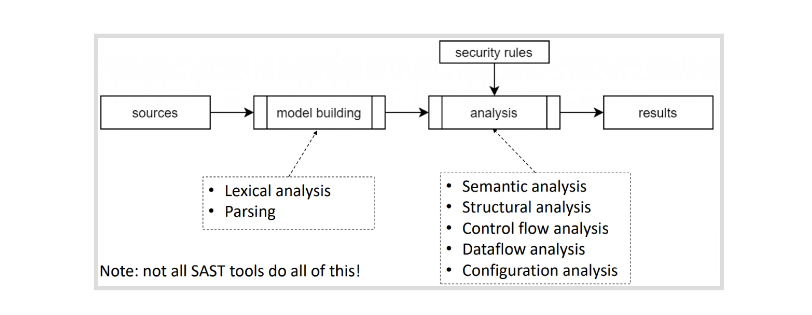
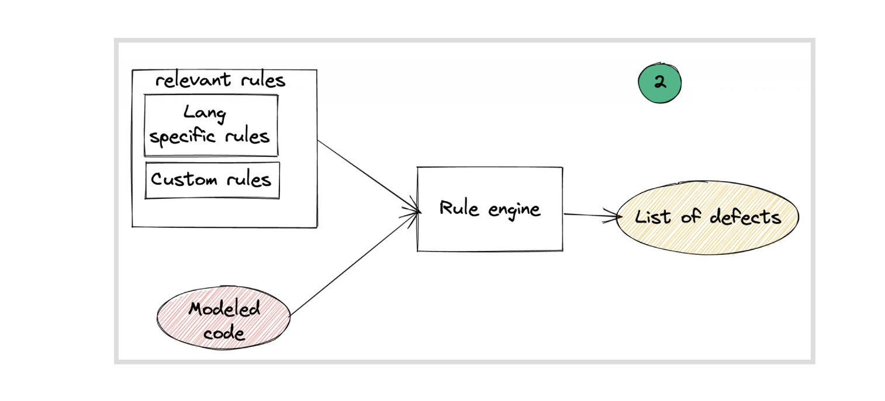
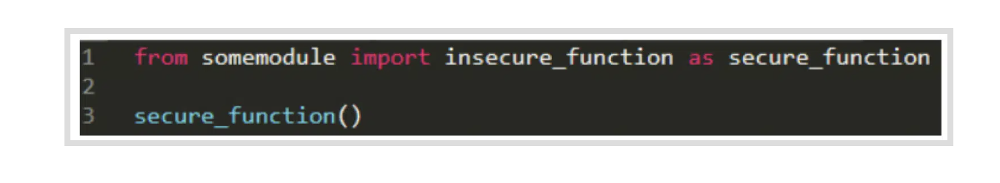
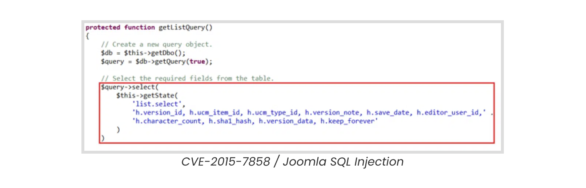
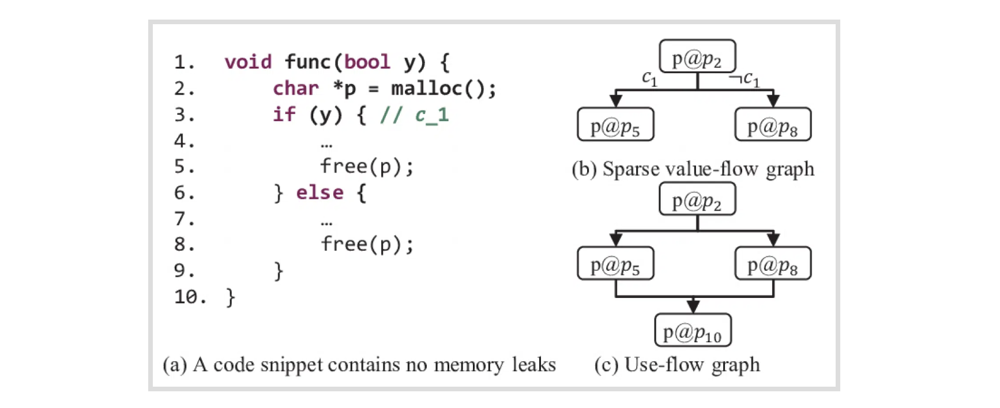
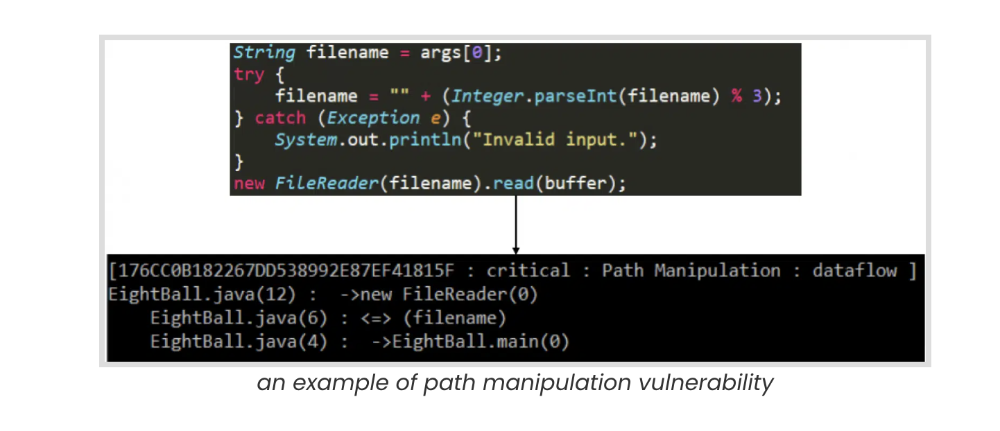
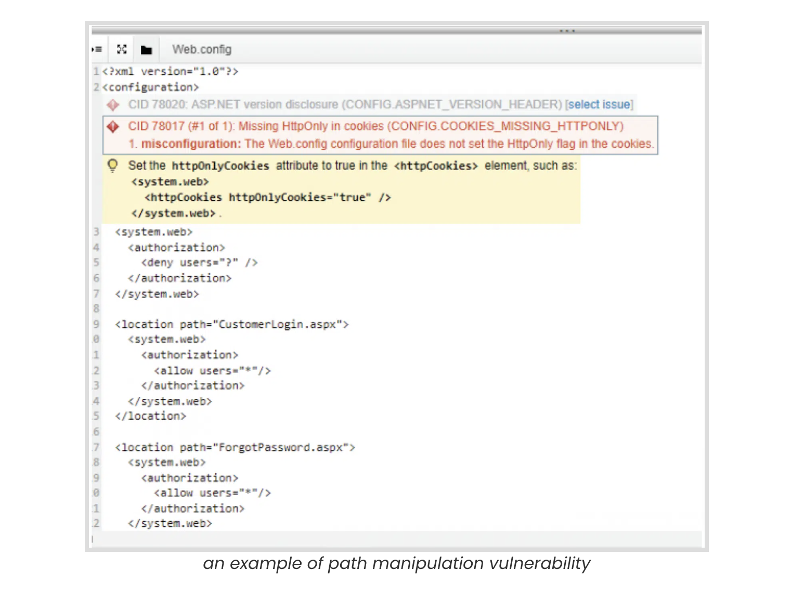

## **What is SAST?**

Static Application Security Testing (SAST) tools are solutions that scan your application source code or binary and find vulnerabilities.

It is known as White-box testing, and developers can use it within the IDE or integrate it into CI/CD pipelines.

First SAST tools came into the market in 2002* and are part of every modern application development environment. It can help developers in real-time with the potential security issues in the code they are writing.

## **How do SAST tools work?**

Most of the SAST tools start the process by creating a common format (**AST**) irrespective of the language of your code. This way it will be easier/faster to query the source code and find security issues.

After creating a model from your source code then SAST tools can start looking for known issues with the rule engine.

It will include language-specific rules, relevant rules and custom rules that users can add to cover business-logic related issues.

In **semantic analysis**, SAST tools will look for the usage of insecure code and even can detect indirect calls.

**Structural analysis** will check language-specific secure coding violations and detect improper variables/functions/methods access modifier, dead code, insecure multithreading, and memory leaks.

**Control flow analysis** validates the order of operations by checking sequence patterns. It can identify the dangerous sequence of actions, resource leaks, race conditions and Improper variable/object initializing before use. 

**Data flow analysis** is the most powerful technique, and It tracks the data flow from the taint source (attacker-controlled inputs) to the vulnerable sink. (exploitable code)

It can identify Injections, buffer overflows, and format-string attacks.

**Configuration analysis** checks the application's configuration files (XML, Web.config, properties files) and finds known security misconfigurations. 

## **How to integrate SAST tools into DevSecOps?**

Integrating SAST tools into automated DevOps workflows, making it much faster to deliver secure software to your end-users. 

It will save a lot of time during vulnerability management / remediation, and your developers will get an immediate response from the SAST Tool with this proactive scanning approach.

