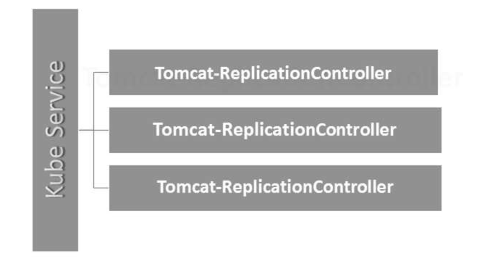

## **Kubernetes - Replication Controller**

Replication Controller is one of the key features of Kubernetes, which is responsible for managing the pod lifecycle. It is responsible for making sure that the specified number of pod replicas are running at any point of time. It is used in time when one wants to make sure that the specified number of pod or at least one pod is running. It has the capability to bring up or down the specified no of pod.

It is a best practice to use the replication controller to manage the pod life cycle rather than creating a pod again and again.

```
apiVersion: v1
kind: ReplicationController --------------------------> 1
metadata:
   name: Tomcat-ReplicationController --------------------------> 2
spec:
   replicas: 3 ------------------------> 3
   template:
      metadata:
         name: Tomcat-ReplicationController
      labels:
         app: App
         component: neo4j
      spec:
         containers:
         - name: Tomcat- -----------------------> 4
         image: tomcat: 8.0
         ports:
            - containerPort: 7474 ------------------------> 5
```

**Setup Details**

  1. **Kind: ReplicationController -** In the above code, we have defined the kind as replication controller which tells the kubectl that the yaml file is going to be used for creating the replication controller.
  2. **name: Tomcat-ReplicationController -** This helps in identifying the name with which the replication controller will be created. If we run the kubctl, get rc < Tomcat-ReplicationController > it will show the replication controller details.
  3. **replicas: 3 -** This helps the replication controller to understand that it needs to maintain three replicas of a pod at any point of time in the pod lifecycle.
  4. **name: Tomcat -** In the spec section, we have defined the name as tomcat which will tell the replication controller that the container present inside the pods is tomcat.
  5. **containerPort: 7474 -** It helps in making sure that all the nodes in the cluster where the pod is running the container inside the pod will be exposed on the same port 7474.



Here, the Kubernetes service is working as a load balancer for three tomcat replicas.

