## **What is kubernetes?**
 
 - Kubernetes is a container management technology developed in Google lab to manage containerized applications in different kind of environments such as physical, virtual, and cloud infrastructure. It is an open source system which helps in creating and managing containerization of application.
 - Kubernetes in an open source container management tool hosted by Cloud Native Computing Foundation (CNCF).
 - Kubernetes comes with a capability of automating deployment, scaling of application, and operations of application containers across clusters. It is capable of creating container centric infrastructure.
 - Kubernetes is a orchestration tool.

 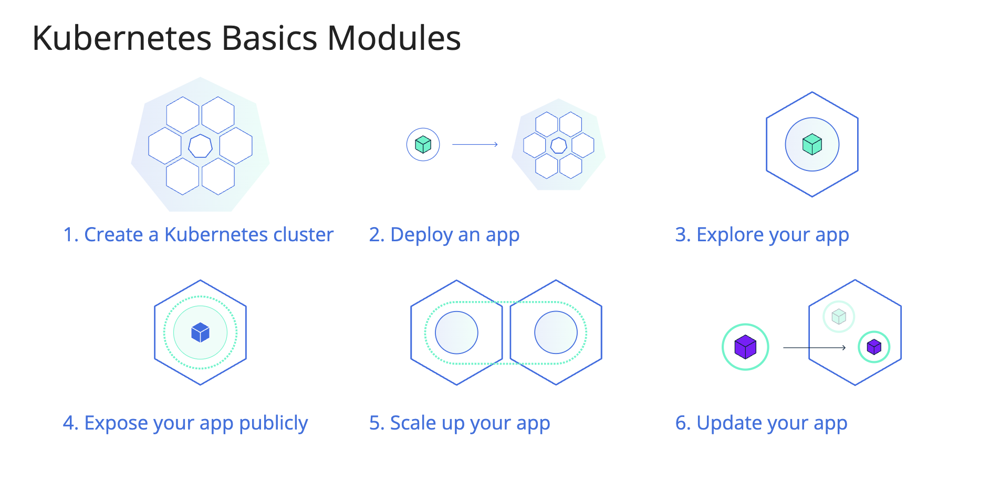

 ## **Features of Kubernetes**

  1. Continues development, integration and deployment
  2. Containerized infrastructure
  3. Application-centric management
  4. Auto-scalable infrastructure
  5. Environment consistency across development testing and production
  6. Loosely coupled infrastructure, where each component can act as a separate unit
  7. Higher density of resource utilization
  8. Predictable infrastructure which is going to be created

  One of the key components of Kubernetes is, it can run application on clusters of physical and virtual machine infrastructure. It also has the capability to run applications on cloud. **It helps in moving from host-centric infrastructure to container-centric infrastructure**.

## **Kubernetes Architecture**

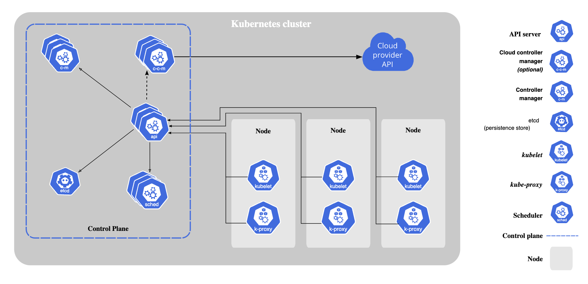

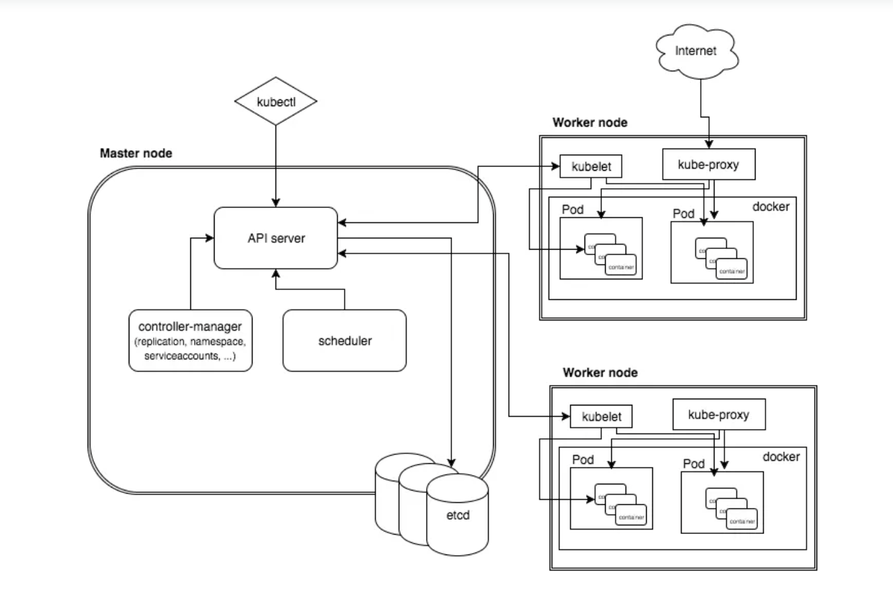

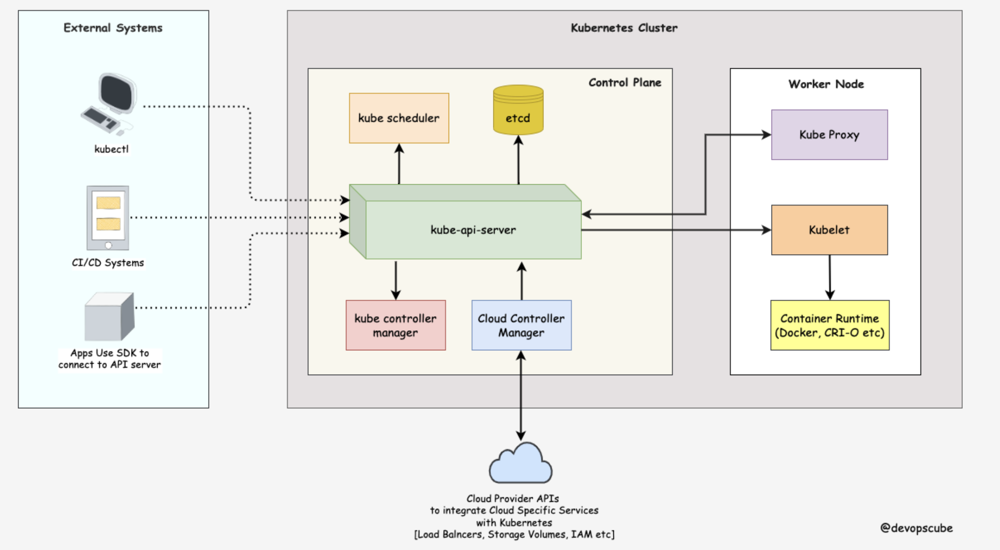

The first and foremost thing you should understand about Kubernetes is, it is a distributed system. Meaning, it has multiple components spread across different servers over a network. These servers could be Virtual machines or bare metal servers. We call it a Kubernetes cluster.

- A Kubernetes cluster consists of control plane nodes and worker nodes.

**Control Plane**

The control plane is responsible for container orchestration and maintaining the desired state of the cluster. It has the following components.

 1. **kube-apiserver**
 2. **etcd**
 3. **kube-scheduler**
 4. **kube-controller-manager**
 5. **cloud-controller-manager**

**Worker Node**

The Worker nodes are responsible for running containerized applications. The worker Node has the following components.

 1. **kubelet**
 2. **kube-proxy**
 3. **Container runtime**

1. **kube-apiserver**
  - The kube-api server is the central hub of the Kubernetes cluster that exposes the Kubernetes API.
  - End users, and other cluster components, talk to the cluster via the API server.
  - Very rarely monitoring systems and third-party services may talk to API servers to interact with the cluster.
  - So when you use kubectl to manage the cluster, at the backend you are actually communicating with the API server through HTTP REST APIs.
  - However, the internal cluster components like the scheduler, controller, etc talk to the API server using **gRPC**.
  - The communication between the API server and other components in the cluster happens over TLS to prevent unauthorized access to the cluster.

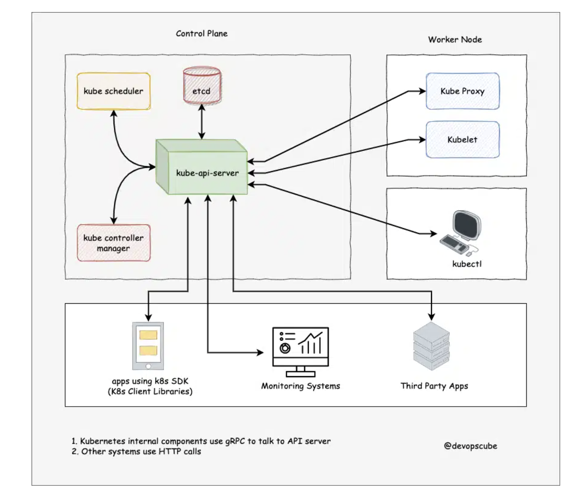

**Kubernetes api-server is responsible for the following**

 1. **API management:** Exposes the cluster API endpoint and handles all API requests.
 2. **Authentication** (Using client certificates, bearer tokens, and HTTP Basic Authentication) and **Authorization** (ABAC and RBAC evaluation)
 3. Processing API requests and validating data for the API objects like pods, services, etc. (Validation and Mutation Admission controllers)
 4. It is the only component that communicates with etcd.
 5. api-server coordinates all the processes between the control plane and worker node components.
 6. api-server has a built-in bastion apiserver proxy. It is part of the API server process. It is primarily used to enable access to ClusterIP services from outside the cluster, even though these services are typically only reachable within the cluster itself.

2. **etcd**
  - Kubernetes is a distributed system and it needs an efficient distributed database like etcd that supports its distributed nature.
  - It acts as both a backend service discovery and a database. You can call it the brain of the Kubernetes cluster.
  - etcd is an open-source strongly consistent, distributed key-value store.
  - etcd uses raft consensus algorithm for strong consistency and availability. It works in a leader-member fashion for high availability and to withstand node failures.
  - etcd is designed to run on multiple nodes as a cluster without sacrificing consistency.

**So how etcd works with Kubernetes?**

To put it simply, when you use kubectl to get kubernetes object details, you are getting it from etcd. Also, when you deploy an object like a pod, an entry gets created in etcd.

  1. etcd stores all configurations, states, and metadata of Kubernetes objects (pods, secrets, daemonsets, deployments, configmaps, statefulsets, etc).
  2. etcd allows a client to subscribe to events using Watch() API . Kubernetes api-server uses the etcd’s watch functionality to track the change in the state of an object.
  3. etcd exposes key-value API using gRPC. Also, the gRPC gateway is a RESTful proxy that translates all the HTTP API calls into gRPC messages. It makes it an ideal database for Kubernetes.
  4. etcd stores all objects under the /registry directory key in key-value format. For example, information on a pod named Nginx in the default namespace can be found under /registry/pods/default/nginx
  5. Also, etcd it is the only Statefulset component in the control plane.

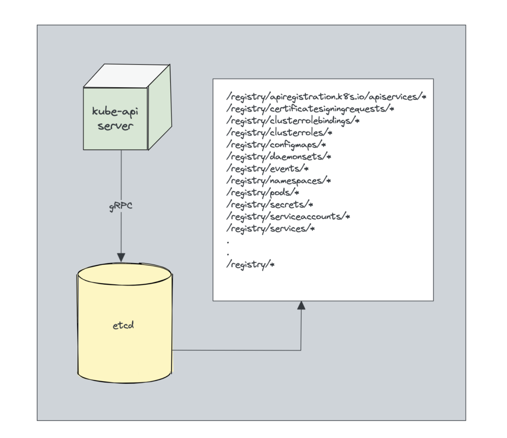

3. **kube-scheduler**
  - The kube-scheduler is responsible for **scheduling pods on worker nodes**.
  - When you deploy a pod, you specify the pod requirements such as CPU, memory, affinity, taints or tolerations, priority, persistent volumes (PV),  etc.
  - The scheduler’s primary task is to identify the create request and choose the best node for a pod that satisfies the requirements.

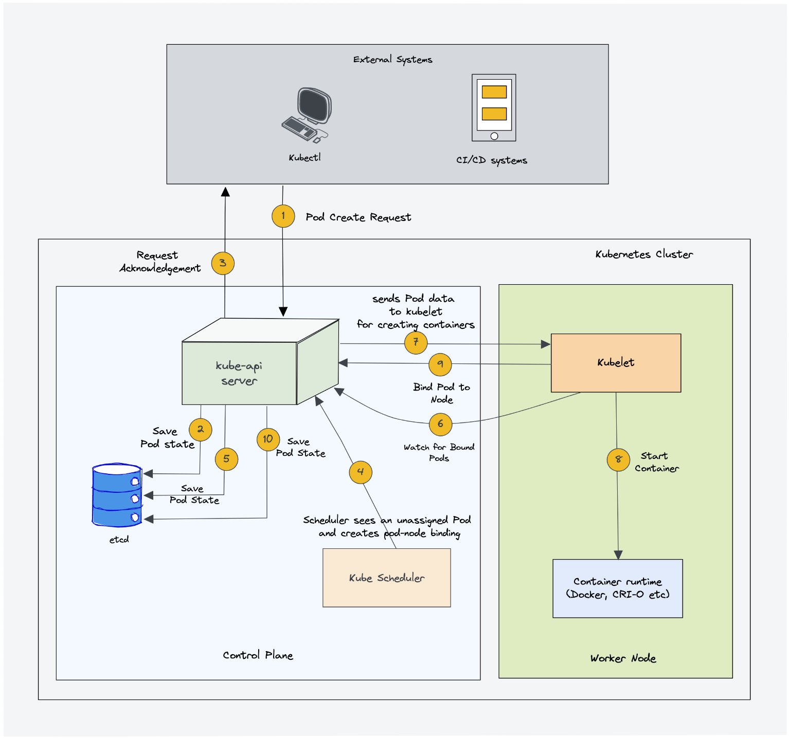

**In a Kubernetes cluster, there will be more than one worker node. So how does the scheduler select the node out of all worker nodes?**

  1. To choose the best node, the Kube-scheduler uses filtering and scoring operations.
  2. In filtering, the scheduler finds the best-suited nodes where the pod can be scheduled.
  3. For example, if there are five worker nodes with resource availability to run the pod, it selects all five nodes.
  4. If there are no nodes, then the pod is unschedulable and moved to the scheduling queue.
  5. If It is a large cluster, let’s say 100 worker nodes, and the scheduler doesn’t iterate over all the nodes. There is a scheduler configuration parameter called **percentageOfNodesToScore**.
  6. The default value is typically 50%.
  7. So it tries to iterate over 50% of nodes in a round-robin fashion.
  8. If the worker nodes are spread across multiple zones, then the scheduler iterates over nodes in different zones. For very large clusters the default **percentageOfNodesToScore** is 5%.
  9. In the scoring phase, the scheduler ranks the nodes by assigning a score to the filtered worker nodes. 
 10. The scheduler makes the scoring by calling multiple scheduling plugins. 
 11. Finally, the worker node with the highest rank will be selected for scheduling the pod.
 12. If all the nodes have the same rank, a node will be selected at random.
 13. Once the node is selected, the scheduler creates a binding event in the API server. Meaning an event to bind a pod and 
 14. It is a controller that listens to pod creation events in the API server.
 15. The scheduler has two phases. Scheduling cycle and the Binding cycle.Together it is called the scheduling context.
 16. The scheduling cycle selects a worker node and the binding cycle applies that change to the cluster.
 17. The scheduler always places the high-priority pods ahead of the low-priority pods for scheduling. Also, in some cases, after the pod started running in the selected node
 18. the pod might get evicted or moved to other nodes.
 19. You can create custom schedulers and run multiple schedulers in a cluster along with the native scheduler.

4. **Kube Controller Manager**
  -  Controllers are programs that run infinite control loops. Meaning it runs continuously and watches the actual and desired state of objects. If there is a difference in the actual and desired state, it ensures that the kubernetes resource/object is in the desired state.
  - In Kubernetes, controllers are control loops that watch the state of your cluster, then make or request changes where needed. Each controller tries to move the current cluster state closer to the desired state.
  - Let’s say you want to create a deployment, you specify the desired state in the manifest YAML file (declarative approach). For example, 2 replicas, one volume mount, configmap, etc. The in-built deployment controller ensures that the deployment is in the desired state all the time. If a user updates the deployment with 5 replicas, the deployment controller recognizes it and ensures the desired state is 5 replicas.
  - Kube controller manager is a component that manages all the Kubernetes controllers. Kubernetes resources/objects like pods, namespaces, jobs, replicaset are managed by respective controllers. Also, the kube scheduler is also a controller managed by Kube controller manager.

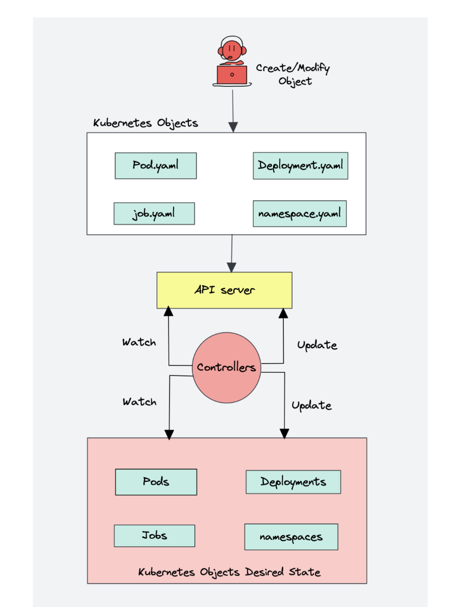

**Following is the list of important built-in Kubernetes controllers.**

  1. Deployment controller
  2. Replicaset controller
  3. DaemonSet controller 
  4. Job Controller (Kubernetes Jobs)
  5. CronJob Controller
  6. endpoints controller
  7. namespace controller
  8. service accounts controller.
  9. Node controller

**what you should know about the Kube controller manager.**
  1. It manages all the controllers and the controllers try to keep the cluster in the desired state.
  2. You can extend kubernetes with custom controllers associated with a custom resource definition.

5. **Cloud Controller Manager (CCM)**
When kubernetes is deployed in cloud environments, the cloud controller manager acts as a bridge between Cloud Platform APIs and the Kubernetes cluster.

This way the core kubernetes core components can work independently and allow the cloud providers to integrate with kubernetes using plugins. (For example, an interface between kubernetes cluster and AWS cloud API)

Cloud controller integration allows Kubernetes cluster to provision cloud resources like instances (for nodes), Load Balancers (for services), and Storage Volumes (for persistent volumes).

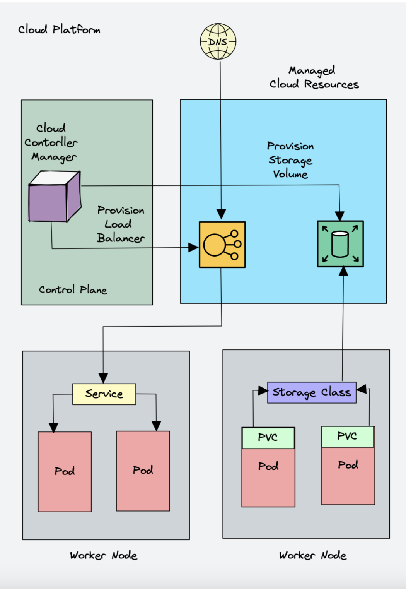

Cloud Controller Manager contains a set of cloud platform-specific controllers that ensure the desired state of cloud-specific components (nodes, Loadbalancers, storage, etc). Following are the three main controllers that are part of the cloud controller manager.

  1. **Node controller:** This controller updates node-related information by talking to the cloud provider API. For example, node labeling & annotation, getting hostname, CPU & memory availability, nodes health, etc.
  2. **Route controller:** It is responsible for configuring networking routes on a cloud platform. So that pods in different nodes can talk to each other.
  3. **Service controller:** It takes care of deploying load balancers for kubernetes services, assigning IP addresses, etc.

**Following are some of the classic examples of cloud controller manager.**

  1. Deploying Kubernetes Service of type Load balancer. Here Kubernetes provisions a Cloud-specific Loadbalancer and integrates with Kubernetes Service.
  2. Provisioning storage volumes (PV) for pods backed by cloud storage solutions.

Overall Cloud Controller Manager manages the lifecycle of cloud-specific resources used by kubernetes.

## **Kubernetes Worker Node Component**

1. **Kubelet**
Kubelet is an agent component that runs on every node in the cluster. It does not run as a container instead runs as a daemon, managed by systemd.

It is responsible for registering worker nodes with the API server and working with the podSpec (Pod specification – YAML or JSON) primarily from the API server.

podSpec defines the containers that should run inside the pod, their resources (e.g. CPU and memory limits), and other settings such as environment variables, volumes, and labels.

It then brings the podSpec to the desired state by creating containers.

To put it simply, kubelet is responsible for the following.

  1. Creating, modifying, and deleting containers for the pod.
  2. Responsible for handling liveliness, readiness, and startup probes.
  3. Responsible for Mounting volumes by reading pod configuration and creating respective directories on the host for the volume mount.
  4. Collecting and reporting Node and pod status via calls to the API server.

Kubelet is also a controller where it watches for pod changes and utilizes the node’s container runtime to pull images, run containers, etc.

Other than PodSpecs from the API server, kubelet can accept podSpec from a file, HTTP endpoint, and HTTP server. A good example of “podSpec from a file” is Kubernetes static pods.

Static pods are controlled by kubelet, not the API servers.

This means you can create pods by providing a pod YAML location to the Kubelet component. However, static pods created by Kubelet are not managed by the API server.

Here is a real-world example use case of the static pod.

While bootstrapping the control plane, kubelet starts the api-server, scheduler, and controller manager as static pods from podSpecs located at /etc/kubernetes/manifests

Following are some of the key things about kubelet.

  1. Kubelet uses the CRI (container runtime interface) gRPC interface to talk to the container runtime.
  2. It also exposes an HTTP endpoint to stream logs and provides exec sessions for clients.
  3. Uses the CSI (container storage interface) gRPC to configure block volumes.
  4. It uses the CNI plugin configured in the cluster to allocate the pod IP address and set up any necessary network routes and firewall rules for the pod.

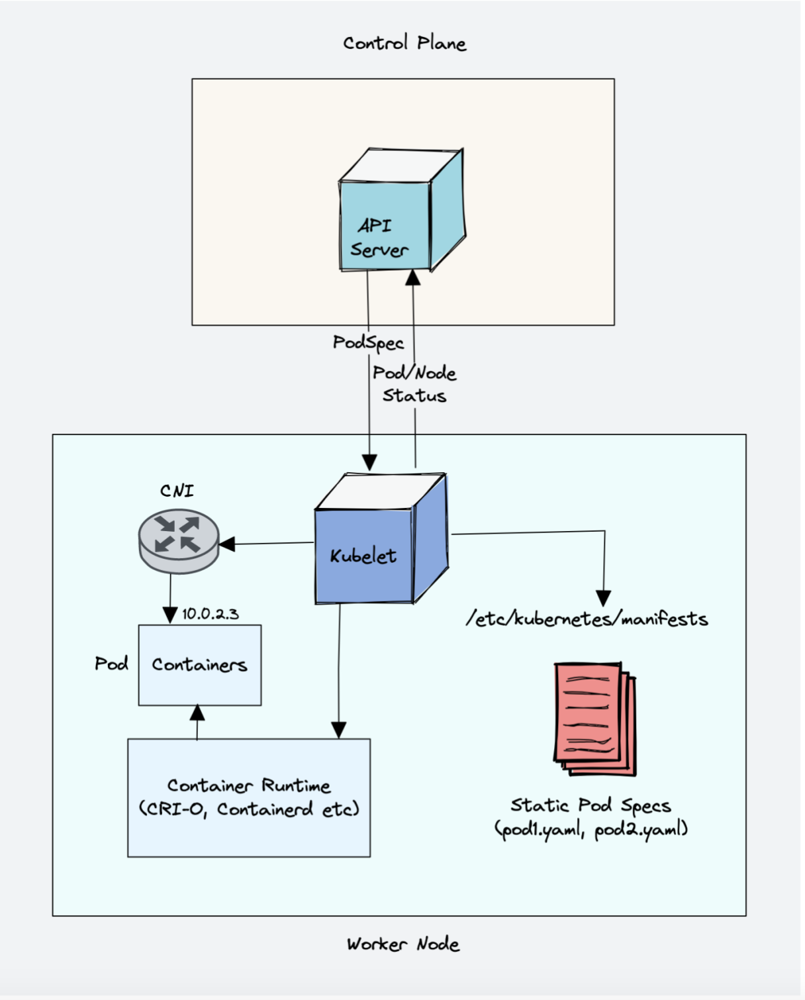

2. **Kube proxy**
To understand kube proxy, you need to have a basic knowledge of Kubernetes Service & endpoint objects.

Service in Kubernetes is a way to expose a set of pods internally or to external traffic.
When you create the service object, it gets a virtual IP assigned to it. It is called clusterIP. It is only accessible within the Kubernetes cluster.

The Endpoint object contains all the IP addresses and ports of pod groups under a Service object.
The endpoints controller is responsible for maintaining a list of pod IP addresses (endpoints). The service controller is responsible for configuring endpoints to a service.

You cannot ping the ClusterIP because it is only used for service discovery, unlike pod IPs which are pingable.

Now let’s understand Kube Proxy.

Kube-proxy is a daemon that runs on every node as a daemonset. It is a proxy component that implements the Kubernetes Services concept for pods. (single DNS for a set of pods with load balancing). It primarily proxies UDP, TCP, and SCTP and does not understand HTTP.

When you expose pods using a Service (ClusterIP), Kube-proxy creates network rules to send traffic to the backend pods (endpoints) grouped under the Service object. Meaning, all the load balancing, and service discovery are handled by the Kube proxy.

**So how does Kube-proxy work?**

Kube proxy talks to the API server to get the details about the Service (ClusterIP) and respective pod IPs & ports (endpoints). It also monitors for changes in service and endpoints.

Kube-proxy then uses any one of the following modes to create/update rules for routing traffic to pods behind a Service

  1. **IPTables:** It is the default mode. In IPTables mode, the traffic is handled by IPtable rules. In this mode, kube-proxy chooses the backend pod random for load balancing. Once the connection is established, the requests go to the same pod until the connection is terminated.
  2. **IPVS:** For clusters with services exceeding 1000, IPVS offers performance improvement. It supports the following load-balancing algorithms for the backend.

   - rr: round-robin : It is the default mode.
   - lc: least connection (smallest number of open connections)
   - dh: destination hashing
   - sh: source hashing
   - sed: shortest expected delay
   - nq: never queue
  
  3. **Userspace** (legacy & not recommended)
  4. **Kernelspace:** This mode is only for windows systems.

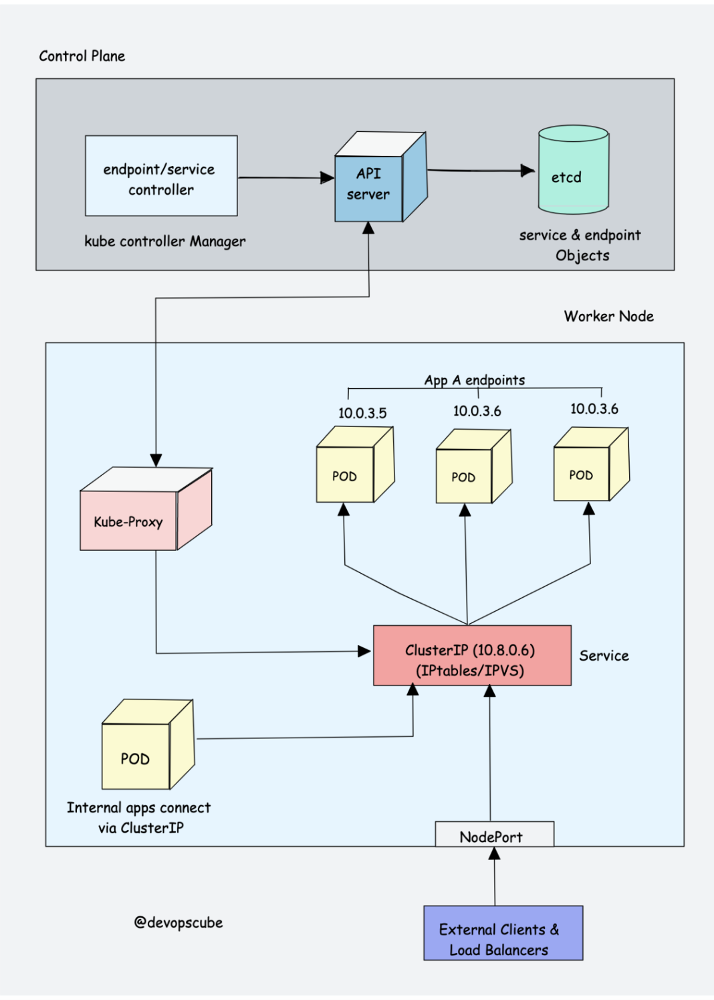

Also, you can run a Kubernetes cluster without kube-proxy by replacing it with Cilium.

3. **Container Runtime**
You probably know about Java Runtime (JRE). It is the software required to run Java programs on a host. In the same way, container runtime is a software component that is required to run containers.

Container runtime runs on all the nodes in the Kubernetes cluster. It is responsible for pulling images from container registries, running containers, allocating and isolating resources for containers, and managing the entire lifecycle of a container on a host.

To understand this better, let’s take a look at two key concepts:

  1. **Container Runtime Interface (CRI):** It is a set of APIs that allows Kubernetes to interact with different container runtimes. It allows different container runtimes to be used interchangeably with Kubernetes. The CRI defines the API for creating, starting, stopping, and deleting containers, as well as for managing images and container networks.

  2. **Open Container Initiative (OCI):** It is a set of standards for container formats and runtimes

Kubernetes supports multiple container runtimes (CRI-O, Docker Engine, containerd, etc) that are compliant with Container Runtime Interface (CRI). This means, all these container runtimes implement the CRI interface and expose gRPC CRI APIs (runtime and image service endpoints).

So how does Kubernetes make use of the container runtime?

As we learned in the Kubelet section, the kubelet agent is responsible for interacting with the container runtime using CRI APIs to manage the lifecycle of a container. It also gets all the container information from the container runtime and provides it to the control plane.

Let’s take an example of CRI-O container runtime interface. Here is a high-level overview of how container runtime works with kubernetes.

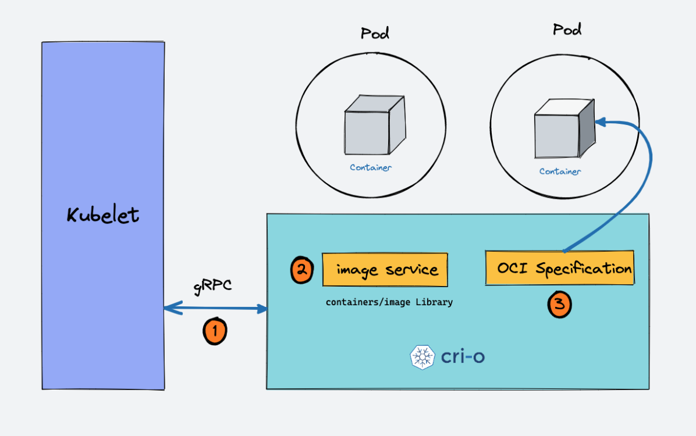

  1. When there is a new request for a pod from the API server, the kubelet talks to CRI-O daemon to launch the required containers via Kubernetes Container Runtime Interface.
  2. CRI-O checks and pulls the required container image from the configured container registry using containers/image library.
  3. CRI-O then generates OCI runtime specification (JSON) for a container.
  4. CRI-O then launches an OCI-compatible runtime (runc) to start the container process as per the runtime specification.

**Kubernetes Cluster Addon Components**

Apart from the core components, the kubernetes cluster needs addon components to be fully operational. Choosing an addon depends on the project requirements and use cases.

Following are some of the popular addon components that you might need on a cluster.

  1. **CNI Plugin (Container Network Interface)**
  2. **CoreDNS (For DNS server):** CoreDNS acts as a DNS server within the Kubernetes cluster. By enabling this addon, you can enable DNS-based service discovery.
  3. **Metrics Server (For Resource Metrics):** This addon helps you collect performance data and resource usage of Nodes and pods in the cluster.
  4. **Web UI (Kubernetes Dashboard):** This addon enables the Kubernetes dashboard for managing the object via web UI.

1. **CNI Plugin**

First, you need to understand Container Networking Interface (CNI)

It is a plugin-based architecture with vendor-neutral specifications and libraries for creating network interfaces for Containers.

It is not specific to Kubernetes. With CNI container networking can be standardized across container orchestration tools like Kubernetes, Mesos, CloudFoundry, Podman, Docker, etc.

When it comes to container networking, companies might have different requirements such as network isolation, security, encryption, etc. As container technology advanced, many network providers created CNI-based solutions for containers with a wide range of networking capabilities. You can call it as CNI-Plugins

This allows users to choose a networking solution that best fits their needs from different providers.

**How does CNI Plugin work with Kubernetes?**

  1. The Kube-controller-manager is responsible for assigning pod CIDR to each node. Each pod gets a unique IP address from the pod CIDR.
  2. Kubelet interacts with container runtime to launch the scheduled pod. The CRI plugin which is part of the Container runtime interacts with the CNI plugin to configure the pod network.
  3. CNI Plugin enables networking between pods spread across the same or different nodes using an overlay network.

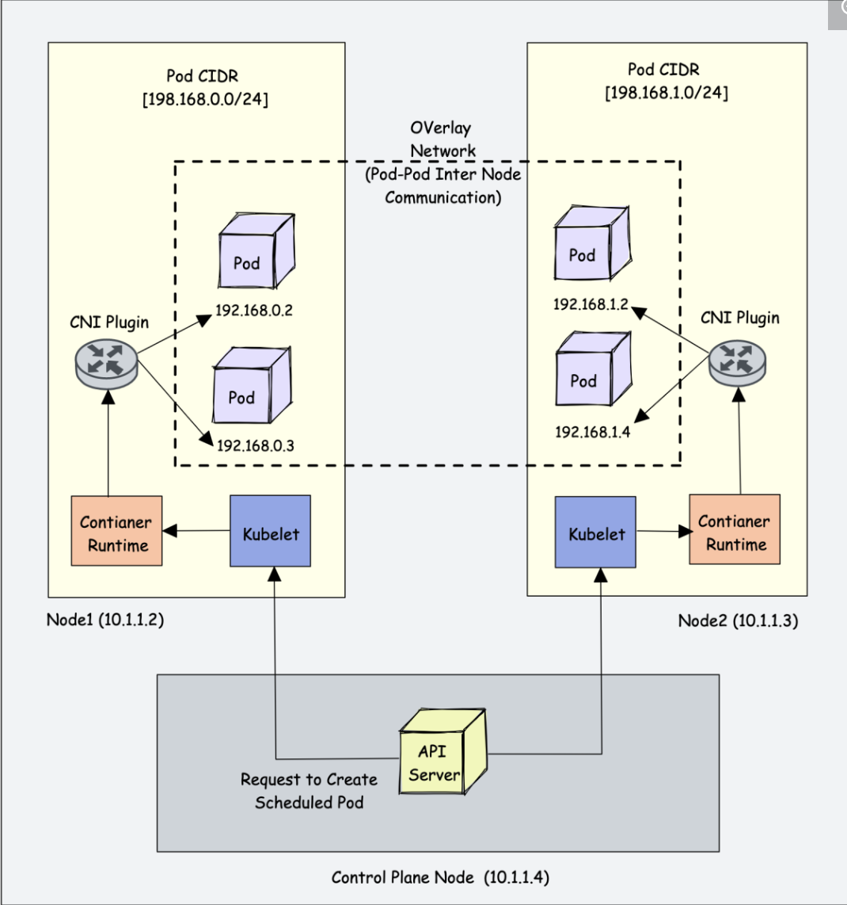

Following are high-level functionalities provided by CNI plugins.

  1. Pod Networking
  2. Pod network security & isolation using Network Policies to control the traffic flow between pods and between namespaces.

Some popular CNI plugins include:

  1. Calico
  2. Flannel
  3. Weave Net
  4. Cilium (Uses eBPF)
  5. Amazon VPC CNI (For AWS VPC)
  6. Azure CNI (For Azure Virtual network)Kubernetes networking is a big topic and it differs based on the hosting platforms.

