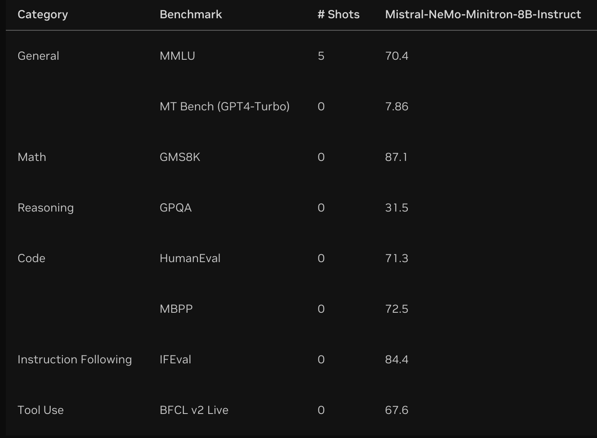
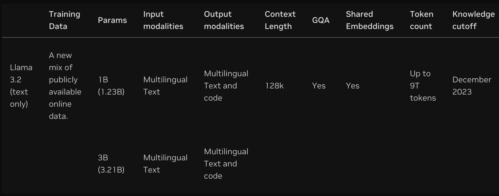
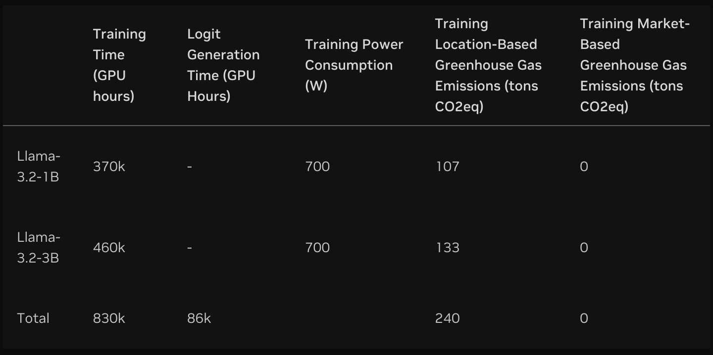
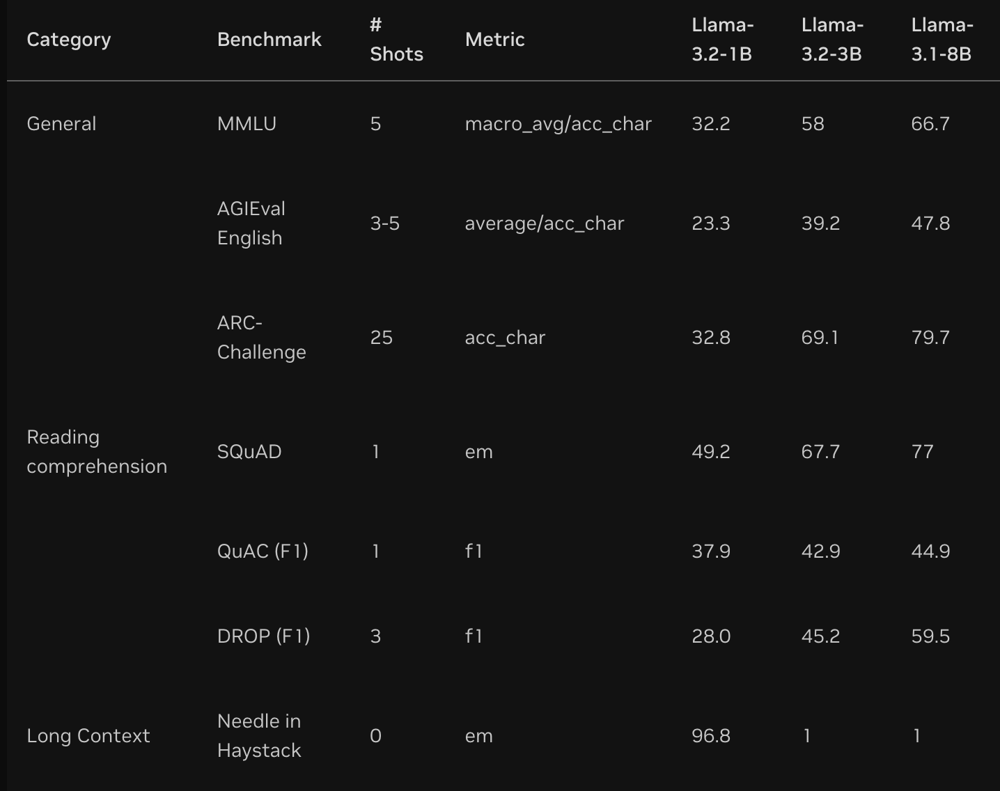

## Publisher: **NVIDIA**

## <span style="color:blue">1. Model: nvidia/llama-3.1-nemotron-70b-instruct</span>


## Model Overview

Llama-3.1-Nemotron-70B-Instruct is a large language model customized by NVIDIA to improve the helpfulness of LLM generated responses to user queries.

This model is ready for commercial use.

## Model Architecture:

- **Architecture Type:** Transformer
- **Network Architecture:** Llama 3.1

## Input:

- **Input Type(s):** Text
- **Input Format:** String
- **Input Parameters:** One Dimensional (1D)
- **Other Properties Related to Input:** Max of 128k tokens

## Output:

- **Output Type(s):** Text
- **Output Format:** String
- **Output Parameters:** One Dimensional (1D)
- **Other Properties Related to Output:** Max of 4k tokens

## Supported Hardware Microarchitecture Compatibility:

- NVIDIA Ampere
- NVIDIA Hopper
- NVIDIA Turing

**Supported Operating System(s):** Linux

## Training & Evaluation:

**Datasets:**
**Data Collection Method by dataset**

[Hybrid: Human, Synthetic]

**Labeling Method by dataset**

[Human]

**Properties (Quantity, Dataset Descriptions, Sensor(s)):**

21, 362 prompt-responses built to make more models more aligned with human preference - specifically more helpful, factually-correct, coherent, and customizable based on complexity and verbosity.
20, 324 prompt-responses used for training and 1, 038 used for validation.

## Inference:

**Engine:** Triton
**Test Hardware:** H100, A100 80GB, A100 40GB

**Ethical Considerations:**
NVIDIA believes Trustworthy AI is a shared responsibility and we have established policies and practices to enable development for a wide array of AI applications. When downloaded or used in accordance with our terms of service, developers should work with their supporting model team to ensure this model meets requirements for the relevant industry and use case and addresses unforeseen product misuse. For more detailed information on ethical considerations for this model, please see the Model Card++ Explainability, Bias, Safety & Security, and Privacy Subcards. Please report security vulnerabilities or NVIDIA AI Concerns

**Python**

```
from openai import OpenAI

client = OpenAI(
  base_url = "https://integrate.api.nvidia.com/v1",
  api_key = "$API_KEY_REQUIRED_IF_EXECUTING_OUTSIDE_NGC"
)

completion = client.chat.completions.create(
  model="nvidia/llama-3.1-nemotron-70b-instruct",
  messages=[{"role":"user","content":"Write a limerick about the wonders of GPU computing."}],
  temperature=0.5,
  top_p=1,
  max_tokens=1024,
  stream=True
)

for chunk in completion:
  if chunk.choices[0].delta.content is not None:
    print(chunk.choices[0].delta.content, end="")

```

**Shell**

```
curl https://integrate.api.nvidia.com/v1/chat/completions \
  -H "Content-Type: application/json" \
  -H "Authorization: Bearer $API_KEY_REQUIRED_IF_EXECUTING_OUTSIDE_NGC" \
  -d '{
    "model": "nvidia/llama-3.1-nemotron-70b-instruct",
    "messages": [{"role":"user","content":"Write a limerick about the wonders of GPU computing."}],
    "temperature": 0.5,   
    "top_p": 1,
    "max_tokens": 1024,
    "stream": true                
  }'
```

## Publisher: **NVIDIA**

## <span style="color:blue">2. Model: nvidia/mistral-nemo-minitron-8b-8k-instruct</span>

**Project**
Build a Customizable Hybrid RAG Chatbot

## Model Overview

Mistral-NeMo-Minitron-8B-Instruct is a model for generating responses for various text-generation tasks including roleplaying, retrieval augmented generation, and function calling. It is a fine-tuned version of nvidia/Mistral-NeMo-Minitron-8B-Base, which was pruned and distilled from Mistral-NeMo 12B using our LLM compression technique. The model was trained using a multi-stage SFT and preference-based alignment technique with NeMo Aligner. For details on the alignment technique, please refer to the Nemotron-4 340B Technical Report. The model supports a context length of 8,192 tokens.

**License/Terms of Use:**
NVIDIA Open Model License

## Model Architecture:
**Architecture Type:** Transformer
**Network Architecture:** Decoder-only

## Input:
**Input Type(s):** Text (Prompt)
**Input Format(s):** String
**Input Parameters:** One Dimensional (1D)
**Other Properties Related to Input:** The model has a maximum of 8192 input tokens.

## Output:
**Output Type(s):** Text (Response)
**Output Format:** String
**Output Parameters:** 1D
**Other Properties Related to Output:** The model has a maximum of 8192 input tokens. Maximum output for both versions can be set apart from input.

**Prompt Format:**
We recommend using the following prompt template, which was used to fine-tune the model. The model may not perform optimally without it.

```
<extra_id_0>System
{system prompt}

<extra_id_1>User
{prompt}
<extra_id_1>Assistant\n
```

Note that a newline character \n should be added at the end of the prompt.
We recommend using <extra_id_1> as a stop token.

**Evaluation Results**



**Software Integration: (Cloud)**

**Runtime Engine:** NeMo Framework 24.09

Supported Hardware Microarchitecture Compatibility:

[NVIDIA Ampere]
[NVIDIA Blackwell]
[NVIDIA Hopper]
[NVIDIA Lovelace]

Model Version(s)
Mistral-NeMo-Minitron 8B Instruct

## Training & Evaluation:
Training Dataset:
** Data Collection Method by dataset

Hybrid: Automated, Human
** Labeling Method by dataset

Hybrid: Automated, Human

## Evaluation Dataset:
** Data Collection Method by dataset

Hybrid: Automated, Human
** Labeling Method by dataset

Human

## Inference:
Engine: TRT-LLM
Test Hardware:

A100
A10G
H100
L40S
Supported Hardware Platform(s): L40S, A10G, A100, H100

## Ethical Considerations:
NVIDIA believes Trustworthy AI is a shared responsibility and we have established policies and practices to enable development for a wide array of AI applications. When downloaded or used in accordance with our terms of service, developers should work with their internal model team to ensure this model meets requirements for the relevant industry and use case and addresses unforeseen product misuse.

**Python**

```
from openai import OpenAI

client = OpenAI(
  base_url = "https://integrate.api.nvidia.com/v1",
  api_key = "$API_KEY_REQUIRED_IF_EXECUTING_OUTSIDE_NGC"
)

completion = client.chat.completions.create(
  model="nvidia/mistral-nemo-minitron-8b-8k-instruct",
  messages=[{"role":"user","content":"Write a limerick about the wonders of GPU computing."}],
  temperature=0.5,
  top_p=1,
  max_tokens=1024,
  stream=True
)

for chunk in completion:
  if chunk.choices[0].delta.content is not None:
    print(chunk.choices[0].delta.content, end="")

```

**Shell**
```
curl https://integrate.api.nvidia.com/v1/chat/completions \
  -H "Content-Type: application/json" \
  -H "Authorization: Bearer $API_KEY_REQUIRED_IF_EXECUTING_OUTSIDE_NGC" \
  -d '{
    "model": "nvidia/mistral-nemo-minitron-8b-8k-instruct",
    "messages": [{"role":"user","content":"Write a limerick about the wonders of GPU computing."}],
    "temperature": 0.5,   
    "top_p": 1,
    "max_tokens": 1024,
    "stream": true                
  }'
```

**Docker**
Pull and run nvidia/mistral-nemo-minitron-8b-8k-instruct using Docker (this will download the full model and run it in your local environment)

```
$ docker login nvcr.io
Username: $oauthtoken
Password: <PASTE_API_KEY_HERE>
```

Pull and run the NVIDIA NIM with the command below. This will download the optimized model for your infrastructure.

```
export NGC_API_KEY=<PASTE_API_KEY_HERE>
export LOCAL_NIM_CACHE=~/.cache/nim
mkdir -p "$LOCAL_NIM_CACHE"
docker run -it --rm \
    --gpus all \
    --shm-size=16GB \
    -e NGC_API_KEY \
    -v "$LOCAL_NIM_CACHE:/opt/nim/.cache" \
    -u $(id -u) \
    -p 8000:8000 \
    nvcr.io/nim/nv-mistralai/mistral-nemo-minitron-8b-8k-instruct:latest
```

You can now make a local API call using this curl command:

```
curl -X 'POST' \
'http://0.0.0.0:8000/v1/chat/completions' \
-H 'accept: application/json' \
-H 'Content-Type: application/json' \
-d '{
    "model": "nv-mistralai/mistral-nemo-minitron-8b-8k-instruct",
    "messages": [{"role":"user", "content":"Write a limerick about the wonders of GPU computing."}],
    "max_tokens": 64
}'
```

## Publisher: **meta**

## <span style="color:blue">3. Model: meta/llama-3.2-3b-instruct</span>

## Model Information

The Meta Llama 3.2 collection of multilingual large language models (LLMs) is a collection of pre-trained and instruction-tuned generative models in 1B and 3B sizes (text in/text out). The Llama 3.2 instruction-tuned text only models are optimized for multilingual dialogue use cases, including agentic retrieval and summarization tasks. They outperform many of the available open source and closed chat models on common industry benchmarks. Llama 3.2 models are ready for commercial use.

Models are accelerated by TensorRT-LLM, a library for optimizing Large Language Model (LLM) inference on NVIDIA GPUs.

**Models in this Collection:**

Llama-3.2-1B
Llama-3.2-1B-Instruct
Llama-3.2-3B
Llama-3.2-3B-Instruct

Third-Party Community Consideration: This model is not owned or developed by NVIDIA. This model has been developed and built to a third-party’s requirements for this application and use case; see link to Non-NVIDIA Llama 3.2 Model Card.

**License:** Use of Llama 3.2 is governed by the Llama 3.2 Community License (a custom, commercial license agreement).

**Model Architecture:** Llama 3.2 is an auto-regressive language model that uses an optimized transformer architecture. The tuned versions use supervised fine-tuning (SFT) and reinforcement learning with human feedback (RLHF) to align with human preferences for helpfulness and safety.



**Supported Languages:** English, German, French, Italian, Portuguese, Hindi, Spanish, and Thai are officially supported. Llama 3.2 has been trained on a broader collection of languages than these 8 supported languages. Developers may fine-tune Llama 3.2 models for languages beyond these supported languages, provided they comply with the Llama 3.2 Community License and the Acceptable Use Policy. Developers are always expected to ensure that their deployments, including those that involve additional languages, are completed safely and responsibly.


**Intended Use**

**Intended Use Cases:** Llama 3.2 is intended for commercial and research use in multiple languages. Instruction tuned text only models are intended for assistant-like chat and agentic applications like knowledge retrieval and summarization, mobile AI powered writing assistants and query and prompt rewriting. Pre-trained models can be adapted for a variety of additional natural language generation tasks.

**Out of Scope:** Use in any manner that violates applicable laws or regulations (including trade compliance laws). Use in any other way that is prohibited by the Acceptable Use Policy and Llama 3.2 Community License. Use in languages beyond those explicitly referenced as supported in this model card.

## Hardware and Software

**Training Factors:** We used custom training libraries, Meta's custom built GPU cluster, and production infrastructure for pre-training. Fine-tuning, annotation, and evaluation were also performed on production infrastructure.

**Training Energy Use:** Training utilized a cumulative of 916k GPU hours of computation on H100-80GB (TDP of 700W) type hardware, per the table below. Training time is the total GPU time required for training each model and power consumption is the peak power capacity per GPU device used, adjusted for power usage efficiency.

**Training Greenhouse Gas Emissions:** Estimated total location-based greenhouse gas emissions were 240 tons CO2eq for training. Since 2020, Meta has maintained net zero greenhouse gas emissions in its global operations and matched 100% of its electricity use with renewable energy; therefore, the total market-based greenhouse gas emissions for training were 0 tons CO2eq.



## Training Data

**Data Collection Method:** Unknown
**Labeling Method:** Unknown

**Overview:** Llama 3.2 was pre-trained on up to 9 trillion tokens of data from publicly available sources. For the 1B and 3B Llama 3.2 models, we incorporated logits from the Llama 3.1 8B and 70B models into the pre-training stage of the model development, where outputs (logits) from these larger models were used as token-level targets. Knowledge distillation was used after pruning to recover performance. In post-training we used a similar recipe as Llama 3.1 and produced final chat models by doing several rounds of alignment on top of the pre-trained model. Each round involved Supervised Fine-Tuning (SFT), Rejection Sampling (RS), and Direct Preference Optimization (DPO).

**Data Freshness:** The pre-training data has a cutoff of December 2023.

## Benchmarks - English Text

In this section, we report the results for Llama 3.2 models on standard automatic benchmarks. For all these evaluations, we used our internal evaluations library.

**Base Pre-trained Models**



**Inference**
**Supported Hardware Microarchitecture Compatibility:**

NVIDIA Ampere
NVIDIA Hopper
NVIDIA Lovelace
NVIDIA Jetson

**Supported Operating System(s):**

Linux
Windows

**Python**

```
from openai import OpenAI

client = OpenAI(
  base_url = "https://integrate.api.nvidia.com/v1",
  api_key = "$API_KEY_REQUIRED_IF_EXECUTING_OUTSIDE_NGC"
)

completion = client.chat.completions.create(
  model="meta/llama-3.2-3b-instruct",
  messages=[{"role":"user","content":"Write a limerick about the wonders of GPU computing."}],
  temperature=0.2,
  top_p=0.7,
  max_tokens=1024,
  stream=True
)

for chunk in completion:
  if chunk.choices[0].delta.content is not None:
    print(chunk.choices[0].delta.content, end="")

```

**LangChain**

```
from langchain_nvidia_ai_endpoints import ChatNVIDIA

client = ChatNVIDIA(
  model="meta/llama-3.2-3b-instruct",
  api_key="$API_KEY_REQUIRED_IF_EXECUTING_OUTSIDE_NGC", 
  temperature=0.2,
  top_p=0.7,
  max_tokens=1024,
)

for chunk in client.stream([{"role":"user","content":"Write a limerick about the wonders of GPU computing."}]): 
  print(chunk.content, end="")
  
```

**Shell**

```
invoke_url='https://integrate.api.nvidia.com/v1/chat/completions'

authorization_header='Authorization: Bearer $API_KEY_REQUIRED_IF_EXECUTING_OUTSIDE_NGC'
accept_header='Accept: application/json'
content_type_header='Content-Type: application/json'

data=$'{
  "messages": [
    {
      "role": "user",
      "content": "Write a limerick about the wonders of GPU computing."
    }
  ],
  "stream": true,
  "model": "meta/llama-3.2-3b-instruct",
  "max_tokens": 1024,
  "presence_penalty": 0,
  "frequency_penalty": 0,
  "top_p": 0.7,
  "temperature": 0.2
}'

response=$(curl --silent -i -w "\n%{http_code}" --request POST \
  --url "$invoke_url" \
  --header "$authorization_header" \
  --header "$accept_header" \
  --header "$content_type_header" \
  --data "$data"
)

echo "$response"
```

**Ref Link:**
[meta/llama-3.2-3b-instruct] (https://build.nvidia.com/meta/llama-3.2-3b-instruct)


## Publisher: **google**

## <span style="color:blue">4. Model: google/gemma-2-2b-it</span>


## Model Information

Gemma is a family of lightweight, state-of-the-art open models from Google, built from the same research and technology used to create the Gemini models. They are text-to-text, decoder-only large language models, available in English, with open weights for both pre-trained variants and instruction-tuned variants. Gemma models are well-suited for a variety of text generation tasks, including question answering, summarization, and reasoning. Their relatively small size makes it possible to deploy them in environments with limited resources such as a laptop, desktop or your own cloud infrastructure, democratizing access to state of the art AI models and helping foster innovation for everyone.

**Model Information**
Summary description and brief definition of inputs and outputs.


**Limitations**

**Training Data**

The quality and diversity of the training data significantly influence the model's capabilities. Biases or gaps in the training data can lead to limitations in the model's responses.
The scope of the training dataset determines the subject areas the model can handle effectively.


## Model Architecture:
**Architecture Type:** Transformer
**Network Architecture:** Gemma-2
Model Version: 0.1

**Input:**
Input Type(s): Text
Input Format(s): String
Input Parameters: One-Dimensional (1D)
Other Properties Related to Output: Text can be question, a prompt, or a document to be summarized.

**Output:**
Output Type(s): Text
Output Format(s): String
Output Parameters: One-Dimensional (1D)
Other Properties Related to Output: Generated English-language text in response to the input (e.g., an answer to the question, a summary of the document).


**Python**

```
from openai import OpenAI

client = OpenAI(
  base_url = "https://integrate.api.nvidia.com/v1",
  api_key = "$API_KEY_REQUIRED_IF_EXECUTING_OUTSIDE_NGC"
)

completion = client.chat.completions.create(
  model="google/gemma-2-2b-it",
  messages=[{"role":"user","content":"Write a limerick about the wonders of GPU computing."}],
  temperature=0.2,
  top_p=0.7,
  max_tokens=1024,
  stream=True
)

for chunk in completion:
  if chunk.choices[0].delta.content is not None:
    print(chunk.choices[0].delta.content, end="")

```

**Langchain**

```
from langchain_nvidia_ai_endpoints import ChatNVIDIA

client = ChatNVIDIA(
  model="google/gemma-2-2b-it",
  api_key = "$API_KEY_REQUIRED_IF_EXECUTING_OUTSIDE_NGC", 
  temperature=0.2,
  top_p=0.7,
  max_tokens=1024,
)

for chunk in client.stream([{"role":"user","content":"Write a limerick about the wonders of GPU computing."}]): 
  print(chunk.content, end="")

```

**Shell**

```
curl https://integrate.api.nvidia.com/v1/chat/completions \
  -H "Content-Type: application/json" \
  -H "Authorization: Bearer $API_KEY_REQUIRED_IF_EXECUTING_OUTSIDE_NGC" \
  -d '{
    "model": "google/gemma-2-2b-it",
    "messages": [{"role":"user","content":"Write a limerick about the wonders of GPU computing."}],
    "temperature": 0.2,   
    "top_p": 0.7,
    "max_tokens": 1024,
    "stream": true                
  }'
```

**Ref Link:**
[google/gemma-2-2b-it] (https://build.nvidia.com/google/gemma-2-2b-it)


## Publisher: **NVIDIA(NIM microservice)**

## <span style="color:blue">5. Model: nvidia/usdcode-llama3-70b-instruct</span>

## Model Overview
USD Code (usdcode-llama3-70b-instruct) is an OpenUSD Python code generation and knowledge answering model that helps developers to write OpenUSD code and answer OpenUSD knowledge questions.

This model is available for preview, demonstration, and non-production usage on the NVIDIA API Catalog.

**References:**
Llama3 - https://ai.meta.com/blog/meta-llama-3/
OpenUSD - https://www.openusd.org/

**Model Architecture:**
**Architecture Type:** Transformer-Based Architecture

**Network Architecture:** Llama-3

**Input**
Input Type(s): Text
Input Format(s): String
Other Properties Related to Input: Max context length of 8k tokens

**Output**
Output Type(s): Text (Code, Python)
Output Format: String
Other Properties Related to Output: Max output length of 8k tokens

**Software Integration:**
Runtime Engine(s):

NIM 1.0.0
**Supported Hardware Microarchitecture Compatibility:**

NVIDIA Hopper

**Training, Testing, and Evaluation Datasets:**
Training Dataset:
Data Collection Method by dataset

Hybrid: Automated, Synthetic
Labeling Method by dataset

Unknown
Properties (Quantity, Dataset Descriptions, Sensor(s)):

59,729 question/answer pairs (text)

**Evaluation Dataset:**
Data Collection Method by dataset

Hybrid: Automated, Synthetic
Labeling Method by dataset

Not Applicable
Properties (Quantity, Dataset Descriptions, Sensor(s)):

100 question/answer pairs (text)

**Inference:**
Engine:

TensorRT
**Test Hardware:**

H100

**Python**

```
from openai import OpenAI

client = OpenAI(
  base_url = "https://integrate.api.nvidia.com/v1",
  api_key = "$API_KEY_REQUIRED_IF_EXECUTING_OUTSIDE_NGC"
)

completion = client.chat.completions.create(
  model="nvidia/usdcode-llama3-70b-instruct",
  messages=[{"role":"user","content":"What is LIVRPS?"}],
  temperature=0.1,
  top_p=1,
  max_tokens=1024,
  stream=True
)

for chunk in completion:
  if chunk.choices[0].delta.content is not None:
    print(chunk.choices[0].delta.content, end="")

```

**Shell**

```
curl https://integrate.api.nvidia.com/v1/chat/completions \
  -H "Content-Type: application/json" \
  -H "Authorization: Bearer $API_KEY_REQUIRED_IF_EXECUTING_OUTSIDE_NGC" \
  -d '{
    "model": "nvidia/usdcode-llama3-70b-instruct",
    "messages": [{"role":"user","content":"What is LIVRPS?"}],
    "temperature": 0.1,   
    "top_p": 1,
    "max_tokens": 1024,
    "stream": true                
  }'
```

**Ref Link:**
[nvidia/usdcode-llama3-70b-instruct] (https://build.nvidia.com/nvidia/usdcode-llama3-70b-instruct)


## Publisher: **NVIDIA(NIM microservice)**

## <span style="color:blue">6. Model: nv-mistralai/mistral-nemo-12b-instruct</span>

## Model Overview
Mistral-NeMo is a Large Language Model (LLM) composed of 12B parameters. This model leads accuracy on popular benchmarks across common sense reasoning, coding, math, multilingual and multi-turn chat tasks; it significantly outperforms existing models smaller or similar in size.

**Model Architecture:**
Architecture Type: Transformer
Network Architecture: Mistral

This transformer model has the following characteristics:

Layers: 40
Dim: 5,120
Head dim: 128
Hidden dim: 14,436
Activation Function: SwiGLU
Number of heads: 32
Number of kv-heads: 8 (GQA)
Rotary embeddings (theta = 1M)
Vocabulary size: 2**17 ~= 128k

**Input**

Input Type: Text
Input Format: String
Input Parameters: max_tokens, temperature, top_p, stop, frequency_penalty, presence_penalty, seed

**Output**

Output Type: Text
Output Format: String

**Inference**
Engine: TensorRT-LLM
Test Hardware: H100

**Python**

```
from openai import OpenAI

client = OpenAI(
  base_url = "https://integrate.api.nvidia.com/v1",
  api_key = "$API_KEY_REQUIRED_IF_EXECUTING_OUTSIDE_NGC"
)

completion = client.chat.completions.create(
  model="nv-mistralai/mistral-nemo-12b-instruct",
  messages=[{"role":"user","content":"Write a limerick about the wonders of GPU computing."}],
  temperature=0.2,
  top_p=0.7,
  max_tokens=1024,
  stream=True
)

for chunk in completion:
  if chunk.choices[0].delta.content is not None:
    print(chunk.choices[0].delta.content, end="")

```

**LangChain**

```
from langchain_nvidia_ai_endpoints import ChatNVIDIA

client = ChatNVIDIA(
  model="nv-mistralai/mistral-nemo-12b-instruct",
  api_key="$API_KEY_REQUIRED_IF_EXECUTING_OUTSIDE_NGC", 
  temperature=0.2,
  top_p=0.7,
  max_tokens=1024,
)

for chunk in client.stream([{"role":"user","content":"Write a limerick about the wonders of GPU computing."}]): 
  print(chunk.content, end="")

```

**Shell**

```
curl https://integrate.api.nvidia.com/v1/chat/completions \
  -H "Content-Type: application/json" \
  -H "Authorization: Bearer $API_KEY_REQUIRED_IF_EXECUTING_OUTSIDE_NGC" \
  -d '{
    "model": "nv-mistralai/mistral-nemo-12b-instruct",
    "messages": [{"role":"user","content":"Write a limerick about the wonders of GPU computing."}],
    "temperature": 0.2,   
    "top_p": 0.7,
    "max_tokens": 1024,
    "stream": true                
  }'
```

**Docker**

Pull and run nv-mistralai/mistral-nemo-12b-instruct using Docker (this will download the full model and run it in your local environment)

```
$ docker login nvcr.io
Username: $oauthtoken
Password: <PASTE_API_KEY_HERE>
```

Pull and run the NVIDIA NIM with the command below. This will download the optimized model for your infrastructure.

```
export NGC_API_KEY=<PASTE_API_KEY_HERE>
export LOCAL_NIM_CACHE=~/.cache/nim
mkdir -p "$LOCAL_NIM_CACHE"
docker run -it --rm \
    --gpus all \
    --shm-size=16GB \
    -e NGC_API_KEY \
    -v "$LOCAL_NIM_CACHE:/opt/nim/.cache" \
    -u $(id -u) \
    -p 8000:8000 \
    nvcr.io/nim/nv-mistralai/mistral-nemo-12b-instruct:latest
```

You can now make a local API call using this curl command:

```
curl -X 'POST' \
'http://0.0.0.0:8000/v1/chat/completions' \
-H 'accept: application/json' \
-H 'Content-Type: application/json' \
-d '{
    "model": "mistral-nemo-12b-instruct",
    "messages": [{"role":"user", "content":"Write a limerick about the wonders of GPU computing."}],
    "max_tokens": 64
}'
```

**Ref Link:**
[nv-mistralai/mistral-nemo-12b-instruct] (https://build.nvidia.com/nv-mistralai/mistral-nemo-12b-instruct)


## Publisher: **NVIDIA(NIM microservice)**

## <span style="color:blue">7. Model: microsoft/phi-3-small-8k-instruct</span>

## Model Overview
Phi-3-Small is a lightweight, state-of-the-art open model built upon datasets used for Phi-2 - synthetic data and filtered publicly available websites - with a focus on very high-quality, reasoning dense data. The model belongs to the Phi-3 model family, and the small version comes in two variants 8K and 128K which is the context length (in tokens) it can support. The model underwent a rigorous enhancement process, incorporating both supervised fine-tuning and direct preference optimization to ensure precise instruction adherence and robust safety measures. This model is ready for commercial and research use.

**Loading the model locally**
The model requires tiktoken and Triton packages. After obtaining the Phi-3-Small-8K-Instruct model checkpoints, users can use this sample code for inference.

```
import torch

from transformers import AutoModelForCausalLM, AutoTokenizer, pipeline

torch.random.manual_seed(0)

model_id = "microsoft/Phi-3-small-8k-instruct"

model = AutoModelForCausalLM.from_pretrained(

model_id,

device_map="cuda",

torch_dtype="auto",

trust_remote_code=True,

)

tokenizer = AutoTokenizer.from_pretrained(model_id)

messages = [

{"role": "user", "content": "Can you provide ways to eat combinations of bananas and dragonfruits?"},

{"role": "assistant", "content": "Sure! Here are some ways to eat bananas and dragonfruits together: 1. Banana and dragonfruit smoothie: Blend bananas and dragonfruits together with some milk and honey. 2. Banana and dragonfruit salad: Mix sliced bananas and dragonfruits together with some lemon juice and honey."},

{"role": "user", "content": "What about solving an 2x + 3 = 7 equation?"},

]

pipe = pipeline(

"text-generation",

model=model,

tokenizer=tokenizer,

)

generation_args = {

"max_new_tokens": 500,

"return_full_text": False,

"temperature": 0.0,

"do_sample": False,

}

output = pipe(messages, \*\*generation_args)

print(output[0]['generated_text'])
```

**Cross Platform Support**
ONNX runtime now supports Phi3 small models across platforms and hardware.


Optimized phi-3 models are also published here in ONNX format. The ONNX models provided run with ONNX Runtime on GPU across server platforms. Support for DML (for Windows GPU), CPU, and mobile variants will be added later.

Here are some of the optimized configurations the authors have added:

ONNX model for fp16 CUDA

ONNX model for int4 CUDA: Quantized to int4 via RTN


**Python**

```
from openai import OpenAI

client = OpenAI(
  base_url = "https://integrate.api.nvidia.com/v1",
  api_key = "$API_KEY_REQUIRED_IF_EXECUTING_OUTSIDE_NGC"
)

completion = client.chat.completions.create(
  model="microsoft/phi-3-small-8k-instruct",
  messages=[{"role":"user","content":"Write a limerick about the wonders of GPU computing."}],
  temperature=0.2,
  top_p=0.7,
  max_tokens=1024,
  stream=True
)

for chunk in completion:
  if chunk.choices[0].delta.content is not None:
    print(chunk.choices[0].delta.content, end="")

```

**LangChain**
```
from langchain_nvidia_ai_endpoints import ChatNVIDIA

client = ChatNVIDIA(
  model="microsoft/phi-3-small-8k-instruct",
  api_key="$API_KEY_REQUIRED_IF_EXECUTING_OUTSIDE_NGC", 
  temperature=0.2,
  top_p=0.7,
  max_tokens=1024,
)

for chunk in client.stream([{"role":"user","content":"Write a limerick about the wonders of GPU computing."}]): 
  print(chunk.content, end="")

```

**Shell**

```
curl https://integrate.api.nvidia.com/v1/chat/completions \
  -H "Content-Type: application/json" \
  -H "Authorization: Bearer $API_KEY_REQUIRED_IF_EXECUTING_OUTSIDE_NGC" \
  -d '{
    "model": "microsoft/phi-3-small-8k-instruct",
    "messages": [{"role":"user","content":"Write a limerick about the wonders of GPU computing."}],
    "temperature": 0.2,   
    "top_p": 0.7,
    "max_tokens": 1024,
    "stream": true                
  }'
```


**Ref Link:**
[microsoft/phi-3-small-8k-instruct] (https://build.nvidia.com/microsoft/phi-3-small-8k-instruct)


## Publisher: **NVIDIA(NIM microservice)**

## <span style="color:blue">8. Model: mistralai/mixtral-8x22b-instruct-v0.1</span>

## Model Overview
Mixtral 8x22B is MistralAI's latest open model. It sets a new standard for performance and efficiency within the AI community. It is a sparse Mixture-of-Experts (SMoE) model that uses only 39B active parameters out of 141B, offering unparalleled cost efficiency for its size.


**Model Architecture:**
Architecture Type: Transformer
Network Architecture: Sparse Mixture of GPT-based experts

**Inference:**
Engine: Triton


**Python**

```
from openai import OpenAI

client = OpenAI(
  base_url = "https://integrate.api.nvidia.com/v1",
  api_key = "$API_KEY_REQUIRED_IF_EXECUTING_OUTSIDE_NGC"
)

completion = client.chat.completions.create(
  model="mistralai/mixtral-8x22b-instruct-v0.1",
  messages=[{"role":"user","content":"Write a limerick about the wonders of GPU computing."}],
  temperature=0.5,
  top_p=1,
  max_tokens=1024,
  stream=True
)

for chunk in completion:
  if chunk.choices[0].delta.content is not None:
    print(chunk.choices[0].delta.content, end="")

```

**Langchain**

```
from langchain_nvidia_ai_endpoints import ChatNVIDIA

client = ChatNVIDIA(
  model="mistralai/mixtral-8x22b-instruct-v0.1",
  api_key="$API_KEY_REQUIRED_IF_EXECUTING_OUTSIDE_NGC", 
  temperature=0.5,
  top_p=1,
  max_tokens=1024,
)

for chunk in client.stream([{"role":"user","content":"Write a limerick about the wonders of GPU computing."}]): 
  print(chunk.content, end="")

```

**Shell**

```
curl https://integrate.api.nvidia.com/v1/chat/completions \
  -H "Content-Type: application/json" \
  -H "Authorization: Bearer $API_KEY_REQUIRED_IF_EXECUTING_OUTSIDE_NGC" \
  -d '{
    "model": "mistralai/mixtral-8x22b-instruct-v0.1",
    "messages": [{"role":"user","content":"Write a limerick about the wonders of GPU computing."}],
    "temperature": 0.5,   
    "top_p": 1,
    "max_tokens": 1024,
    "stream": true                
  }'
```

**Docker**

Pull and run mistralai/mixtral-8x22b-instruct using Docker (this will download the full model and run it in your local environment)

```
$ docker login nvcr.io
Username: $oauthtoken
Password: <PASTE_API_KEY_HERE>
```

Pull and run the NVIDIA NIM with the command below. This will download the optimized model for your infrastructure.

```
export NGC_API_KEY=<PASTE_API_KEY_HERE>
export LOCAL_NIM_CACHE=~/.cache/nim
mkdir -p "$LOCAL_NIM_CACHE"
docker run -it --rm \
    --gpus all \
    --shm-size=16GB \
    -e NGC_API_KEY \
    -v "$LOCAL_NIM_CACHE:/opt/nim/.cache" \
    -u $(id -u) \
    -p 8000:8000 \
    nvcr.io/nim/mistralai/mixtral-8x22b-instruct-v01:latest

```

You can now make a local API call using this curl command:


```
curl -X 'POST' \
'http://0.0.0.0:8000/v1/chat/completions' \
-H 'accept: application/json' \
-H 'Content-Type: application/json' \
-d '{
    "model": "mistralai/mixtral-8x22b-instruct-v0.1",
    "messages": [{"role":"user", "content":"Write a limerick about the wonders of GPU computing."}],
    "max_tokens": 64
}'
```


**Ref Link:**
[mistralai/mixtral-8x22b-instruct-v0.1] (https://build.nvidia.com/mistralai/mixtral-8x22b-instruct)


## Publisher: **NVIDIA(NIM microservice)**

## <span style="color:blue">9. Model: meta/codellama-70b</span>

## Model Overview

Code Llama is a large language artificial intelligence (AI) model that generates code and natural language about code built from a collection of models based on Llama 2.

**Inference:**
Engine: Triton

**Python**

```
from openai import OpenAI

client = OpenAI(
  base_url = "https://integrate.api.nvidia.com/v1",
  api_key = "$API_KEY_REQUIRED_IF_EXECUTING_OUTSIDE_NGC"
)

completion = client.chat.completions.create(
  model="meta/codellama-70b",
  messages=[{"role":"user","content":"Write a Python function to calculate the factorial of a number."}],
  temperature=0.1,
  top_p=1,
  max_tokens=1024,
  stream=True
)

for chunk in completion:
  if chunk.choices[0].delta.content is not None:
    print(chunk.choices[0].delta.content, end="")

```

**LangChain**

```
from langchain_nvidia_ai_endpoints import ChatNVIDIA

client = ChatNVIDIA(
  model="meta/codellama-70b",
  api_key="$API_KEY_REQUIRED_IF_EXECUTING_OUTSIDE_NGC", 
  temperature=0.1,
  top_p=1,
  max_tokens=1024,
)

for chunk in client.stream([{"role":"user","content":"Write a Python function to calculate the factorial of a number."}]): 
  print(chunk.content, end="")
```

**Shell**

```
curl https://integrate.api.nvidia.com/v1/chat/completions \
  -H "Content-Type: application/json" \
  -H "Authorization: Bearer $API_KEY_REQUIRED_IF_EXECUTING_OUTSIDE_NGC" \
  -d '{
    "model": "meta/codellama-70b",
    "messages": [{"role":"user","content":"Write a Python function to calculate the factorial of a number."}],
    "temperature": 0.1,   
    "top_p": 1,
    "max_tokens": 1024,
    "stream": true                
  }'
```

**Docker**

Pull and run meta/codellama-70b using Docker (this will download the full model and run it in your local environment)

```
$ docker login nvcr.io
Username: $oauthtoken
Password: <PASTE_API_KEY_HERE>
```

Pull and run the NVIDIA NIM with the command below. This will download the optimized model for your infrastructure.

```
export NGC_API_KEY=<PASTE_API_KEY_HERE>
export LOCAL_NIM_CACHE=~/.cache/nim
mkdir -p "$LOCAL_NIM_CACHE"
docker run -it --rm \
    --gpus all \
    --shm-size=16GB \
    -e NGC_API_KEY \
    -v "$LOCAL_NIM_CACHE:/opt/nim/.cache" \
    -u $(id -u) \
    -p 8000:8000 \
    nvcr.io/nim/meta/codellama-70b-instruct:latest
```

You can now make a local API call using this curl command:

```
curl -X 'POST' \
'http://0.0.0.0:8000/v1/chat/completions' \
-H 'accept: application/json' \
-H 'Content-Type: application/json' \
-d '{
    "model": "codellama/codellama-70b-instruct",
    "messages": [{"role":"user", "content":"Write a Python function to calculate the factorial of a number."}],
    "max_tokens": 64
}'
```


**Ref Link:**
[meta/codellama-70b] (https://build.nvidia.com/meta/codellama-70b)
