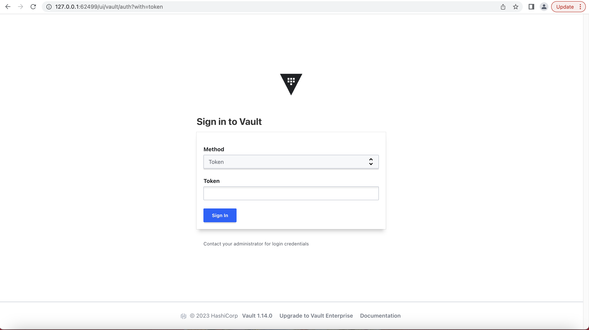
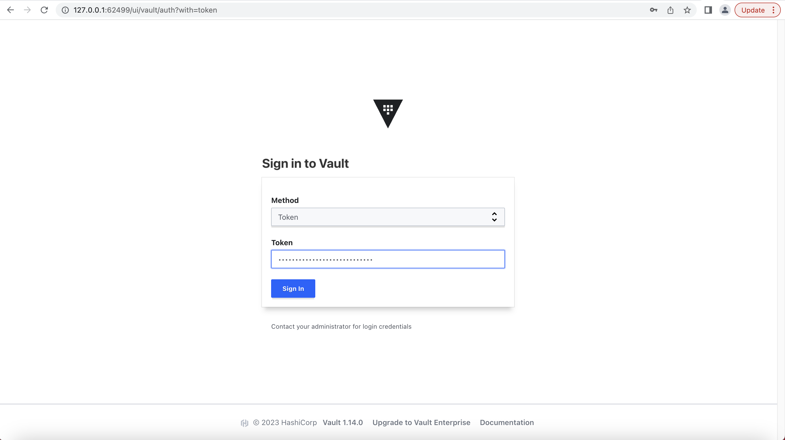
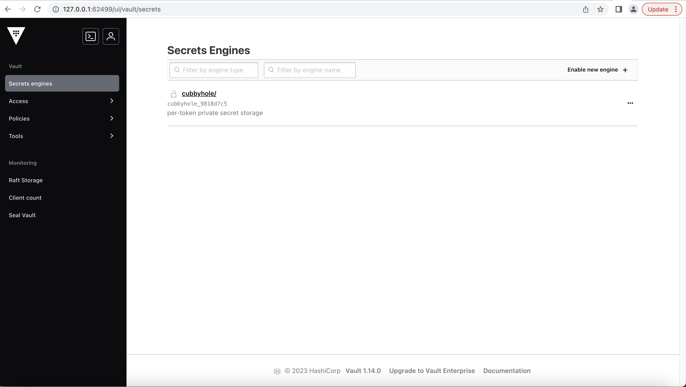

## **Hashicorp vault installation kubernetes minikube**

**Install the Vault Helm chart**
1. **Add the HashiCorp Helm repository.**

 $ helm repo add hashicorp https://helm.releases.hashicorp.com

2. **Update all the repositories to ensure helm is aware of the latest versions.**

 $ helm repo update

3. **To verify, search repositories for vault in charts.**

 $ helm search repo hashicorp/vault

4. **Install the latest version of the Vault Helm chart with Integrated Storage.**
 Create a file named helm-vault-raft-values.yml with the following contents:
 ```
 $ cat > helm-vault-raft-values.yml <<EOF
server:
  affinity: ""
  ha:
    enabled: true
    raft: 
      enabled: true
EOF
```

5. **Run this command:**

 $ helm install vault hashicorp/vault --values helm-vault-raft-values.yml
 NAME: vault
 LAST DEPLOYED: Sun Jul 16 20:52:39 2023
 NAMESPACE: default
 STATUS: deployed
 REVISION: 1
 NOTES:
 Thank you for installing HashiCorp Vault!

 Now that you have deployed Vault, you should look over the docs on using
 Vault with Kubernetes available here:

 https://www.vaultproject.io/docs/


 Your release is named vault. To learn more about the release, try:

  $ helm status vault
  $ helm get manifest vault

This creates three Vault server instances with an Integrated Storage (Raft) backend.

6. **Display all the pods within the default namespace.**
 
 $ kubectl -n default get pod,svc
 NAME                                        READY   STATUS    RESTARTS   AGE
 pod/vault-0                                 0/1     Running   0          116s
 pod/vault-1                                 0/1     Running   0          116s
 pod/vault-2                                 0/1     Running   0          116s
 pod/vault-agent-injector-86bbf55bd8-ks72t   1/1     Running   0          117s

 NAME                               TYPE        CLUSTER-IP       EXTERNAL-IP   PORT(S)             AGE
 service/kubernetes                 ClusterIP   10.96.0.1        <none>        443/TCP             20h
 service/vault                      ClusterIP   10.106.90.5      <none>        8200/TCP,8201/TCP   117s
 service/vault-active               ClusterIP   10.102.35.129    <none>        8200/TCP,8201/TCP   117s
 service/vault-agent-injector-svc   ClusterIP   10.103.217.175   <none>        443/TCP             117s
 service/vault-internal             ClusterIP   None             <none>        8200/TCP,8201/TCP   117s
 service/vault-standby              ClusterIP   10.102.232.168   <none>        8200/TCP,8201/TCP   117s


7. **Initialize vault-0 with one key share and one key threshold.**

 $ kubectl exec vault-0 -- vault operator init \
    -key-shares=1 \
    -key-threshold=1 \
    -format=json > cluster-keys.json

 The operator init command generates a root key that it disassembles into key shares -key-shares=1 and then sets the number of key shares required to unseal Vault -key-threshold=1. These key shares are written to the output as unseal keys in JSON format -format=json. Here the output is redirected to a file named cluster-keys.json.

8. **Display the unseal key found in cluster-keys.json.**

 $ jq -r ".unseal_keys_b64[]" cluster-keys.json

**Note**
 ```
 Insecure operation
 
 Do not run an unsealed Vault in production with a single key share and a single key threshold. This approach is only used here to simplify the unsealing process for this demonstration.
 ```

9. **Create a variable named VAULT_UNSEAL_KEY to capture the Vault unseal key.**

 $ VAULT_UNSEAL_KEY=$(jq -r ".unseal_keys_b64[]" cluster-keys.json)

 After initialization, Vault is configured to know where and how to access the storage, but does not know how to decrypt any of it. Unsealing is the process of constructing the root key necessary to read the decryption key to decrypt the data, allowing access to the Vault.

10. **Unseal Vault running on the vault-0 pod.**

 $ kubectl exec vault-0 -- vault operator unseal $VAULT_UNSEAL_KEY

 **Note**

 ```
 Insecure operation

 Providing the unseal key with the command writes the key to your shell's history. This approach is only used here to simplify the unsealing process for this demonstration.
 ```

The Vault server is initialized and unsealed.

11. **Join the vault-1 pod to the Raft cluster.**

 $ kubectl exec -ti vault-1 -- vault operator raft join http://vault-0.vault-internal:8200
 Key       Value
 ---       -----
 Joined    true

12. **Join the vault-2 pod to the Raft cluster.**

 $ kubectl exec -ti vault-2 -- vault operator raft join http://vault-0.vault-internal:8200
 Key       Value
 ---       -----
 Joined    true

13. **Use the unseal key from above to unseal vault-1.**

 $ kubectl exec -ti vault-1 -- vault operator unseal $VAULT_UNSEAL_KEY
 Key                Value
 ---                -----
 Seal Type          shamir
 Initialized        true
 Sealed             true
 Total Shares       1
 Threshold          1
 Unseal Progress    0/1
 Unseal Nonce       n/a
 Version            1.14.0
 Build Date         2023-06-19T11:40:23Z
 Storage Type       raft
 HA Enabled         true

14. **Use the unseal key from above to unseal vault-2.**

 $ kubectl exec -ti vault-2 -- vault operator unseal $VAULT_UNSEAL_KEY
 Key                Value
 ---                -----
 Seal Type          shamir
 Initialized        true
 Sealed             true
 Total Shares       1
 Threshold          1
 Unseal Progress    0/1
 Unseal Nonce       n/a
 Version            1.14.0
 Build Date         2023-06-19T11:40:23Z
 Storage Type       raft
 HA Enabled         true

15. **Expose the service**

 $ minikube service list
 |-------------|--------------------------|--------------|-----|
 |  NAMESPACE  |           NAME           | TARGET PORT  | URL |
 |-------------|--------------------------|--------------|-----|
 | default     | kubernetes               | No node port |
 | default     | vault                    | No node port |
 | default     | vault-active             | No node port |
 | default     | vault-agent-injector-svc | No node port |
 | default     | vault-internal           | No node port |
 | default     | vault-standby            | No node port |
 | kube-system | kube-dns                 | No node port |
 |-------------|--------------------------|--------------|-----|

 $ minikube service expose vault
 |-----------|-------|-------------|--------------|
 | NAMESPACE | NAME  | TARGET PORT |     URL      |
 |-----------|-------|-------------|--------------|
 | default   | vault |             | No node port |
 |-----------|-------|-------------|--------------|
 😿  service default/vault has no node port
 🏃  Starting tunnel for service vault.
 |-----------|-------|-------------|------------------------|
 | NAMESPACE | NAME  | TARGET PORT |          URL           |
 |-----------|-------|-------------|------------------------|
 | default   | vault |             | http://127.0.0.1:62499 |
 |           |       |             | http://127.0.0.1:62500 |
 |-----------|-------|-------------|------------------------|
 [default vault  http://127.0.0.1:62499
 http://127.0.0.1:62500]
 ❗  Because you are using a Docker driver on darwin, the terminal needs to be open to run it.

 

 

 

## **Set a secret in Vault**

 Vault generated an initial root token when it was initialized.

1. **Display the root token found in cluster-keys.json.**

 $ jq -r ".root_token" cluster-keys.json


2. **Login to vault in CLI**

 $ export VAULT_ADDR="http://127.0.0.1:62499"

 $ vault login
 Token (will be hidden): 
 Success! You are now authenticated. The token information displayed below
 is already stored in the token helper. You do NOT need to run "vault login"
 again. Future Vault requests will automatically use this token.

 Key                  Value
 ---                  -----
 token                xxxxxxxxxxxxxxxxxxxxxxxx
 token_accessor       xxxxxxxxxxxxxxxxxxxxxxxx
 token_duration       ∞
 token_renewable      false
 token_policies       ["root"]
 identity_policies    []
 policies             ["root"]

3. **Enable an instance of the kv-v2 secrets engine at the path secret.**

 $ vault secrets enable -path=secret kv-v2
 Success! Enabled the kv-v2 secrets engine at: secret/

4. **Create a secret at path secret/webapp/config with a username and password.**

 $ vault kv put secret/webapp/config username="static-user" password="static-password"
 ====== Secret Path ======
 secret/data/webapp/config

 ======= Metadata =======
 Key                Value
 ---                -----
 created_time       2023-07-16T16:02:49.336297792Z
 custom_metadata    <nil>
 deletion_time      n/a
 destroyed          false
 version            1

5. **Verify that the secret is defined at the path secret/webapp/config.**

 $ vault kv get secret/webapp/config
 ====== Secret Path ======
 secret/data/webapp/config

 ======= Metadata =======
 Key                Value
 ---                -----
 created_time       2023-07-16T16:02:49.336297792Z
 custom_metadata    <nil>
 deletion_time      n/a
 destroyed          false
 version            1

 ====== Data ======
 Key         Value
 ---         -----
 password    static-password
 username    static-user


## **Configure Kubernetes authentication**

 The initial root token is a privileged user that can perform any operation at any path. The web application only requires the ability to read secrets defined at a single path. This application should authenticate and be granted a token with limited access.

 We recommend that root tokens are used only for initial setup of an authentication method and policies. Afterwards they should be revoked.

 Vault provides a Kubernetes authentication method that enables clients to authenticate with a Kubernetes Service Account Token.

1. **Enable the Kubernetes authentication method.**

 $ vault auth enable kubernetes
 Success! Enabled kubernetes auth method at: kubernetes/

 Vault accepts this service token from any client within the Kubernetes cluster. During authentication, Vault verifies that the service account token is valid by querying a configured Kubernetes endpoint.


3. **Configure the Kubernetes authentication method to use the location of the Kubernetes API.**

 For the best compatibility with recent Kubernetes versions, ensure you are using Vault v1.9.3 or greater.

 $ vault write auth/kubernetes/config     kubernetes_host="http://127.0.0.1:62499"
 Success! Data written to: auth/kubernetes/config

 The environment variable KUBERNETES_PORT_443_TCP_ADDR is defined and references the internal network address of the Kubernetes host.

 For a client to access the secret data defined, at secret/webapp/config, requires that the read capability be granted for the path secret/data/webapp/config. This is an example of a policy. A policy defines a set of capabilities.

4. **Write out the policy named webapp that enables the read capability for secrets at path secret/data/webapp/config.**

 $ vault policy write webapp - <<EOF
 path "secret/data/webapp/config" {
 capabilities = ["read"]
 }
 EOF
 Success! Uploaded policy: webapp

 Define an auth method role that uses the webapp policy. A role binds policies and environment parameters together to create a login for the web application.

5. **Create a Kubernetes authentication role, named webapp, that connects the Kubernetes service account name and webapp policy.**

 $ vault write auth/kubernetes/role/webapp \
        bound_service_account_names=vault \
        bound_service_account_namespaces=default \
        policies=webapp \
        ttl=24h

 Success! Data written to: auth/kubernetes/role/webapp

 The role connects the Kubernetes service account, vault, and namespace, default, with the Vault policy, webapp. The tokens returned after authentication are valid for 24 hours.

## **Launch a web application**

We've created a web application, published it to DockerHub, and created a Kubernetes deployment that will run the application in your existing cluster. The example web application performs the single function of listening for HTTP requests. During a request it reads the Kubernetes service token, logs into Vault, and then requests the secret.

1. **Use your preferred text editor and review the contents of deployment-01-webapp.yml.**

 $ vi deployment-01-webapp.yml

  ---
apiVersion: apps/v1
kind: Deployment
metadata:
  name: webapp
  labels:
    app: webapp
spec:
  replicas: 1
  selector:
    matchLabels:
      app: webapp
  template:
    metadata:
      labels:
        app: webapp
    spec:
      serviceAccountName: vault
      containers:
        - name: app
          image: hashieducation/simple-vault-client:latest
          imagePullPolicy: Always
          env:
            - name: VAULT_ADDR
              value: 'http://127.0.0.1:62499'
            - name: JWT_PATH
              value: '/var/run/secrets/kubernetes.io/serviceaccount/token'
            - name: SERVICE_PORT
              value: '8080'

 The web application deployment defines a list of environment variables.

 - **JWT_PATH** sets the path of the JSON web token (JWT) issued by Kubernetes. This token is used by the web  application to authenticate with Vault.
 - **VAULT_ADDR** sets the address of the Vault service. The Helm chart defined a Kubernetes service named vault that forwards requests to its endpoints (i.e. The pods named vault-0, vault-1, and vault-2).
 - **SERVICE_PORT** sets the port that the service listens for incoming HTTP requests.

2. **Deploy the webapp in Kubernetes by applying the file deployment-01-webapp.yml.**

 $ kubectl apply --filename deployment-01-webapp.yml
 deployment.apps/webapp created

 The webapp runs as a pod within the default namespace.

3. **Get all the pods within the default namespace.**

 $ kubectl get pods
 NAME                                    READY   STATUS    RESTARTS   AGE
 vault-0                                 1/1     Running   0          72m
 vault-1                                 1/1     Running   0          72m
 vault-2                                 1/1     Running   0          72m
 vault-agent-injector-86bbf55bd8-ks72t   1/1     Running   0          72m
 webapp-b4b9578bb-9s6tq                  1/1     Running   0          6m32s

 The webapp pod is displayed here as the pod prefixed with webapp.

 The deployment of the service requires the retrieval of the web application container from Docker Hub. This displays the STATUS of ContainerCreating. The pod reports that it is not ready (0/1).

 Wait until the webapp pod is running and ready (1/1).

 The webapp pod runs an HTTP service that is listening on port 8080.


