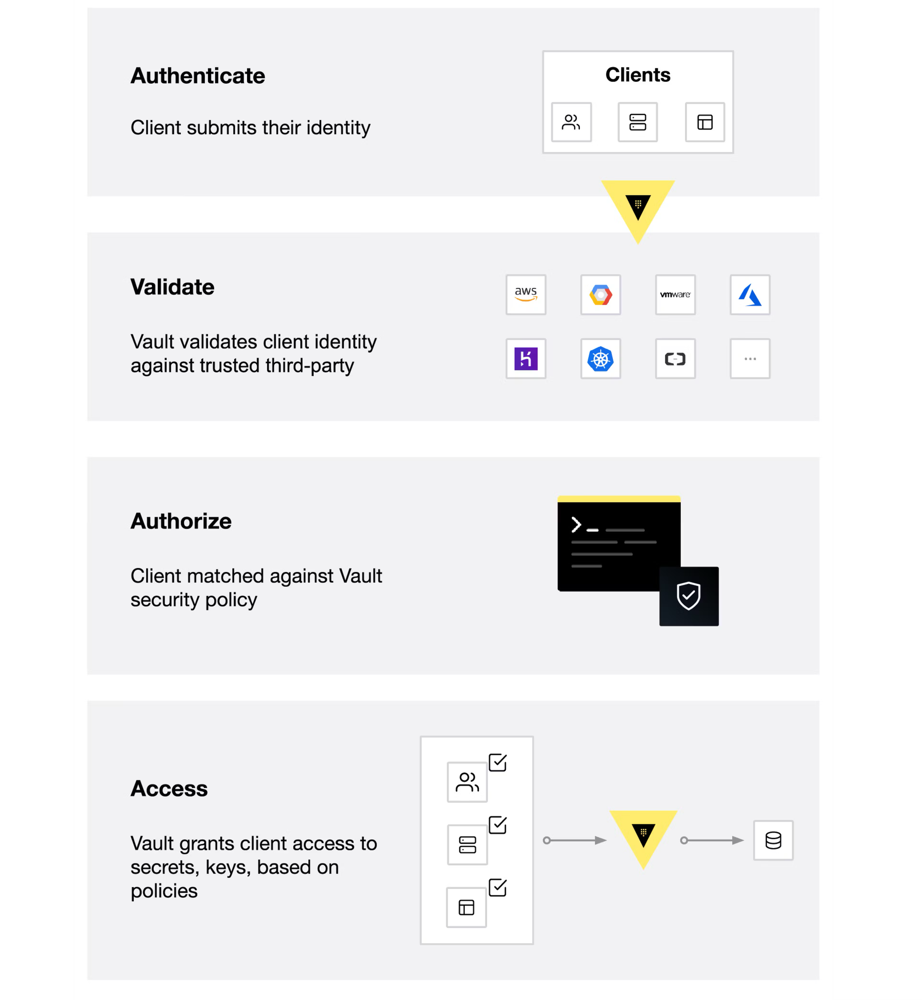
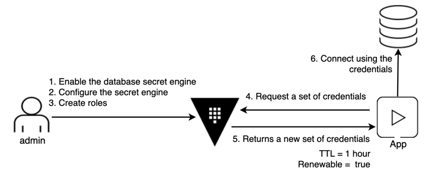

## What is Vault?
HashiCorp Vault is an identity-based secrets and encryption management system.A secret is anything that you want to tightly control access to, such as API encryption keys, passwords, and certificates. Vault provides encryption services that are gated by authentication and authorization methods. Using Vault’s UI, CLI, or HTTP API, access to secrets and other sensitive data can be securely stored and managed, tightly controlled (restricted), and auditable.

A modern system requires access to a multitude of secrets, including database credentials, API keys for external services, credentials for service-oriented architecture communication, etc. It can be difficult to understand who is accessing which secrets, especially since this can be platform-specific. Adding on key rolling, secure storage, and detailed audit logs is almost impossible without a custom solution. This is where Vault steps in.

Vault validates and authorizes clients (users, machines, apps) before providing them access to secrets or stored sensitive data.


## How does Vault work?
Vault works primarily with tokens and a token is associated to the client's policy. Each policy is path-based and policy rules constrains the actions and accessibility to the paths for each client. With Vault, you can create tokens manually and assign them to your clients, or the clients can log in and obtain a token. The illustration below displays Vault's core workflow.



The core Vault workflow consists of four stages:

- Authenticate: Authentication in Vault is the process by which a client supplies information that Vault uses to determine if they are who they say they are. Once the client is authenticated against an auth method, a token is generated and associated to a policy.
- Validation: Vault validates the client against third-party trusted sources, such as Github, LDAP, AppRole, and more.
- Authorize: A client is matched against the Vault security policy. This policy is a set of rules defining which API endpoints a client has access to with its Vault token. Policies provide a declarative way to grant or forbid access to certain paths and operations in Vault.
- Access: Vault grants access to secrets, keys, and encryption capabilities by issuing a token based on policies associated with the client’s identity. The client can then use their Vault token for future operations.

## Why Vault?
Most enterprises today have credentials sprawled across their organizations. Passwords, API keys, and credentials are stored in plain text, app source code, config files, and other locations. Because these credentials live everywhere, the sprawl can make it difficult and daunting to really know who has access and authorization to what. Having credentials in plain text also increases the potential for malicious attacks, both by internal and external attackers.

Vault was designed with these challenges in mind. Vault takes all of these credentials and centralizes them so that they are defined in one location, which reduces unwanted exposure to credentials. But Vault takes it a few steps further by making sure users, apps, and systems are authenticated and explicitly authorized to access resources, while also providing an audit trail that captures and preserves a history of clients' actions.

The key features of Vault are:

- Secure Secret Storage: Arbitrary key/value secrets can be stored in Vault. Vault encrypts these secrets prior to writing them to persistent storage, so gaining access to the raw storage isn't enough to access your secrets. Vault can write to disk, Consul, and more.

- Dynamic Secrets: Vault can generate secrets on-demand for some systems, such as AWS or SQL databases. For example, when an application needs to access an S3 bucket, it asks Vault for credentials, and Vault will generate an AWS keypair with valid permissions on demand. After creating these dynamic secrets, Vault will also automatically revoke them after the lease is up.

- Data Encryption: Vault can encrypt and decrypt data without storing it. This allows security teams to define encryption parameters and developers to store encrypted data in a location such as a SQL database without having to design their own encryption methods.

- Leasing and Renewal: All secrets in Vault have a lease associated with them. At the end of the lease, Vault will automatically revoke that secret. Clients are able to renew leases via built-in renew APIs.

- Revocation: Vault has built-in support for secret revocation. Vault can revoke not only single secrets, but a tree of secrets, for example all secrets read by a specific user, or all secrets of a particular type. Revocation assists in key rolling as well as locking down systems in the case of an intrusion.

## What is HCP Vault?
HashiCorp Cloud Platform (HCP) Vault is a hosted version of Vault, which is operated by HashiCorp to allow organizations to get up and running quickly. HCP Vault uses the same binary as self-hosted Vault, which means you will have a consistent user experience. You can use the same Vault clients to communicate with HCP Vault as you use to communicate with a self-hosted Vault.

## Use Cases

## General Secret Storage
As workloads become more and more ephemeral and short-lived, having long-lived static credentials pose a big security threat vector. What if credentials are accidentally leaked, or an employee leaves with their post it notes that contain the AWS access key, or someone checks their S3 access token to a public GH repo? With Vault, you can generate short-lived, just-in-time credentials that are automatically revoked when their time expires. This means users and security teams do not have to worry about manually revoking or changing these credentials.

## Static Secrets
Credentials can be long-lived and static, where they don't change or are changed infrequently. Vault can store these secrets bedhind its cryptographic barrier, and clients can request them to use in their applications.

## Dynamic Secrets
The key value with secrets storage is the ability to dynamically generate credentials. These credentials are created when clients need them. Vault can also manage the lifecycle of these credentials, including but not limited to, deleting them after a defined period of time.

In addition to database credential management, Vault can manage your Active Directory accounts, SSH keys, PKI certificates and more.

## Dynamic Secrets: Database Secrets Engine

Vault can generate secrets on-demand for some systems. For example, when an app needs to access an Amazon S3 bucket, it asks Vault for AWS credentials. Vault will generate an AWS credential granting permissions to access the S3 bucket. In addition, Vault will automatically revoke this credential after the time-to-live (TTL) expires.

## Challenge
Data protection is a top priority, and database credential rotation is a critical part of any data protection initiative. Each role has a different set of permissions granted to access the database. When a system is attacked by hackers, continuous credential rotation becomes necessary and needs to be automated.

## Solution
Applications ask Vault for database credentials rather than setting them as environment variables. The administrator specifies the TTL of the database credentials to enforce its validity so that they are automatically revoked when they are no longer used.



## Personas
Involves two personas:

- admin with privileged permissions to configure secrets engines
- apps read the secrets from Vault

## Policy requirements

Each persona requires a different set of capabilities. These are expressed in policies. If you are not familiar with policies.
The admin tasks require these capabilities.

```
# Mount secrets engines
path "sys/mounts/*" {
  capabilities = [ "create", "read", "update", "delete", "list" ]
}

# Configure the database secrets engine and create roles
path "database/*" {
  capabilities = [ "create", "read", "update", "delete", "list" ]
}

# Manage the leases
path "sys/leases/+/database/creds/readonly/*" {
  capabilities = [ "create", "read", "update", "delete", "list", "sudo" ]
}

path "sys/leases/+/database/creds/readonly" {
  capabilities = [ "create", "read", "update", "delete", "list", "sudo" ]
}

# Write ACL policies
path "sys/policies/acl/*" {
  capabilities = [ "create", "read", "update", "delete", "list" ]
}

# Manage tokens for verification
path "auth/token/create" {
  capabilities = [ "create", "read", "update", "delete", "list", "sudo" ]
}
```

The apps tasks require these capabilities.

```
# Get credentials from the database secrets engine 'readonly' role.
path "database/creds/readonly" {
  capabilities = [ "read" ]
}
```


