## **Hashicorp vault github auth**

## **STEP 1: Install hasicorp vault in kubernetes minikube**

```
$ helm repo add hashicorp https://helm.releases.hashicorp.com
"hashicorp" already exists with the same configuration, skipping

$ helm search repo hashicorp/vault
NAME           	CHART VERSION	APP VERSION	DESCRIPTION                   
hashicorp/vault	0.23.0       	1.12.1     	Official HashiCorp Vault Chart

$ helm install vault hashicorp/vault
NAME: vault
LAST DEPLOYED: Fri Jul 14 21:17:05 2023
NAMESPACE: default
STATUS: deployed
REVISION: 1
NOTES:
Thank you for installing HashiCorp Vault!

Now that you have deployed Vault, you should look over the docs on using
Vault with Kubernetes available here:

https://www.vaultproject.io/docs/


Your release is named vault. To learn more about the release, try:

  $ helm status vault
  $ helm get manifest vault

$ kubectl get pod,svc -n default
NAME                                        READY   STATUS    RESTARTS   AGE
pod/vault-0                                 0/1     Running   0          35s
pod/vault-agent-injector-7dcd577577-9559g   1/1     Running   0          36s

NAME                               TYPE        CLUSTER-IP     EXTERNAL-IP   PORT(S)             AGE
service/kubernetes                 ClusterIP   10.96.0.1      <none>        443/TCP             108d
service/vault                      ClusterIP   10.106.6.9     <none>        8200/TCP,8201/TCP   36s
service/vault-agent-injector-svc   ClusterIP   10.103.13.49   <none>        443/TCP             36s
service/vault-internal             ClusterIP   None           <none>        8200/TCP,8201/TCP   36s

$ minikube service vault
|-----------|-------|-------------|--------------|
| NAMESPACE | NAME  | TARGET PORT |     URL      |
|-----------|-------|-------------|--------------|
| default   | vault |             | No node port |
|-----------|-------|-------------|--------------|
😿  service default/vault has no node port
🏃  Starting tunnel for service vault.
|-----------|-------|-------------|------------------------|
| NAMESPACE | NAME  | TARGET PORT |          URL           |
|-----------|-------|-------------|------------------------|
| default   | vault |             | http://127.0.0.1:56029 |
|           |       |             | http://127.0.0.1:56030 |
|-----------|-------|-------------|------------------------|
[default vault  http://127.0.0.1:56029
http://127.0.0.1:56030]
❗  Because you are using a Docker driver on darwin, the terminal needs to be open to run it.
```

**Remove helm deployment**

```
$ helm ls
NAME 	NAMESPACE	REVISION	UPDATED                             	STATUS  	CHART       	APP VERSION
vault	default  	1       	2023-07-14 21:23:11.745081 +0530 IST	deployed	vault-0.23.0	1.12.1     

$ helm uninstall vault hashicorp/vault
release "vault" uninstalled
```

## **Access vault in Browser**

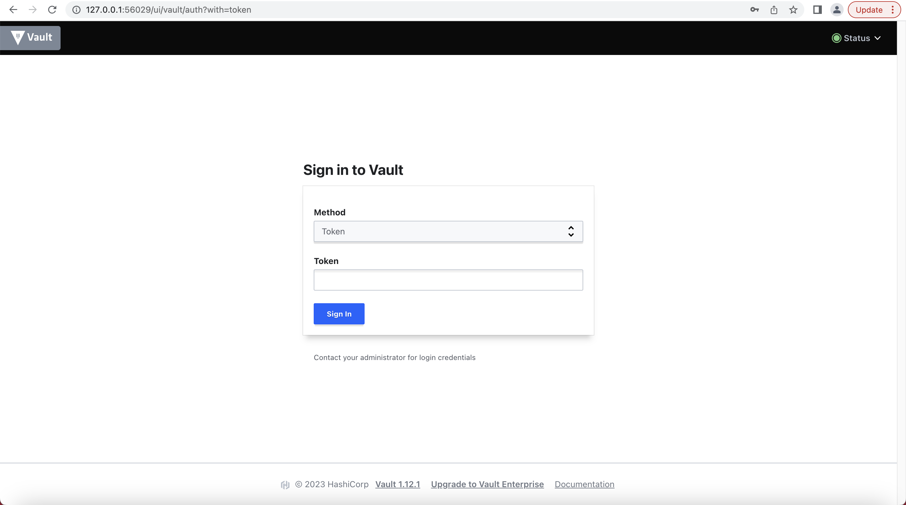


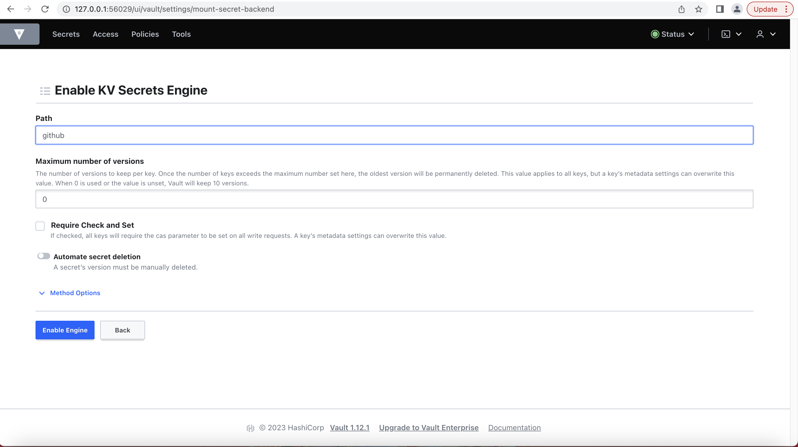


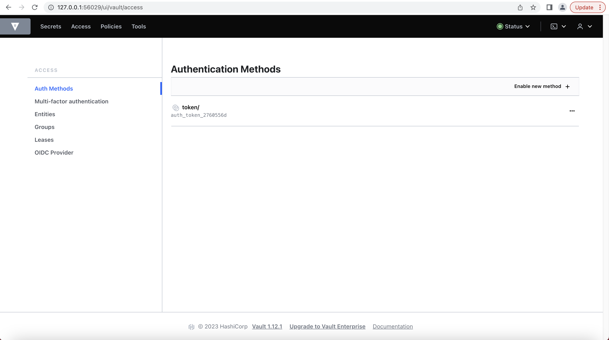

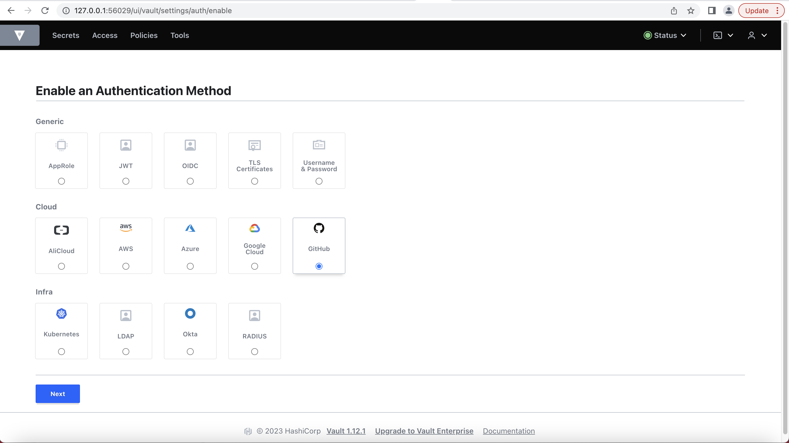


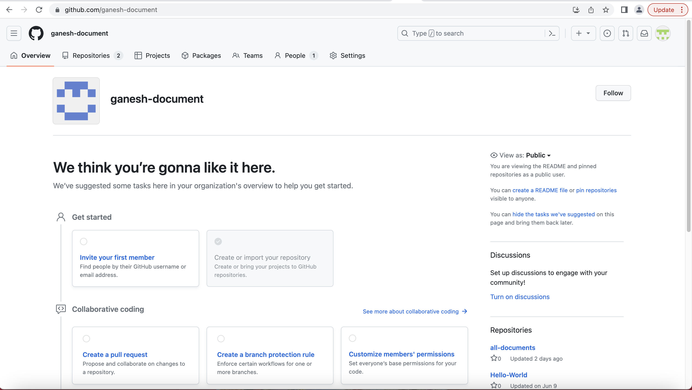

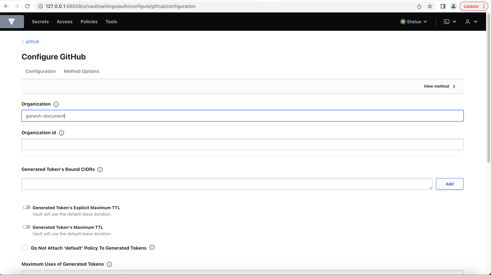


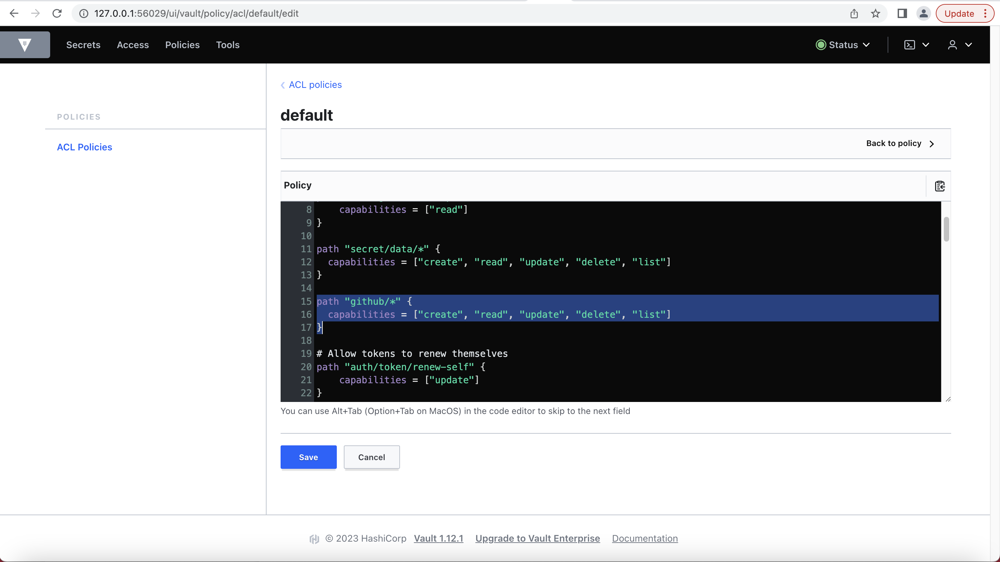

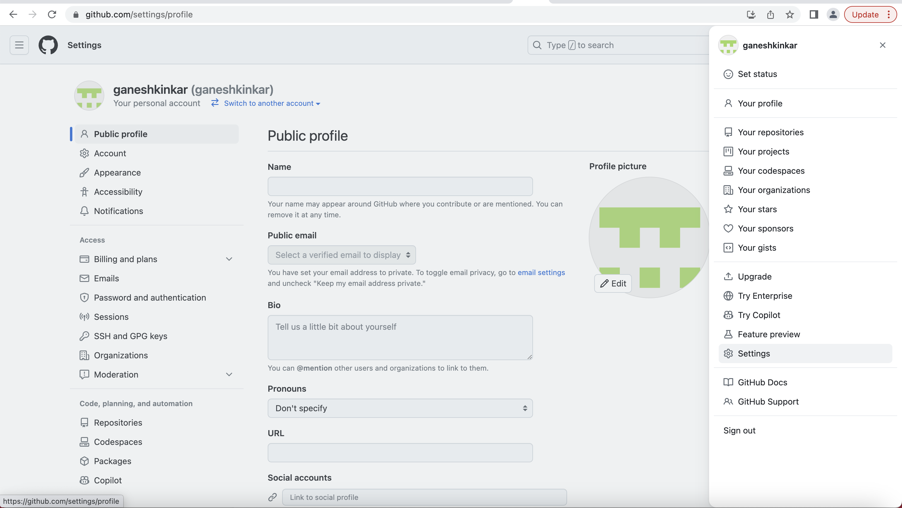

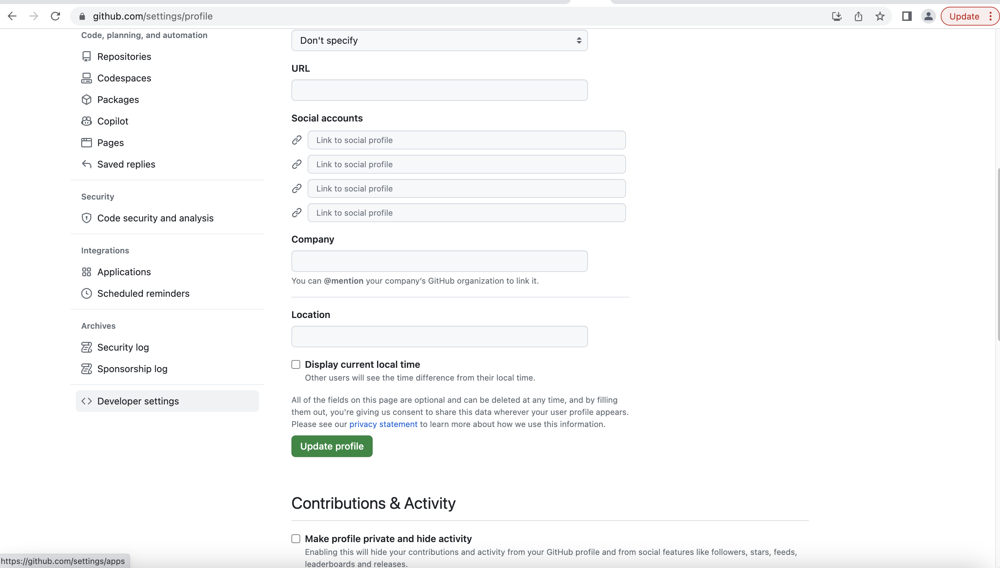

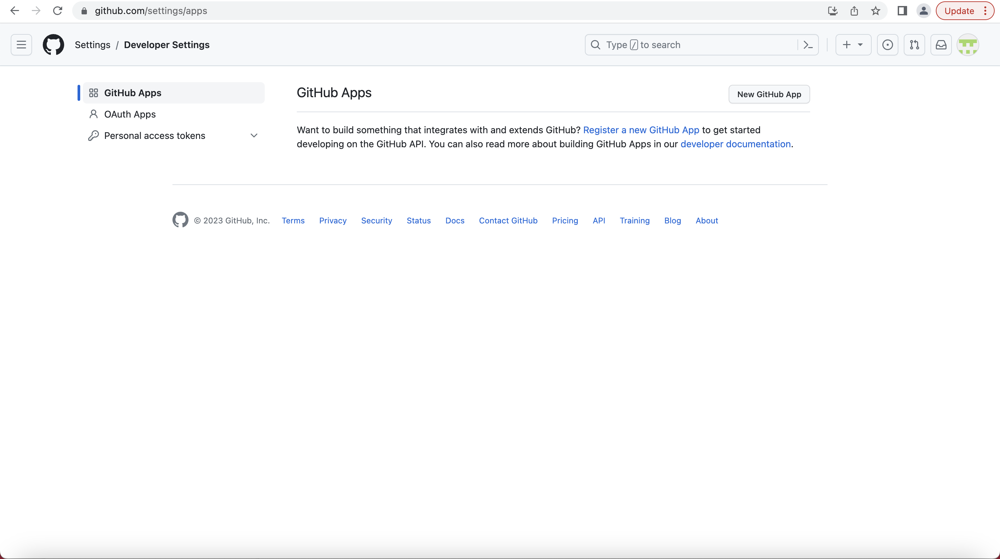


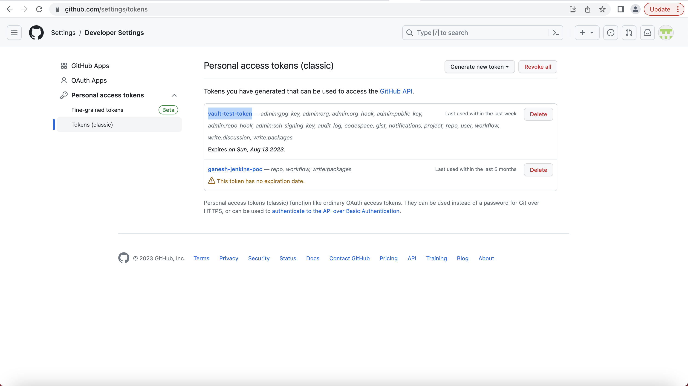

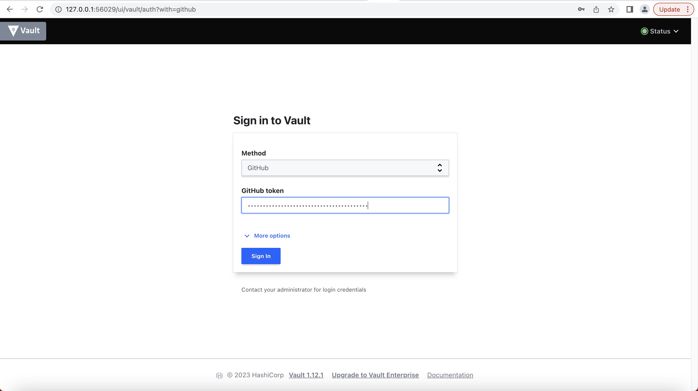

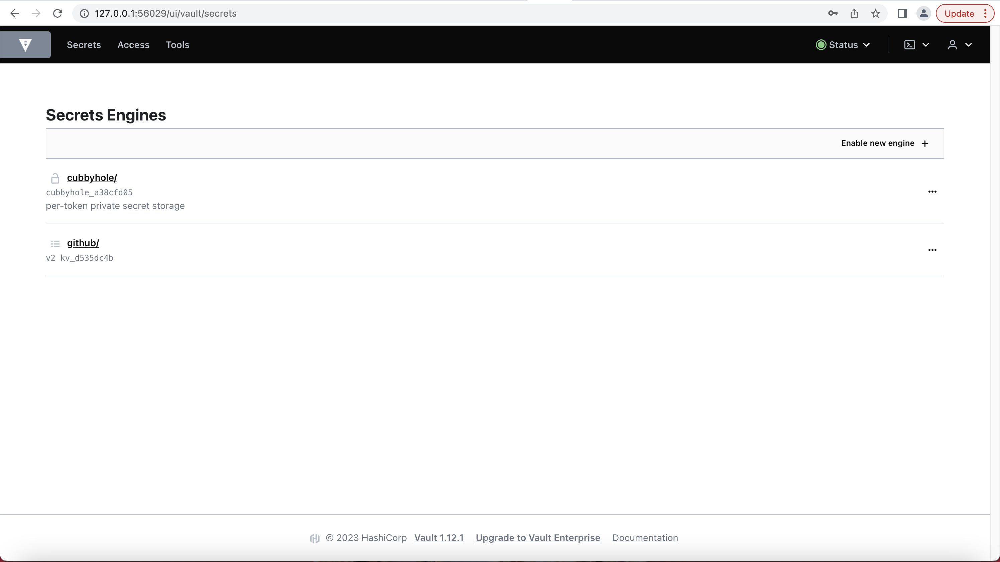


```
$ vault login -method=github token="ghp_xxxxxxxxxxxxxxxxxxxxxx"
Success! You are now authenticated. The token information displayed below
is already stored in the token helper. You do NOT need to run "vault login"
again. Future Vault requests will automatically use this token.

Key                    Value
---                    -----
token                  hvs.xxxxxxxxxxxxxxxxxxxxx
token_accessor         xxxxxxxxxxxxxxxxxxxxxxxxx
token_duration         768h
token_renewable        true
token_policies         ["default"]
identity_policies      []
policies               ["default"]
token_meta_org         ganesh-document
token_meta_username    ganeshkinkar


$ vault kv get -field=password github/dev1
test123
```

